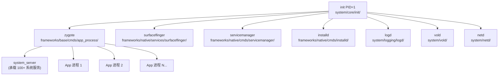

# AOSP 工程架构全景

> 基于 Android 15 (android-15.0.0_r1) 源码，从 AOSP 顶层目录出发，将 Android 系统的每个功能模块与源码位置一一对应。

---

## 一、Android 系统五层架构

Android 系统从上到下分为五层，每一层对应 AOSP 中不同的代码目录：

```mermaid
flowchart TB
    subgraph L1 [应用层 Applications]
        Launcher3["Launcher3 桌面"]
        Settings["Settings 设置"]
        SystemUI_app["SystemUI 状态栏/通知"]
        Camera["Camera 相机"]
        Dialer["Dialer 电话"]
        more1["...50+ 系统 App"]
    end

    subgraph L2 [Java Framework 层]
        AMS["ActivityManagerService\n活动管理"]
        WMS["WindowManagerService\n窗口管理"]
        PMS["PackageManagerService\n包管理"]
        ViewSystem["View / ViewRootImpl\n视图体系"]
        Choreographer_f["Choreographer\n帧调度"]
        InputManager["InputManagerService\n输入管理"]
        NotificationMgr["NotificationManager\n通知管理"]
    end

    subgraph L3 [Native Framework 层]
        SF["SurfaceFlinger\n图形合成"]
        IF["InputFlinger\n输入处理"]
        AF["AudioFlinger\n音频处理"]
        HWUI_n["HWUI\n硬件加速渲染"]
        BQ["BufferQueue\n缓冲队列"]
        BinderNative["Binder IPC\n进程间通信"]
    end

    subgraph L4 [HAL 硬件抽象层]
        HWC["HWComposer\n显示合成"]
        Gralloc["Gralloc\n图形内存分配"]
        AudioHAL["Audio HAL\n音频硬件"]
        CameraHAL["Camera HAL\n相机硬件"]
        SensorHAL["Sensor HAL\n传感器"]
    end

    subgraph L5 [Linux Kernel 内核层]
        BinderDrv["Binder 驱动"]
        DisplayDrv["Display 驱动"]
        InputDrv["Input 驱动"]
        AudioDrv["Audio 驱动"]
        GPU["GPU 驱动"]
    end

    L1 --> L2
    L2 --> L3
    L3 --> L4
    L4 --> L5
```




**每层对应的 AOSP 目录**：


| 层                | 主要 AOSP 目录                                                         |
| ---------------- | ------------------------------------------------------------------ |
| 应用层              | `packages/apps/`、`frameworks/base/packages/SystemUI/`              |
| Java Framework   | `frameworks/base/core/java/`、`frameworks/base/services/`           |
| Native Framework | `frameworks/native/`、`frameworks/base/libs/hwui/`、`frameworks/av/` |
| HAL              | `hardware/interfaces/`、`hardware/`                                 |
| Kernel           | `kernel/`（AOSP 中可能不包含，通常独立仓库）                                      |


---

## 二、AOSP 顶层目录全览

AOSP 根目录下共 26 个子目录。下表按功能分组，标注学习优先级（针对 Android OS 开发岗位）。

### 核心开发目录（必须掌握）


| 目录                | 大小   | 内容                                         | 学习重点                      |
| ----------------- | ---- | ------------------------------------------ | ------------------------- |
| `**frameworks/`** | 2.2G | **Android 系统框架**，包含 Java API 层和 Native 服务层 | ★★★ 最核心目录，JD 要求的所有技能点都在这里 |
| `**packages/`**   | 2.2G | 系统内置 App（Launcher3、Settings、Camera 等）和系统服务 | ★★★ Launcher 模块在这里        |
| `**system/`**     | 715M | 系统底层库和守护进程（init、libutils、libbase、vold 等）   | ★★ Binder 工具、系统启动相关       |


### 运行时与底层库（建议了解）


| 目录                     | 大小   | 内容                                                         | 学习重点             |
| ---------------------- | ---- | ---------------------------------------------------------- | ---------------- |
| `**art/**`             | 96M  | **Android Runtime (ART)** — Java/Kotlin 虚拟机、JIT/AOT 编译器、GC | ★★ 性能优化涉及 GC、编译  |
| `**bionic/`**          | 63M  | Android 的 **C 标准库**（libc、libm、libdl、linker）                | ★ C++ 代码跳转需要其头文件 |
| `**libcore/`**         | 105M | **Java 核心类库**（java.lang、java.util、java.io 等的 Android 实现）   | ★ 偶尔需要查看         |
| `**libnativehelper/`** | 小    | JNI 辅助库（JNIEnv 封装、scoped_local_ref 等）                      | ★ JNI 开发相关       |


### 硬件与设备相关


| 目录          | 大小   | 内容                                       | 学习重点 |
| ----------- | ---- | ---------------------------------------- | ---- |
| `hardware/` | 348M | **HAL 接口定义和实现**（HIDL/AIDL HAL）           | 了解即可 |
| `device/`   | 12G  | **设备特定配置**（Pixel 各机型的 BoardConfig、内核配置等） | 不需关注 |
| `kernel/`   | 2.7G | Linux 内核源码（部分设备的预置内核）                    | 不需关注 |


### 构建与工具


| 目录           | 大小   | 内容                                        | 学习重点             |
| ------------ | ---- | ----------------------------------------- | ---------------- |
| `build/`     | 48M  | **构建系统**（Soong/Blueprint、Make、Bazel）      | 了解 Android.bp 即可 |
| `tools/`     | 941M | 开发工具（metalava API 检查、platform-compat 注解等） | 注解定义在这里          |
| `prebuilts/` | 68G  | **预编译工具链**（SDK、NDK、Clang、Rust、Go 编译器等）    | 不需关注，占空间最大       |
| `toolchain/` | 34M  | 编译器辅助脚本                                   | 不需关注             |
| `sdk/`       | 小    | SDK 相关文件                                  | 不需关注             |


### 第三方库与外部依赖


| 目录          | 大小  | 内容                                                  | 学习重点                               |
| ----------- | --- | --------------------------------------------------- | ---------------------------------- |
| `external/` | 15G | **第三方开源库**（skia、icu、boringssl、protobuf、sqlite 等数百个） | 只需关注 `external/skia/`（HWUI 底层渲染引擎） |
| `dalvik/`   | 25M | **旧版 Dalvik 虚拟机**（已被 ART 替代，保留兼容性工具如 dx）            | 不需关注                               |


### 测试与文档


| 目录                  | 大小   | 内容                                     | 学习重点 |
| ------------------- | ---- | -------------------------------------- | ---- |
| `cts/`              | 2.0G | **兼容性测试套件** (Compatibility Test Suite) | 不需关注 |
| `test/`             | 355M | 测试框架和基础设施                              | 不需关注 |
| `platform_testing/` | 186M | 平台级测试库                                 | 不需关注 |
| `developers/`       | 401M | 开发者示例代码                                | 不需关注 |
| `development/`      | 387M | 开发环境工具和示例                              | 不需关注 |
| `pdk/`              | 小    | Platform Development Kit               | 不需关注 |


### 安全相关


| 目录          | 大小  | 内容                     | 学习重点 |
| ----------- | --- | ---------------------- | ---- |
| `trusty/`   | 小   | **Trusty TEE**（可信执行环境） | 不需关注 |
| `bootable/` | 小   | Bootloader、Recovery 模式 | 不需关注 |


---

## 三、`frameworks/` 深度展开 — 最核心的目录

`frameworks/` 是 Android 系统的心脏，几乎所有 Framework 层的代码都在这里。

```
frameworks/
├── base/          ← Java Framework 层（最大、最重要）
├── native/        ← Native C++ 服务层
├── av/            ← 音视频框架（MediaPlayer、AudioFlinger、CameraService）
├── opt/           ← 可选模块（蓝牙、电话等）
├── hardware/      ← 硬件抽象接口（Camera、Sensor 等的 Java 封装）
├── libs/          ← 跨模块共享库
│   └── modules-utils/  ← @NonNull/@Nullable 等注解定义
├── minikin/       ← 文字排版引擎
├── compile/       ← 编译优化工具
├── ex/            ← 扩展库
├── layoutlib/     ← Android Studio 布局预览的渲染引擎
├── multidex/      ← MultiDex 支持
├── proto_logging/ ← ProtoLog 日志系统
├── rs/            ← RenderScript（已废弃）
└── wilhelm/       ← OpenSL ES 音频接口
```

### 3.1 `frameworks/base/` — Java Framework 层

#### 3.1.1 `core/` — 框架核心 API

```
frameworks/base/core/
├── java/android/          ← Android SDK 的 Java API 实现
│   ├── app/               ← Activity、Service、Application、Fragment
│   ├── view/              ← ★★★ View、ViewGroup、ViewRootImpl、Choreographer、Surface
│   ├── widget/            ← TextView、RecyclerView、Button 等系统 Widget
│   ├── os/                ← ★★★ Binder、Handler、Looper、MessageQueue、Build
│   ├── content/           ← Context、ContentProvider、Intent、SharedPreferences
│   ├── graphics/          ← Canvas、Paint、Bitmap、drawable
│   ├── animation/         ← ObjectAnimator、ValueAnimator
│   ├── window/            ← WindowManager 客户端接口
│   ├── net/               ← Uri、HttpURLConnection（部分）
│   ├── provider/          ← Settings.Secure、ContactsContract
│   ├── database/          ← SQLiteDatabase
│   ├── util/              ← SparseArray、ArrayMap、Log
│   └── ...
├── jni/                   ← Framework JNI 层（Java ↔ Native 桥梁）
│   ├── android_view_*.cpp           ← View 系统的 JNI
│   ├── android_os_*.cpp             ← Binder、MessageQueue 的 JNI
│   ├── core_jni_helpers.h           ← JNI 辅助工具
│   └── include/android_runtime/     ← AndroidRuntime.h
├── res/                   ← 系统资源（布局、字符串、主题）
└── proto/                 ← Protobuf 定义
```

**最需要精读的文件**：


| 文件                        | 行数    | 内容                                     | JD 对应        |
| ------------------------- | ----- | -------------------------------------- | ------------ |
| `view/View.java`          | 34110 | View 绘制、事件分发、动画                        | 显示渲染模块       |
| `view/ViewRootImpl.java`  | 13255 | View 树的根，连接 WMS，驱动 measure/layout/draw | 显示渲染模块       |
| `view/Choreographer.java` | ~2000 | VSync 信号接收，帧回调调度                       | 显示渲染模块       |
| `view/Surface.java`       | ~1000 | Surface 的 Java 封装                      | 显示渲染模块       |
| `view/SurfaceView.java`   | ~2000 | 独立 Surface 的 View                      | 显示渲染模块       |
| `app/Activity.java`       | ~9000 | Activity 生命周期                          | Framework 架构 |
| `app/ActivityThread.java` | ~8000 | App 进程的主线程                             | Framework 架构 |
| `os/Binder.java`          | ~1500 | Binder IPC 的 Java 层                    | Framework 架构 |
| `os/Handler.java`         | ~900  | 消息机制                                   | Framework 架构 |
| `os/Looper.java`          | ~400  | 消息循环                                   | Framework 架构 |


#### 3.1.2 `services/` — 系统服务

```
frameworks/base/services/
├── java/com/android/server/
│   └── SystemServer.java         ← ★ 系统服务启动入口
├── core/java/com/android/server/
│   ├── wm/                       ← ★★★ WindowManagerService（窗口管理）
│   │   ├── WindowManagerService.java
│   │   ├── WindowState.java
│   │   ├── WindowContainer.java
│   │   ├── ActivityTaskManagerService.java   ← Activity 管理
│   │   ├── Task.java
│   │   └── DisplayContent.java
│   ├── am/                       ← ★★ ActivityManagerService（进程、组件管理）
│   │   ├── ActivityManagerService.java
│   │   ├── ProcessRecord.java
│   │   ├── ProcessList.java
│   │   └── AnrHelper.java
│   ├── pm/                       ← PackageManagerService（APK 安装解析）
│   ├── input/                    ← InputManagerService
│   ├── display/                  ← DisplayManagerService
│   ├── notification/             ← NotificationManagerService
│   ├── power/                    ← PowerManagerService
│   ├── audio/                    ← AudioService
│   ├── connectivity/             ← ConnectivityService（网络）
│   ├── vibrator/                 ← VibratorManagerService
│   └── ...40+ 系统服务
```

#### 3.1.3 `libs/hwui/` — 硬件加速渲染引擎（C++）

```
frameworks/base/libs/hwui/
├── renderthread/
│   ├── RenderThread.cpp          ← ★★★ 渲染线程主循环
│   ├── CanvasContext.cpp          ← ★★★ 管理一个 Surface 的渲染上下文
│   └── DrawFrameTask.cpp          ← 每帧渲染任务
├── pipeline/skia/
│   ├── SkiaOpenGLPipeline.cpp     ← Skia + OpenGL 渲染管线
│   └── SkiaVulkanPipeline.cpp     ← Skia + Vulkan 渲染管线
├── RenderNode.cpp                 ← ★★★ DisplayList 的载体，每个 View 对应一个
├── RecordingCanvas.cpp            ← 录制绘制指令
├── FrameInfo.cpp                  ← 帧时间戳统计
├── DamageAccumulator.cpp          ← 脏区域计算
└── JankTracker.cpp                ← 掉帧检测
```

#### 3.1.4 `packages/SystemUI/` — 系统界面

```
frameworks/base/packages/SystemUI/
├── src/com/android/systemui/
│   ├── statusbar/phone/
│   │   └── CentralSurfacesImpl.java    ← ★ 状态栏主控制器
│   ├── qs/                              ← Quick Settings 快捷设置
│   ├── keyguard/                        ← 锁屏
│   ├── recents/                         ← 最近任务
│   ├── navigationbar/                   ← 导航栏
│   ├── volume/                          ← 音量面板
│   ├── power/                           ← 关机菜单
│   ├── screenshot/                      ← 截屏
│   └── biometrics/                      ← 生物识别 UI
└── shared/src/                          ← 与 Launcher 共享的代码
```

#### 3.1.5 其他重要子目录


| 目录                | 内容                                             |
| ----------------- | ---------------------------------------------- |
| `graphics/java/`  | Canvas、Paint、Bitmap、RenderNode 的 Java API      |
| `media/java/`     | MediaPlayer、AudioManager、MediaCodec 的 Java API |
| `opengl/java/`    | OpenGL ES 的 Java 绑定（GLES20、EGL14）              |
| `telephony/java/` | 电话子系统 API                                      |
| `wifi/java/`      | Wi-Fi 子系统 API                                  |
| `cmds/`           | 系统命令行工具（am、pm、wm、input、dumpsys 等）              |
| `data/`           | 字体、时区数据、键盘布局                                   |


### 3.2 `frameworks/native/` — Native 服务层

```
frameworks/native/
├── services/
│   ├── surfaceflinger/            ← ★★★ 图形合成器
│   │   ├── SurfaceFlinger.cpp     ← 主循环、合成逻辑
│   │   ├── Layer.cpp              ← 每个 Surface 对应的 Layer
│   │   ├── Scheduler/             ← VSync 调度、帧率管理
│   │   ├── DisplayHardware/       ← HWC 接口封装
│   │   └── CompositionEngine/     ← 合成引擎抽象
│   ├── inputflinger/              ← ★★ 输入子系统
│   │   ├── reader/InputReader.cpp       ← 从 /dev/input 读取原始事件
│   │   └── dispatcher/InputDispatcher.cpp ← 分发事件到目标窗口
│   ├── sensorservice/             ← 传感器服务
│   └── gpuservice/                ← GPU 服务
├── libs/
│   ├── gui/                       ← ★★★ BufferQueue、Surface、SurfaceControl
│   ├── binder/                    ← ★★★ Binder IPC 的 C++ 实现
│   │   ├── IPCThreadState.cpp     ← Binder 线程状态管理
│   │   ├── ProcessState.cpp       ← 进程级 Binder 状态
│   │   └── Binder.cpp             ← BBinder/BpBinder 实现
│   ├── ui/                        ← 图形基础类型（Rect、Region、PixelFormat）
│   ├── input/                     ← 输入事件数据结构
│   ├── nativewindow/              ← ANativeWindow 接口
│   └── renderengine/              ← GPU 合成渲染引擎
├── cmds/
│   ├── servicemanager/            ← ServiceManager（Binder 服务注册中心）
│   ├── surfaceflinger/            ← SurfaceFlinger 进程入口
│   ├── installd/                  ← APK 安装守护进程
│   └── dumpsys/                   ← dumpsys 命令行工具
├── opengl/                        ← EGL/OpenGL ES 加载器
└── vulkan/                        ← Vulkan 加载器
```

### 3.3 `frameworks/av/` — 音视频框架


| 子目录                            | 内容                  |
| ------------------------------ | ------------------- |
| `media/libmediaplayerservice/` | MediaPlayerService  |
| `media/libaudioclient/`        | AudioFlinger 客户端    |
| `services/camera/`             | CameraService       |
| `services/audioflinger/`       | AudioFlinger（音频混音器） |
| `services/audiopolicy/`        | 音频策略管理              |
| `media/codec2/`                | 硬件编解码框架             |


---

## 四、`packages/` — 系统内置 App

```
packages/
├── apps/                    ← 系统预装应用
│   ├── Launcher3/           ← ★★★ 桌面启动器
│   ├── Settings/            ← 系统设置
│   ├── Camera2/             ← 相机
│   ├── Dialer/              ← 电话
│   ├── Contacts/            ← 联系人
│   ├── Messaging/           ← 短信
│   ├── Calendar/            ← 日历
│   ├── DeskClock/           ← 时钟
│   ├── Music/               ← 音乐播放器
│   ├── Gallery2/            ← 图库
│   ├── Browser2/            ← 浏览器
│   ├── DocumentsUI/         ← 文件管理器
│   ├── Traceur/             ← 系统追踪（Perfetto 前端）
│   └── ...50+ 应用
├── providers/               ← 系统 ContentProvider
│   ├── ContactsProvider/    ← 联系人数据库
│   ├── MediaProvider/       ← 媒体文件数据库
│   ├── SettingsProvider/    ← 系统设置数据库
│   └── ...
├── inputmethods/            ← 输入法（LatinIME）
├── modules/                 ← Mainline 模块（可通过 Play Store 独立更新）
└── services/                ← 系统后台服务
```

---

## 五、`system/` — 系统底层

```
system/
├── core/                    ← ★★ 系统核心组件
│   ├── init/                ← init 进程（PID 1，系统第一个用户进程）
│   ├── adb/                 ← ADB 调试桥
│   ├── logcat/              ← logcat 日志工具
│   ├── libutils/            ← RefBase、StrongPointer 等 Native 工具类
│   ├── liblog/              ← 日志库
│   ├── libcutils/           ← properties、ashmem 等工具
│   ├── rootdir/             ← init.rc 启动脚本
│   └── fastboot/            ← fastboot 刷机工具
├── libbase/                 ← 基础工具库（logging、strings、file）
├── sepolicy/                ← SELinux 安全策略
├── vold/                    ← 存储卷守护进程
├── netd/                    ← 网络守护进程
├── security/                ← Keystore、密钥管理
├── update_engine/           ← OTA 系统更新引擎
└── apex/                    ← APEX 模块管理
```

---

## 六、其他重要目录

### `art/` — Android Runtime

```
art/
├── runtime/                 ← ART 虚拟机核心
│   ├── gc/                  ← 垃圾回收器
│   ├── jit/                 ← JIT 编译器
│   ├── interpreter/         ← 字节码解释器
│   └── thread.cc            ← 线程管理
├── compiler/                ← AOT 编译器
├── dex2oat/                 ← dex → oat 编译工具
└── libdexfile/              ← DEX 文件解析
```

### `bionic/` — Android C 库

```
bionic/
├── libc/                    ← C 标准库（malloc、pthread、stdio 等）
│   ├── include/             ← 标准 C 头文件
│   └── kernel/uapi/         ← Linux 内核用户空间头文件
├── libm/                    ← 数学库
├── libdl/                   ← 动态链接库加载
└── linker/                  ← 动态链接器
```

### `external/skia/` — 2D 图形引擎

```
external/skia/
├── include/
│   ├── core/                ← SkCanvas、SkPaint、SkBitmap
│   ├── gpu/                 ← GPU 后端接口
│   └── effects/             ← 图像效果（模糊、阴影等）
└── src/
    ├── gpu/                 ← OpenGL/Vulkan 后端实现
    └── core/                ← 核心渲染逻辑
```

---

## 七、Android 功能 → 代码映射

### 用户操作 → 代码调用链


| 用户操作          | 完整调用链                                                                                                                                                        | 关键源码位置                                                                                                                                                        |
| ------------- | ------------------------------------------------------------------------------------------------------------------------------------------------------------ | ------------------------------------------------------------------------------------------------------------------------------------------------------------- |
| **点击 App 图标** | Launcher3 → Binder IPC → ATMS → AMS → Zygote fork → ActivityThread.main() → Activity.onCreate()                                                              | `packages/apps/Launcher3/`、`frameworks/base/services/core/.../wm/ActivityTaskManagerService.java`、`frameworks/base/core/java/android/app/ActivityThread.java` |
| **触摸滑动列表**    | 内核 Input 驱动 → InputReader → InputDispatcher → ViewRootImpl → View.onTouchEvent()                                                                             | `frameworks/native/services/inputflinger/`、`frameworks/base/core/java/android/view/ViewRootImpl.java`                                                         |
| **画面渲染上屏**    | Choreographer.doFrame() → performTraversals() → measure/layout/draw → DisplayList → RenderThread → Skia → GPU → queueBuffer → SurfaceFlinger → HWC → Display | `frameworks/base/core/java/android/view/Choreographer.java`、`frameworks/base/libs/hwui/renderthread/`、`frameworks/native/services/surfaceflinger/`            |
| **下拉通知栏**     | SystemUI NotificationPanelView → 展开动画 → WMS 调整窗口 → SurfaceFlinger 重新合成                                                                                       | `frameworks/base/packages/SystemUI/`                                                                                                                          |
| **安装 APK**    | PackageInstaller → PMS → 解析 Manifest → dex2oat 编译 → 写入 /data/app/                                                                                            | `frameworks/base/services/core/.../pm/`、`art/dex2oat/`                                                                                                        |
| **拍照**        | Camera App → CameraManager → CameraService → Camera HAL → 硬件                                                                                                 | `packages/apps/Camera2/`、`frameworks/av/services/camera/`                                                                                                     |
| **播放音乐**      | App → MediaPlayer → MediaPlayerService → AudioFlinger → Audio HAL                                                                                            | `frameworks/av/services/audioflinger/`                                                                                                                        |
| **连接 Wi-Fi**  | Settings → WifiManager → WifiService → wpa_supplicant → 内核驱动                                                                                                 | `frameworks/base/services/wifi/`                                                                                                                              |
| **指纹解锁**      | 触摸指纹 → FingerprintService → Fingerprint HAL → TEE → Keyguard 解锁                                                                                              | `frameworks/base/services/core/.../biometrics/`                                                                                                               |
| **屏幕旋转**      | 传感器 → WMS.updateRotation() → 重配窗口 → App.onConfigurationChanged()                                                                                             | `frameworks/base/services/core/.../wm/DisplayRotation.java`                                                                                                   |


### 系统事件 → 代码调用链


| 系统事件         | 调用链                                                                                 | 关键源码位置                                                                                                        |
| ------------ | ----------------------------------------------------------------------------------- | ------------------------------------------------------------------------------------------------------------- |
| **系统启动**     | Bootloader → Kernel → init (PID 1) → 解析 init.rc → 启动 zygote → system_server → 各系统服务 | `system/core/init/`、`frameworks/base/cmds/app_process/`、`frameworks/base/services/java/.../SystemServer.java` |
| **App 进程创建** | AMS → Zygote fork() → ActivityThread.main() → Looper.loop()                         | `frameworks/base/core/java/android/os/ZygoteProcess.java`                                                     |
| **ANR 发生**   | InputDispatcher 超时 5s → AMS appNotResponding() → dump traces.txt                    | `frameworks/base/services/core/.../am/AnrHelper.java`                                                         |
| **低内存杀进程**   | kswapd → lmkd 检查阈值 → 按 ADJ 优先级杀进程                                                   | `frameworks/base/services/core/.../am/ProcessList.java`                                                       |


---

## 八、进程模型

### 系统关键进程




| 进程               | 源码位置                                                  | 职责                                       |
| ---------------- | ----------------------------------------------------- | ---------------------------------------- |
| `init`           | `system/core/init/`                                   | 系统第一个用户进程，解析 init.rc，启动所有守护进程            |
| `zygote`         | `frameworks/base/cmds/app_process/`                   | App 进程母体，预加载 Framework 类，fork 出所有 App 进程 |
| `system_server`  | `frameworks/base/services/java/.../SystemServer.java` | 承载 AMS、WMS、PMS 等 100+ 系统 Java 服务         |
| `surfaceflinger` | `frameworks/native/services/surfaceflinger/`          | 图形合成，将所有 Surface 合成到屏幕                   |
| `servicemanager` | `frameworks/native/cmds/servicemanager/`              | Binder 服务注册中心                            |
| `installd`       | `frameworks/native/cmds/installd/`                    | APK 安装（dex 优化、权限设置）                      |
| `vold`           | `system/vold/`                                        | 存储卷管理（挂载、加密）                             |
| `netd`           | `system/netd/`                                        | 网络管理（iptables、DNS）                       |
| `logd`           | `system/logging/logd/`                                | 日志守护进程                                   |
| `adbd`           | `system/core/adb/`                                    | ADB 调试守护进程                               |


### App 进程内部线程


| 线程                    | 创建位置                    | 职责                        |
| --------------------- | ----------------------- | ------------------------- |
| **main**（UI 线程）       | `ActivityThread.main()` | Looper 消息循环，处理 UI 事件和生命周期 |
| **RenderThread**      | HWUI 首次绘制时              | 回放 DisplayList，驱动 GPU 渲染  |
| **Binder:xxx** (1-15) | 首次 Binder 调用时           | 处理来自其他进程的 Binder 请求       |
| **FinalizerDaemon**   | ART 自动创建                | 执行 finalize()             |
| **HeapTaskDaemon**    | ART 自动创建                | GC 并发标记                   |


---

## 九、构建系统简介

### 构建文件类型


| 文件                    | 构建系统            | 说明                 |
| --------------------- | --------------- | ------------------ |
| `Android.bp`          | **Soong**（当前主流） | 声明式构建，Blueprint 语法 |
| `Android.mk`          | **Make**（逐步淘汰）  | 传统 Makefile        |
| `BUILD` / `WORKSPACE` | **Bazel**（实验性）  | Google 内部推进        |


### `build/` 目录

```
build/
├── soong/           ← Soong 构建系统源码
├── make/            ← Make 构建系统
├── bazel/           ← Bazel 集成
└── blueprint/       ← Blueprint 解析器
```

### 常用构建命令（了解即可）

```bash
source build/envsetup.sh     # 初始化环境
lunch aosp_x86_64-eng        # 选择编译目标
m                            # 全量编译
mm                           # 编译当前目录模块
```

---

## 十、学习优先级路线图

基于 JD 要求，按以下顺序探索源码：

```
第 1 优先级（JD 核心要求）：
├── frameworks/base/core/java/android/view/     ← View 绘制体系
├── frameworks/base/libs/hwui/                  ← HWUI 硬件加速渲染
├── frameworks/native/services/surfaceflinger/  ← SurfaceFlinger 合成
├── frameworks/base/packages/SystemUI/          ← SystemUI 状态栏/通知
└── packages/apps/Launcher3/                    ← Launcher 桌面

第 2 优先级（Framework 架构基础）：
├── frameworks/base/services/core/.../wm/       ← WMS 窗口管理
├── frameworks/base/services/core/.../am/       ← AMS 活动管理
├── frameworks/base/core/java/android/os/       ← Binder/Handler/Looper
├── frameworks/native/libs/binder/              ← Binder Native 层
├── frameworks/native/libs/gui/                 ← BufferQueue/Surface
└── frameworks/base/services/java/.../SystemServer.java

第 3 优先级（深入理解）：
├── frameworks/native/services/inputflinger/    ← 输入系统
├── frameworks/base/core/java/android/app/      ← Activity/Service
├── art/runtime/                                ← ART 虚拟机
├── system/core/init/                           ← 系统启动
├── bionic/libc/                                ← C 库
└── external/skia/                              ← Skia 渲染引擎
```

