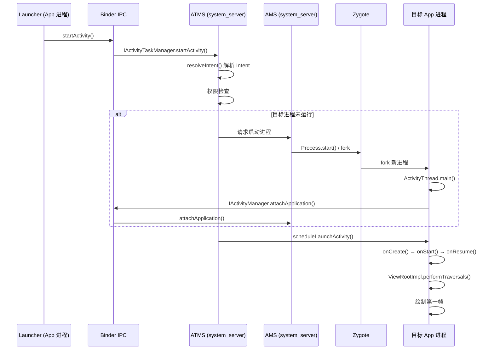
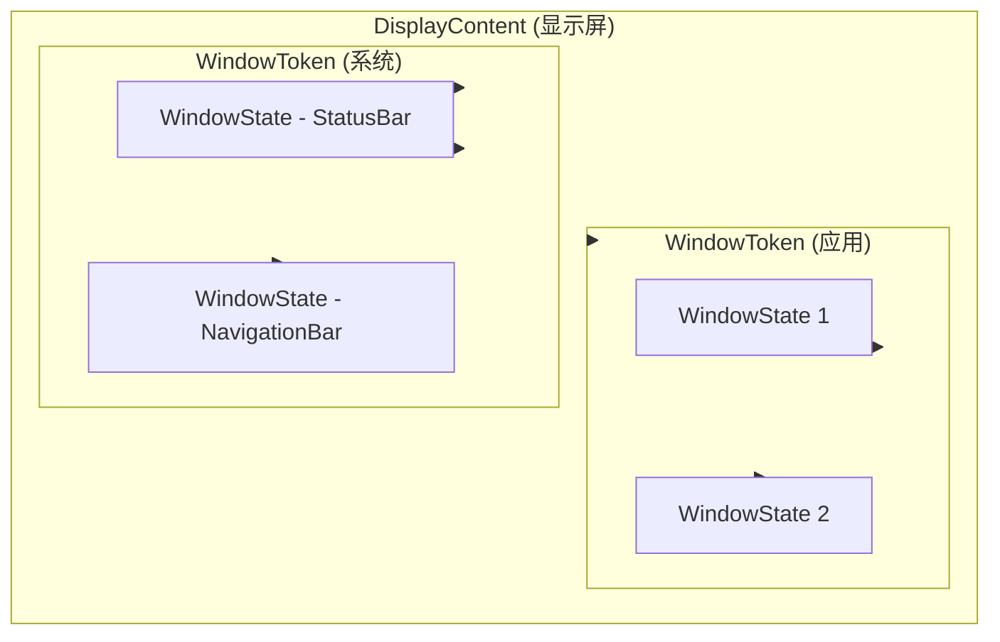
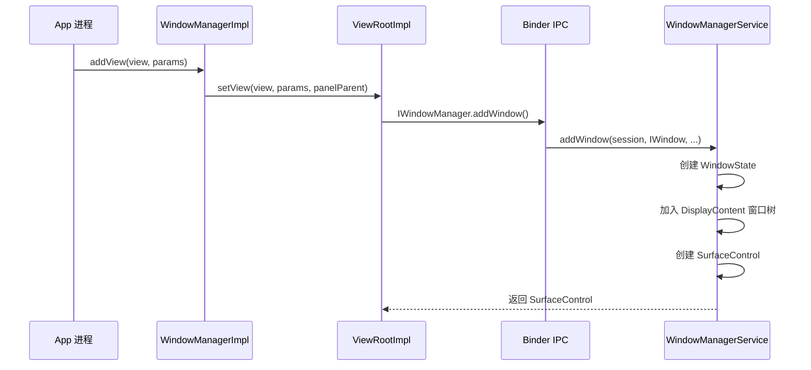

# Day 2：AMS 与 WMS 核心服务

> 面向具有 5.5 年 Android 应用开发经验的开发者，深入学习 ActivityManagerService 与 WindowManagerService

---

## Part 1：ActivityManagerService (AMS)

### 1.1 角色与职责

**ActivityManagerService (AMS)** 是 Android 系统中负责 **Activity 生命周期、进程、任务栈、最近任务** 等核心管理的系统服务。

| 职责 | 说明 |
|------|------|
| Activity 生命周期 | 驱动 Activity 的 create/start/resume/destroy 等生命周期回调 |
| 进程管理 | 维护进程列表，OOM 策略，进程优先级 |
| 任务栈 (Task) | 管理 Activity 所属的任务栈，Back Stack |
| 最近任务 (Recents) | 维护最近使用的应用列表，供 Launcher/Recents 展示 |

### 1.2 源码路径

```
frameworks/base/services/core/java/com/android/server/am/
```

### 1.3 关键类

| 类名 | 说明 |
|------|------|
| **ActivityManagerService.java** | AMS 主类，实现 IActivityManager 接口 |
| **ProcessRecord.java** | 进程信息记录，包含进程名、UID、内存状态等 |
| **ProcessList.java** | 进程列表管理，OOM 调整、进程优先级计算 |

### 1.4 Android 12+ 的变化：ActivityTaskManagerService (ATMS)

在 **Android 12+** 中，Activity 相关的管理逻辑从 AMS 剥离，迁移到了 **ActivityTaskManagerService (ATMS)** 侧。

- **AMS**：仍负责进程、内存、权限等
- **ATMS**：负责 Activity、Task、Recents 等

ATMS 源码路径：

```
frameworks/base/services/core/java/com/android/server/wm/ActivityTaskManagerService.java
```

### 1.5 Activity 启动完整流程（跨进程）

从 Launcher 点击图标到目标 Activity 显示第一帧，涉及多进程协作，流程如下：

1. **Launcher 调用 `startActivity()`**
   - App 进程内通过 Instrumentation 或 Activity 调用

2. **Binder IPC 到 system_server（ATMS）**
   - `IActivityTaskManager.startActivity()` 跨进程调用

3. **ATMS/AMS 解析 Intent，检查权限**
   - 解析目标 Activity、包名
   - 权限校验、exported 检查等

4. **若目标进程未运行：AMS 向 Zygote 发起 fork**
   - `Process.start()` → ZygoteProcess → `Zygote.fork()` 创建新进程

5. **Zygote fork 新进程 → 调用 `ActivityThread.main()`**
   - 新进程入口为 `ActivityThread.main()`，完成运行时初始化

6. **ActivityThread 通过 Binder 向 AMS 执行 `attach()`**
   - `IActivityManager.attachApplication()` 绑定应用进程信息

7. **AMS 调度启动：onCreate → onStart → onResume**
   - AMS/ATMS 通过 Binder 回调到 App 进程，驱动生命周期

8. **`ViewRootImpl.performTraversals()` 绘制第一帧**
   - measure → layout → draw，最终通过 SurfaceFlinger 合成到屏幕

### 1.6 Activity 启动时序图



### 1.7 常用 dumpsys 命令

```bash
# 查看 Activity 栈、Task 结构
adb shell dumpsys activity activities

# 查看进程列表及状态（与 AMS 相关）
adb shell dumpsys activity processes

# 查看当前顶部 Activity
adb shell dumpsys activity top

# 查看 service 相关信息
adb shell dumpsys activity services
```

---

## Part 2：WindowManagerService (WMS)

### 2.1 角色与职责

**WindowManagerService (WMS)** 负责系统中 **所有窗口的管理**，包括：

| 职责 | 说明 |
|------|------|
| 窗口管理 | 窗口的创建、添加、移除、层级 |
| Z-Order | 窗口叠放顺序（z-order） |
| 输入分发 | 将输入事件路由到正确的窗口 |
| 过渡动画 | 窗口切换、显示/隐藏时的过渡效果 |

### 2.2 源码路径

```
frameworks/base/services/core/java/com/android/server/wm/
```

### 2.3 关键类

| 类名 | 说明 |
|------|------|
| **WindowManagerService.java** | WMS 主类 |
| **WindowState.java** | 单个窗口状态，对应一个 Window |
| **WindowContainer.java** | 窗口容器基类，支持层级结构 |
| **DisplayContent.java** | 单块显示屏的窗口容器 |
| **WindowToken.java** | 窗口 Token，用于权限/类型分组 |

### 2.4 窗口层级结构



层级关系：**DisplayContent → WindowToken → WindowState**

### 2.5 addWindow 流程

应用调用 `WindowManager.addView()` 后，窗口如何被 WMS 接受并显示：

1. App 调用 `WindowManager.addView()`
2. → `ViewRootImpl.setView()` 被调用
3. → `ViewRootImpl` 通过 Binder 调用 `WMS.addWindow()`
4. WMS 创建 `WindowState`，加入对应 `DisplayContent` 的窗口树
5. 分配 `SurfaceControl`，供 App 绘制内容



### 2.6 窗口类型 (Window Types)

| 类型 | 示例 | 说明 |
|------|------|------|
| **Application** | 普通应用窗口 | 与 Activity 关联，受 Task 管理 |
| **Sub** | 子窗口、PopupWindow | 依附于父窗口 |
| **System** | TYPE_STATUS_BAR, TYPE_NAVIGATION_BAR | 系统级窗口，高优先级 |

常见系统窗口类型：

- `TYPE_STATUS_BAR`：状态栏
- `TYPE_NAVIGATION_BAR`：导航栏
- `TYPE_SYSTEM_ALERT`：系统 Alert 窗口

### 2.7 WMS 与 SurfaceFlinger 的关系

| 组件 | 职责 |
|------|------|
| **WMS** | 管理窗口策略、布局、层级、输入路由；为每个窗口创建 SurfaceControl |
| **SurfaceFlinger** | 接收各层 Surface 的 GraphicBuffer，进行合成并输出到 Display |

WMS 负责「谁可以显示、显示在哪儿」，SurfaceFlinger 负责「怎么画到屏上」。

### 2.8 Surface 与 SurfaceControl

- **Surface**：应用侧持有的绘图表面，通过它写入像素数据
- **SurfaceControl**：WMS 为每个窗口创建的「控制句柄」，用于在 SF 侧配置层级、位置、可见性等

WMS 为每个 `WindowState` 创建对应的 `SurfaceControl`，App 通过 `SurfaceControl` 获取 `Surface` 进行绘制。

### 2.9 常用 dumpsys 命令

```bash
# 查看所有窗口列表及层级
adb shell dumpsys window windows

# 查看显示屏信息
adb shell dumpsys window displays

# 查看窗口策略相关信息
adb shell dumpsys window policy

# 查看输入相关（InputManager 与 WMS 协作）
adb shell dumpsys input
```

---

## AI 交互建议

阅读源码或调试时，可以向 AI 提问以下类型的问题，加深理解：

### 流程与调用链

1. **完整调用链**：`帮我讲解 ActivityTaskManagerService.startActivity() 的完整调用链，从 Launcher 到 Activity 显示。`
2. **跨进程路径**：`从 Instrumentation.execStartActivity 到 system_server，经过哪些 Binder 接口？`
3. **进程启动**：`AMS 如何通过 Zygote  fork 新进程？ZygoteProcess 和 Zygote 的协作方式是什么？`

### 窗口与显示

4. **addWindow**：`WMS.addWindow() 的完整逻辑是什么？如何创建 WindowState 和 SurfaceControl？`
5. **层级关系**：`DisplayContent、WindowToken、WindowState 三者的继承和包含关系是怎样的？`
6. **WMS 与 SF**：`WMS 创建的 SurfaceControl 如何传递给 SurfaceFlinger 参与合成？`

### 调试与排查

7. **dumpsys 解读**：`dumpsys activity activities 输出的 RootTask、Task、Activity 结构如何解读？`
8. **窗口问题**：`应用窗口无法显示时，应该从 dumpsys window 的哪些字段入手排查？`

---

## 真机实操

在真实设备或模拟器上执行以下命令，观察 AMS 与 WMS 的实际行为。

### 1. 查看 Activity 栈与 Task 结构

```bash
adb shell dumpsys activity activities
```

**预期**：看到 `RootTask`、`Task`、`ActivityRecord` 的层级结构，以及各 Activity 的 `state`（如 `RESUMED`、`STOPPED`）。

### 2. 查看进程列表与状态

```bash
adb shell dumpsys activity processes
```

**预期**：列出所有与 AMS 关联的进程，包括进程名、PID、优先级、oom_adj 等。

### 3. 启动应用并观察栈变化

```bash
# 先查看当前栈
adb shell dumpsys activity activities

# 通过 adb 启动一个 Activity（替换为实际包名和 Activity）
adb shell am start -n com.example.app/.MainActivity

# 再次查看栈，对比变化
adb shell dumpsys activity activities
```

### 4. 查看窗口列表与层级

```bash
adb shell dumpsys window windows
```

**预期**：看到每个窗口的 `mAttrs`、`mBaseLayer`、`mOwnerUid` 等信息，理解 z-order 与归属。

### 5. 查看显示屏信息

```bash
adb shell dumpsys window displays
```

**预期**：显示屏的 `init` 分辨率、`density`、`real` 区域等。

### 6. 观察窗口与 Activity 的对应关系

```bash
# 终端 1：持续输出 activity 栈（可配合过滤）
adb shell "while true; do dumpsys activity activities | head -80; sleep 2; clear; done"

# 终端 2：同时查看 window 信息
adb shell dumpsys window windows | grep -E "Window #|mOwner"
```

通过对比，可以理解：每个 Activity 对应哪些 Window，以及 Window 如何挂到 WMS 的层级树上。

---

## 下一步学习建议

- 阅读 `ActivityTaskManagerService.java` 和 `ActivityManagerService.java` 的 `startActivity` 相关方法
- 阅读 `WindowManagerService.addWindow()` 及 `WindowState` 的创建流程
- 结合 [02-Binder与跨进程通信.md](./02-Binder与跨进程通信.md) 理解 AMS/WMS 的 Binder 接口定义
- 学习 `ViewRootImpl` 与 WMS 的交互，理解 measure/layout/draw 如何触发
