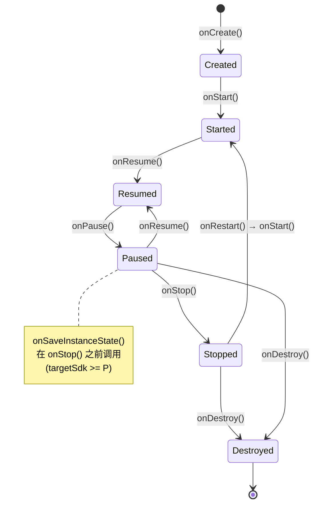
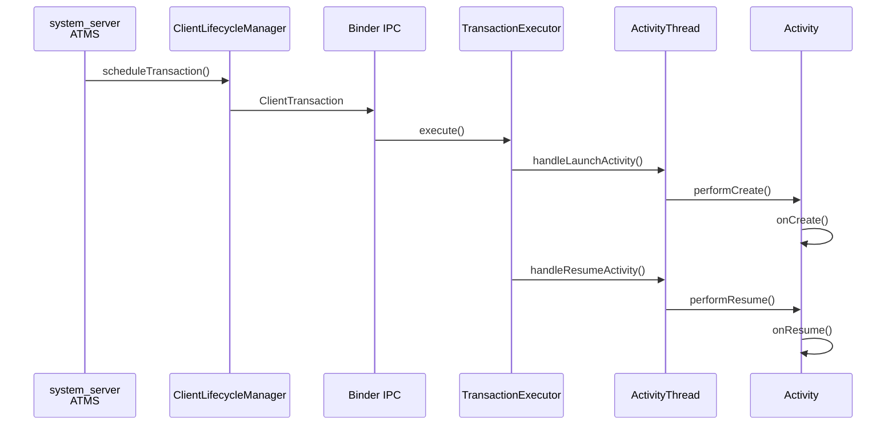
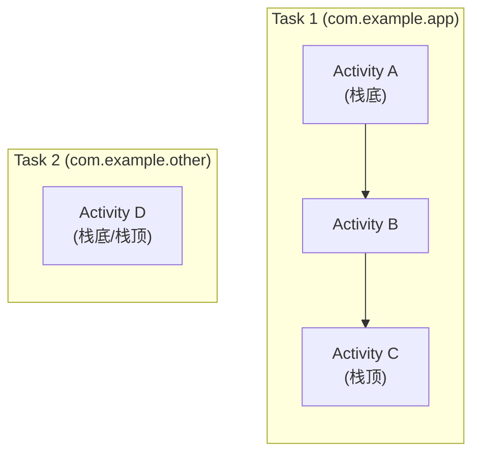
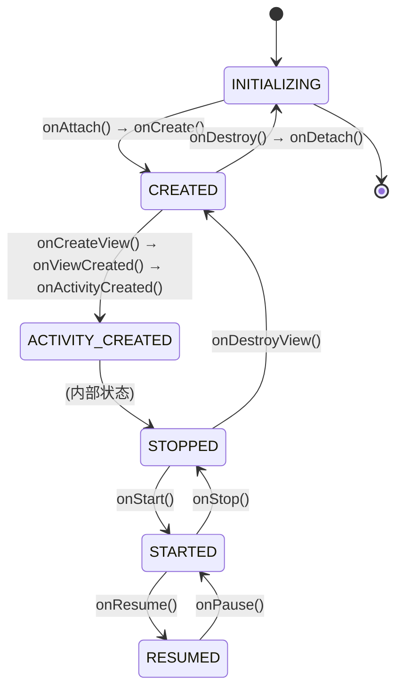
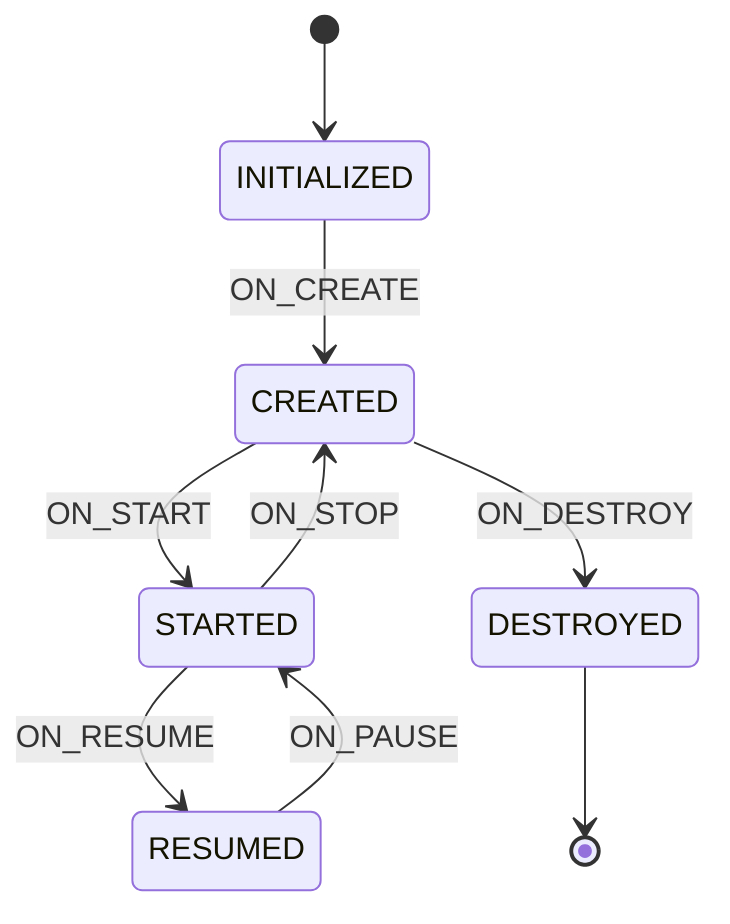

# Activity 与 Fragment 深度解析

> 面向具有 5.5 年 Android 应用开发经验的开发者，从 AOSP 源码视角深入 Activity/Fragment 生命周期的驱动机制、启动模式与 Task 管理、Fragment 事务原理，并延伸到 AndroidX Lifecycle 与 ViewModel 架构组件的设计思想

---

## 1. Activity 生命周期全景图

### 1.1 源码位置

```
frameworks/base/core/java/android/app/Activity.java
```

### 1.2 生命周期状态机



### 1.3 perform* 方法与回调的对应关系

Activity 的生命周期并非由 `on*` 方法自行驱动，而是由 `perform*` 方法统一调度，同时同步 Fragment 生命周期：

| perform* 方法 | 核心动作 | Fragment 联动 | 源码行 |
|------|------|------|------|
| `performCreate()` | 调用 `onCreate()` | `mFragments.dispatchActivityCreated()` | 8984-9015 |
| `performStart()` | `mInstrumentation.callActivityOnStart()` | `mFragments.dispatchStart()` | 9034-9086 |
| `performResume()` | `mInstrumentation.callActivityOnResume()` | `mFragments.dispatchResume()` | 9144-9195 |
| `performPause()` | 调用 `onPause()` | `mFragments.dispatchPause()` | 9197-9220 |
| `performStop()` | `mInstrumentation.callActivityOnStop()` | `mFragments.dispatchStop()` | 9227-9281 |
| `performDestroy()` | 调用 `onDestroy()` | `mFragments.dispatchDestroy()` | 9283-9303 |

关键设计：`perform*` 中通过 `mCalled` 标志位检测子类是否调用了 `super.on*()`，未调用则抛出 `SuperNotCalledException`。

### 1.4 Fragment 生命周期的同步入口

```java
// Activity.java 行 960
final FragmentController mFragments = FragmentController.createController(new HostCallbacks());
```

Activity 的每个 `perform*` 方法内部都会调用 `mFragments.dispatch*()` 来同步驱动所有附属 Fragment 的生命周期，保证 Activity 与 Fragment 的状态一致性。

---

## 2. Activity 生命周期的驱动机制（ClientTransaction）

### 2.1 核心架构

Activity 生命周期的驱动采用 **事务机制**——system_server 不直接调用 App 的生命周期方法，而是封装为 `ClientTransaction` 发送给 App 进程执行。

### 2.2 调度全链路



### 2.3 生命周期状态常量

```java
// ActivityLifecycleItem.java 行 32-53
public static final int PRE_ON_CREATE = 0;
public static final int ON_CREATE = 1;
public static final int ON_START = 2;
public static final int ON_RESUME = 3;
public static final int ON_PAUSE = 4;
public static final int ON_STOP = 5;
public static final int ON_DESTROY = 6;
public static final int ON_RESTART = 7;
```

### 2.4 事务项对照表

| 事务项 | 目标状态 | 调用的 ActivityThread 方法 |
|------|------|------|
| `LaunchActivityItem` | ON_CREATE | `handleLaunchActivity()` |
| `StartActivityItem` | ON_START | `handleStartActivity()` |
| `ResumeActivityItem` | ON_RESUME | `handleResumeActivity()` |
| `PauseActivityItem` | ON_PAUSE | `handlePauseActivity()` |
| `StopActivityItem` | ON_STOP | `handleStopActivity()` |
| `DestroyActivityItem` | ON_DESTROY | `handleDestroyActivity()` |

关键源码路径：
```
frameworks/base/core/java/android/app/servertransaction/LaunchActivityItem.java
frameworks/base/core/java/android/app/servertransaction/ActivityLifecycleItem.java
frameworks/base/services/core/java/com/android/server/wm/ClientLifecycleManager.java
```

### 2.5 服务端的 ActivityRecord 状态

system_server 通过 `ActivityRecord.State` 跟踪每个 Activity 的服务端状态：

```java
// ActivityRecord.java 行 614-626
enum State {
    INITIALIZING,
    STARTED,
    RESUMED,
    PAUSING,
    PAUSED,
    STOPPING,
    STOPPED,
    FINISHING,
    DESTROYING,
    DESTROYED,
    RESTARTING_PROCESS
}
```

注意：服务端 `State` 包含中间态（`PAUSING`、`STOPPING`、`FINISHING`），用于处理并发场景和状态回退。

---

## 3. Activity 启动模式与 Task 管理

### 3.1 五种启动模式

```java
// ActivityInfo.java 行 77-105
public static final int LAUNCH_MULTIPLE = 0;              // standard
public static final int LAUNCH_SINGLE_TOP = 1;            // singleTop
public static final int LAUNCH_SINGLE_TASK = 2;           // singleTask
public static final int LAUNCH_SINGLE_INSTANCE = 3;       // singleInstance
public static final int LAUNCH_SINGLE_INSTANCE_PER_TASK = 4; // singleInstancePerTask (Android 12+)
```

| 启动模式 | 多实例 | Task 行为 | 典型场景 |
|------|------|------|------|
| **standard** | 允许 | 在调用者 Task 中创建新实例 | 普通页面 |
| **singleTop** | 栈顶复用 | 栈顶已有则调 `onNewIntent()`，否则新建 | 通知点击、搜索页 |
| **singleTask** | 栈内复用 | 同 taskAffinity 的 Task 中找已有实例，清除其上方 Activity | 首页、主入口 |
| **singleInstance** | 独占 Task | 独占一个 Task，Task 中不允许其他 Activity | 来电界面、悬浮窗 |
| **singleInstancePerTask** | 每 Task 一个 | 每个 Task 最多一个实例，不同 Task 可各有一个 | 多窗口场景 |

### 3.2 常用 Intent Flags

| Flag | 效果 |
|------|------|
| `FLAG_ACTIVITY_NEW_TASK` | 在新 Task 中启动（需配合 taskAffinity） |
| `FLAG_ACTIVITY_CLEAR_TOP` | 已在栈中则清除其上方所有 Activity |
| `FLAG_ACTIVITY_SINGLE_TOP` | 等同于 singleTop |
| `FLAG_ACTIVITY_CLEAR_TASK` | 清空整个 Task 再启动（需配合 NEW_TASK） |
| `FLAG_ACTIVITY_NO_HISTORY` | 不保留在栈中，离开即销毁 |

### 3.3 Task 与 Back Stack



- 每个 Task 是一个 Activity 栈（Back Stack），用户按返回键从栈顶逐个弹出
- `taskAffinity` 决定 Activity 默认归属哪个 Task，默认值为 App 包名
- `allowTaskReparenting` 允许 Activity 在 Task 之间迁移

关键源码路径：
```
frameworks/base/services/core/java/com/android/server/wm/Task.java
frameworks/base/services/core/java/com/android/server/wm/ActivityRecord.java
```

---

## 4. Activity 状态保存与恢复

### 4.1 onSaveInstanceState 调用时机

```java
// Activity.java 行 2506-2515
protected void onSaveInstanceState(@NonNull Bundle outState) {
    outState.putBundle(WINDOW_HIERARCHY_TAG, mWindow.saveHierarchyState());
    Parcelable p = mFragments.saveAllState();
    if (p != null) {
        outState.putParcelable(FRAGMENTS_TAG, p);
    }
    getAutofillClientController().onSaveInstanceState(outState);
    dispatchActivitySaveInstanceState(outState);
}
```

调用时机（`targetSdk >= P`）：
1. `onStop()` **之前**调用（Android 9+ 保证此顺序）
2. 不在 `finish()` 主动销毁时调用——只在系统可能回收时触发

### 4.2 恢复流程

- `onCreate(savedInstanceState)` — savedInstanceState 不为 null 时即为恢复场景
- `onRestoreInstanceState(savedInstanceState)` — 在 `onStart()` 之后调用，仅在有保存状态时回调

### 4.3 Bundle 大小限制

Binder 事务缓冲区限制约 **1MB**（所有并发事务共享），单个 Bundle 过大会抛出 `TransactionTooLargeException`。实践建议：
- Bundle 仅存储轻量级 UI 状态（滚动位置、选中项 ID）
- 大数据使用 ViewModel 或持久化存储

### 4.4 配置变更时的销毁重建

当发生屏幕旋转等配置变更时：

```
performPause() → performStop() → onSaveInstanceState()
→ performDestroy() → [创建新实例] → performCreate(savedState)
→ performStart() → onRestoreInstanceState() → performResume()
```

可通过 `android:configChanges` 拦截特定变更，避免重建，但不推荐滥用。

---

## 5. Fragment 生命周期

### 5.1 源码位置

```
frameworks/base/core/java/android/app/Fragment.java             ← AOSP（已废弃）
frameworks/base/core/java/android/app/FragmentManager.java
frameworks/base/core/java/android/app/FragmentTransaction.java
```

> 注：AOSP 中的 `android.app.Fragment` 已标记 `@Deprecated`，现代开发使用 AndroidX Fragment。本节以 AOSP 源码讲解底层原理，设计思想与 AndroidX 一致。

### 5.2 Fragment 内部状态常量

```java
// Fragment.java 行 276-282
static final int INVALID_STATE = -1;   // Invalid state used as a null value.
static final int INITIALIZING = 0;     // Not yet created.
static final int CREATED = 1;          // Created.
static final int ACTIVITY_CREATED = 2; // The activity has finished its creation.
static final int STOPPED = 3;          // Fully created, not started.
static final int STARTED = 4;          // Created and started, not resumed.
static final int RESUMED = 5;          // Created started and resumed.
```

### 5.3 Fragment 生命周期状态图



### 5.4 Fragment 回调与 perform* 方法

| 状态转换 | perform* 方法 | 回调方法 | 目标 mState |
|------|------|------|------|
| 创建 | `performCreate()` | `onCreate()` | CREATED |
| 创建视图 | `performCreateView()` | `onCreateView()` | — |
| Activity 创建完成 | `performActivityCreated()` | `onActivityCreated()` | ACTIVITY_CREATED |
| 启动 | `performStart()` | `onStart()` | STARTED |
| 恢复 | `performResume()` | `onResume()` | RESUMED |
| 暂停 | `performPause()` | `onPause()` | STARTED |
| 停止 | `performStop()` | `onStop()` | STOPPED |
| 销毁视图 | `performDestroyView()` | `onDestroyView()` | CREATED |
| 销毁 | `performDestroy()` | `onDestroy()` | INITIALIZING |
| 分离 | `performDetach()` | `onDetach()` | — |

### 5.5 Activity 与 Fragment 生命周期联动

Activity 的 `perform*` 驱动 Fragment 的 `dispatch*`，二者联动顺序：

**启动阶段（从外到内）：**
```
Activity.onCreate() → Fragment.onAttach/onCreate/onCreateView/onActivityCreated
Activity.onStart()  → Fragment.onStart()
Activity.onResume() → Fragment.onResume()
```

**销毁阶段（从内到外）：**
```
Fragment.onPause()       → Activity.onPause()
Fragment.onStop()        → Activity.onStop()
Fragment.onDestroyView() → Fragment.onDestroy() → Fragment.onDetach()
                         → Activity.onDestroy()
```

---

## 6. FragmentManager 与事务机制

### 6.1 核心调度：moveToState()

`FragmentManagerImpl.moveToState()` 是 Fragment 生命周期调度的核心方法（行 1165-1483），负责将 Fragment 从当前状态转换到目标状态：

```
// 伪代码 — moveToState 核心逻辑
void moveToState(Fragment f, int newState) {
    if (f.mState < newState) {
        // 向上转换：INITIALIZING → CREATED → ... → RESUMED
        switch (f.mState) {
            case INITIALIZING:
                f.onAttach(); f.performCreate();
                // fall through
            case CREATED:
                f.performCreateView(); f.onViewCreated();
                f.performActivityCreated();
                // fall through
            case ACTIVITY_CREATED:
                // fall through to STOPPED
            case STOPPED:
                f.performStart();
                // fall through
            case STARTED:
                f.performResume();
        }
    } else if (f.mState > newState) {
        // 向下转换：RESUMED → STARTED → ... → INITIALIZING
        switch (f.mState) {
            case RESUMED:
                f.performPause();
                // fall through
            case STARTED:
                f.performStop();
                // fall through
            case STOPPED:
            case ACTIVITY_CREATED:
                f.performDestroyView();
                // fall through
            case CREATED:
                f.performDestroy(); f.performDetach();
        }
    }
}
```

### 6.2 FragmentTransaction 操作

```java
// FragmentTransaction.java 行 33-137
add(containerViewId, fragment, tag)      // 添加到容器
replace(containerViewId, fragment, tag)  // 替换容器中的已有 Fragment
remove(fragment)                         // 移除
hide(fragment)                           // 隐藏（View.GONE，不走生命周期）
show(fragment)                           // 显示
detach(fragment)                         // 分离（销毁 View，保留实例）
attach(fragment)                         // 重新附加（重建 View）
```

**add vs replace 的区别：**

| 操作 | 已有 Fragment | 新 Fragment | 回退行为 |
|------|------|------|------|
| `add` | 保留（可能重叠） | 添加到容器 | 移除新 Fragment |
| `replace` | 移除（或 detach） | 添加到容器 | 恢复旧 Fragment |

**hide/show vs detach/attach 的区别：**

| 操作对 | View 状态 | Fragment 生命周期 | 适用场景 |
|------|------|------|------|
| `hide/show` | GONE/VISIBLE | 不变化 | 需要保持状态的 Tab 切换 |
| `detach/attach` | 销毁/重建 | `onDestroyView` / `onCreateView` | 需要释放 View 内存 |

### 6.3 commit 的四种方式

| 方法 | 异步/同步 | 允许状态丢失 | 说明 |
|------|------|------|------|
| `commit()` | 异步（post 到主线程） | 否 | 标准方式，`onSaveInstanceState()` 后调用会崩溃 |
| `commitAllowingStateLoss()` | 异步 | 是 | 允许在保存状态后提交，可能丢失用户操作 |
| `commitNow()` | 同步（立即执行） | 否 | 不能与 `addToBackStack()` 一起使用 |
| `commitNowAllowingStateLoss()` | 同步 | 是 | 最宽松，但风险最高 |

### 6.4 Back Stack 管理

```java
// 添加到回退栈
fragmentTransaction.addToBackStack("tag_name").commit();

// 弹出回退栈
fragmentManager.popBackStack();                    // 异步弹出栈顶
fragmentManager.popBackStack("tag", 0);           // 弹到指定 tag
fragmentManager.popBackStack("tag", POP_BACK_STACK_INCLUSIVE); // 包含 tag 一起弹出
fragmentManager.popBackStackImmediate();            // 同步弹出
```

---

## 7. Lifecycle 组件（AndroidX）

> AndroidX Lifecycle 源码不在 AOSP 中（位于独立的 AndroidX 仓库），但其设计思想与 AOSP Activity 生命周期机制紧密关联，是面试必考内容。

### 7.1 设计动机

传统做法需要在 Activity 的每个 `on*` 回调中手动注册/反注册组件（如 LocationListener、MediaPlayer）。Lifecycle 用**观察者模式**解决这个问题——组件自行感知生命周期，无需在 Activity 中编写样板代码。

### 7.2 核心接口与类

| 类/接口 | 职责 |
|------|------|
| `Lifecycle` | 抽象类，持有 State 和 Event，提供 `addObserver()` / `removeObserver()` |
| `LifecycleOwner` | Activity/Fragment 实现此接口，暴露 `getLifecycle()` |
| `LifecycleObserver` | 标记接口（已废弃注解方式） |
| `DefaultLifecycleObserver` | 推荐的观察者接口，提供所有 `on*` 默认方法 |
| `LifecycleRegistry` | `Lifecycle` 的实现类，在 `ComponentActivity` 中创建和维护 |

### 7.3 State 与 Event 的映射



**理解要点：** Event 是转换动作，State 是转换后的稳态。`ON_CREATE` 事件触发后进入 `CREATED` 状态，`ON_PAUSE` 事件触发后回退到 `STARTED` 状态。

### 7.4 与 AOSP Activity 的衔接

AndroidX `ComponentActivity` 继承自 AOSP `android.app.Activity`：

```
AOSP Activity.performCreate()
  → Activity.onCreate()
    → ComponentActivity.onCreate()          ← AndroidX
      → mLifecycleRegistry.handleLifecycleEvent(ON_CREATE)
        → 通知所有 LifecycleObserver.onCreate()
```

AOSP 的 `perform*` 方法是最底层的驱动源，AndroidX Lifecycle 是在其上层封装的观察者分发机制。

### 7.5 典型使用场景

```kotlin
// 自定义 LifecycleObserver
class LocationObserver(private val context: Context) : DefaultLifecycleObserver {
    override fun onStart(owner: LifecycleOwner) {
        // 开始定位
    }
    override fun onStop(owner: LifecycleOwner) {
        // 停止定位
    }
}

// Activity 中一行注册，无需手动反注册
lifecycle.addObserver(LocationObserver(this))
```

其他场景：
- **LiveData**：内部持有 `LifecycleOwner`，仅在 `STARTED` 以上状态分发数据
- **lifecycleScope**：协程作用域，自动在 `onDestroy()` 时取消
- **repeatOnLifecycle**：在指定状态范围内重复收集 Flow

---

## 8. ViewModel 架构（AndroidX）

### 8.1 设计动机

配置变更（屏幕旋转）会销毁重建 Activity，导致内存中的 UI 数据丢失。ViewModel 的生命周期**跨越配置变更**，在 Activity 重建后仍可获取同一个 ViewModel 实例。

### 8.2 核心类

| 类/接口 | 职责 |
|------|------|
| `ViewModel` | 持有 UI 数据，提供 `onCleared()` 回调在最终销毁时释放资源 |
| `ViewModelProvider` | 创建和获取 ViewModel 实例的工厂类 |
| `ViewModelStore` | HashMap 容器，存储 `<String, ViewModel>` |
| `ViewModelStoreOwner` | `ComponentActivity` 和 `Fragment` 实现，暴露 `getViewModelStore()` |
| `SavedStateHandle` | 键值对容器，数据序列化到 Bundle，进程被杀后可恢复 |

### 8.3 ViewModel 生命周期

```
                Activity          ViewModel
                --------          ---------
                onCreate()        ← 首次创建 / 从 ViewModelStore 获取
                onStart()
                onResume()
                ─── 用户旋转屏幕 ───
                onPause()
                onStop()
                onDestroy()       ← 配置变更，Activity 销毁
                ─── 新 Activity ───
                onCreate()        ← 获取到同一个 ViewModel 实例！
                onStart()
                onResume()
                ─── 用户按返回 ───
                onPause()
                onStop()
                onDestroy()       ← 真正 finish
                                  → ViewModel.onCleared() ← 最终清理
```

### 8.4 存活原理：NonConfigurationInstances

ViewModel 能跨配置变更的根基在 AOSP `Activity.java`：

```java
// Activity.java 行 925-931
static final class NonConfigurationInstances {
    Object activity;          // ← onRetainNonConfigurationInstance() 的返回值
    HashMap<String, Object> children;
    FragmentManagerNonConfig fragments;
    // ...
}
```

**完整链路：**

1. 配置变更触发销毁时，`ActivityThread.performDestroyActivity()` 调用：
   ```java
   // ActivityThread.java 行 5940
   r.lastNonConfigurationInstances = r.activity.retainNonConfigurationInstances();
   ```
2. `retainNonConfigurationInstances()` 调用 `onRetainNonConfigurationInstance()`，AndroidX `ComponentActivity` 在此处保存 `ViewModelStore`
3. 新 Activity 创建时，通过 `attach()` 参数传入 `lastNonConfigurationInstances`
4. `ComponentActivity.onCreate()` 从中恢复 `ViewModelStore`，ViewModel 实例不变

### 8.5 数据保持方案对比

| 方案 | 配置变更存活 | 进程被杀存活 | 数据大小限制 | 适用场景 |
|------|------|------|------|------|
| **ViewModel** | 存活 | 丢失 | 无限制（内存） | UI 状态、网络数据缓存 |
| **onSaveInstanceState** | 存活 | 存活 | ~1MB（Bundle/Binder） | 轻量 ID、滚动位置 |
| **SavedStateHandle** | 存活 | 存活 | ~1MB | ViewModel + 进程恢复 |
| **Room / DataStore** | 存活 | 存活 | 磁盘空间 | 持久化业务数据 |

### 8.6 典型使用

```kotlin
// 定义 ViewModel
class UserViewModel(private val savedStateHandle: SavedStateHandle) : ViewModel() {
    val userName: StateFlow<String> = savedStateHandle.getStateFlow("name", "")
    
    fun loadUser(id: String) { /* 网络请求 */ }
    
    override fun onCleared() { /* 释放资源 */ }
}

// Activity 中获取
class UserActivity : AppCompatActivity() {
    private val viewModel: UserViewModel by viewModels()
}

// Fragment 间共享（使用宿主 Activity 的 ViewModelStore）
class DetailFragment : Fragment() {
    private val sharedViewModel: UserViewModel by activityViewModels()
}
```

---

## 9. android.app.Fragment vs AndroidX Fragment

### 9.1 废弃原因

AOSP `android.app.Fragment`（API 11 引入，API 28 废弃）的核心问题：
- 生命周期与系统版本绑定，无法独立修复 Bug
- 缺少 `ViewLifecycleOwner`，View 和 Fragment 实例生命周期混淆
- `onActivityCreated()` 导致 Activity 和 Fragment 耦合

### 9.2 AndroidX Fragment 关键改进

| 改进点 | 说明 |
|------|------|
| **独立版本发布** | 通过 Gradle 依赖更新，不受 Android 版本约束 |
| **ViewLifecycleOwner** | Fragment 的 View 有独立的 Lifecycle，避免 View 销毁后仍观察数据 |
| **FragmentFactory** | 支持构造器参数注入，替代无参构造器 + `setArguments()` |
| **FragmentResult API** | Fragment 间类型安全的结果传递，替代 `setTargetFragment()` |
| **Navigation 集成** | 与 Navigation Component 深度整合，简化路由 |
| **废弃 onActivityCreated** | 推荐使用 `onViewCreated()` + `onViewStateRestored()` |
| **RESUMED 状态的 max lifecycle** | ViewPager2 中可控制 Fragment 的最大生命周期状态，实现真正的懒加载 |

### 9.3 源码位置

- AOSP：`frameworks/base/core/java/android/app/Fragment.java`（已废弃，仅供原理学习）
- AndroidX：独立仓库 `androidx.fragment:fragment`（不在 AOSP 目录树中）

---

## 10. 常见问题与最佳实践

### 10.1 Fragment 重叠问题

**成因：** Activity 因配置变更重建时，系统自动从 `savedInstanceState` 恢复之前的 Fragment。如果 `onCreate()` 中无条件执行 `add()`，会产生重叠。

**解决：**
```kotlin
override fun onCreate(savedInstanceState: Bundle?) {
    super.onCreate(savedInstanceState)
    if (savedInstanceState == null) {
        supportFragmentManager.beginTransaction()
            .add(R.id.container, MyFragment())
            .commit()
    }
}
```

### 10.2 Fragment 与 Activity 通信方式对比

| 方式 | 耦合度 | 适用场景 |
|------|------|------|
| 接口回调 | 高（直接引用） | 简单场景，少量数据 |
| 共享 ViewModel | 低 | 推荐方案，数据驱动 |
| FragmentResult API | 低 | 一次性结果传递 |
| EventBus / 广播 | 最低 | 跨模块通信（不推荐滥用） |

### 10.3 ViewPager2 + Fragment 懒加载

AndroidX Fragment 支持 `setMaxLifecycle()`，ViewPager2 默认使用：

```kotlin
// FragmentStateAdapter 内部
fragmentTransaction.setMaxLifecycle(fragment, Lifecycle.State.STARTED)
// 当前页面的 Fragment 才会 RESUME，非当前页停留在 STARTED
```

不再需要 `setUserVisibleHint()` 等过时方案。

### 10.4 DialogFragment vs Dialog

| 对比 | Dialog | DialogFragment |
|------|------|------|
| 生命周期管理 | 手动管理，旋转易泄漏 | 随 Fragment 生命周期自动管理 |
| 状态保存 | 不支持 | 支持 `onSaveInstanceState()` |
| 推荐程度 | 不推荐 | **推荐** |

### 10.5 ViewModel 内存泄漏陷阱

ViewModel 的生命周期长于 Activity 的单次实例，因此 **绝对不能持有 Activity/Fragment/View 的引用**：

```kotlin
// 错误：ViewModel 持有 Activity 引用 → 内存泄漏
class BadViewModel(private val activity: Activity) : ViewModel()

// 正确：需要 Context 时使用 AndroidViewModel（持有 Application）
class GoodViewModel(application: Application) : AndroidViewModel(application)
```

---

## 11. 面试高频问题

### Q1：Activity 的 `onCreate()` 和 `onStart()` 有什么区别？

**onCreate()** 在 Activity 首次创建时调用，用于初始化（setContentView、绑定数据）。**onStart()** 在 Activity 变为可见时调用（每次从不可见恢复都会调）。关键区别：`onCreate()` 只在创建和配置变更重建时调用一次，`onStart()` 在每次可见时都调。

### Q2：说一下 Activity 的启动模式，singleTask 和 singleInstance 的区别是什么？

`singleTask` 在同 `taskAffinity` 的 Task 中复用实例，清除其上方的 Activity；该 Task 中可以有其他 Activity。`singleInstance` 独占一个 Task，Task 中不允许有其他 Activity。

### Q3：onSaveInstanceState 在 Activity 生命周期的哪个时机调用？

`targetSdk >= P` 时保证在 `onStop()` 之前调用（紧跟在 `onPause()` 之后）。低版本在 `onStop()` 前但不保证与 `onPause()` 的相对顺序。只在系统可能回收 Activity 时触发，`finish()` 不触发。

### Q4：Fragment 的 add 和 replace 有什么区别？

`add` 将 Fragment 添加到容器，不移除已有的 Fragment（可能导致重叠）。`replace` 先移除容器中所有同 `containerViewId` 的 Fragment，再添加新的。若配合 `addToBackStack()`，`replace` 被弹出时会恢复之前移除的 Fragment。

### Q5：commit() 和 commitAllowingStateLoss() 的区别，什么场景使用后者？

`commit()` 在 `onSaveInstanceState()` 之后调用会抛出 `IllegalStateException`，因为提交的事务无法被保存到状态中。`commitAllowingStateLoss()` 允许在此之后提交，代价是配置变更后事务可能丢失。适用于不影响用户体验的后台更新操作。

### Q6：Lifecycle 的 State 和 Event 是什么关系？

Event 是生命周期的**转换动作**（如 ON_CREATE、ON_RESUME），State 是转换后的**稳定状态**（如 CREATED、RESUMED）。Event 触发 State 变化：ON_CREATE → CREATED，ON_START → STARTED，ON_PAUSE → 回退到 STARTED，ON_STOP → 回退到 CREATED。

### Q7：ViewModel 为什么能在配置变更后存活？

底层依赖 AOSP `Activity` 的 `NonConfigurationInstances` 机制。配置变更触发销毁时，`ActivityThread.performDestroyActivity()` 调用 `activity.retainNonConfigurationInstances()` 保存数据到 `ActivityClientRecord`。新 Activity 创建时通过 `attach()` 传入上次保存的实例。AndroidX `ComponentActivity` 在此机制上保存 `ViewModelStore`，从而让所有 ViewModel 实例跨重建存活。

### Q8：ViewModel 和 onSaveInstanceState 如何选择？

ViewModel 适合**大数据和复杂对象**（网络请求结果、列表数据），仅在配置变更时存活，进程被杀后丢失。onSaveInstanceState 适合**轻量级 UI 状态**（滚动位置、选中 ID），数据通过 Bundle 序列化，受 1MB 大小限制，但进程被杀后可恢复。最佳实践是两者结合使用，或使用 `SavedStateHandle` 统一管理。

### Q9：Fragment 的 ViewLifecycleOwner 是什么？解决了什么问题？

AndroidX Fragment 引入了 View 独立的 Lifecycle（通过 `getViewLifecycleOwner()`）。问题场景：Fragment 使用 `replace` + `addToBackStack` 时，返回后 Fragment 实例不变但 View 会重建。如果用 Fragment 本身的 Lifecycle 观察 LiveData，旧的 Observer 不会被移除，导致重复回调。使用 `viewLifecycleOwner` 则 Observer 随 View 销毁而自动移除。

### Q10：如何实现两个 Fragment 之间的数据通信？

推荐方案：**共享 ViewModel**——两个 Fragment 通过 `by activityViewModels()` 获取宿主 Activity 级别的 ViewModel，通过 LiveData/StateFlow 通信。替代方案：**FragmentResult API**——发送方 `setFragmentResult(key, bundle)`，接收方 `setFragmentResultListener(key)`，适合一次性结果传递。

### Q11：ActivityThread 中 handleLaunchActivity 和 performLaunchActivity 的区别？

`handleLaunchActivity()` 是事务调度的入口，负责调用 `performLaunchActivity()` 创建 Activity 实例并触发生命周期，之后还会处理窗口可见性等后续工作。`performLaunchActivity()` 是实际的创建逻辑：通过 `Instrumentation.newActivity()` 反射创建 Activity → 调用 `activity.attach()` 绑定上下文 → 调用 `activity.performCreate()` 触发 `onCreate()`。

### Q12：描述 Fragment 事务的执行流程。

`beginTransaction()` 创建 `BackStackRecord`，记录所有操作（add/replace/remove 等）。`commit()` 将 `BackStackRecord` 添加到待执行队列，post 一个 Runnable 到主线程。执行时 `FragmentManager.execPendingActions()` 批量处理队列中的所有事务，对每个受影响的 Fragment 调用 `moveToState()` 驱动状态转换。如果添加了 `addToBackStack()`，`BackStackRecord` 会被压入 Back Stack，用户按返回键时弹出并反向执行操作。

---

## 关联文档

- [01-2-App启动流程](01-2-App启动流程.md) — Activity 创建的跨进程完整链路
- [02-1-AMS与WMS核心服务](02-1-AMS与WMS核心服务.md) — 系统服务视角的 AMS/ATMS 和 WMS
- [03-View绘制体系](03-View绘制体系.md) — Activity 首帧上屏后的 View 测量/布局/绘制
- [01-1-Android系统启动流程](01-1-Android系统启动流程.md) — 从开机到 Launcher 的系统启动全链路
- [10-1-AndroidStudioProfiler性能优化](10-1-AndroidStudioProfiler性能优化.md) — Activity/Fragment 内存泄漏检测
