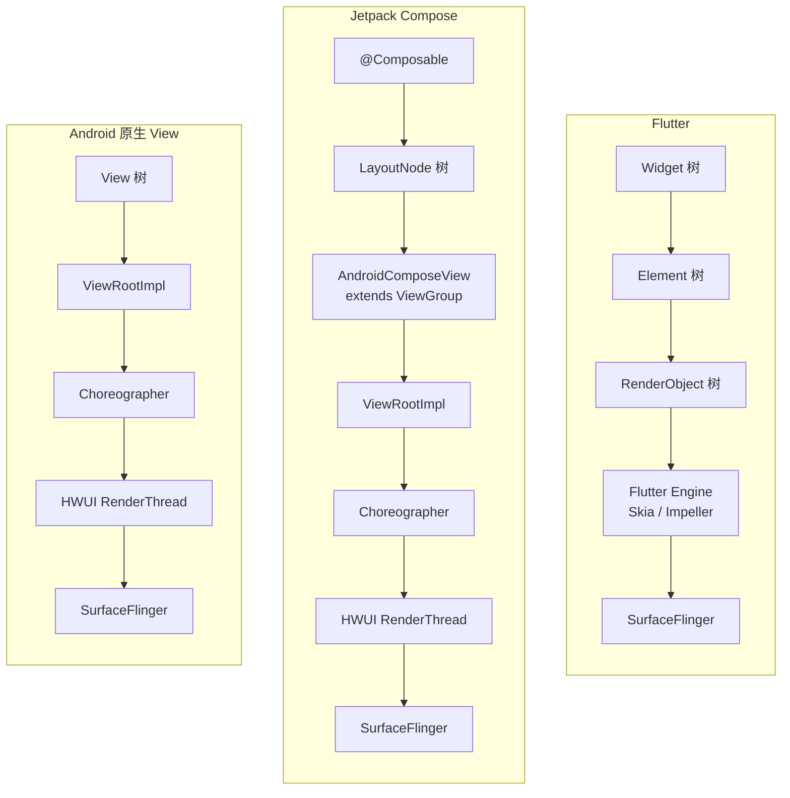
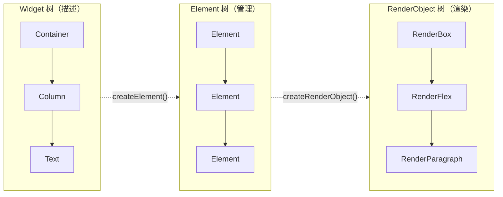
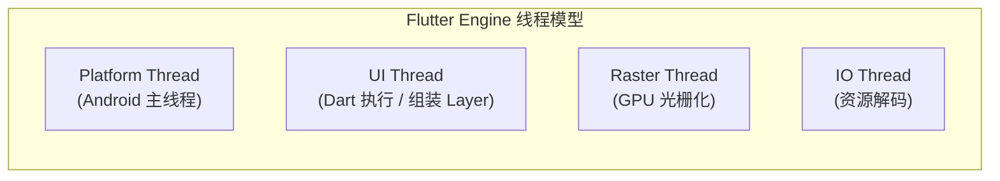
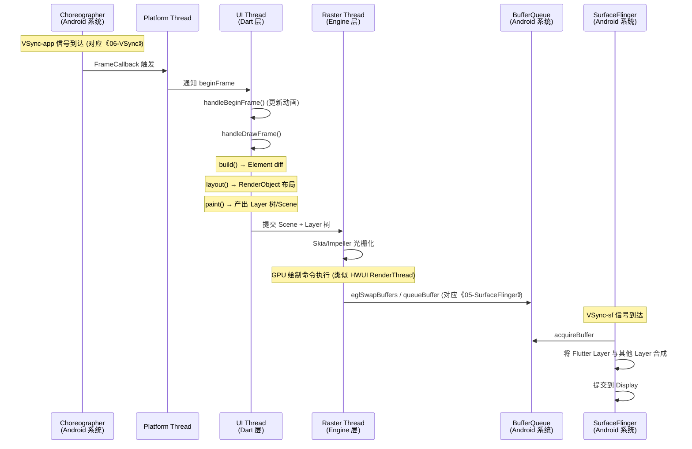
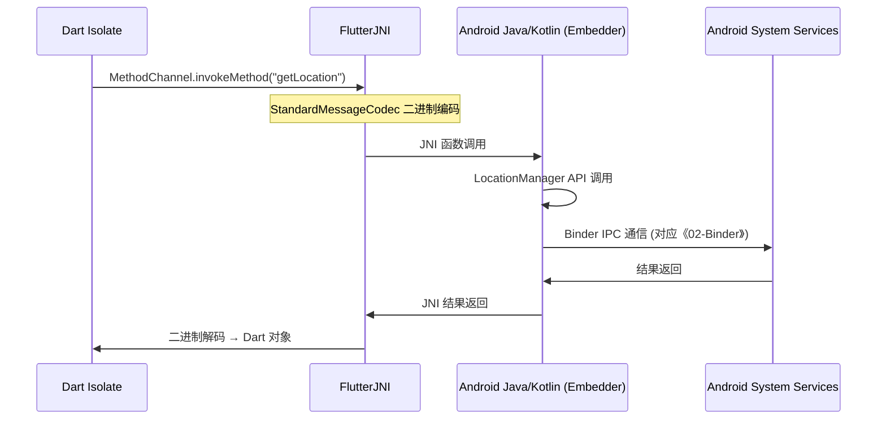

# Flutter 渲染框架设计

> 面向具有 5.5 年 Android 应用开发经验的开发者，从上层 Widget 声明式 API 逐层向下，经 Element/RenderObject 三棵树、Flutter Engine（Skia/Impeller）、Embedder 平台层，最终对接到已学习的 AOSP 系统组件。
> 
> 💡 **学习导读**：本文在叙述 Flutter 设计时，会全程对标 Android 原生渲染框架的四大核心模块：
> 1. [《03-View绘制体系》](./03-View绘制体系.md)
> 2. [《04-HWUI渲染管线》](./04-HWUI渲染管线.md)
> 3. [《06-VSync与帧调度》](./06-VSync与帧调度.md)
> 4. [《05-SurfaceFlinger合成》](./05-SurfaceFlinger合成.md)

---

## 1. Flutter 的架构定位 — 与 Android 原生/Compose 的根本差异

### 1.1 三种渲染路径对比



**核心区别**：

| 维度 | Android 原生 View | Jetpack Compose | Flutter |
|------|-------------------|-----------------|---------|
| 渲染路径 | View → ViewRootImpl → HWUI → SF | LayoutNode → AndroidComposeView → ViewRootImpl → HWUI → SF | RenderObject → Engine → SF |
| 是否经过 View 体系 | 是（核心） | 是（桥接） | **否（完全绕过）** |
| 是否经过 HWUI | 是 | 是 | **否（自带渲染引擎）** |
| 渲染引擎 | HWUI（内含 Skia） | HWUI（内含 Skia） | Skia / Impeller（自带） |
| 语言 | Java / Kotlin | Kotlin | Dart |
| 跨平台 | 仅 Android | 跨 Android（Compose Multiplatform 支持桌面/iOS） | iOS / Android / Web / Desktop |

---

## 2. Widget / Element / RenderObject 三棵树

> 💡 **【对标原生】**：本节内容对应 Android 的 **[《03-View绘制体系》](./03-View绘制体系.md)**。在原生中，UI 的描述、管理、布局、绘制都由 `View` 承担（过于沉重）；而 Flutter 将其拆分为轻量的 `Widget`、负责状态和生命周期的 `Element`，以及专门负责布局绘制的 `RenderObject`。

### 2.1 三棵树的职责拆分

Flutter 将 UI 的**描述**、**管理**、**渲染**三个关注点分离到三棵不同的树中：



### 2.2 详解三棵树

| 树 | 节点基类 | 职责 | 💡 对应 [《03-View绘制体系》](./03-View绘制体系.md) |
|----|---------|------|------|
| **Widget** | `Widget` | 声明式配置描述（轻量、不可变、频繁重建） | 类似写在 XML 中的标签配置，只是它是代码形式 |
| **Element** | `Element` | 管理 Widget → RenderObject 的映射，跨帧复用，做 diff 判断 | `View` 中负责保存状态（状态机）、生命周期管理的部分 |
| **RenderObject** | `RenderObject` | 实际的布局计算和绘制（长生命周期，仅在必要时更新） | `View` 中的 `measure()`, `layout()`, `draw()` 核心逻辑 |

**工作机制**：每次 `setState()` 后 `build()` 重新执行，生成新的 Widget 树。Element 层做 diff 判断，如果新旧 Widget 的 `runtimeType` 和 `key` 相同，则复用 Element 和 RenderObject，只做增量更新。这避免了原生 `View` 动辄重建带来的巨大开销。

### 2.3 跨框架生命周期对标 (Activity / Fragment / View)

在传统的 Android 开发中，我们习惯于处理 `Activity`（页面级别）、`Fragment`（局部页面模块）和 `View`（UI组件）这三种不同级别的生命周期。而 Flutter 是一个典型的**“单 Activity 架构”**（Single Activity Architecture），所谓的“万物皆 Widget”，它是如何接管并替代这些原生生命周期的呢？

1. **View 级别生命周期（组件级）**：
   - **接管者**：Flutter 的 `StatefulWidget` 及其绑定的 `State` 对象。
   - **机制**：`Widget` 只是不可变的临时配置，真正的生命周期记忆由 Element 树上的 `State` 来承载。
   - **核心映射**：
     - `View.onAttachedToWindow()` ➡️ `State.initState()` + `didChangeDependencies()` （节点被插入到 Element 树）
     - 各种 `set*()` 触发刷新 ➡️ `State.didUpdateWidget()` （父节点重建导致当前节点配置更新）
     - `View.onDetachedFromWindow()` ➡️ `State.dispose()` （节点从 Element 树上永久移除）

2. **Fragment / 页面路由级别生命周期**：
   - **接管者**：Flutter 的 `Navigator` 与 `Route` 体系 + `RouteAware` 接口。
   - **机制**：在 Flutter 中，所谓的“打开新页面”，并不是去向 AMS 申请启动新的 Activity，也不是去 commit 一个 FragmentTransaction，而是单纯地在内部虚拟栈（Overlay）上压入一个新的 Widget 节点。
   - **核心感知**：如果你想知道当前页面是否可见（类似 Fragment 的 `onResume`/`onHiddenChanged`），你需要让 State 实现 `RouteAware` 接口，通过 `didPush()`、`didPopNext()` 等回调来感知路由栈的变化。

3. **Activity / App 进程级别生命周期**：
   - **接管者**：Flutter 的 `WidgetsBindingObserver`（全局应用状态监听）。
   - **机制**：当底层的那个唯一的宿主 `FlutterActivity` 经历了系统的 `onPause` 或 `onStop` 时，宿主（Embedder 层）会将这些系统事件打包，通过 C++ Engine 转发给 Dart 层。
   - **核心映射**：通过在代码中混入 `WidgetsBindingObserver`，你可以监听到 `didChangeAppLifecycleState`：
     - `Activity.onResume()` ➡️ `AppLifecycleState.resumed`（前台可见并可交互）
     - `Activity.onPause/onStop()` ➡️ `AppLifecycleState.inactive` / `paused`（退到后台）
     - 进程/引擎销毁 ➡️ `AppLifecycleState.detached`

**总结**：Flutter 通过将系统事件桥接（Embedder），并结合自带的虚拟路由栈（Navigator）和状态对象（State），**在纯 Dart 层面完全内化并模拟了原生这三层生命周期**，极大地抹平了跨平台生命周期管理的碎片化问题。

---

## 3. 布局系统 — Constraints 向下，Size 向上

> 💡 **【对标原生】**：本节内容对应 **[《03-View绘制体系》](./03-View绘制体系.md)** 中的 `MeasureSpec` 和测量布局流程。

### 3.1 单遍布局协议

Flutter 遵循严格的单遍布局（Single-pass Layout），通过 `BoxConstraints` 和 `Size` 配合：

```
父节点 (RenderBox)
  │
  ├── 向下传递 BoxConstraints（minWidth, maxWidth, minHeight, maxHeight）
  │   💡 对应原生: ViewGroup 将 MeasureSpec 传递给子 View
  ▼
子节点 (RenderBox)
  │
  ├── 在 Constraints 范围内计算自身 Size
  │   💡 对应原生: View.onMeasure() 计算 measuredWidth/Height
  │
  ├── 向上返回 Size
  │
  ▼
父节点 (RenderBox)
  │
  └── 根据子节点 Size 确定子节点的偏移量（Offset）
      💡 对应原生: ViewGroup.onLayout() 中的 child.layout() 定位
```

### 3.2 布局约束与边界优化对比

| 维度 | Android MeasureSpec ([《03-View绘制体系》](./03-View绘制体系.md)) | Flutter BoxConstraints |
|------|--------------------|----------------------|
| 数据结构 | 32 位 int（高 2 位 mode + 低 30 位 size） | 4 个 double (min/maxWidth, min/maxHeight) |
| 模式 | EXACTLY / AT_MOST / UNSPECIFIED | 紧约束 (min==max) / 松约束 (min=0) / 无约束 |
| 多次测量 | 允许（`RelativeLayout` 等常有双重测量，性能隐患） | 不推荐，通常严格单遍测量 |
| 布局隔离优化 | 无标准机制，通常整树或大范围 `requestLayout()` | **RelayoutBoundary**：满足特定条件时，布局变化不向上传播 |

---

## 4. 绘制系统与 Layer 树

> 💡 **【对标原生】**：本节内容对应 Android 的 **[《04-HWUI渲染管线》](./04-HWUI渲染管线.md)**。Flutter 在 Dart 层构建的 Layer 树和 Scene，在设计理念上与 HWUI 的 RenderNode 树和 DisplayList 如出一辙。

### 4.1 Layer 树与 HWUI 概念映射

Flutter 渲染的产物是 Layer 树，而不是直接画在像素上：

| Flutter 绘制概念 | 💡 对应 [《04-HWUI渲染管线》](./04-HWUI渲染管线.md) 概念 | 说明 |
|------------------|--------------------------------------------|------|
| `PictureLayer` | `DisplayList` | 记录 2D 绘制命令（如 `drawRect`, `drawText`）的列表，而非位图。 |
| `OffsetLayer` 等其他 Layer | `RenderNode` 的属性（如 `setTranslation`, `setAlpha`） | 用于在 GPU 回放时做矩阵变换，无需重绘底层 `PictureLayer`。 |
| **`RepaintBoundary`** | `RenderNode` 隔离机制 | **极其重要**：`RepaintBoundary` 强制创建一个新的 Layer。子树重绘时只更新自己的 `PictureLayer`，不影响外部。等同于 HWUI 遇到复杂 View 时自动使用独立的 `RenderNode` 缓存 `DisplayList`。 |
| `Scene` | 最终的渲染树根节点提交 | 提交给 Engine 的完整绘制指令集。 |

### 4.2 绘制提交流程

```dart
// RenderView 的 compositeFrame 方法
void compositeFrame() {
  // 1. 构建 Scene (将所有 Layer 组装)
  final SceneBuilder builder = SceneBuilder();
  final Scene scene = layer!.buildScene(builder);

  // 2. 提交给 Engine
  _window.render(scene); 
  // 💡 对应原生: ViewRootImpl 将根 RenderNode 提交给 HWUI 的 RenderThread

  scene.dispose();
}
```

---

## 5. Flutter Engine — Skia、Impeller 与线程模型

> 💡 **【对标原生】**：本节对应 **[《04-HWUI渲染管线》](./04-HWUI渲染管线.md)** 中的 HWUI 架构和线程模型。Flutter Engine 扮演的就是 HWUI 的角色，只是它没有内置在 Android 框架中。

### 5.1 Skia 与 Impeller

| 渲染引擎 | 💡 与 HWUI 的关系与对比 | 特点 |
|----------|------------------------|------|
| **Skia** | AOSP `libhwui.so` 静态链接了一份 Skia；Flutter Engine `libflutter.so` 也静态链接了一份自己的 Skia。两者是平行且独立的。 | 通用 2D 图形库。存在 Shader Compilation Jank（运行时着色器编译卡顿）问题。 |
| **Impeller** | 无对应，Flutter 专属的新一代渲染引擎。 | **预编译着色器**。针对 Flutter 专门定制的精简管线，彻底解决运行时 Shader 编译卡顿。目前已是 iOS/Android 默认渲染器。 |

### 5.2 四线程模型对标 HWUI 线程

Flutter Engine 运行 4 个核心线程，这与 HWUI 的双线程模型高度相关：



| Flutter 线程 | 职责 | 💡 对应 [《04-HWUI渲染管线》](./04-HWUI渲染管线.md) 及原生组件 |
|-------------|------|--------------------------------------------------------|
| **Platform Thread** | 响应平台生命周期、处理 Platform Channel 消息、分发输入事件。 | `ActivityThread` 主线程。但 Flutter 不在其中进行 UI 测量和绘制，避免了主线程卡顿。 |
| **UI Thread** | 执行 Dart 代码：`build` → `layout` → `paint`，生成 Layer 树。 | **HWUI Main Thread**（UI 线程中负责执行 measure/layout/draw 录制 DisplayList 的阶段）。 |
| **Raster Thread** | 消费 Scene，利用 Skia/Impeller 将绘制指令光栅化为 GPU 纹理，提交到 Surface。 | **HWUI RenderThread**（接收 DisplayList，执行 OpenGL/Vulkan 命令进行 GPU 回放）。 |
| **IO Thread** | 异步加载图片和字体资源。 | 无直接对应线程，由 Glide/Fresco 等三方库或应用自定义线程池承担。 |

---

## 6. 帧调度机制 — 接入 Choreographer

> 💡 **【对标原生】**：本节深度对标 Android 系统的 **[《06-VSync与帧调度》](./06-VSync与帧调度.md)**。Flutter 虽然自带渲染器，但它必须听从 Android 系统的帧节拍（VSync）。

### 6.1 获取 VSync 信号

Flutter Embedder 层在 Android 上的 `FlutterView` / `FlutterActivity` 初始化时，会通过 `Choreographer.getInstance().postFrameCallback()` 注册自己。

```
VSync 信号 (VSYNC-app)
  ↓ [ DispSync 分发 ]
Choreographer.doFrame()
  ↓
Flutter Embedder (Platform Thread) 收到回调
  ↓ [ 跨线程传递 ]
通知 UI Thread 开始处理新的一帧
```
**结论**：Flutter 的 VSync 来源与原生 View 完全一致。

### 6.2 帧处理阶段对标

Flutter UI Thread 的帧处理由 `SchedulerBinding` 管理，它分为两个核心阶段，这与 `Choreographer` 的内部阶段完美对应：

| Flutter `SchedulerBinding` 阶段 | 💡 对应 [《06-VSync与帧调度》](./06-VSync与帧调度.md) `Choreographer` 回调 | 动作内容 |
|---------------------------------|-----------------------------------------------------------------|----------|
| **`handleBeginFrame`** (Ticker) | `CALLBACK_ANIMATION` | 执行动画计算，更新 AnimationController 的值。 |
| **`handleDrawFrame`** | `CALLBACK_TRAVERSAL` | 执行 `build()` → `layout()` → `paint()` → 生成 Scene。 |
| 交给 Raster Thread | 触发 `RenderThread` 工作 | 帧逻辑准备完毕，提交给光栅化线程。 |

---

## 7. 平台桥接与合成出口 — 接入 SurfaceFlinger

> 💡 **【对标原生】**：本节深度对标 Android 系统的 **[《05-SurfaceFlinger合成》](./05-SurfaceFlinger合成.md)**。这是解答“Flutter 画出来的东西怎么显示到屏幕上”的最终答案。

### 7.1 Flutter 获取渲染目标的两种方式

Flutter 不能直接画在屏幕上，它需要一个 Android 提供的载体。

| 载体类型 | 原理 | 💡 与 [《05-SurfaceFlinger合成》](./05-SurfaceFlinger合成.md) 的关系 |
|---------|------|----------------------------------------------------------|
| **FlutterSurfaceView** (默认，推荐) | 底层使用 `SurfaceView`。Flutter Engine 直接拿到该 Surface 的 `ANativeWindow`。 | 拥有完全独立的 BufferQueue。**完全绕过 HWUI**，Flutter 的 Raster Thread 自己作为生产者 dequeueBuffer，画完后 queueBuffer 给 SurfaceFlinger。在 SF 看来，这是一个独立的 Layer。性能最高。 |
| **FlutterTextureView** | 底层使用 `TextureView`。产生 `SurfaceTexture`。 | 相当于将 Flutter 渲染的画面作为一张纹理贴图。需要**经过 HWUI**，由 HWUI 的 RenderThread 进行二次合成后再交给 SF。支持 View 动画和复杂嵌套，但多一次 GPU 拷贝开销。 |

### 7.2 一帧的完整生命周期全景图

将前文与 Android 系统组件串联起来：



---

## 8. Platform Channel — 与系统服务通信

由于 Flutter 完全绕过了 View 体系和大部分 Android Java Framework，当它需要获取 GPS、相机、电池电量等系统服务时，必须通过 **Platform Channel**。

### 8.1 通信机制



### 8.2 与 Binder IPC 的区别

| 维度 | Platform Channel | Binder IPC |
|------|-----------------|------------|
| 通信范围 | **进程内**（Dart VM ↔ Android ART 在同一进程） | **跨进程**（App 进程 ↔ system_server 进程） |
| 底层机制 | JNI（C++ 调用 Java） + 内存拷贝 | `/dev/binder` 驱动 + mmap |
| 性能延迟 | 微秒级开销极小 | 百微秒级（涉及内核态切换） |
| 最终链路 | Dart 端发起请求最终依然依赖 Java 端通过 Binder 访问系统服务 | 系统级底层 IPC 标准 |

---

## 9. 性能分析与排查工具

> 💡 **【对标原生】**：熟练掌握了原生 Perfetto 分析（见《10-Perfetto使用指南》），分析 Flutter 将非常轻松。

### 9.1 性能工具对标

| Flutter 分析工具 | 💡 对应 Android 原生工具 | 作用 |
|------------------|-----------------------|------|
| **Flutter DevTools Performance** | Android Studio Profiler (CPU/GPU) | 火焰图分析 UI Thread 和 Raster Thread 耗时，排查 Jank。 |
| **Flutter Inspector** | Layout Inspector | 查看 Widget 树层级，排查布局嵌套过深和重组（Rebuild）范围过大。 |
| **Perfetto 中的 `flutter/` slice** | Perfetto 中的 `hwui/` slice | 系统级 Trace 分析，可直接查看 Engine 耗时并联合 SurfaceFlinger、BufferQueue 综合分析。 |

### 9.2 Jank (卡顿) 的两种主要类型

在 Flutter 中，卡顿通常被细分为两类，对应两个主要线程：

1. **UI Jank**：
   - **原因**：Dart 代码在 UI Thread 执行了过多的运算、解析庞大的 JSON、或者 `setState()` 触发了极其庞大的子树重建。
   - **对标原生**：主线程在 `measure`/`layout` 耗时过长。
2. **Raster Jank**：
   - **原因**：UI 复杂度过高（如大量的半透明混合、庞大的图片处理、复杂的 Clip/Shadow），导致 GPU 光栅化耗时超过 16.6ms。或者由于 Skia 着色器编译（Shader Compilation Jank）。
   - **对标原生**：HWUI RenderThread GPU 绘制超帧（Profile GPU Rendering 条形图越过红线）。

---

## 10. 面试高频问题

### Q1：Flutter 和 Android 原生 View 的渲染链路有什么本质区别？（核心高频）
**答**：Android 原生 View 走的是 `ViewRootImpl` 经过系统自带的 HWUI 引擎渲染。而 Flutter 完全**绕过了原生的 View 体系和 HWUI**。它自带 Skia/Impeller 渲染引擎。Flutter 通过在 Android 侧初始化一个 `SurfaceView`，直接接管其底层对应的 `Surface`。Flutter Engine 将绘制指令通过自己的光栅化线程转化为 GPU 纹理，直接将 Buffer 放入底层的 `BufferQueue`。最终，无论是原生 View 还是 Flutter 界面，**两者的共同终点都是 SurfaceFlinger**，在 SF 看来它们只是并列的不同 Layer。

### Q2：为什么说 Flutter 的 RepaintBoundary 类似 Android HWUI 的 RenderNode？
**答**：两者的核心思想都是“绘制隔离”。在原生 Android 中，每个 View 默认对应一个 HWUI 的 `RenderNode`，当一个 View 的属性改变时，不会引起其他 View 重新录制 `DisplayList`。在 Flutter 中，默认情况下所有的 Widget 绘制指令都记录在同一个根 Layer 中。如果一部分界面需要做复杂动画，我们可以用 `RepaintBoundary` 包裹它。这会强制 Flutter Framework 为其创建一个独立的 `PictureLayer`。这样，该部分的重绘不会导致整棵树的 `paint()` 重新执行，实现了绘制区域隔离。

### Q3：Flutter 是如何保证每一帧的频率和 Android 系统一致的？
**答**：Flutter 并不会自己创造时钟。在 Android 平台上，Flutter Embedder 依然依赖原生的机制。它会调用 `Choreographer.getInstance().postFrameCallback()` 注册回调，等待系统的 DispSync 发出 VSYNC-app 信号。当信号到达时，原生主线程收到回调，然后通过内部机制唤醒 Flutter Engine 的 UI Thread，开始执行 `handleBeginFrame`（动画）和 `handleDrawFrame`（构建和布局渲染），以此保证与屏幕刷新率严格同步。

### Q4：在 Flutter 中遇到卡顿，你怎么利用系统知识进行排查？
**答**：利用 Perfetto 进行跨线程/系统级排查。我会抓取包含 `sched`, `gfx`, `view` 等 tag 的 Trace。
1. 首先看 `Choreographer` 的 VSync 信号到达时间。
2. 接着看 `flutter/` 相关的 trace，分辨耗时是在 `UI Thread`（Dart 业务逻辑、构建、布局，类似原生的 UI 主线程耗时）还是在 `Raster Thread`（`GPURasterizer::Draw` 阶段，类似原生的 `RenderThread` 耗时）。
3. 如果是在 Raster Thread 卡顿，我会检查是否由于 Skia 的 Shader 编译导致的（考虑开启预热或切换 Impeller）；如果正常绘制耗时太久，排查过度绘制或滥用 `SaveLayer` / 半透明遮罩。
4. 最后核对 `BufferQueue` 和 `SurfaceFlinger` 的 `acquireBuffer`，确认是否因为提交延迟错过了 VSYNC-sf 导致丢帧。

### Q5：解释 Flutter 中 Widget、Element 和 RenderObject 三者的关系？
**答**：它们将 UI 渲染解耦为三部分，以应对声明式 UI 的频繁刷新。
- **Widget**：用户写的配置信息，不可变且非常轻量，每次状态改变都会大量创建和销毁（类似 XML 配置）。
- **Element**：实例的管理者，生命周期较长，它将 Widget 挂载到树上，当 Widget 树重建时，Element 会对比新旧 Widget 的类型和 Key，决定是复用还是重新创建（类似 View 的状态持有者）。
- **RenderObject**：真正的重量级渲染对象，负责 measure、layout 和 paint。只有在 Element 确认配置发生实际变更时，才会去修改 RenderObject 的属性，从而避免了重量级对象的频繁创建，保障了性能（类似 View 核心测量绘制模块）。

---

## AI 交互建议

1. `帮我详细对比 Flutter 的 Raster Thread 和 Android 的 HWUI RenderThread 渲染过程。`
2. `Flutter 使用 SurfaceView 提取 Surface 后，是如何通过 eglSwapBuffers 提交给 BufferQueue 的？结合 SurfaceFlinger 的知识解释一下。`
3. `我想通过 Perfetto 分析一个 Flutter App，怎么分辨是 Shader 编译引起的卡顿还是 Dart 业务代码太重引起的卡顿？`
4. `Jetpack Compose 和 Flutter 同样是声明式 UI，Compose 有没有类似 Element 和 RenderObject 的分离机制？`

---

## 下一步学习建议

复习以下四篇 Android 原生渲染基础文档，加深对 Flutter 跨界对接原理的理解：
- 🟢 [03-View绘制体系](./03-View绘制体系.md)
- 🟢 [04-HWUI渲染管线](./04-HWUI渲染管线.md)
- 🟢 [06-VSync与帧调度](./06-VSync与帧调度.md)
- 🟢 [05-SurfaceFlinger合成](./05-SurfaceFlinger合成.md)