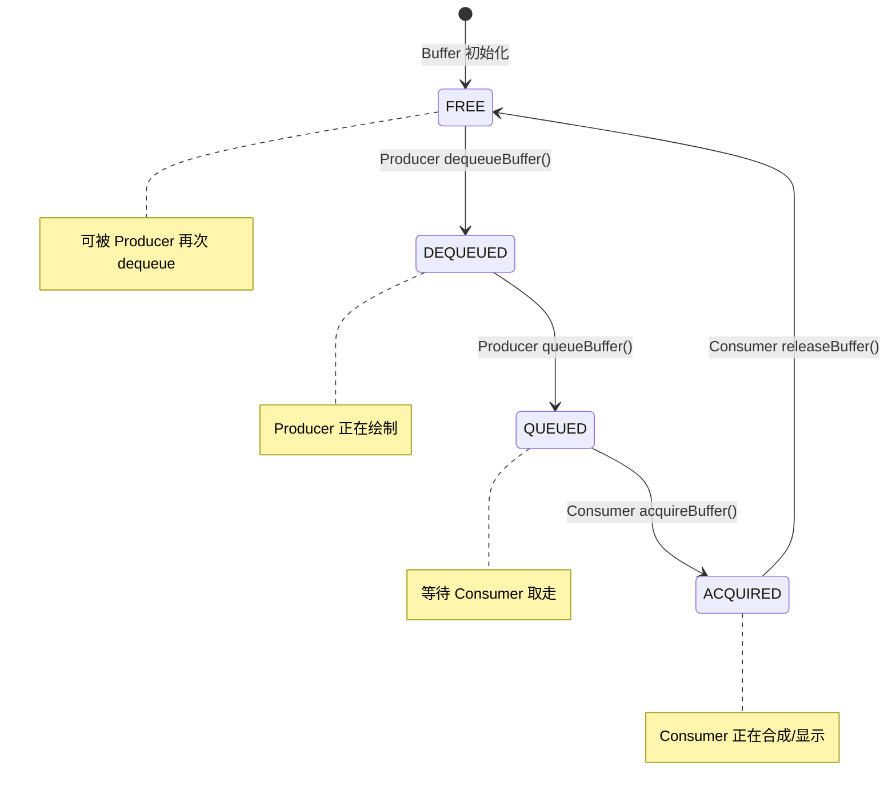
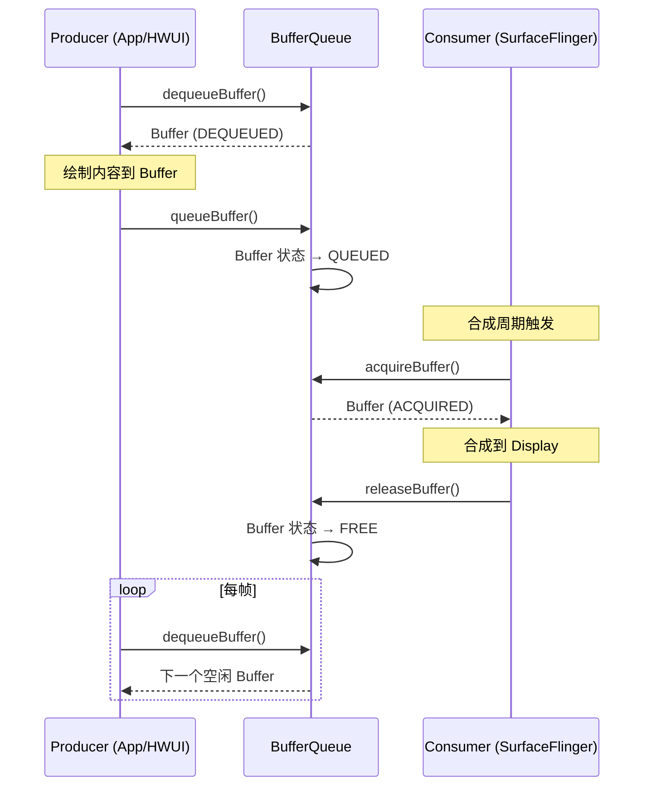
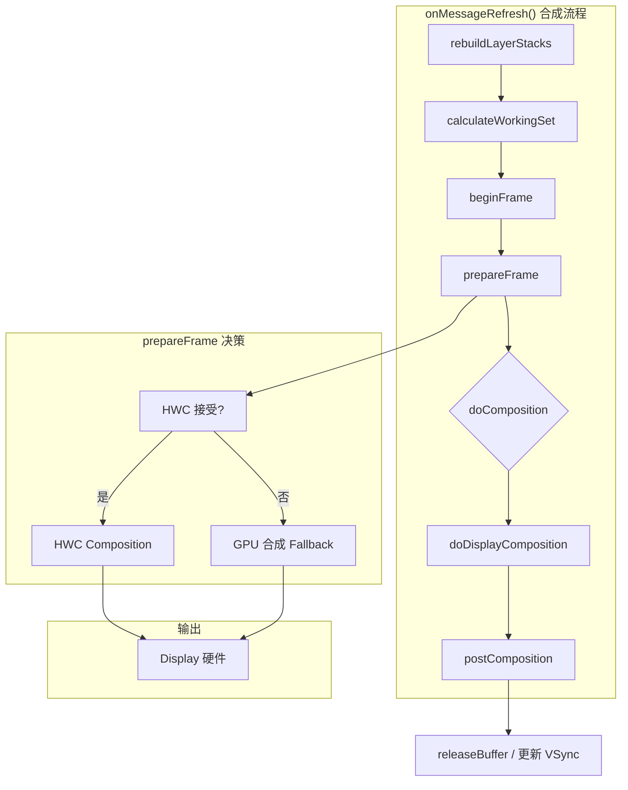

# Day 5：SurfaceFlinger 合成架构

> 面向具有 5.5 年 Android 应用开发经验的开发者，深入理解 SurfaceFlinger 合成流程、BufferQueue 生产者-消费者模型、Layer 体系及 HWC/GPU 合成决策机制

---

## 1. SurfaceFlinger 概述

### 1.1 什么是 SurfaceFlinger

**SurfaceFlinger** 是 Android 系统中负责**合成显示**的核心守护进程。它的职责是：

- **接收**来自多个 Producer（应用、系统 UI、壁纸等）的图形 Buffer
- **合成**所有可见的 Layer 到一个或多个 Display Buffer
- **输出**最终的合成结果到物理显示屏

可以理解为：SurfaceFlinger 是「所有图形内容的最终汇聚点」，负责把分散在各应用的 Surface 上的 Buffer 拼成你最终在屏幕上看到的画面。

### 1.2 进程与启动时机

- SurfaceFlinger 以**独立进程**运行，进程名为 `surfaceflinger`
- 由 **init** 在系统早期阶段启动，早于大多数系统服务
- 作为核心图形服务，优先级较高，通常与 bootanimation、SystemServer 配合完成开机显示

### 1.3 源码位置


| 组件                     | 源码路径                                                                |
| ---------------------- | ------------------------------------------------------------------- |
| **SurfaceFlinger 主逻辑** | `frameworks/native/services/surfaceflinger/SurfaceFlinger.cpp`      |
| **启动与初始化**             | `frameworks/native/services/surfaceflinger/main_surfaceflinger.cpp` |


### 1.4 核心职责总结

```
┌─────────────────────────────────────────────────────────────────┐
│                      SurfaceFlinger 核心职责                      │
├─────────────────────────────────────────────────────────────────┤
│  Producer (App / HWUI / SystemUI)                                │
│       │                                                          │
│       │  queueBuffer()                                           │
│       ▼                                                          │
│  BufferQueue ─────► Layer 1, Layer 2, Layer 3, ...               │
│       │                                                          │
│       │  acquireBuffer() → composite() → releaseBuffer()        │
│       ▼                                                          │
│  Display (LCD / HDMI / Virtual Display)                          │
└─────────────────────────────────────────────────────────────────┘
```

- **Input**：多个 Producer 通过各自的 BufferQueue 向对应 Layer 提交 Buffer
- **Process**：按 z-order、透明度和变换合成所有可见 Layer
- **Output**：将合成结果送到显示硬件（HWC 或 GPU 输出）

---

## 2. BufferQueue 生产者-消费者模型

### 2.1 设计思想

**BufferQueue** 是 Android 图形系统中用于**解耦 Producer 与 Consumer** 的环形队列。每个有图形输出的 **Surface** 都绑定一个 BufferQueue。

- **Producer**（生产者）：应用或 HWUI，负责往 Buffer 里绘制内容
- **Consumer**（消费者）：通常是 SurfaceFlinger，负责取走 Buffer 并合成显示

通过 BufferQueue，Producer 和 Consumer 可以**异步**工作，Producer 不必等待 Consumer 显示完才继续绘制，从而提升帧率和流畅度。

### 2.2 源码位置


| 文件                                                     | 职责                    |
| ------------------------------------------------------ | --------------------- |
| `frameworks/native/libs/gui/BufferQueue.cpp`           | BufferQueue 核心逻辑、状态管理 |
| `frameworks/native/libs/gui/BufferQueueProducer.cpp`   | Producer 端 API 实现     |
| `frameworks/native/libs/gui/BufferQueueConsumer.cpp`   | Consumer 端 API 实现     |
| `frameworks/native/libs/gui/include/gui/BufferQueue.h` | Buffer 状态、接口定义        |


### 2.3 典型配置：三重缓冲（Triple Buffering）

每个 Surface 的 BufferQueue 通常配置为 **3 个 Buffer**：


| Buffer 槽位 | 典型状态          | 说明                   |
| --------- | ------------- | -------------------- |
| Slot 0    | DEQUEUED      | 正在被 Producer 绘制      |
| Slot 1    | QUEUED        | 已绘制完成，等待 Consumer 取走 |
| Slot 2    | ACQUIRED/FREE | 被 Consumer 使用中或空闲可用  |


三重缓冲的好处：

- Producer 可以在 Consumer 显示上一帧时，提前开始绘制下一帧
- 减少「等 Buffer」的阻塞，提高流水线吞吐量

### 2.4 Producer 与 Consumer 调用流程

**Producer 端（App / HWUI）：**

1. `dequeueBuffer()`：向 BufferQueue 申请一个空闲 Buffer
2. 渲染：将内容绘制到该 Buffer（如通过 OpenGL/Vulkan）
3. `queueBuffer()`：标记 Buffer 已就绪，交给 Consumer 使用

**Consumer 端（SurfaceFlinger）：**

1. `acquireBuffer()`：从 BufferQueue 取走一个已就绪的 Buffer
2. 合成：将该 Buffer 作为 Layer 的输入参与合成
3. `releaseBuffer()`：使用完毕后释放 Buffer，回到 FREE 状态供 Producer 再次 dequeue

### 2.5 Buffer 状态流转

Buffer 在 BufferQueue 中经历以下状态：


| 状态           | 含义                                |
| ------------ | --------------------------------- |
| **FREE**     | 空闲，可被 Producer dequeue            |
| **DEQUEUED** | 已被 Producer 占用，正在绘制               |
| **QUEUED**   | 已 queueBuffer，等待 Consumer acquire |
| **ACQUIRED** | 已被 Consumer 占用，正在合成/显示            |


### 2.6 Buffer 生命周期状态图




### 2.7 Producer-Consumer 时序图




---

## 3. Layer 体系

### 3.1 Surface 与 Layer 的对应关系

在 SurfaceFlinger 中，**每个有图形输出的 Surface 对应一个 Layer**。Layer 是 SurfaceFlinger 内部管理合成的基本单位。

- **Surface**：应用侧持有的句柄，用于获取 Canvas 或直接操作 Buffer
- **Layer**：SurfaceFlinger 侧的数据结构，存储该 Surface 的 Buffer、属性及合成信息

### 3.2 源码位置


| 组件                   | 源码路径                                                             |
| -------------------- | ---------------------------------------------------------------- |
| **Layer 基类**         | `frameworks/native/services/surfaceflinger/Layer.cpp`            |
| **BufferStateLayer** | `frameworks/native/services/surfaceflinger/BufferStateLayer.cpp` |
| **EffectLayer**      | `frameworks/native/services/surfaceflinger/EffectLayer.cpp`      |
| **Layer 层级管理**       | `frameworks/native/services/surfaceflinger/LayerHierarchy.cpp`   |


### 3.3 Layer 类型


| Layer 类型             | 用途                                           |
| -------------------- | -------------------------------------------- |
| **BufferStateLayer** | 最常见，对应 App/HWUI 绘制的 Surface，内容来自 BufferQueue |
| **EffectLayer**      | 纯色、渐变等特效层，不需要 Buffer，由 SurfaceFlinger 直接渲染   |
| **ContainerLayer**   | 容器层，用于组织子 Layer 的层级关系，本身不参与合成                |


### 3.4 Layer 属性

每个 Layer 有一组影响合成结果的属性：


| 属性            | 含义                             |
| ------------- | ------------------------------ |
| **position**  | 在屏幕上的偏移 (x, y)                 |
| **size**      | 宽高 (width, height)             |
| **alpha**     | 透明度 [0, 1]                     |
| **transform** | 变换矩阵（平移、旋转、缩放等）                |
| **z-order**   | 层级顺序，决定谁在上面                    |
| **crop**      | 裁剪区域，限制 Layer 的显示范围            |
| **blendMode** | 混合模式（如 SRC_OVER、PREMULTIPLIED） |


这些属性通常由 **WindowManager** 通过 `SurfaceControl.Transaction` 批量设置。

### 3.5 Layer 树结构

Layer 之间存在**父子关系**，形成树形结构：

```
ContainerLayer (Root)
├── BufferStateLayer (StatusBar)
├── BufferStateLayer (NavigationBar)
├── ContainerLayer (DefaultTaskDisplayArea)
│   ├── BufferStateLayer (App A)
│   ├── BufferStateLayer (App B)
│   └── EffectLayer (DimLayer)
└── BufferStateLayer (Wallpaper)
```

- 子 Layer 的坐标系相对于父 Layer
- 父 Layer 的裁剪、透明度会影响子 Layer
- `rebuildLayerStacks()` 会按 Display 遍历 Layer 树，确定每个 Display 上可见的 Layer 列表及其顺序

---

## 4. 合成流程

### 4.1 主循环：Invalidate → Refresh

SurfaceFlinger 的主循环由 **MessageQueue** 驱动，核心分为两个阶段：


| 阶段                        | 触发                     | 职责                      |
| ------------------------- | ---------------------- | ----------------------- |
| **onMessageInvalidate()** | VSync 信号或显式 invalidate | 判断是否需要刷新，可能直接进入 Refresh |
| **onMessageRefresh()**    | Invalidate 后调度         | 执行完整的合成流程               |


每帧合成都在 `onMessageRefresh()` 中完成。

### 4.2 onMessageRefresh() 内部流程

`onMessageRefresh()` 中按顺序执行以下步骤：


| 步骤  | 函数                                           | 职责                                 |
| --- | -------------------------------------------- | ---------------------------------- |
| 1   | `rebuildLayerStacks()`                       | 按 Display 重建可见 Layer 列表，确定 z-order |
| 2   | `calculateWorkingSet()`                      | 收集各 Layer 的 Buffer，准备合成数据          |
| 3   | `beginFrame()`                               | 通知 HWC 开始本帧，准备 Display             |
| 4   | `prepareFrame()`                             | 为每个 Layer 决定 HWC 合成还是 GPU 合成       |
| 5   | `doComposition()` → `doDisplayComposition()` | 执行实际合成（HWC 或 GPU）                  |
| 6   | `postComposition()`                          | 释放 Buffer、更新统计、触发 Callback         |


### 4.3 合成流水线流程图




### 4.4 关键步骤说明

**rebuildLayerStacks()**

- 遍历 Layer 树
- 按每个 Display 的可见区域和 z-order 构建 `LayerStack`
- 后续合成只处理这些 Layer

**prepareFrame()**

- 与 HWC 交互，尝试把 Layer 交给 HWC 合成
- 若 HWC 拒绝某些 Layer（能力不足、格式不支持等），这些 Layer 会回退到 GPU 合成
- 最终得到每个 Layer 的合成路径：HWC 或 GPU

**doComposition() / doDisplayComposition()**

- **HWC 路径**：由 HWC 硬件直接合成各 Layer 到屏幕
- **GPU 路径**：SurfaceFlinger 使用 OpenGL/Vulkan 将需要 GPU 合成的 Layer 合到一个 Buffer，再将该 Buffer 作为一层交给 HWC 或直接输出

**postComposition()**

- 调用 `releaseBuffer()` 归还 Buffer 给 Producer
- 更新 Frame 统计、VSync 相关信息
- 触发 `onFrameCommitted` 等回调

---

## 5. HWC vs GPU 合成

### 5.1 两种合成路径


| 方式         | 执行者                           | 特点                 |
| ---------- | ----------------------------- | ------------------ |
| **HWC 合成** | 显示控制器硬件                       | 专用电路合成，功耗低、延迟小，最省电 |
| **GPU 合成** | SurfaceFlinger（OpenGL/Vulkan） | 用 GPU 将多层合为一层，功耗较高 |


理想情况下，所有 Layer 都交给 HWC 合成；当 HWC 无法处理时，部分 Layer 会回退到 GPU。

### 5.2 HWC（Hardware Composer）

**HWC** 是显示子系统中的硬件模块，负责：

- 接收多个 Layer 的 Buffer
- 按 z-order、alpha、transform 等在硬件中合成
- 输出到显示端口（LCD、HDMI 等）

HWC 的软件接口定义在 **HWC2**，SurfaceFlinger 通过该接口与厂商实现的 HWC 驱动通信。

**源码位置：**

- `frameworks/native/services/surfaceflinger/DisplayHardware/HWComposer.cpp`
- `frameworks/native/services/surfaceflinger/DisplayHardware/ComposerHal.cpp`

### 5.3 GPU 合成 Fallback

当 HWC 无法合成某 Layer 时，SurfaceFlinger 会：

1. 将该 Layer 的 Buffer 通过 OpenGL/Vulkan 绘制到 GPU 合成的目标 Buffer
2. 将合成后的 Buffer 作为**一个 Layer** 交给 HWC
3. HWC 只需合成这一个「预合成」的 Layer，降低硬件压力

### 5.4 常见 GPU Fallback 原因


| 原因               | 说明                                      |
| ---------------- | --------------------------------------- |
| **Layer 数量超限**   | HWC 支持的 Layer 数量有限（如 4~8 层）             |
| **不支持混合模式**      | 某些 blendMode（如 SRC_OVER 以外的模式）HWC 可能不支持 |
| **旋转 / 复杂变换**    | 非 0°、90°、180°、270° 等简单旋转可能回退            |
| **缩放**           | 非 1:1 缩放时部分 HWC 实现可能回退                  |
| **格式不支持**        | 某些 PixelFormat 或 YUV 格式 HWC 不支持         |
| **Protected 内容** | DRM 等 protected Buffer 可能强制 GPU 路径      |


### 5.5 决策流程简述

```
prepareFrame():
  for each Layer in layerStack:
    if HWC.setLayer() 成功:
      Mark as HWC composition
    else:
      Mark as GPU composition (add to clientCompositionLayers)
  
  if 存在 GPU composition Layers:
    用 GPU 将这些 Layer 合成到 composeTarget
    将 composeTarget 作为单层交给 HWC
```

---

## 6. SurfaceControl 与 Transaction

### 6.1 SurfaceControl 是什么

**SurfaceControl** 是应用/WMS 侧持有的句柄，用于控制 SurfaceFlinger 中的 Layer。通过 SurfaceControl，可以：

- 修改 Layer 的 position、size、alpha、transform、z-order、crop 等属性
- 不直接持有 Buffer，只控制「如何显示」

WMS 为每个 Window 创建 Surface 和对应的 SurfaceControl，SurfaceControl 与 SurfaceFlinger 中的 Layer 一一对应。

### 6.2 SurfaceControl.Transaction

**Transaction** 是**批量更新** Layer 属性的机制：

- 多次 `setPosition()`、`setSize()`、`setAlpha()` 等调用可以放入同一个 Transaction
- 调用 `apply()` 时，**一次性**将这些变更提交给 SurfaceFlinger
- 减少跨进程调用次数，保证同一帧内属性更新原子生效

### 6.3 关系图

```
WMS                          SurfaceFlinger
  │                                │
  │  createSurfaceControl()        │
  ├──────────────────────────────►│  创建 Layer
  │                                │
  │  transaction.setPosition()    │
  │  transaction.setSize()        │
  │  transaction.setAlpha()       │
  │  transaction.apply()           │
  ├──────────────────────────────►│  批量更新 Layer 属性
  │                                │
```

### 6.4 源码位置


| 组件                 | 源码路径                                                   |
| ------------------ | ------------------------------------------------------ |
| **SurfaceControl** | `frameworks/native/libs/gui/SurfaceControl.cpp`        |
| **Transaction**    | `frameworks/native/libs/gui/SurfaceComposerClient.cpp` |
| **Binder 接口**      | `frameworks/native/libs/gui/ISurfaceComposer.cpp`      |


### 6.5 使用示例（概念）

```cpp
// WMS 侧伪代码
sp<SurfaceControl> sc = createSurfaceControl(...);
SurfaceComposerClient::Transaction t;
t.setPosition(sc, x, y);
t.setSize(sc, width, height);
t.setAlpha(sc, 1.0f);
t.setLayer(sc, zOrder);
t.apply();  // 一次性提交
```

---

## 7. AI 交互建议

在阅读源码或调试时，可以用以下问题与 AI 助手深入探讨：

1. **「帮我解读 SurfaceFlinger::onMessageRefresh() 的完整合成流程」**
  聚焦从 `rebuildLayerStacks` 到 `postComposition` 的每一步，结合源码行号说明。
2. **「BufferQueue 的三重缓冲是如何工作的？画出 buffer 状态流转」**
  结合 FREE/DEQUEUED/QUEUED/ACQUIRED 状态和实际调用顺序理解流水线。
3. **「SurfaceFlinger 什么时候会选择 GPU 合成而不是 HWC 合成？」**
  分析 prepareFrame 中的决策逻辑，以及 HWC 返回错误/不支持时的 fallback 条件。
4. **「解释 SurfaceControl.Transaction 的批量提交机制」**
  理解 Transaction 的 accumulate + apply 模式，以及跨进程提交的原子性保证。

---

## 8. 真机实操

### 8.1 常用命令

```bash
# 查看 SurfaceFlinger 完整 dump 信息
adb shell dumpsys SurfaceFlinger

# 仅列出 Layer 等关键结构
adb shell dumpsys SurfaceFlinger --list

# 查看合成方式（HWC vs GPU）
adb shell dumpsys SurfaceFlinger | grep -A5 "Composition"

# 查看 GPU 相关统计（如 GPU 合成层数）
adb shell dumpsys SurfaceFlinger | grep "GLES"
```

### 8.2 输出解读要点

- **Composition**：当前帧中 HWC 与 GPU 合成的比例，有助于判断是否有不必要的 GPU fallback
- **GLES**：若出现较多 GLES 相关统计，说明有 Layer 在使用 GPU 合成
- **Layer 列表**：可看到当前所有 Layer 的 name、type、buffer 信息
- **Display 信息**：各 Display 的 LayerStack、刷新率等

### 8.3 调试建议

- 若界面卡顿，可先看 `dumpsys SurfaceFlinger` 中是否有大量 GPU 合成，或 Layer 数量过多
- 对比 `Composition` 中 HWC/GPU 占比，评估是否存在可优化的合成路径

---

## 小结


| 概念                             | 要点                                                                                                     |
| ------------------------------ | ------------------------------------------------------------------------------------------------------ |
| **SurfaceFlinger**             | 系统级合成守护进程，汇聚多 Producer 的 Buffer 并输出到 Display                                                           |
| **BufferQueue**                | 生产者-消费者解耦，三重缓冲，FREE→DEQUEUED→QUEUED→ACQUIRED→FREE                                                      |
| **Layer**                      | 每个 Surface 对应一个 Layer，含 BufferStateLayer/EffectLayer/ContainerLayer                                    |
| **合成流程**                       | rebuildLayerStacks → calculateWorkingSet → beginFrame → prepareFrame → doComposition → postComposition |
| **HWC vs GPU**                 | 优先 HWC，不支持时 fallback 到 GPU 合成                                                                          |
| **SurfaceControl.Transaction** | 批量更新 Layer 属性，减少跨进程调用，保证原子性                                                                            |


---

**下一日预告**：Day 6 将深入 VSync 机制与 Choreographer，理解帧率同步与掉帧根因分析。