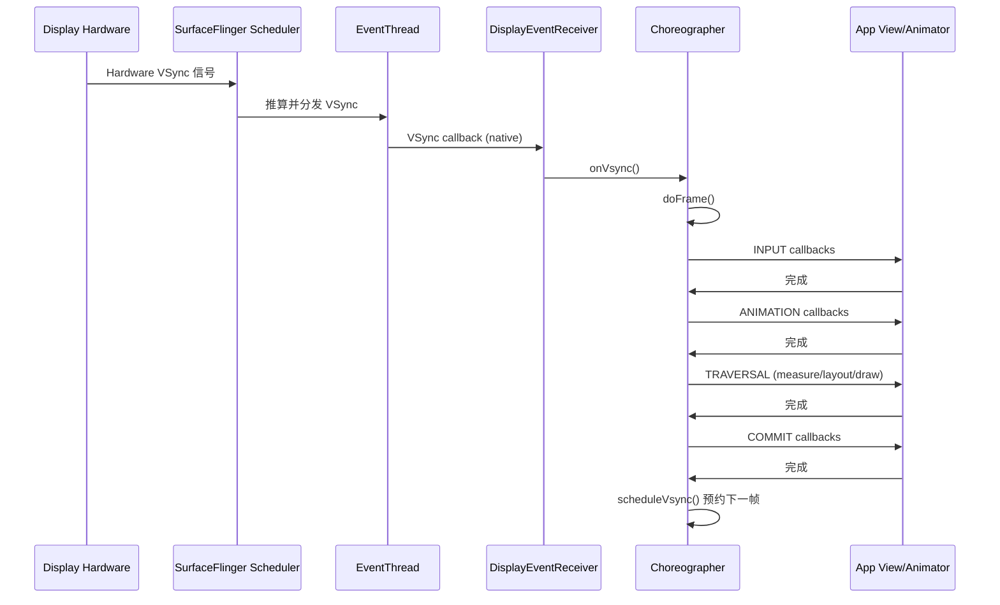
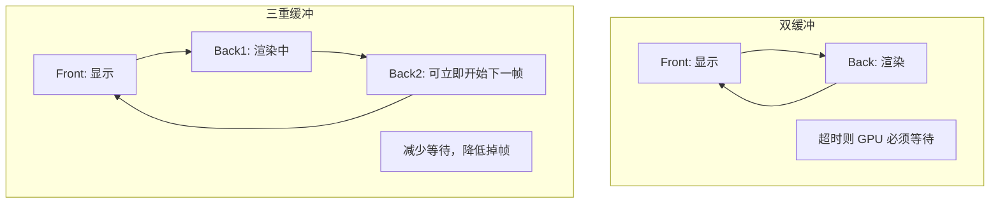

# Day 6: VSync 与帧调度 (VSync and Frame Scheduling)

> 本文档面向具有 5.5 年 Android 应用开发经验的学习者，深入解析 Android Framework 中 VSync 与帧调度的核心机制。

---

## 1. VSync 基础概念

### 1.1 什么是 VSync (Vertical Synchronization)

**VSync (垂直同步)** 是显示器硬件发出的时序信号，用于指示屏幕刷新的节奏。当显示器完成一帧的扫描显示后，会发出 VSync 信号，表示可以开始下一帧的绘制。


| 刷新率    | 每帧时长     | 常见设备      |
| ------ | -------- | --------- |
| 60 Hz  | 16.67 ms | 传统手机、普通电视 |
| 90 Hz  | 11.11 ms | 部分旗舰机     |
| 120 Hz | 8.33 ms  | 高刷屏、游戏手机  |
| 144 Hz | 6.94 ms  | 电竞设备      |


计算公式：**每帧时长 = 1000 ms ÷ 刷新率**

### 1.2 无 VSync 的问题：Screen Tearing（画面撕裂）

在没有 VSync 同步的情况下，可能出现 **screen tearing**（画面撕裂）：

- 显示器上半部分仍显示**上一帧**（old frame）
- 下半部分已开始显示**新帧**（new frame）
- 原因：GPU 输出 buffer 的时机与显示器扫描不同步，导致同一屏幕出现两帧叠加

### 1.3 Android 的解决方案

Android 采取 **Choreograph everything to VSync**（以 VSync 为指挥棒编排一切）的策略：

- 应用的渲染、SurfaceFlinger 的合成、显示的 present，全部与 VSync 信号对齐
- 通过统一的 VSync 节奏，避免 tearing，并实现可预测的帧生命周期

---

## 2. VSync 信号生成与分发

### 2.1 硬件 VSync vs 软件 VSync

- **Hardware VSync**：由显示面板硬件产生，反映真实的物理刷新周期
- **Software VSync**：由 SurfaceFlinger Scheduler 根据硬件 VSync 推算、分发，供 App 和 SF 使用

### 2.2 源码位置

```
frameworks/native/services/surfaceflinger/Scheduler/
├── VsyncReactor.cpp      # VSync 信号接收与预测
├── VSyncDispatch.cpp     # VSync 分发调度
├── EventThread.cpp       # VSync 事件向 App/SF 分发
└── ...
```

### 2.3 两类 VSync 阶段


| 阶段            | 作用对象                | 时机            | 目的                           |
| ------------- | ------------------- | ------------- | ---------------------------- |
| **VSYNC-app** | Choreographer / App | 略早于 VSYNC-sf  | 触发 App 的 measure/layout/draw |
| **VSYNC-sf**  | SurfaceFlinger      | 略晚于 VSYNC-app | 触发 SF 的 acquireBuffer 与合成    |


### 2.4 VSync Offset 机制

- **VSYNC-app** 比 **VSYNC-sf** 提前一定时间触发
- 这样 App 有时间完成渲染并 `queueBuffer()`，在 SF 需要 `acquireBuffer()` 时，buffer 已经就绪
- 若两者同时触发，SF 可能拿不到 App 刚渲染完的 buffer，导致掉帧

### 2.5 VSync 时间线示意

```
┌─────────────────────────────────────────────────────────────────┐
│                    Vsync Offset 优化效果                         │
├─────────────────────────────────────────────────────────────────┤
│                                                                  │
│  无 Offset（传统方式）                                          │
│  ─────────────────────                                          │
│  时间 →                                                         │
│                                                                  │
│  HW Vsync:    │              │              │                   │
│               T0             T1             T2                   │
│                                                                  │
│  App:         [████ 渲染 ████]                                  │
│  SF:                         [████ 合成 ████]                   │
│  显示:                                      [显示]               │
│                                                                  │
│  总延迟: 2 个 Vsync 周期 (120Hz 下约 16.6ms)                   │
│                                                                  │
│                                                                  │
│  有 Offset（优化方式）                                          │
│  ─────────────────────                                          │
│  时间 →                                                         │
│                                                                  │
│  HW Vsync:    │              │              │                   │
│               T0             T1             T2                   │
│               ↓              ↓                                   │
│  Vsync-app:   ↓              (offset)                           │
│               │                                                  │
│  App:         [████ 渲染 ████]                                  │
│                        ↓                                         │
│  Vsync-sf:            │ (app 完成后立即触发)                    │
│                       ↓                                          │
│  SF:                  [█ 合成 █]                                │
│  显示:                         [显示]                            │
│                                                                  │
│  总延迟: 约 1 个 Vsync 周期 (120Hz 下约 8.3ms)                 │
│                                                                  │
│  收益：延迟减少一半，跟手性大幅提升！                          │
│                                                                  │
└─────────────────────────────────────────────────────────────────┘
```

---

## 3. Choreographer 深入（VSync 视角）

### 3.1 源码位置

```
frameworks/base/core/java/android/view/Choreographer.java
```

### 3.2 VSync 接收链路

Choreographer 通过 **DisplayEventReceiver**（JNI 层）连接到 native 的 **EventThread**：

```
scheduleVsync() [Java]
    ↓ JNI
DisplayEventReceiver.scheduleVsync() [Native]
    ↓
EventThread (SurfaceFlinger Scheduler)
    ↓ VSync callback
FrameDisplayEventReceiver.onVsync()
    ↓
doFrame(frameTimeNanos, frameIntervalNanos)
```

### 3.3 doFrame 中的回调顺序

`doFrame()` 按固定顺序执行以下阶段：


| 顺序  | 回调类型        | 说明                                 |
| --- | ----------- | ---------------------------------- |
| 1   | `INPUT`     | 处理输入事件                             |
| 2   | `ANIMATION` | 执行动画（ObjectAnimator、Transitions 等） |
| 3   | `TRAVERSAL` | Measure → Layout → Draw（View 树遍历）  |
| 4   | `COMMIT`    | 将渲染结果提交给 RenderThread              |


### 3.4 Frame Deadline 与掉帧

- 每个 VSync 周期对应一个 **frame deadline**（帧截止时间）
- 若 `doFrame()` 在 deadline 之前未完成，该帧会被视为 **dropped frame**（掉帧）
- `jitterNanos`：表示实际执行时间与理想时间的偏差，可用于分析 jank

### 3.5 VSync → Choreographer → doFrame 时序图




---

## 4. 双缓冲与三重缓冲

### 4.1 双缓冲 (Double Buffering)


| Buffer           | 作用                   |
| ---------------- | -------------------- |
| **Front buffer** | 当前正在被显示器扫描显示的 buffer |
| **Back buffer**  | App/GPU 正在渲染的 buffer |


- 每帧：Back 渲染完成 → 与 Front 交换 → 下一帧的渲染在“新 Back”上进行
- **问题**：若渲染时间超过 16.67 ms，GPU 必须等待下一次 VSync 才能 swap，导致 **jank**（卡顿）

### 4.2 三重缓冲 (Triple Buffering)

- 在 Front + Back 之外增加**第三个 buffer**
- 即使某一帧渲染较慢，GPU 可以立即开始在“空闲 buffer”上绘制下一帧，不必空等
- **好处**：减少因 GPU 等待造成的掉帧
- **代价**：多占用一块 buffer 的内存；在部分场景下可能增加约 1 帧的延迟（buffer 排队更长）

### 4.3 Android 默认策略

- Android 默认使用 **三重缓冲**
- 通过 `BufferQueue` 的 slot 管理实现，通常有 2–3 个 buffer slot 供生产者（App）和消费者（SF）使用

### 4.4 双缓冲 vs 三重缓冲时间线




---

## 5. 帧生命周期与 FrameTimeline

### 5.1 完整帧生命周期

```text
1. VSync-app 触发
       ↓
2. Choreographer.doFrame()
   - INPUT → ANIMATION → TRAVERSAL → COMMIT
   - 生成 DisplayList
       ↓
3. RenderThread
   - 重放 DisplayList → GPU 渲染
   - queueBuffer() 将 buffer 放入 BufferQueue
       ↓
4. VSync-sf 触发
       ↓
5. SurfaceFlinger
   - acquireBuffer() 从 BufferQueue 取出
   - Composite 合成所有 Layer
   - Present 到 Display
```

### 5.2 理想情况

- 每个阶段在**一个 VSync 周期内**完成
- 渲染 pipeline 与 VSync 对齐，帧率稳定

### 5.3 Jank 的产生

当任一部分超过其 **deadline** 时，就会出现 jank：

- App 主线程阻塞（如主线程做网络/IO）
- RenderThread 渲染过慢
- SurfaceFlinger 合成过慢
- Buffer 在 BufferQueue 中堆积或饥饿

### 5.4 Perfetto FrameTimeline

- **FrameTimeline** 是 Perfetto 中的 track，用于可视化帧的 **expected vs actual** 时间
- 可以区分：
  - **On-time**：按时完成
  - **Late**：超时完成（jank）
  - **Dropped**：未能在 deadline 前完成

---

## 6. 可变刷新率 (VRR)

### 6.1 概述

- **Android 11+** 支持可变刷新率 (Variable Refresh Rate)
- SurfaceFlinger Scheduler 可在 60 Hz、90 Hz、120 Hz 等模式间**动态切换**

### 6.2 决策因素


| 因素                     | 说明                 |
| ---------------------- | ------------------ |
| **Touch boost**        | 触摸时短暂提升刷新率，提升交互流畅感 |
| **Content FPS**        | 视频/游戏内容帧率          |
| **Thermal throttling** | 发热时降频、降刷新率         |
| **Battery**            | 省电模式下可能降至 60 Hz    |


### 6.3 源码位置

```
frameworks/native/services/surfaceflinger/Scheduler/RefreshRateConfigs.cpp
```

---

## 7. AI 交互建议

在与 AI 讨论时，可使用以下问题深化理解：

1. **「解释 VSYNC-app 和 VSYNC-sf 的 offset 机制，为什么需要错开？」**
2. **「三重缓冲如何减少掉帧？是否会增加延迟？」**
3. **「Choreographer 如何检测掉帧？doFrame 中的 jitterNanos 是什么？」**
4. **「可变刷新率下，SurfaceFlinger 如何决定当前使用哪个刷新率？」**

---

## 8. 真机实操

在连接真机或模拟器后执行：

```bash
# 查看 VSync 相关配置
adb shell dumpsys SurfaceFlinger | grep -i vsync

# 查看当前刷新率配置
adb shell dumpsys SurfaceFlinger | grep -i "refresh rate"

# 查看 Surface 的帧延迟统计
adb shell dumpsys SurfaceFlinger --latency

# 强制开启 GPU 合成（仅调试用，需 root）
adb shell service call SurfaceFlinger 1035 i32 1
```

建议配合 Perfetto 的 **FrameTimeline** 和 **SurfaceFlinger** 相关 track 一起分析。

---

## 9. 小结


| 概念                   | 要点                                             |
| -------------------- | ---------------------------------------------- |
| VSync                | 显示刷新节奏信号，Android 以 VSync 为核心编排渲染               |
| VSYNC-app / VSYNC-sf | 双相位，app 略早于 sf，保证 buffer 就绪                    |
| Choreographer        | 接收 VSync，按 INPUT→ANIMATION→TRAVERSAL→COMMIT 执行 |
| 三重缓冲                 | 减少 GPU 等待带来的掉帧，代价是略增延迟和内存                      |
| FrameTimeline        | Perfetto 中用于分析 expected vs actual 帧时间          |
| VRR                  | 可变刷新率，根据交互、内容、温度、电量等动态调整                       |


