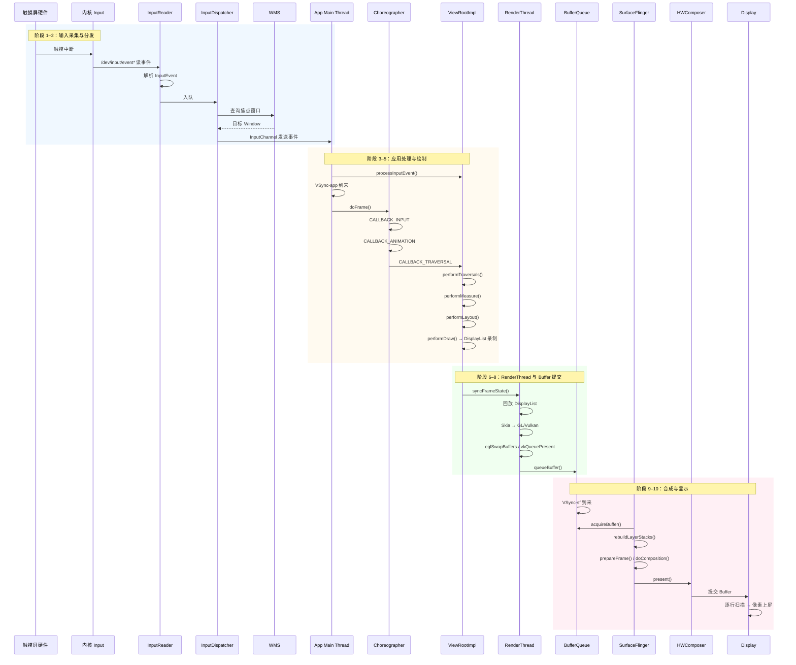

# Day 3–6 综合：从触摸到像素上屏的完整渲染全链路

> 面向具有 5.5 年 Android 应用开发经验的开发者，将 Days 3–6 的核心内容合成为一条完整的渲染流水线，建立从 Input 到 Display 的全链路视角

---

## 1. 从触摸到像素上屏的完整链路

本节是本文档的核心，将触摸事件从硬件产生到最终像素上屏的**完整链条**串起来，并标注每一步涉及的核心源码位置。

### 1.1 完整链路概览

```
触摸屏幕产生中断
→ InputReader 读取事件 (frameworks/native/services/inputflinger/)
→ InputDispatcher 分发到目标窗口 (WMS 确定的焦点窗口)
→ ViewRootImpl.processInputEvents()
→ VSync-app 信号到来
→ Choreographer.doFrame()
  → CALLBACK_INPUT: 处理触摸事件
  → CALLBACK_ANIMATION: 更新动画值
  → CALLBACK_TRAVERSAL:
    → ViewRootImpl.performTraversals()
      → performMeasure() → View 树递归 measure
      → performLayout() → View 树递归 layout
      → performDraw() → ThreadedRenderer.draw()
        → 主线程录制 DisplayList (RecordingCanvas)
→ syncFrameState() 同步到 RenderThread
→ RenderThread:
  → 回放 DisplayList
  → Skia → OpenGL/Vulkan GPU 命令
  → eglSwapBuffers() / vkQueuePresent()
  → queueBuffer() → Buffer 进入 BufferQueue
→ VSync-sf 信号到来
→ SurfaceFlinger:
  → acquireBuffer() 获取各 Layer 的 Buffer
  → rebuildLayerStacks() 计算可见区域
  → prepareFrame() → HWC 或 GPU 合成决策
  → doComposition() 执行合成
  → 提交到 Display Controller
→ Display 硬件扫描输出 → 像素上屏
```

---

### 1.2 各阶段详细说明（含源码路径）

#### 阶段 1：触摸中断与 InputReader

| 项目 | 说明 |
|------|------|
| **触发** | 触摸屏硬件产生中断，内核 Input 驱动读取原始事件 |
| **核心逻辑** | InputReader 循环读取 `/dev/input/event*`，解析为 `InputEvent` |
| **源码路径** | `frameworks/native/services/inputflinger/reader/InputReader.cpp`<br/>`frameworks/native/services/inputflinger/reader/InputReader.h` |
| **关键类** | `InputReader`, `InputDevice`, `EventHub` |
| **时序约束** | 输入读取应在下一帧前完成，否则输入延迟增加 |

#### 阶段 2：InputDispatcher 分发到目标窗口

| 项目 | 说明 |
|------|------|
| **触发** | InputReader 将事件放入队列，InputDispatcher 消费并分发 |
| **核心逻辑** | 根据 WMS 提供的焦点窗口信息，将事件通过 Binder/InputChannel 发往目标应用的 `ViewRootImpl` |
| **源码路径** | `frameworks/native/services/inputflinger/dispatcher/InputDispatcher.cpp`<br/>`frameworks/native/services/inputflinger/dispatcher/InputDispatcher.h` |
| **关键类** | `InputDispatcher`, `InputChannel`, `Connection` |
| **时序约束** | 分发应在目标应用可接收时尽快完成；若主线程被阻塞，事件会堆积 |

#### 阶段 3：ViewRootImpl 接收并处理输入

| 项目 | 说明 |
|------|------|
| **触发** | InputChannel 收到事件，经由 Looper 回调 `ViewRootImpl.processInputEvent()` |
| **核心逻辑** | 事件进入 `InputStage` 责任链，最终分发给焦点 View 的 `onTouchEvent()` 等 |
| **源码路径** | `frameworks/base/core/java/android/view/ViewRootImpl.java`<br/>（方法：`enqueueInputEvent`, `deliverInputEvent`, `processInputEvent`） |
| **关键类** | `ViewRootImpl`, `View`, `InputStage` |
| **时序约束** | 输入处理与 measure/layout/draw 共享主线程；若主线程忙碌，输入会延迟 |

#### 阶段 4：VSync-app 与 Choreographer.doFrame()

| 项目 | 说明 |
|------|------|
| **触发** | SurfaceFlinger 的 EventThread 发出 VSync-app 信号，Choreographer 收到后执行 `doFrame()` |
| **核心逻辑** | 按序执行 INPUT → ANIMATION → TRAVERSAL → COMMIT；TRAVERSAL 触发 `performTraversals()` |
| **源码路径** | `frameworks/base/core/java/android/view/Choreographer.java`<br/>（方法：`doFrame`, `doCallbacks`） |
| **关键类** | `Choreographer`, `FrameDisplayEventReceiver` |
| **时序约束** | **核心约束**：主线程必须在 **一个 VSync 周期内** 完成 measure/layout/draw 及 DisplayList 录制，否则该帧会「掉帧」 |

#### 阶段 5：performTraversals() — measure / layout / draw

| 项目 | 说明 |
|------|------|
| **触发** | `Choreographer.doFrame()` 执行 `CALLBACK_TRAVERSAL` 时调用 |
| **核心逻辑** | `performMeasure()` → `performLayout()` → `performDraw()`；draw 通过 `ThreadedRenderer.draw()` 录制 DisplayList |
| **源码路径** | `frameworks/base/core/java/android/view/ViewRootImpl.java`<br/>（方法：`performTraversals`, `performMeasure`, `performLayout`, `performDraw`） |
| **关键类** | `ViewRootImpl`, `View`, `ThreadedRenderer` |
| **时序约束** | 三阶段总和 + 其他主线程工作需在 **< 16.67ms（60Hz）** 内完成 |

#### 阶段 6：DisplayList 录制与 syncFrameState()

| 项目 | 说明 |
|------|------|
| **触发** | `performDraw()` 中 `ThreadedRenderer.draw()` 完成后调用 `syncFrameState()` |
| **核心逻辑** | 将主线程录制的 DisplayList、属性动画等同步到 RenderThread；主线程会短暂阻塞等待 |
| **源码路径** | `frameworks/base/libs/hwui/ThreadedRenderer.cpp`<br/>`frameworks/base/libs/hwui/renderthread/CanvasContext.cpp` |
| **关键类** | `ThreadedRenderer`, `RenderProxy`, `CanvasContext` |
| **时序约束** | sync 时间应尽量短；长时间 sync 会拉长主线程帧时间 |

#### 阶段 7：RenderThread 回放与 GPU 渲染

| 项目 | 说明 |
|------|------|
| **触发** | `syncFrameState()` 完成后，RenderThread 收到绘制任务 |
| **核心逻辑** | 回放 DisplayList → Skia GPU Backend → 生成 OpenGL/Vulkan 命令 → `eglSwapBuffers()` / `vkQueuePresent()` → `queueBuffer()` 将 Buffer 放入 BufferQueue |
| **源码路径** | `frameworks/base/libs/hwui/renderthread/RenderThread.cpp`<br/>`frameworks/base/libs/hwui/renderthread/CanvasContext.cpp`<br/>`frameworks/base/libs/hwui/SkiaDisplayList.cpp` |
| **关键类** | `RenderThread`, `CanvasContext`, `SkiaPipeline` |
| **时序约束** | RenderThread 也需在合理时间内完成；若超出一帧，会导致 **render jank** |

#### 阶段 8：BufferQueue 与 Buffer 提交

| 项目 | 说明 |
|------|------|
| **触发** | RenderThread 调用 `queueBuffer()` 将渲染完成的 Buffer 放入 BufferQueue |
| **核心逻辑** | BufferQueue 管理 3 个 Slot（Triple Buffering）；Producer 提交，Consumer（SF）消费 |
| **源码路径** | `frameworks/native/libs/gui/BufferQueue.cpp`<br/>`frameworks/native/libs/gui/BufferQueueProducer.cpp` |
| **关键类** | `BufferQueue`, `IGraphicBufferProducer` |
| **时序约束** | 若三个 Buffer 都被占用（Producer 未 release），会 **buffer stuffing**，造成卡顿 |

#### 阶段 9：VSync-sf 与 SurfaceFlinger 合成

| 项目 | 说明 |
|------|------|
| **触发** | EventThread 发出 VSync-sf 信号，SurfaceFlinger 的 `onMessageRefresh()` 被调用 |
| **核心逻辑** | `acquireBuffer()` 获取各 Layer 的 Buffer → `rebuildLayerStacks()` → `prepareFrame()`（HWC/GPU 决策）→ `doComposition()` 执行合成 → 提交 Display |
| **源码路径** | `frameworks/native/services/surfaceflinger/SurfaceFlinger.cpp`<br/>（方法：`onMessageRefresh`, `composite`, `rebuildLayerStacks`） |
| **关键类** | `SurfaceFlinger`, `Layer`, `CompositionEngine` |
| **时序约束** | SF 需在下一 VSync 前完成合成；否则 **composition jank** |

#### 阶段 10：Display 硬件输出

| 项目 | 说明 |
|------|------|
| **触发** | SurfaceFlinger 将最终 buffer 提交给 HWC；Display Controller 按刷新率扫描 |
| **核心逻辑** | 硬件逐行扫描像素到屏幕 |
| **源码路径** | `frameworks/native/services/surfaceflinger/DisplayHardware/`<br/>HAL: `hardware/interfaces/graphics/composer/` |
| **关键类** | `Display`, `HWComposer` |
| **时序约束** | 硬件固定节奏，软件侧需保证 buffer 按时就绪 |

---

### 1.3 完整流程 Mermaid 序列图



---

### 1.4 时序预算（Timing Budget）

| 环节 | 预算（60 Hz） | 说明 |
|------|---------------|------|
| **主线程（measure + layout + draw + DisplayList）** | < 16.67 ms | 超时则该帧 **UI thread jank** |
| **RenderThread（DrawFrame）** | < 16.67 ms | 超时则 **render jank** |
| **SurfaceFlinger（合成）** | < 16.67 ms | 超时则 **composition jank** |
| **VSync-app → VSync-sf** | 有 offset | App 先完成，SF 再合成，避免 SF 拿不到 buffer |

核心原则：**Choreograph everything to VSync**，各阶段都必须在各自的 VSync 周期内完成。

---

### 1.5 各阶段变慢时的 Jank 类型

| 变慢环节 | 表现 | Jank 类型 |
|----------|------|-----------|
| **主线程 measure/layout/draw 慢** | doFrame 超 16ms，用户操作反馈延迟 | **UI thread jank** |
| **RenderThread 绘制慢** | DrawFrame 超 16ms，画面更新滞后 | **Render jank** |
| **SurfaceFlinger 合成慢** | 多 Layer、复杂合成，onMessageRefresh 超时 | **Composition jank** |
| **BufferQueue 满** | 三 Buffer 全占满，queueBuffer 阻塞 | **Buffer stuffing** |
| **CPU 降频 / 调度延迟** | 线程得不到足够 CPU，各阶段普遍变慢 | **Scheduling jank** |

---

## 2. 关键瓶颈点分析

### 2.1 Main Thread 过慢（复杂 layout）→ UI Thread Jank

| 现象 | 原因 | 缓解措施 |
|------|------|----------|
| doFrame 超 16ms | 复杂 View 树、嵌套 layout、过度 measure | 扁平化布局、ConstraintLayout、减少嵌套 |
| 主线程阻塞 | 主线程做 I/O、复杂计算、锁等待 | 移到 WorkManager/协程/子线程 |
| 输入延迟 | 主线程忙，Input 事件排队 | 同上，减少主线程负担 |

**源码关联**：`ViewRootImpl.performTraversals()` 及 `View.measure()` / `layout()` / `draw()` 递归。

---

### 2.2 RenderThread 过慢（复杂绘制）→ Render Jank

| 现象 | 原因 | 缓解措施 |
|------|------|----------|
| DrawFrame 超 16ms | 复杂路径、大 Bitmap、过多 Overdraw | 简化 path、合理缓存、减少 Overdraw |
| GPU 负载高 | 大量纹理、复杂 shader | 降低分辨率、简化 shader |

**源码关联**：`RenderThread.cpp`, `SkiaDisplayList`, `SkiaPipeline`。

---

### 2.3 SurfaceFlinger 过慢（Layer 过多）→ Composition Jank

| 现象 | 原因 | 缓解措施 |
|------|------|----------|
| onMessageRefresh 超时 | 大量 Layer、复杂透明度/变换 | 合并 Layer、减少透明 Overlay |
| GPU 合成压力大 | HWC 无法处理，fallback 到 GPU | 简化 Layer 结构，让 HWC 承担更多 |

**源码关联**：`SurfaceFlinger.cpp`, `CompositionEngine`, `HWComposer`。

---

### 2.4 BufferQueue 满（Triple Buffer 全忙）→ Buffer Stuffing

| 现象 | 原因 | 缓解措施 |
|------|------|----------|
| queueBuffer 阻塞 | 三个 Buffer 都被占用，Consumer 未及时 release | 减少主线程/RenderThread 耗时，避免生产过快 |
| 掉帧 | Producer 等待空闲 Buffer，错过 VSync | 优化绘制路径，避免重复无效渲染 |

**源码关联**：`BufferQueue.cpp`, `BufferQueueProducer::queueBuffer()`。

---

### 2.5 CPU 降频 / 调度延迟 → Scheduling Jank

| 现象 | 原因 | 缓解措施 |
|------|------|----------|
| 整体卡顿 | CPU  thermal throttle、后台任务抢占 | 避免长时间 CPU 高负载，后台任务降优先级 |
| 调度延迟 | 线程迁移、优先级不当 | 关键线程提高优先级，减少锁竞争 |

---

## 3. 源码路径速查表

| 流水线阶段 | 核心类/组件 | 源码路径 |
|------------|-------------|----------|
| 触摸中断读取 | InputReader | `frameworks/native/services/inputflinger/reader/InputReader.cpp` |
| 事件分发 | InputDispatcher | `frameworks/native/services/inputflinger/dispatcher/InputDispatcher.cpp` |
| 输入处理入口 | ViewRootImpl | `frameworks/base/core/java/android/view/ViewRootImpl.java` |
| 帧调度 | Choreographer | `frameworks/base/core/java/android/view/Choreographer.java` |
| measure/layout/draw | ViewRootImpl | `frameworks/base/core/java/android/view/ViewRootImpl.java` |
| View 树遍历 | View | `frameworks/base/core/java/android/view/View.java` |
| 硬件加速入口 | ThreadedRenderer | `frameworks/base/libs/hwui/ThreadedRenderer.cpp` |
| DisplayList 录制 | RecordingCanvas | `frameworks/base/libs/hwui/RecordingCanvas.cpp` |
| 帧状态同步 | CanvasContext | `frameworks/base/libs/hwui/renderthread/CanvasContext.cpp` |
| 渲染线程 | RenderThread | `frameworks/base/libs/hwui/renderthread/RenderThread.cpp` |
| DisplayList 回放 | SkiaDisplayList | `frameworks/base/libs/hwui/SkiaDisplayList.cpp` |
| Buffer 队列 | BufferQueue | `frameworks/native/libs/gui/BufferQueue.cpp` |
| 合成服务 | SurfaceFlinger | `frameworks/native/services/surfaceflinger/SurfaceFlinger.cpp` |
| Layer 管理 | Layer | `frameworks/native/services/surfaceflinger/Layer.cpp` |
| VSync 调度 | EventThread | `frameworks/native/services/surfaceflinger/Scheduler/EventThread.cpp` |
| 硬件合成 | HWComposer | `frameworks/native/services/surfaceflinger/DisplayHardware/HWComposer.cpp` |

---

## 4. AI 交互建议

在与 AI 协作学习时，可以尝试以下提问方式：

1. **完整链路追踪**
   > 「请帮我从 InputReader 到 SurfaceFlinger 输出，完整追踪一次触摸滑动的渲染路径。」

2. **单点瓶颈分析**
   > 「如果 measure 耗时 20ms，会发生什么？掉帧在哪个环节体现？」

3. **多环节联动**
   > 「BufferQueue 三 Buffer 全满时，主线程和 RenderThread 分别会怎样？」

4. **源码定位**
   > 「在 AOSP 里，Choreographer 收到 VSync 后具体是怎样调用到 performTraversals 的？」

---

**相关文档**：  
- [03-View 绘制体系](./03-View绘制体系.md)  
- [04-HWUI 渲染管线](./04-HWUI渲染管线.md)  
- [05-SurfaceFlinger 合成](./05-SurfaceFlinger合成.md)  
- [06-VSync 与帧调度](./06-VSync与帧调度.md)
