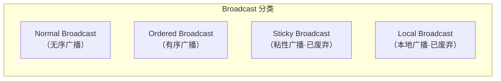
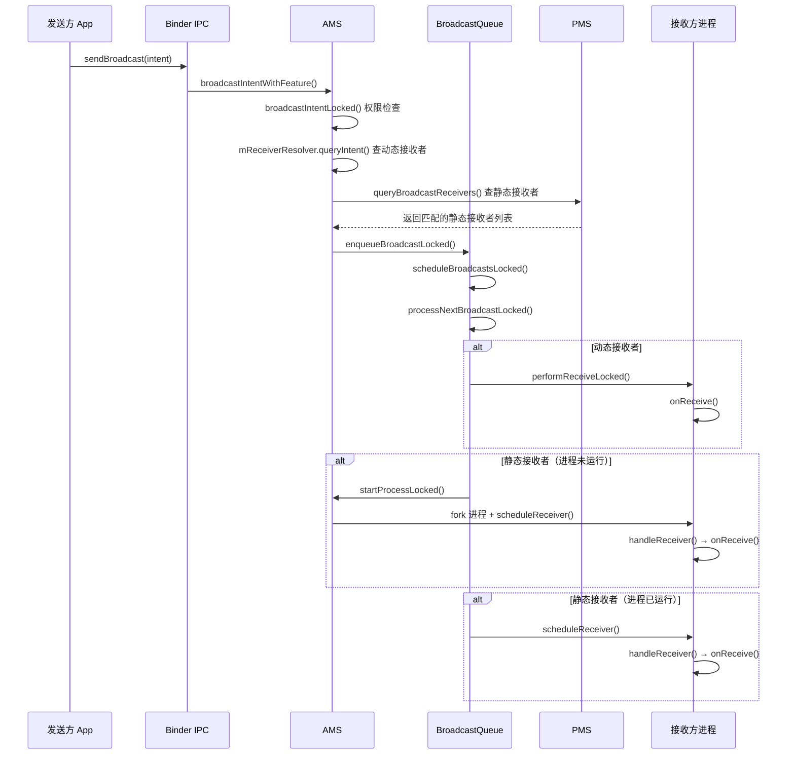
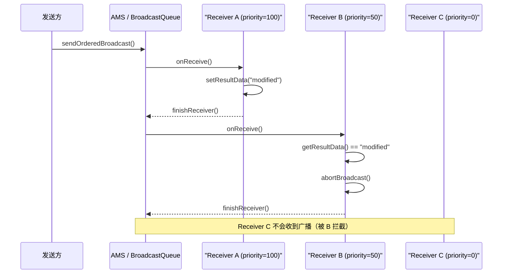

# Android BroadcastReceiver 深度解析

> 从 AOSP 源码视角全面解析 BroadcastReceiver 的发布-订阅模型、静态/动态注册机制、sendBroadcast 完整分发链路、有序广播、权限安全、ANR 超时，以及 Android 8–15 的广播限制演进

---

## 1. BroadcastReceiver 是什么、为什么需要它

### 1.1 一句话定义

**BroadcastReceiver 是 Android 四大组件之一，是系统级的发布-订阅（Pub/Sub）机制，用于在组件之间、应用之间、系统与应用之间传递事件通知。**

你可以把它理解为一个"全局事件总线"——任何组件都可以发送广播（发布），任何注册了匹配 IntentFilter 的 Receiver 都会收到通知（订阅）。

### 1.2 与其他事件/通信机制的对比


| 对比维度   | BroadcastReceiver      | EventBus    | LiveData          | SharedFlow              |
| ------ | ---------------------- | ----------- | ----------------- | ----------------------- |
| 跨进程    | 支持（系统级 IPC）            | 不支持         | 不支持               | 不支持                     |
| 跨 App  | 支持                     | 不支持         | 不支持               | 不支持                     |
| 系统事件   | 能接收系统广播（开机、网络变化等）      | 不能          | 不能                | 不能                      |
| 生命周期感知 | 无（需手动注册/反注册）           | 无           | 有（LifecycleOwner） | 有（配合 repeatOnLifecycle） |
| 性能开销   | 高（经过 AMS + Binder IPC） | 低（进程内反射/直调） | 低（观察者模式）          | 低（协程调度）                 |
| 有序分发   | 支持（Ordered Broadcast）  | 不支持         | 不支持               | 不支持                     |
| 推荐场景   | 系统事件、跨 App 通信          | 已不推荐        | 应用内 UI 数据         | 应用内事件流                  |


### 1.3 六大典型使用场景


| 场景           | 真实例子                             | 为什么用 Broadcast                      |
| ------------ | -------------------------------- | ----------------------------------- |
| **监听系统事件**   | 开机完成启动后台任务、电量低提醒                 | 系统广播是唯一的通知渠道                        |
| **网络状态变化**   | App 在网络恢复时自动重试请求                 | `CONNECTIVITY_ACTION`（动态注册）         |
| **应用安装/卸载**  | 应用商店更新推荐列表                       | `PACKAGE_ADDED` / `PACKAGE_REMOVED` |
| **跨 App 通信** | 推送 SDK 通知宿主 App 有新消息             | 广播是标准的跨 App 事件通道                    |
| **系统级权限交互**  | 短信验证码自动填充                        | 接收 `SMS_RECEIVED` 广播                |
| **闹钟/定时触发**  | AlarmManager 到时后触发 Receiver 执行任务 | PendingIntent 配合 BroadcastReceiver  |


### 1.4 不该用 Broadcast 的反模式


| 反模式                          | 应该怎么做                                         |
| ---------------------------- | --------------------------------------------- |
| 应用内组件通信（Activity → Fragment） | 使用 SharedFlow / LiveData / ViewModel          |
| 高频事件传递（每秒多次）                 | 使用 SharedFlow / 回调接口                          |
| 传递大数据（Bitmap、大 List）         | Intent 有大小限制（~1MB），使用文件/数据库                   |
| 替代 Service 做后台任务             | `onReceive()` 执行时间极短（10 秒 ANR），使用 WorkManager |
| 仅进程内通信                       | LocalBroadcastManager 已废弃，使用 SharedFlow       |


---

## 2. 广播分类

### 2.1 分类总览




### 2.2 四种广播对比


| 类型          | 发送方法                                    | 分发顺序                   | 可拦截                  | 跨进程 | 状态                  |
| ----------- | --------------------------------------- | ---------------------- | -------------------- | --- | ------------------- |
| **Normal**  | `sendBroadcast()`                       | 并行（几乎同时分发给所有接收者）       | 不可拦截                 | 是   | 推荐使用                |
| **Ordered** | `sendOrderedBroadcast()`                | 串行（按 priority 排序，逐个分发） | 可 `abortBroadcast()` | 是   | 推荐使用                |
| **Sticky**  | `sendStickyBroadcast()`                 | 同 Normal，但广播会滞留        | 不可拦截                 | 是   | **API 21 废弃**       |
| **Local**   | `LocalBroadcastManager.sendBroadcast()` | 进程内同步分发                | 不可拦截                 | 否   | **AndroidX 1.1 废弃** |


### 2.3 Normal Broadcast（无序广播）

```java
// 发送
Intent intent = new Intent("com.example.MY_ACTION");
intent.putExtra("key", "value");
sendBroadcast(intent);
```

- AMS 将所有匹配的接收者加入**并行队列**，几乎同时分发
- 接收者之间无优先级关系，无法互相影响
- 效率最高，适合"通知所有人"的场景

### 2.4 Ordered Broadcast（有序广播）

```java
// 发送
sendOrderedBroadcast(intent, null /* receiverPermission */);
```

- 按 `IntentFilter.priority`（-1000 ~ 1000）降序串行分发
- 高优先级接收者可以 `abortBroadcast()` 阻止后续接收者收到广播
- 可通过 `setResultData()` / `setResultExtras()` 传递数据给下一个接收者

### 2.5 Sticky Broadcast（已废弃）

```java
// API 21 已废弃
sendStickyBroadcast(intent);
```

废弃原因：

- 任何 App 都能读取滞留的广播数据 → 安全隐患
- 没有权限保护机制
- 占用系统资源无法自动回收
- 被 `LiveData` / `SharedPreferences` / `DataStore` 等方案替代

### 2.6 Local Broadcast（已废弃）

```java
// AndroidX 1.1.0 已废弃
LocalBroadcastManager.getInstance(context).sendBroadcast(intent);
```

废弃原因：

- 本质是进程内的 `Handler` 分发，没有利用广播的任何跨进程能力
- 与 `LiveData` / `SharedFlow` 功能重叠，后者更轻量且生命周期感知
- 详见第 10 节

---

## 3. 注册方式：静态 vs 动态

### 3.1 静态注册（Manifest）

在 `AndroidManifest.xml` 中声明：

```xml
<receiver
    android:name=".BootReceiver"
    android:exported="true"
    android:permission="android.permission.RECEIVE_BOOT_COMPLETED">
    <intent-filter>
        <action android:name="android.intent.action.BOOT_COMPLETED" />
    </intent-filter>
</receiver>
```

系统侧处理：

- 安装时由 **PMS（PackageManagerService）** 解析 Manifest，将 Receiver 信息存入 `PackageParser.Activity`（注意：AOSP 中 Receiver 复用了 Activity 的解析结构）
- 广播分发时，AMS 通过 `PMS.queryBroadcastReceivers()` 查询所有匹配的静态接收者

源码路径：

```
frameworks/base/services/core/java/com/android/server/pm/PackageManagerService.java
```

### 3.2 动态注册（registerReceiver）

```java
// 注册
IntentFilter filter = new IntentFilter("com.example.MY_ACTION");
registerReceiver(myReceiver, filter);

// 反注册（必须手动调用，否则泄漏）
unregisterReceiver(myReceiver);
```

系统侧处理：

- `ContextImpl.registerReceiver()` 通过 Binder 调用 `AMS.registerReceiverWithFeature()`
- AMS 将 Receiver 封装为 `BroadcastFilter`，加入 `ReceiverList`，存储在 `mRegisteredReceivers` 映射表中
- 广播分发时直接从内存中匹配，无需查询 PMS

源码路径：

```
frameworks/base/core/java/android/app/ContextImpl.java
frameworks/base/services/core/java/com/android/server/am/ActivityManagerService.java
```

### 3.3 静态 vs 动态对比


| 对比维度            | 静态注册                  | 动态注册                                        |
| --------------- | --------------------- | ------------------------------------------- |
| 注册位置            | `AndroidManifest.xml` | Java / Kotlin 代码                            |
| 生命周期            | 应用安装后永久生效（除非被禁用）      | 随 `registerReceiver` / `unregisterReceiver` |
| 进程未启动时          | 系统会启动进程来分发广播          | 进程不在则收不到                                    |
| Android 8+ 隐式广播 | **大部分被禁止**            | 不受限制                                        |
| 性能              | 需要 PMS 查询 + 可能启动进程，较慢 | 内存中直接匹配，快                                   |
| 适用场景            | 开机广播、应用安装等必须在进程外接收的事件 | 界面可见时监听网络变化等                                |


### 3.4 Android 8（O）隐式广播限制

Android 8 起，**大多数隐式广播不再递送给静态注册的接收者**。

**核心规则：**

- **隐式广播**（未指定目标组件）+ **静态注册** → 被系统过滤，不递送
- **显式广播**（指定了 `ComponentName`）+ **静态注册** → 正常递送
- **动态注册** → 不受此限制

**白名单（仍允许静态接收的隐式广播）：**


| Action                                | 说明         |
| ------------------------------------- | ---------- |
| `ACTION_BOOT_COMPLETED`               | 开机完成       |
| `ACTION_LOCALE_CHANGED`               | 语言变更       |
| `ACTION_USB_ACCESSORY_ATTACHED`       | USB 附件连接   |
| `ACTION_HEADSET_PLUG`                 | 耳机插拔       |
| `ACTION_CONNECTION_STATE_CHANGED`（蓝牙） | 蓝牙连接变化     |
| `ACTION_PACKAGE_FULLY_REMOVED`        | 应用完全卸载     |
| `ACTION_PACKAGE_DATA_CLEARED`         | 应用数据被清除    |
| ...                                   | 完整白名单见官方文档 |


---

## 4. sendBroadcast 完整链路（系统侧）

### 4.1 关键源码文件


| 文件                            | 路径                                                                                     | 角色                    |
| ----------------------------- | -------------------------------------------------------------------------------------- | --------------------- |
| `ContextImpl.java`            | `frameworks/base/core/java/android/app/ContextImpl.java`                               | App 侧入口               |
| `ActivityManagerService.java` | `frameworks/base/services/core/java/com/android/server/am/ActivityManagerService.java` | AMS 主类，接收广播请求         |
| `BroadcastQueue.java`         | `frameworks/base/services/core/java/com/android/server/am/BroadcastQueue.java`         | 广播队列，调度分发             |
| `BroadcastRecord.java`        | `frameworks/base/services/core/java/com/android/server/am/BroadcastRecord.java`        | 单条广播的记录               |
| `BroadcastFilter.java`        | `frameworks/base/services/core/java/com/android/server/am/BroadcastFilter.java`        | 动态注册的 IntentFilter 封装 |
| `ReceiverList.java`           | `frameworks/base/services/core/java/com/android/server/am/ReceiverList.java`           | 单个进程注册的所有 Receiver 列表 |
| `ActivityThread.java`         | `frameworks/base/core/java/android/app/ActivityThread.java`                            | App 进程侧接收并处理广播        |


### 4.2 sendBroadcast 调用链

```
App 进程                          system_server                          App/目标进程
───────                          ─────────────                          ────────────
ContextImpl.sendBroadcast(intent)
  → ContextImpl.sendBroadcast(intent, null)
    → IActivityManager.broadcastIntentWithFeature()
      ──── Binder IPC ────→
                              AMS.broadcastIntentWithFeature()
                                → AMS.broadcastIntentLocked()
                                  1. 处理系统级广播（如 TIME_SET、PACKAGE_ADDED）
                                  2. 权限检查（发送者/接收者权限匹配）
                                  3. 收集动态接收者：mReceiverResolver.queryIntent()
                                  4. 收集静态接收者：PMS.queryBroadcastReceivers()
                                  5. 合并接收者列表
                                  6. 入队 BroadcastQueue
                                → BroadcastQueue.enqueueBroadcastLocked()
                                → BroadcastQueue.scheduleBroadcastsLocked()
                                  → BroadcastQueue.processNextBroadcastLocked()
                                    → 动态接收者：deliverToRegisteredReceiverLocked()
                                      → performReceiveLocked()
      ←── Binder IPC ─────
                                                                       ActivityThread.scheduleRegisteredReceiver()
                                                                         → receiver.onReceive(context, intent)
                                    → 静态接收者：processCurBroadcastLocked()
                                      → thread.scheduleReceiver()
      ←── Binder IPC ─────
                                                                       ActivityThread.handleReceiver()
                                                                         → 实例化 BroadcastReceiver
                                                                         → receiver.onReceive(context, intent)
```

### 4.3 时序图




### 4.4 BroadcastRecord 关键字段

`BroadcastRecord` 是一条广播在 system_server 侧的"档案"：

```java
final class BroadcastRecord extends Binder {
    final Intent intent;               // 广播 Intent
    final ComponentName targetComp;    // 目标组件（显式广播时非 null）
    final String callerPackage;        // 发送方包名
    final int callingPid;             // 发送方 PID
    final int callingUid;             // 发送方 UID
    final boolean ordered;             // 是否有序广播
    final boolean sticky;              // 是否粘性广播
    final String requiredPermission;   // 接收所需权限
    final List receivers;              // 接收者列表（BroadcastFilter + ResolveInfo 混合）
    int nextReceiver;                  // 下一个待分发的接收者索引
    long dispatchTime;                 // 分发开始时间
    long receiverTime;                 // 当前接收者开始处理时间
    int resultCode;                    // 有序广播结果码
    String resultData;                 // 有序广播结果数据
    Bundle resultExtras;               // 有序广播附加数据
}
```

### 4.5 动态接收者的分发路径

动态接收者已在 App 进程中存活，分发路径较短：

1. `BroadcastQueue.processNextBroadcastLocked()` 取出 `BroadcastRecord`
2. 遍历 `receivers` 列表中的 `BroadcastFilter`（动态接收者）
3. `deliverToRegisteredReceiverLocked()` → `performReceiveLocked()`
4. 通过 Binder 回调 `IIntentReceiver.performReceive()`
5. App 进程的 `LoadedApk.ReceiverDispatcher` 将回调 post 到主线程
6. 执行 `receiver.onReceive(context, intent)`

### 4.6 静态接收者的分发路径

静态接收者可能需要启动进程，分发路径较长：

1. `BroadcastQueue.processNextBroadcastLocked()` 取出 `ResolveInfo`（静态接收者）
2. 检查目标进程是否存在
  - **不存在** → `AMS.startProcessLocked()` → Zygote fork → 进程启动后回到分发流程
  - **已存在** → 直接分发
3. `processCurBroadcastLocked()` → `thread.scheduleReceiver()`
4. App 进程 `ActivityThread.handleReceiver()`：
  - 通过反射实例化 `BroadcastReceiver`
  - 创建 `ReceiverRestrictedContext`
  - 调用 `receiver.onReceive(context, intent)`
  - 处理完成后通知 AMS → `finishReceiver()`

---

## 5. Ordered Broadcast 机制

### 5.1 有序广播排序规则

有序广播的接收者按 `IntentFilter.priority` **降序**排列（值越大越先收到）：


| priority 值 | 说明                         |
| ---------- | -------------------------- |
| 1000       | 最大值（系统保留，App 设 1000 也会被截断） |
| 0          | 默认值                        |
| -1000      | 最小值                        |


相同 priority 时，动态注册的接收者优先于静态注册。

### 5.2 有序广播时序图




### 5.3 核心 API

```java
// 在 onReceive() 中使用
public class MyOrderedReceiver extends BroadcastReceiver {
    @Override
    public void onReceive(Context context, Intent intent) {
        // 读取上一个接收者传递的数据
        String data = getResultData();
        Bundle extras = getResultExtras(true);

        // 修改数据，传递给下一个接收者
        setResultData("processed by MyReceiver");
        setResultExtras(extras);

        // 设置结果码
        setResultCode(Activity.RESULT_OK);

        // 拦截广播，后续接收者不再收到
        abortBroadcast();
    }
}
```

### 5.4 sendOrderedBroadcast 带最终接收者

```java
sendOrderedBroadcast(
    intent,
    null,                    // receiverPermission
    finalReceiver,           // 最终接收者（无论是否被拦截，都会收到）
    null,                    // scheduler（Handler，null 则用主线程）
    Activity.RESULT_OK,      // initialCode
    null,                    // initialData
    null                     // initialExtras
);
```

`finalReceiver` 是一个"兜底接收者"，即使中间某个接收者调用了 `abortBroadcast()`，最终接收者仍会被调用。

---

## 6. BroadcastReceiver 生命周期与约束

### 6.1 极短的生命周期

BroadcastReceiver 的"生命周期"是四大组件中**最短的**：

```
实例化 → onReceive() → 对象可被 GC 回收
```

- `onReceive()` 返回后，系统认为该 Receiver 已处理完毕
- 如果 Receiver 所在进程没有其他活跃组件，进程可能被立即杀死
- **不能在 `onReceive()` 中启动异步操作（Thread、Coroutine）并期望它完成**

### 6.2 执行线程

`onReceive()` 默认在**主线程**执行，不可做耗时操作。


| 注册方式                                                                    | 执行线程          | 可指定 |
| ----------------------------------------------------------------------- | ------------- | --- |
| 静态注册                                                                    | 主线程           | 不可  |
| 动态注册 `registerReceiver(receiver, filter)`                               | 主线程           | 不可  |
| 动态注册 `registerReceiver(receiver, filter, broadcastPermission, handler)` | handler 指定的线程 | 可   |


### 6.3 goAsync() 异步模式

当需要在 `onReceive()` 中执行异步操作时，可使用 `goAsync()`：

```java
@Override
public void onReceive(Context context, Intent intent) {
    PendingResult pendingResult = goAsync();

    new Thread(() -> {
        try {
            // 耗时操作（仍需在 ANR 超时内完成）
            doHeavyWork();
        } finally {
            // 必须调用 finish()，否则系统认为接收者仍在处理，最终触发 ANR
            pendingResult.finish();
        }
    }).start();
}
```

`goAsync()` 源码（`BroadcastReceiver.java`）：

```java
public final PendingResult goAsync() {
    PendingResult res = mPendingResult;
    mPendingResult = null;  // 将 PendingResult 转移给调用者
    return res;
}
```

关键要点：

- `goAsync()` **不会延长 ANR 超时**——前台广播仍是 10 秒，后台仍是 60 秒
- 必须在超时内调用 `PendingResult.finish()`
- 适合需要在子线程处理但耗时不长的场景

### 6.4 ANR 超时机制


| 场景   | 超时时间     | 说明                                      |
| ---- | -------- | --------------------------------------- |
| 前台广播 | **10 秒** | 通过 `Intent.FLAG_RECEIVER_FOREGROUND` 标记 |
| 后台广播 | **60 秒** | 默认行为                                    |


超时检测在 `BroadcastQueue` 中实现：

- 分发广播时启动超时计时器
- 若接收者未在超时内调用 `finishReceiver()`，触发 `broadcastTimeoutLocked()`
- 系统弹出 ANR 对话框

### 6.5 onReceive() 中的限制


| 操作                | 是否允许                 | 原因                                                 |
| ----------------- | -------------------- | -------------------------------------------------- |
| `bindService()`   | **不允许**              | `onReceive()` 返回后 Receiver 即被回收，绑定失去意义             |
| 启动后台 Activity     | **不允许**（Android 10+） | 后台启动 Activity 被限制                                  |
| 启动前台 Service      | **允许**（需符合前台服务限制）    | 常见做法：收到广播后启动前台服务处理耗时任务                             |
| `startActivity()` | **受限**               | 需要添加 `FLAG_ACTIVITY_NEW_TASK`，且 Android 10+ 后台启动受限 |
| 显示 Toast          | 允许                   | 轻量操作                                               |


---

## 7. 权限与安全

### 7.1 发送端权限控制

限制哪些接收者可以收到广播：

```java
// 只有持有 MY_PERMISSION 权限的接收者才能收到
sendBroadcast(intent, "com.example.MY_PERMISSION");
```

AMS 在 `broadcastIntentLocked()` 中检查每个接收者是否持有该权限，不满足则跳过。

### 7.2 接收端权限控制

限制哪些发送者的广播可以被接收：

```xml
<!-- 只接收持有 MY_PERMISSION 的发送者发来的广播 -->
<receiver
    android:name=".SecureReceiver"
    android:permission="com.example.MY_PERMISSION"
    android:exported="true">
    <intent-filter>
        <action android:name="com.example.SECURE_ACTION" />
    </intent-filter>
</receiver>
```

动态注册时：

```java
registerReceiver(receiver, filter, "com.example.MY_PERMISSION", null);
```

### 7.3 android:exported 属性


| `exported` 值 | 含义                                                                              |
| ------------ | ------------------------------------------------------------------------------- |
| `true`       | 其他 App 可以向此 Receiver 发送广播                                                       |
| `false`      | 仅同一 App（或相同 UID）可以发送                                                            |
| 未声明          | Android 12 以前：有 `<intent-filter>` 默认 `true`，无则默认 `false`；**Android 12+ 必须显式声明** |


Android 12+ 若不声明 `exported`，安装时会报错：

```
Installation did not succeed.
The application could not be installed: INSTALL_FAILED_VERIFICATION_FAILURE
```

### 7.4 保护级别（protectionLevel）


| 级别                  | 说明               | 示例                                     |
| ------------------- | ---------------- | -------------------------------------- |
| `normal`            | 安装时自动授予          | `INTERNET`、`ACCESS_NETWORK_STATE`      |
| `dangerous`         | 需要用户运行时授权        | `READ_CONTACTS`、`ACCESS_FINE_LOCATION` |
| `signature`         | 只有相同签名的 App 才能获取 | 自定义权限保护广播                              |
| `signatureOrSystem` | 相同签名或系统 App      | 系统级保护                                  |


推荐做法：自定义广播权限使用 `signature` 级别，确保只有自己的 App 或同签名 App 能交互。

---

## 8. Android 版本演进与限制

```
Android 7 (N)    移除部分隐式广播的静态注册支持
                 （CONNECTIVITY_ACTION 不再递送给静态接收者）
        ↓
Android 8 (O)    大规模限制隐式广播静态注册（白名单机制）
                 后台 App 几乎无法通过静态注册接收隐式广播
        ↓
Android 9 (P)    网络广播不再包含位置/个人数据
                 NETWORK_STATE_CHANGED_ACTION 移除 SSID/BSSID
        ↓
Android 12 (S)   android:exported 必须显式声明
                 所有包含 <intent-filter> 的组件
        ↓
Android 13 (T)   运行时注册接收者需声明导出行为
                 registerReceiver() 新增 RECEIVER_EXPORTED / RECEIVER_NOT_EXPORTED flag
        ↓
Android 14 (U)   RECEIVER_EXPORTED / RECEIVER_NOT_EXPORTED 强制要求
                 不声明则抛出 SecurityException
```

### 8.1 Android 7 的变化


| 移除的静态接收               | 替代方案                                                 |
| --------------------- | ---------------------------------------------------- |
| `CONNECTIVITY_ACTION` | 动态注册 `ConnectivityManager.registerNetworkCallback()` |
| `ACTION_NEW_PICTURE`  | `JobScheduler` 配合 content URI 触发                     |
| `ACTION_NEW_VIDEO`    | `JobScheduler` 配合 content URI 触发                     |


### 8.2 Android 8 的重大变化

核心思路：减少不必要的进程唤醒，延长电池寿命。

**影响范围：**

- 隐式广播 + 静态注册 → 被过滤（白名单除外）
- 显式广播 + 静态注册 → 不受影响
- 动态注册 → 不受影响

**开发者应对策略：**


| 场景             | 推荐做法                                           |
| -------------- | ---------------------------------------------- |
| 监听系统事件（不在白名单中） | 改为动态注册，在 Activity/Service 中 `registerReceiver` |
| 需要进程不在时也接收     | 使用 `JobScheduler` / `WorkManager` 替代           |
| 跨 App 通信       | 改为显式广播（指定 `ComponentName`）                     |


### 8.3 Android 14 的 RECEIVER_EXPORTED 变化

```java
// Android 14+ 动态注册时必须声明导出行为

// 可接收其他 App 的广播
registerReceiver(receiver, filter, Context.RECEIVER_EXPORTED);

// 仅接收本 App 的广播
registerReceiver(receiver, filter, Context.RECEIVER_NOT_EXPORTED);
```

不声明则抛出 `SecurityException`：

```
One of RECEIVER_EXPORTED or RECEIVER_NOT_EXPORTED should be specified
when a receiver isn't being registered exclusively for system broadcasts
```

---

## 9. 常用系统广播一览

### 9.1 常见系统广播


| Action                         | 说明        | Android 8+ 静态接收        |
| ------------------------------ | --------- | ---------------------- |
| `ACTION_BOOT_COMPLETED`        | 设备启动完成    | 允许（白名单）                |
| `ACTION_BATTERY_LOW`           | 电量低       | 允许（白名单）                |
| `ACTION_BATTERY_OKAY`          | 电量恢复正常    | 允许（白名单）                |
| `ACTION_POWER_CONNECTED`       | 充电器连接     | 允许（白名单）                |
| `ACTION_POWER_DISCONNECTED`    | 充电器断开     | 允许（白名单）                |
| `ACTION_SCREEN_ON`             | 屏幕点亮      | **不允许**（仅动态）           |
| `ACTION_SCREEN_OFF`            | 屏幕关闭      | **不允许**（仅动态）           |
| `ACTION_USER_PRESENT`          | 用户解锁      | **不允许**（仅动态）           |
| `CONNECTIVITY_ACTION`          | 网络变化      | **不允许**（Android 7+ 移除） |
| `ACTION_AIRPLANE_MODE_CHANGED` | 飞行模式      | **不允许**（仅动态）           |
| `ACTION_TIME_TICK`             | 每分钟系统时钟   | **不允许**（仅动态）           |
| `ACTION_TIME_CHANGED`          | 系统时间被手动设置 | 允许（白名单）                |
| `ACTION_TIMEZONE_CHANGED`      | 时区变更      | 允许（白名单）                |
| `ACTION_LOCALE_CHANGED`        | 语言变更      | 允许（白名单）                |
| `ACTION_PACKAGE_ADDED`         | 应用安装      | 允许（白名单）                |
| `ACTION_PACKAGE_REMOVED`       | 应用卸载      | 允许（白名单）                |
| `ACTION_PACKAGE_REPLACED`      | 应用更新      | 允许（白名单）                |
| `ACTION_MY_PACKAGE_REPLACED`   | 自身被更新     | 允许（白名单）                |


### 9.2 发送系统广播的源码入口

系统广播在 framework 各处发送，例如：


| 广播                    | 发送位置                                                                 |
| --------------------- | -------------------------------------------------------------------- |
| `BOOT_COMPLETED`      | `ActivityManagerService.finishBooting()`                             |
| `BATTERY_LOW`         | `BatteryService.sendBatteryLowLocked()`                              |
| `CONNECTIVITY_ACTION` | `ConnectivityService`                                                |
| `PACKAGE_ADDED`       | `PackageManagerService.sendPackageBroadcast()`                       |
| `SCREEN_ON/OFF`       | `PowerManagerService` → `Notifier.sendScreenStateChangedBroadcast()` |


---

## 10. LocalBroadcastManager（已废弃）与替代方案

### 10.1 工作原理

`LocalBroadcastManager` 是 AndroidX 提供的进程内广播实现：

```
LocalBroadcastManager
  ├── mReceivers: HashMap<BroadcastReceiver, ArrayList<ReceiverRecord>>
  ├── mActions: HashMap<String, ArrayList<ReceiverRecord>>
  └── mHandler: Handler（主线程）
```

- `sendBroadcast()` 将 Intent 加入 `mPendingBroadcasts` 列表
- 通过 `Handler.sendMessage()` post 到主线程
- 遍历匹配的 Receiver 直接调用 `onReceive()`
- **完全不经过 AMS、不走 Binder IPC**

### 10.2 废弃原因

AndroidX 1.1.0 将 `LocalBroadcastManager` 标记为 `@Deprecated`：

1. **功能定位尴尬**：既然是进程内通信，用 Observer 模式（LiveData、Flow）更直接
2. **无生命周期感知**：仍需手动 register/unregister，容易泄漏
3. **API 笨重**：需要构造 Intent + IntentFilter，对进程内通信来说过于复杂
4. **线程模型单一**：只能在主线程分发

### 10.3 替代方案对比


| 方案             | 生命周期感知                 | 线程安全     | 多订阅者 | 跨进程 | 推荐度  |
| -------------- | ---------------------- | -------- | ---- | --- | ---- |
| **SharedFlow** | 配合 `repeatOnLifecycle` | 是（协程）    | 是    | 否   | 最推荐  |
| **LiveData**   | 原生支持                   | 是（主线程分发） | 是    | 否   | 推荐   |
| **EventBus**   | 无                      | 需配置      | 是    | 否   | 不推荐  |
| **回调接口**       | 无                      | 需自行处理    | 单个   | 否   | 简单场景 |


推荐做法：

```kotlin
// SharedFlow 替代 LocalBroadcast
class EventBus {
    private val _events = MutableSharedFlow<AppEvent>()
    val events: SharedFlow<AppEvent> = _events.asSharedFlow()

    suspend fun emit(event: AppEvent) = _events.emit(event)
}

// 在 ViewModel 或 Repository 中发送
eventBus.emit(AppEvent.DataRefreshed)

// 在 UI 层收集
lifecycleScope.launch {
    repeatOnLifecycle(Lifecycle.State.STARTED) {
        eventBus.events.collect { event -> handleEvent(event) }
    }
}
```

---

## 11. 常用调试命令与 Perfetto 实操

### 11.1 dumpsys 命令

```bash
# 查看当前广播队列（包含待分发和历史记录）
adb shell dumpsys activity broadcasts

# 查看指定包名相关的广播
adb shell dumpsys activity broadcasts | grep -A 10 "com.example.app"

# 查看广播历史记录
adb shell dumpsys activity broadcasts history

# 查看已注册的动态接收者
adb shell dumpsys activity broadcasts | grep -A 3 "Registered Receivers"

# 查看广播相关的 ANR
adb shell dumpsys activity anr
```

输出关键字段解读：


| 字段                     | 含义         |
| ---------------------- | ---------- |
| `BroadcastRecord{...}` | 一条广播记录     |
| `act=...`              | 广播的 Action |
| `caller=...`           | 发送方信息      |
| `receivers=N`          | 接收者数量      |
| `nextReceiver=N`       | 下一个待分发的索引  |
| `dispatchTime=...`     | 分发时间戳      |
| `Registered Receivers` | 动态注册的接收者列表 |


### 11.2 adb shell am broadcast

```bash
# 发送普通广播
adb shell am broadcast -a com.example.MY_ACTION

# 发送带 Extra 的广播
adb shell am broadcast -a com.example.MY_ACTION --es key "value" --ei count 42

# 发送给指定组件（显式广播）
adb shell am broadcast -n com.example.app/.MyReceiver

# 发送有序广播
adb shell am broadcast -a com.example.MY_ACTION --receiver-permission com.example.PERM

# 模拟系统广播（需要 root 或 shell 权限）
adb shell am broadcast -a android.intent.action.BOOT_COMPLETED -n com.example.app/.BootReceiver
```

### 11.3 Perfetto 中的 Broadcast 相关 Trace

抓取 `am` 和 `ams` tag 时可看到：


| Trace Slice             | 含义                     |
| ----------------------- | ---------------------- |
| `broadcastIntent`       | AMS 收到广播发送请求           |
| `broadcastIntentLocked` | AMS 处理广播（权限检查、接收者匹配）   |
| `processNextBroadcast`  | BroadcastQueue 分发下一条广播 |
| `broadcastReceiveReg`   | 动态接收者收到广播              |
| `broadcastReceiveComp`  | 静态接收者收到广播              |
| `Broadcast ANR`         | 广播接收超时                 |


### 11.4 Perfetto SQL 查询示例

```sql
-- 查找广播相关的 trace slice
SELECT ts, dur, name
FROM slice
WHERE name LIKE '%broadcast%'
  AND dur > 0
ORDER BY ts;

-- 查找耗时超过 5 秒的广播分发
SELECT ts, dur / 1000000 AS dur_ms, name
FROM slice
WHERE name LIKE '%broadcast%'
  AND dur > 5000000000
ORDER BY dur DESC;

-- 查找广播 ANR 事件
SELECT ts, dur, name
FROM slice
WHERE name LIKE '%Broadcast ANR%'
ORDER BY ts;
```

---

## 12. 面试高频问题

### Q1：普通广播和有序广播的区别？

普通广播（`sendBroadcast`）并行分发给所有匹配的接收者，效率高，接收者之间互不影响。有序广播（`sendOrderedBroadcast`）按 `priority` 降序串行分发，高优先级接收者可以通过 `abortBroadcast()` 拦截，也可通过 `setResultData()` 向后传递数据。

### Q2：静态注册和动态注册的区别？

静态注册在 Manifest 中声明，App 安装后永久生效，进程未运行时系统也会启动进程来分发广播；但 Android 8+ 大部分隐式广播不再递送给静态接收者。动态注册在代码中 `registerReceiver()`，随注册/反注册生效，不受 Android 8 隐式广播限制，但进程不在则收不到。

### Q3：Android 8 对广播做了什么限制？为什么？

Android 8 禁止大部分隐式广播递送给静态注册的接收者，保留了白名单（如 `BOOT_COMPLETED`、`PACKAGE_ADDED` 等）。目的是减少不必要的进程唤醒，延长电池寿命——之前一条隐式广播可能唤醒几十个 App 进程。开发者应改用动态注册、显式广播或 `WorkManager`/`JobScheduler`。

### Q4：BroadcastReceiver 的 ANR 超时是多少？

前台广播 10 秒，后台广播 60 秒。超时后系统通过 `BroadcastQueue.broadcastTimeoutLocked()` 触发 ANR。前台广播通过 `Intent.FLAG_RECEIVER_FOREGROUND` 标记。

### Q5：onReceive 可以做耗时操作吗？goAsync 是什么？

不可以。`onReceive()` 默认在主线程执行，且有 ANR 超时限制。`goAsync()` 返回一个 `PendingResult` 对象，允许在子线程中处理，但**不会延长 ANR 超时**——必须在超时前调用 `PendingResult.finish()`。适合需要子线程但耗时可控的场景。

### Q6：sendBroadcast 的系统侧分发流程是怎样的？

`ContextImpl.sendBroadcast()` → Binder IPC → `AMS.broadcastIntentLocked()` → 权限检查 → 通过 `mReceiverResolver` 查动态接收者 + 通过 PMS 查静态接收者 → 构建 `BroadcastRecord` → 入队 `BroadcastQueue` → `processNextBroadcastLocked()` 逐个分发 → 动态接收者通过 `IIntentReceiver` 回调 → 静态接收者通过 `scheduleReceiver()` 分发。

### Q7：LocalBroadcastManager 为什么被废弃？用什么替代？

`LocalBroadcastManager` 本质是进程内的 Handler 分发，完全不走 IPC，与广播机制的跨进程能力无关。它没有生命周期感知、API 繁琐（需构造 Intent + IntentFilter）、线程模型单一。推荐用 `SharedFlow`（配合 `repeatOnLifecycle`）或 `LiveData` 替代。

### Q8：如何保证广播的安全性？

1. 发送端：`sendBroadcast(intent, permission)` 限制接收者权限
2. 接收端：`android:permission` 限制发送者权限
3. `android:exported="false"` 限制仅同 App 可访问
4. 使用 `signature` 级别自定义权限
5. Android 14+ 动态注册时声明 `RECEIVER_NOT_EXPORTED`

### Q9：Sticky Broadcast 是什么？为什么废弃？

Sticky Broadcast 发送后会"滞留"在系统中，后续注册的接收者能立即收到最后一条。API 21 废弃，原因是：无权限保护（任何 App 可读取）、安全隐患、占用系统资源。被 `LiveData`、`SharedPreferences`、`DataStore` 等方案替代。

### Q10：BroadcastReceiver 与 EventBus / LiveData 的区别？

BroadcastReceiver 是系统级组件，支持跨进程、跨 App 通信，经过 AMS + Binder IPC，开销大。EventBus 是进程内的反射/直调，无生命周期感知，已不推荐。LiveData 是 Lifecycle 感知的观察者模式，仅进程内，自动管理订阅。选择原则：跨进程/系统事件用 Broadcast，应用内用 LiveData/SharedFlow。

### Q11：静态注册的 Receiver，进程未启动时收到广播会怎样？

系统（AMS）会先启动目标进程（通过 Zygote fork），进程启动完成后再分发广播。`ActivityThread.handleReceiver()` 中通过反射实例化 BroadcastReceiver，调用 `onReceive()`。这就是为什么 Android 8 要限制静态接收——一条隐式广播可能唤醒大量进程，浪费电量和内存。

### Q12：Android 14 的 RECEIVER_EXPORTED / RECEIVER_NOT_EXPORTED 是什么？

Android 14 要求动态注册接收者时必须通过 `Context.RECEIVER_EXPORTED` 或 `Context.RECEIVER_NOT_EXPORTED` 显式声明该接收者是否对其他 App 可见。不声明则抛出 `SecurityException`。这与 Android 12 要求 Manifest 中 `exported` 显式声明的思路一致，堵住了动态注册的安全漏洞。

---

## AI 交互建议

阅读源码时，可以向 AI 提问以下问题加深理解：

### 分发机制

1. `帮我追踪 ContextImpl.sendBroadcast() 的完整调用链，从 App 进程到 BroadcastQueue 分发给接收者`
2. `AMS.broadcastIntentLocked() 中如何区分动态接收者和静态接收者？分发顺序是怎样的？`
3. `BroadcastRecord 的 receivers 列表中，BroadcastFilter 和 ResolveInfo 分别代表什么？`

### 有序广播

1. `有序广播的串行分发在 BroadcastQueue 中是如何实现的？如何保证一个接收者处理完才分发给下一个？`
2. `abortBroadcast() 的实现原理是什么？在源码中是哪个字段控制的？`

### 权限与安全

1. `broadcastIntentLocked() 中的权限检查逻辑是怎样的？发送端权限和接收端权限分别在哪里校验？`
2. `Android 14 的 RECEIVER_EXPORTED 校验逻辑在 AMS 源码的什么位置？`

### ANR 与性能

1. `BroadcastQueue 的 ANR 超时计时器是如何设置和触发的？超时后的处理流程是什么？`
2. `Android 8 的隐式广播过滤逻辑在源码中的什么位置？白名单是如何维护的？`

---

## 真机实操

### 1. 查看当前广播队列

```bash
# 查看广播队列和已注册的接收者
adb shell dumpsys activity broadcasts
```

**预期**：看到 `Historical broadcasts`（历史广播记录）、`Registered Receivers`（动态注册的接收者列表），包含 filter action、接收者类名、所属进程等。

### 2. 手动发送广播并观察

```bash
# 发送自定义广播
adb shell am broadcast -a com.example.TEST_ACTION --es message "hello"

# 查看是否有接收者匹配
adb shell dumpsys activity broadcasts | grep "com.example.TEST_ACTION"
```

**预期**：如果有匹配的接收者，在 App 的 logcat 中看到 `onReceive()` 被调用；如果无匹配，dumpsys 中看到广播被丢弃。

### 3. 有序广播拦截测试

编写两个 Receiver（priority 不同），高优先级的调用 `abortBroadcast()`：

```bash
# 发送有序广播
adb shell am broadcast -a com.example.ORDERED_TEST

# 观察 logcat，确认低优先级 Receiver 未收到
adb logcat | grep "OrderedTest"
```

**预期**：高优先级 Receiver 收到广播并拦截，低优先级 Receiver 的 `onReceive()` 不被调用。

### 4. 观察广播 ANR

在 `onReceive()` 中 `Thread.sleep(15000)`（> 10 秒前台广播超时），用前台广播触发：

```bash
# 发送前台广播
adb shell "am broadcast -a com.example.SLOW_ACTION -f 0x10000000"

# 等待 10+ 秒后查看 ANR
adb shell dumpsys activity anr

# 抓取 traces
adb pull /data/anr/traces.txt
```

**预期**：约 10 秒后系统弹出 ANR 对话框，`dumpsys activity anr` 中出现 Broadcast 超时记录。

### 5. 对比静态/动态注册行为（Android 8+）

```bash
# 发送隐式广播
adb shell am broadcast -a com.example.IMPLICIT_ACTION

# 发送显式广播
adb shell am broadcast -n com.example.app/.MyStaticReceiver

# 对比 logcat 输出
```

**预期**：Android 8+ 设备上，静态注册的 Receiver 收不到隐式广播（除非在白名单中），但能收到显式广播。动态注册的 Receiver 都能收到。

---

## 下一步学习建议

- 阅读 `BroadcastQueue.processNextBroadcastLocked()` 的完整实现，理解并行/串行分发逻辑
- 结合 [AMS与WMS核心服务](../framework/AMS与WMS核心服务.md) 理解 AMS 如何统一管理四大组件
- 结合 [Binder与跨进程通信](../framework/Binder与跨进程通信.md) 理解广播分发的 Binder IPC 细节
- 结合 [Service组件](./Service组件.md) 对比 Service 和 BroadcastReceiver 的生命周期差异
- 阅读 `BroadcastQueueModernImpl.java`（Android 14+ 的新广播队列实现）了解最新架构变化
- 阅读 Android 官方文档中隐式广播例外白名单的完整列表

