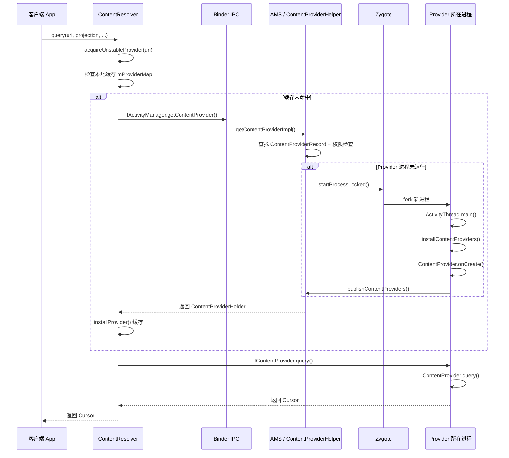
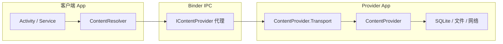
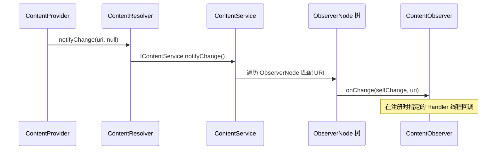

# Android ContentProvider 深度解析

> 从 AOSP 源码视角全面解析 ContentProvider 的跨进程数据共享模型、Content URI 设计、query/insert 完整链路、ContentObserver 观察机制、权限与安全、FileProvider 原理，以及 Scoped Storage 演进

---

## 目录

1. [ContentProvider 是什么、为什么需要它](#1-contentprovider-是什么为什么需要它)
2. [核心概念与基本结构](#2-核心概念与基本结构)
3. [ContentProvider 生命周期](#3-contentprovider-生命周期)
4. [ContentProvider 启动与发布完整链路（系统侧）](#4-contentprovider-启动与发布完整链路系统侧)
5. [ContentResolver 与 Binder 通信机制](#5-contentresolver-与-binder-通信机制)
6. [数据观察机制：ContentObserver](#6-数据观察机制contentobserver)
7. [权限与安全](#7-权限与安全)
8. [FileProvider：安全的文件共享](#8-fileprovider安全的文件共享)
9. [系统内置 ContentProvider 一览](#9-系统内置-contentprovider-一览)
10. [Android 版本演进与限制](#10-android-版本演进与限制)
11. [常用调试命令与 Perfetto 实操](#11-常用调试命令与-perfetto-实操)
12. [面试高频问题](#12-面试高频问题)
13. [AI 交互建议](#ai-交互建议)
14. [真机实操](#真机实操)
15. [下一步学习建议](#下一步学习建议)

---

## 1. ContentProvider 是什么、为什么需要它

### 1.1 一句话定义

**ContentProvider 是 Android 四大组件之一，为结构化数据提供统一的跨进程共享接口，对外暴露类似数据库表的 CRUD 操作，底层通过 Binder IPC 实现跨进程通信。**

你可以把它理解为一个"数据库代理服务器"——它把内部的数据存储（SQLite、文件、内存等）封装成标准的 URI + CRUD 接口，其他 App 或组件通过 `ContentResolver` 即可访问，无需关心数据的物理存储方式和所在进程。

### 1.2 与其他跨进程数据共享方式的对比


| 对比维度   | ContentProvider  | 直接 AIDL/Binder | 文件共享  | Socket | SharedPreferences（多进程） |
| ------ | ---------------- | -------------- | ----- | ------ | ---------------------- |
| 接口标准化  | 统一 URI + CRUD    | 自定义接口          | 无标准接口 | 自定义协议  | key-value              |
| 跨进程    | 原生支持             | 原生支持           | 需处理并发 | 支持     | 官方不推荐（不可靠）             |
| 权限控制   | URI 级精细权限        | 需自行实现          | 文件权限  | 无      | 无                      |
| 数据观察   | ContentObserver  | 需自行实现          | 无     | 无      | 无                      |
| 临时权限授予 | 支持（FLAG_GRANT_*） | 不支持            | 不支持   | 不支持    | 不支持                    |
| 系统集成   | 系统级（通讯录、媒体库等）    | 需自行封装          | 需自行管理 | 需自行管理  | 仅简单 KV                 |


### 1.3 六大典型使用场景


| 场景             | 真实例子           | 为什么用 ContentProvider                                                  |
| -------------- | -------------- | --------------------------------------------------------------------- |
| **系统通讯录**      | 读取联系人、添加联系人    | ContactsProvider 是标准接口，所有 App 统一通过 `content://contacts` 访问            |
| **媒体库**        | 相册 App 读取图片/视频 | MediaProvider 统一管理设备上的媒体文件，是 Scoped Storage 的基础                       |
| **系统设置**       | 读取/修改系统亮度、铃声   | SettingsProvider 暴露 `content://settings`，系统设置全靠它                      |
| **跨 App 数据共享** | 微信分享文件给其他 App  | FileProvider 提供安全的 `content://` URI，替代不安全的 `file://`                  |
| **应用内多进程共享**   | 主进程 + 推送进程共享配置 | ContentProvider 天然支持跨进程，比 SharedPreferences 的 `MODE_MULTI_PROCESS` 可靠 |
| **数据同步框架**     | SyncAdapter 框架 | SyncAdapter 要求数据源必须通过 ContentProvider 暴露                              |


### 1.4 不该用 ContentProvider 的反模式


| 反模式             | 应该怎么做                                 |
| --------------- | ------------------------------------- |
| 进程内数据访问（不跨进程）   | 直接使用 Room / SQLite / DataStore        |
| 只需要简单 KV 存储     | 使用 DataStore（替代 SharedPreferences）    |
| 传递大文件           | 使用 FileProvider 只传 URI，不把文件内容放 Cursor |
| 高频实时数据流（如传感器数据） | 使用 Binder 回调 / SharedMemory           |
| 仅在两个 App 间通信    | 如果不需要标准化接口，可直接用 AIDL Bound Service    |


---

## 2. 核心概念与基本结构

### 2.1 源码位置

```
frameworks/base/core/java/android/content/ContentProvider.java
frameworks/base/core/java/android/content/ContentResolver.java
frameworks/base/core/java/android/content/ContentUris.java
```

类声明：

```java
public abstract class ContentProvider implements ContentInterface, ComponentCallbacks2 {
```

### 2.2 Content URI 结构

```
content://com.example.app.provider/users/42
  │         │                       │     │
  │         │                       │     └── id（可选，具体行）
  │         │                       └── path（数据表/集合名）
  │         └── authority（全局唯一标识，通常为包名 + ".provider"）
  └── scheme（固定为 content://）
```

**UriMatcher 匹配机制：**

```java
private static final UriMatcher sUriMatcher = new UriMatcher(UriMatcher.NO_MATCH);
static {
    sUriMatcher.addURI("com.example.provider", "users", USERS);         // 集合
    sUriMatcher.addURI("com.example.provider", "users/#", USER_ID);     // 单条（# 匹配数字）
    sUriMatcher.addURI("com.example.provider", "users/*/photos", USER_PHOTOS); // * 匹配字符串
}
```

### 2.3 MIME 类型

`getType(Uri)` 返回 MIME 类型，遵循规范：


| URI 类型 | MIME 前缀                    | 示例                                              |
| ------ | -------------------------- | ----------------------------------------------- |
| 集合（多行） | `vnd.android.cursor.dir/`  | `vnd.android.cursor.dir/vnd.com.example.users`  |
| 单条（单行） | `vnd.android.cursor.item/` | `vnd.android.cursor.item/vnd.com.example.users` |


### 2.4 六大核心方法


| 方法           | 说明                       | 线程         |
| ------------ | ------------------------ | ---------- |
| `onCreate()` | Provider 创建时调用，初始化数据库等资源 | **主线程**    |
| `query()`    | 查询数据，返回 `Cursor`         | Binder 线程池 |
| `insert()`   | 插入数据，返回新记录的 URI          | Binder 线程池 |
| `update()`   | 更新数据，返回受影响行数             | Binder 线程池 |
| `delete()`   | 删除数据，返回受影响行数             | Binder 线程池 |
| `getType()`  | 返回 URI 对应的 MIME 类型       | Binder 线程池 |


注意：除 `onCreate()` 外，其余五个方法都在 **Binder 线程池**中执行（多线程并发），必须自行保证线程安全。

### 2.5 关键字段

```java
// ContentProvider.java
private Context mContext = null;
private String mAuthority = null;
private String mReadPermission = null;
private String mWritePermission = null;
private PathPermission[] mPathPermissions = null;
private boolean mExported = false;
private boolean mNoPerms = false;
private boolean mSingleUser = false;
```

### 2.6 Manifest 声明

```xml
<provider
    android:name=".data.MyProvider"
    android:authorities="com.example.app.provider"
    android:exported="true"
    android:readPermission="com.example.app.READ_DATA"
    android:writePermission="com.example.app.WRITE_DATA"
    android:grantUriPermissions="true">
    <grant-uri-permission android:pathPrefix="/public/" />
</provider>
```

---

## 3. ContentProvider 生命周期

### 3.1 极简生命周期

ContentProvider 的生命周期是四大组件中**最简单的**：

```
进程启动 → onCreate() → 持续存在 → 进程被杀
```

- 没有 `onStart()`、`onResume()` 等中间状态
- 没有显式的 `onDestroy()` 回调
- 一旦创建，就一直存活到进程被杀

### 3.2 与 Application.onCreate() 的调用顺序

这是一个**极高频面试题**——ContentProvider.onCreate() 在 Application.onCreate() **之前**调用：

```
进程启动
  → ActivityThread.main()
    → ActivityThread.handleBindApplication()
      → 1. Application 实例化（但不调 onCreate）
      → 2. installContentProviders()
        → 遍历所有本进程的 ContentProvider
          → 实例化 ContentProvider
          → ContentProvider.attachInfo()
          → ContentProvider.onCreate()       ← 先执行
      → 3. mInstrumentation.callApplicationOnCreate()
        → Application.onCreate()             ← 后执行
```

源码位置（`ActivityThread.java` `handleBindApplication()`）：

```java
// 先安装 ContentProvider
if (!ArrayUtils.isEmpty(data.providers)) {
    installContentProviders(app, data.providers);
}
// 再调用 Application.onCreate
mInstrumentation.callApplicationOnCreate(app);
```

**实际影响**：如果在 ContentProvider.onCreate() 中依赖 Application.onCreate() 中初始化的 SDK（如日志库、网络库），会导致空指针或未初始化异常。这也是 ContentProvider 拖慢冷启动的常见原因。

### 3.3 系统侧 ContentProviderRecord

`ContentProviderRecord` 是 ContentProvider 在 system_server 侧的"档案"：

```java
// ContentProviderRecord.java
final class ContentProviderRecord implements ComponentName.WithComponentName {
    final ActivityManagerService service;
    final ProviderInfo info;              // Manifest 中声明的信息
    final ComponentName name;             // 组件名
    IContentProvider provider;            // Binder 代理（App 端发布后填入）
    ProcessRecord proc;                   // 运行所在的进程
    ProcessRecord launchingApp;           // 正在启动的进程（尚未发布时）
    final ArrayMap<ProcessRecord, ArrayList<ContentProviderConnection>> connections; // 连接记录
    boolean noReleaseNeeded;              // 是否需要引用计数管理
    int externalProcessNoHandleCount;     // 外部进程连接计数
}
```

---

## 4. ContentProvider 启动与发布完整链路（系统侧）

### 4.1 关键源码文件


| 文件                            | 路径                                                                                     | 角色                        |
| ----------------------------- | -------------------------------------------------------------------------------------- | ------------------------- |
| `ContentResolver.java`        | `frameworks/base/core/java/android/content/ContentResolver.java`                       | 客户端入口                     |
| `ContextImpl.java`            | `frameworks/base/core/java/android/app/ContextImpl.java`                               | `getContentResolver()` 实现 |
| `ActivityManagerService.java` | `frameworks/base/services/core/java/com/android/server/am/ActivityManagerService.java` | AMS 主类                    |
| `ContentProviderHelper.java`  | `frameworks/base/services/core/java/com/android/server/am/ContentProviderHelper.java`  | Provider 管理核心逻辑           |
| `ContentProviderRecord.java`  | `frameworks/base/services/core/java/com/android/server/am/ContentProviderRecord.java`  | Provider 状态记录             |
| `ActivityThread.java`         | `frameworks/base/core/java/android/app/ActivityThread.java`                            | App 进程侧安装和发布              |


### 4.2 首次 query 触发的完整调用链

```
客户端 App 进程                    system_server                       Provider 所在进程
──────────────                    ─────────────                       ────────────────
ContentResolver.query(uri, ...)
  → ContentResolver.acquireUnstableProvider()
    → ApplicationContentResolver.acquireUnstableProvider()
      → ActivityThread.acquireProvider()
        → 检查本地缓存 mProviderMap
          ├── 命中 → 直接返回 IContentProvider
          └── 未命中 → IActivityManager.getContentProvider()
            ──── Binder IPC ────→
                                  AMS.getContentProvider()
                                    → ContentProviderHelper.getContentProviderImpl()
                                      1. 查找 ContentProviderRecord
                                      2. 检查权限
                                      3. 若 Provider 进程未运行：
                                         → AMS.startProcessLocked()
                                         → Zygote fork
                                         → 等待进程启动并发布 Provider
                                      4. 若 Provider 进程已运行但未发布：
                                         → 等待 publishContentProviders()
                                      5. Provider 已就绪：
                                         → 创建 ContentProviderConnection
                                         → 返回 ContentProviderHolder
            ←── Binder IPC ─────
        → installProvider() 缓存到本地
        → 返回 IContentProvider
  → IContentProvider.query()
    ──── Binder IPC ────→
                                                                     ContentProvider.Transport.query()
                                                                       → ContentProvider.query()
                                                                       → 返回 Cursor
    ←── Binder IPC ─────（CursorWindow 共享内存）
  → 返回 Cursor 给调用者
```

### 4.3 时序图




### 4.4 Provider 发布流程（App 进程侧）

`ActivityThread.installContentProviders()` 是 Provider 在 App 进程侧的安装入口：

```java
private void installContentProviders(Context context, List<ProviderInfo> providers) {
    final ArrayList<ContentProviderHolder> results = new ArrayList<>();

    for (ProviderInfo cpi : providers) {
        // 1. 实例化 ContentProvider 并调用 onCreate()
        ContentProviderHolder cph = installProvider(context, null, cpi, ...);
        if (cph != null) {
            results.add(cph);
        }
    }

    // 2. 批量发布给 AMS
    ActivityManager.getService().publishContentProviders(
            getApplicationThread(), results);
}
```

`installProvider()` 内部：

```java
// 通过反射实例化
ContentProvider localProvider = packageInfo.getAppFactory()
        .instantiateProvider(cl, info.name);
// 调用 attachInfo → 内部调用 onCreate()
localProvider.attachInfo(c, info);
```

### 4.5 已缓存 Provider 的快速路径

当 Provider 已经被获取过一次后，`IContentProvider` 代理会缓存在 `ActivityThread.mProviderMap` 中：

```java
// ActivityThread.java
final ArrayMap<ProviderKey, ProviderClientRecord> mProviderMap
        = new ArrayMap<>();
```

后续调用 `ContentResolver.query()` 时直接从缓存获取，不再经过 AMS，这就是快速路径。

---

## 5. ContentResolver 与 Binder 通信机制

### 5.1 ContentResolver 的角色

`ContentResolver` 是客户端的"万能遥控器"——它不关心目标 ContentProvider 在哪个进程，统一提供 `query` / `insert` / `update` / `delete` 接口：




### 5.2 IContentProvider 与 Transport

ContentProvider 的跨进程通信通过 `IContentProvider` AIDL 接口实现。ContentProvider 内部有一个 `Transport` 类作为 Binder 服务端：

```java
// ContentProvider.java
class Transport extends ContentProviderNative {
    @Override
    public Cursor query(String callingPkg, ..., Uri uri, ...) {
        // 权限检查
        uri = validateIncomingUri(uri);
        uri = maybeGetUriWithoutUserId(uri);
        // 调用 ContentProvider 的实际实现
        return ContentProvider.this.query(uri, projection, queryArgs, cancellationSignal);
    }
}
```

`ContentProvider.getIContentProvider()` 返回这个 `Transport` 实例：

```java
public IContentProvider getIContentProvider() {
    return mTransport;
}
```

### 5.3 Stable vs Unstable 连接

ContentResolver 获取 Provider 时有两种连接模式：


| 连接类型         | 方法                          | 行为                           | 使用场景                                    |
| ------------ | --------------------------- | ---------------------------- | --------------------------------------- |
| **Unstable** | `acquireUnstableProvider()` | Provider 进程崩溃时**不连带杀死**客户端进程 | `query()` 默认使用                          |
| **Stable**   | `acquireProvider()`         | Provider 进程崩溃时**连带杀死**客户端进程  | `insert()` / `update()` / `delete()` 使用 |


为什么 `query()` 用 Unstable？因为 query 返回的 `Cursor` 可以安全检测到远端死亡（`StaleDataException`），客户端可以重试。而写操作如果 Provider 崩溃，事务状态不确定，连带杀死客户端更安全。

`ContentResolver.query()` 的 Unstable → Stable 降级逻辑：

```java
public final Cursor query(Uri uri, ...) {
    IContentProvider unstableProvider = acquireUnstableProvider(uri);
    try {
        Cursor qCursor = unstableProvider.query(...);
        // 尝试读取数据，如果 Provider 已死会抛异常
        qCursor.getCount();
        return qCursor;
    } catch (DeadObjectException e) {
        // Unstable 失败，降级为 Stable 重试
        unstableProviderDied(unstableProvider);
        IContentProvider stableProvider = acquireProvider(uri);
        Cursor qCursor = stableProvider.query(...);
        return qCursor;
    }
}
```

### 5.4 ContentProviderClient

`ContentProviderClient` 是对 `IContentProvider` 的轻量封装，避免每次操作都走 `ContentResolver.acquireProvider()`：

```java
// 获取 Client，保持连接
ContentProviderClient client = getContentResolver()
        .acquireContentProviderClient(uri);

try {
    Cursor cursor = client.query(uri, null, null, null, null);
    // ... 多次操作 ...
} finally {
    client.close();  // 必须关闭，否则 Provider 进程永远不会被回收
}
```

**关键**：`close()` / `release()` 必须调用，否则 AMS 会认为客户端仍在使用该 Provider，导致 Provider 进程无法被 LMK 回收。

---

## 6. 数据观察机制：ContentObserver

### 6.1 注册观察者

```java
getContentResolver().registerContentObserver(
    ContactsContract.Contacts.CONTENT_URI,  // 观察的 URI
    true,                                    // notifyForDescendants（是否监听子 URI）
    new ContentObserver(new Handler(Looper.getMainLooper())) {
        @Override
        public void onChange(boolean selfChange, Uri uri) {
            // 数据变更回调
        }
    }
);
```

### 6.2 触发通知

数据变更后，Provider 端调用：

```java
@Override
public Uri insert(Uri uri, ContentValues values) {
    long id = db.insert(TABLE_NAME, null, values);
    // 通知所有观察者
    getContext().getContentResolver().notifyChange(uri, null);
    return ContentUris.withAppendedId(uri, id);
}
```

### 6.3 系统侧分发路径




`ContentService`（运行在 system_server 中）维护一棵 `ObserverNode` 树，按 URI 路径组织：

```
根节点
  └── content://
        ├── com.android.contacts/
        │     ├── contacts → [Observer1, Observer2]
        │     └── contacts/42 → [Observer3]
        └── media/
              └── external/images → [Observer4]
```

`notifyChange()` 时沿树匹配 URI，将变更通知分发给所有匹配的 Observer。

### 6.4 notifyForDescendants 参数


| 值       | 行为                     |
| ------- | ---------------------- |
| `true`  | 监听指定 URI 及其所有子 URI 的变更 |
| `false` | 仅监听精确匹配的 URI           |


示例：注册监听 `content://contacts/`，`notifyForDescendants=true` 时，`content://contacts/42` 的变更也会触发回调。

---

## 7. 权限与安全

### 7.1 读写权限

```xml
<provider
    android:readPermission="com.example.READ_DATA"
    android:writePermission="com.example.WRITE_DATA"
    ... />
```

- `readPermission`：客户端调用 `query()` 时检查
- `writePermission`：客户端调用 `insert()` / `update()` / `delete()` 时检查
- 也可用 `android:permission` 同时设置读写权限

### 7.2 Path Permission（精细控制）

```xml
<provider android:authorities="com.example.provider" ...>
    <path-permission
        android:pathPrefix="/public/"
        android:readPermission="com.example.READ_PUBLIC" />
    <path-permission
        android:pathPrefix="/private/"
        android:readPermission="com.example.READ_PRIVATE"
        android:writePermission="com.example.WRITE_PRIVATE" />
</provider>
```

`path-permission` 优先于 Provider 级权限，可以对不同 URI 路径设置不同的权限要求。

### 7.3 URI 临时权限授予

当需要向没有权限的 App 临时开放数据访问时：

```java
Intent intent = new Intent(Intent.ACTION_VIEW);
Uri uri = FileProvider.getUriForFile(context, authority, file);
intent.setDataAndType(uri, "image/jpeg");
intent.addFlags(Intent.FLAG_GRANT_READ_URI_PERMISSION);  // 临时授予读权限
startActivity(intent);
```

系统侧通过 `UriGrantsManagerService` 管理临时权限：

- 权限绑定到目标 Activity 的生命周期
- Activity 销毁后权限自动回收
- 也可通过 `revokeUriPermission()` 主动撤销

### 7.4 android:exported


| `exported` 值 | 含义                                                                                   |
| ------------ | ------------------------------------------------------------------------------------ |
| `true`       | 其他 App 可以访问此 Provider                                                                |
| `false`      | 仅同一 App（或相同 UID）可以访问                                                                 |
| 未声明          | Android 12 以前：有 `authorities` 且有 `<intent-filter>` 则默认 `true`；**Android 12+ 必须显式声明** |


### 7.5 android:grantUriPermissions


| 属性                                                                   | 行为                         |
| -------------------------------------------------------------------- | -------------------------- |
| `android:grantUriPermissions="true"`                                 | 可以对该 Provider 下所有 URI 临时授权 |
| `android:grantUriPermissions="false"` + `<grant-uri-permission>` 子标签 | 仅对指定路径的 URI 可临时授权          |


```xml
<provider android:grantUriPermissions="false" ...>
    <grant-uri-permission android:pathPrefix="/shared/" />
</provider>
```

---

## 8. FileProvider：安全的文件共享

### 8.1 设计动机

Android 7（API 24）起，将 `file://` URI 传递给其他 App 会抛出 `FileUriExposedException`。原因：`file://` URI 暴露了文件的绝对路径，其他 App 可能据此访问不应访问的文件。

FileProvider 将 `file://` 转换为 `content://` URI，通过 ContentProvider 的权限机制控制访问。

### 8.2 配置三步骤

**1. Manifest 声明：**

```xml
<provider
    android:name="androidx.core.content.FileProvider"
    android:authorities="${applicationId}.fileprovider"
    android:exported="false"
    android:grantUriPermissions="true">
    <meta-data
        android:name="android.support.FILE_PROVIDER_PATHS"
        android:resource="@xml/file_paths" />
</provider>
```

**2. file_paths.xml：**

```xml
<?xml version="1.0" encoding="utf-8"?>
<paths>
    <files-path name="internal_files" path="images/" />
    <cache-path name="cache" path="temp/" />
    <external-path name="external" path="Download/" />
    <external-files-path name="ext_files" path="photos/" />
    <external-cache-path name="ext_cache" path="" />
</paths>
```


| 标签                      | 对应目录                                        |
| ----------------------- | ------------------------------------------- |
| `<files-path>`          | `Context.getFilesDir()`                     |
| `<cache-path>`          | `Context.getCacheDir()`                     |
| `<external-path>`       | `Environment.getExternalStorageDirectory()` |
| `<external-files-path>` | `Context.getExternalFilesDir()`             |
| `<external-cache-path>` | `Context.getExternalCacheDir()`             |


**3. 生成 URI：**

```java
File file = new File(context.getFilesDir(), "images/photo.jpg");
Uri uri = FileProvider.getUriForFile(context,
    context.getPackageName() + ".fileprovider", file);
// 结果：content://com.example.app.fileprovider/internal_files/photo.jpg
```

### 8.3 内部原理

`FileProvider.getUriForFile()` 的核心逻辑：

1. 读取 `file_paths.xml`，构建**路径映射表**（文件路径 → URI path name）
2. 查找文件对应的映射项，将绝对路径转换为 `content://authority/name/relative_path`
3. 收到 `query()` / `openFile()` 请求时，反向映射 URI → 文件路径
4. 通过 `ParcelFileDescriptor.open()` 返回文件描述符

### 8.4 典型场景


| 场景         | 做法                                                            |
| ---------- | ------------------------------------------------------------- |
| **拍照**     | 创建临时文件 → `getUriForFile()` → 传给相机 Intent 的 `EXTRA_OUTPUT`     |
| **分享文件**   | `getUriForFile()` → Intent + `FLAG_GRANT_READ_URI_PERMISSION` |
| **安装 APK** | `getUriForFile()` → `ACTION_INSTALL_PACKAGE` + 授予读权限          |


---

## 9. 系统内置 ContentProvider 一览

### 9.1 常见系统 Provider


| Provider                   | Authority                   | 常用 URI                                         | 运行时权限                              |
| -------------------------- | --------------------------- | ---------------------------------------------- | ---------------------------------- |
| **ContactsProvider**       | `com.android.contacts`      | `ContactsContract.Contacts.CONTENT_URI`        | `READ_CONTACTS` / `WRITE_CONTACTS` |
| **MediaProvider**          | `media`                     | `MediaStore.Images.Media.EXTERNAL_CONTENT_URI` | Android 13+：`READ_MEDIA_IMAGES` 等  |
| **SettingsProvider**       | `settings`                  | `Settings.System.CONTENT_URI`                  | `WRITE_SETTINGS`（特殊权限）             |
| **CalendarProvider**       | `com.android.calendar`      | `CalendarContract.Events.CONTENT_URI`          | `READ_CALENDAR` / `WRITE_CALENDAR` |
| **TelephonyProvider**      | `telephony`                 | `Telephony.Sms.CONTENT_URI`                    | `READ_SMS`                         |
| **DownloadProvider**       | `downloads`                 | `Downloads.Impl.CONTENT_URI`                   | 系统内部                               |
| **UserDictionaryProvider** | `user_dictionary`           | `UserDictionary.Words.CONTENT_URI`             | 无需权限                               |
| **BlockedNumberProvider**  | `com.android.blockednumber` | `BlockedNumbers.CONTENT_URI`                   | 系统 App                             |


### 9.2 MediaStore URI 常用路径

```java
// 图片
MediaStore.Images.Media.EXTERNAL_CONTENT_URI  // content://media/external/images/media
// 视频
MediaStore.Video.Media.EXTERNAL_CONTENT_URI   // content://media/external/video/media
// 音频
MediaStore.Audio.Media.EXTERNAL_CONTENT_URI   // content://media/external/audio/media
// 下载
MediaStore.Downloads.EXTERNAL_CONTENT_URI     // content://media/external/downloads (API 29+)
```

---

## 10. Android 版本演进与限制

```
Android 7 (N)    FileUriExposedException：file:// URI 传给其他 App 时抛异常
                 必须使用 FileProvider 替代
        ↓
Android 10 (Q)   Scoped Storage（分区存储）：App 只能通过 MediaStore API
                 访问公共媒体文件，不能直接访问 /sdcard 任意路径
                 requestLegacyExternalStorage="true" 可临时豁免
        ↓
Android 11 (R)   强制分区存储：requestLegacyExternalStorage 失效
                 MANAGE_EXTERNAL_STORAGE 特殊权限用于文件管理器等场景
                 MediaStore.createWriteRequest() 批量修改媒体
        ↓
Android 12 (S)   exported 强制显式声明
                 所有包含 intent-filter 的 Provider 必须声明 exported
        ↓
Android 13 (T)   READ_EXTERNAL_STORAGE 拆分为三个细粒度权限：
                 READ_MEDIA_IMAGES / READ_MEDIA_VIDEO / READ_MEDIA_AUDIO
                 Photo Picker API 作为无权限替代方案
```

### 10.1 Scoped Storage 关键影响


| 访问类型       | Android 9 及以前 | Android 10+ (Scoped Storage)        |
| ---------- | ------------- | ----------------------------------- |
| App 私有目录   | 直接文件访问        | 不变                                  |
| 公共媒体文件     | 直接文件路径访问      | **必须通过 MediaStore ContentProvider** |
| 其他 App 的文件 | 有存储权限即可访问     | **不可访问**（除非通过 SAF / MediaStore）     |
| 下载目录       | 直接访问          | 仅自己下载的文件可访问                         |


### 10.2 Photo Picker（Android 13+）

```kotlin
val pickMedia = registerForActivityResult(ActivityResultContracts.PickVisualMedia()) { uri ->
    // uri 已自动获得临时权限
}
pickMedia.launch(PickVisualMediaRequest(ActivityResultContracts.PickVisualMedia.ImageOnly))
```

Photo Picker 不需要任何权限声明，系统会安全地返回用户选中的媒体 URI。

---

## 11. 常用调试命令与 Perfetto 实操

### 11.1 adb shell content 命令

```bash
# 查询 Settings 数据
adb shell content query --uri content://settings/system --projection name:value

# 查询 MediaStore 图片
adb shell content query --uri content://media/external/images/media --projection _id:_display_name

# 插入数据
adb shell content insert --uri content://com.example.provider/users \
    --bind name:s:Alice --bind age:i:30

# 更新数据
adb shell content update --uri content://com.example.provider/users \
    --bind age:i:31 --where "name='Alice'"

# 删除数据
adb shell content delete --uri content://com.example.provider/users \
    --where "name='Alice'"
```

类型标识：`s` = String, `i` = Integer, `l` = Long, `f` = Float, `b` = Boolean

### 11.2 dumpsys 命令

```bash
# 查看所有已注册的 ContentProvider
adb shell dumpsys activity providers

# 查看指定包名的 Provider
adb shell dumpsys activity providers com.android.providers.media

# 查看 Provider 连接信息
adb shell dumpsys activity providers | grep -A 5 "ContentProviderRecord"
```

输出关键字段解读：


| 字段                           | 含义                   |
| ---------------------------- | -------------------- |
| `ContentProviderRecord{...}` | Provider 的唯一标识       |
| `authority=...`              | Provider 的 authority |
| `proc=ProcessRecord{...}`    | 运行所在进程               |
| `connections=N`              | 当前连接数                |
| `published=true/false`       | 是否已发布就绪              |
| `multiprocess=true/false`    | 是否在每个客户端进程都实例化       |


### 11.3 Perfetto 中的 ContentProvider 相关 Trace

抓取 `am` tag 时可看到：


| Trace Slice                | 含义                      |
| -------------------------- | ----------------------- |
| `getContentProvider`       | AMS 获取 Provider 引用      |
| `installProvider`          | App 进程安装 Provider       |
| `publishContentProviders`  | App 进程向 AMS 发布 Provider |
| `ContentProvider.onCreate` | Provider 初始化            |


### 11.4 Perfetto SQL 查询示例

```sql
-- 查找 ContentProvider 相关的 trace slice
SELECT ts, dur, name
FROM slice
WHERE name LIKE '%ContentProvider%' OR name LIKE '%contentProvider%'
  AND dur > 0
ORDER BY ts;

-- 查找 Provider 启动耗时（影响冷启动）
SELECT ts, dur / 1000000 AS dur_ms, name
FROM slice
WHERE name LIKE '%installProvider%' OR name LIKE '%ContentProvider.onCreate%'
ORDER BY dur DESC;

-- 查找 getContentProvider 调用
SELECT ts, dur / 1000000 AS dur_ms, name
FROM slice
WHERE name LIKE '%getContentProvider%'
ORDER BY dur DESC;
```

---

## 12. 面试高频问题

### Q1：ContentProvider 的作用是什么？为什么不直接用 Binder？

ContentProvider 是对 Binder 的上层封装，提供标准化的 URI + CRUD 接口、URI 级权限控制、临时权限授予、ContentObserver 数据变更通知。直接用 Binder 需要自己定义 AIDL 接口、自己实现权限控制和观察者机制。ContentProvider 是系统级的数据共享标准——通讯录、媒体库、设置等都基于它。

### Q2：ContentProvider 的 onCreate 和 Application.onCreate 谁先执行？

ContentProvider.onCreate() **先于** Application.onCreate() 执行。在 `ActivityThread.handleBindApplication()` 中，先调用 `installContentProviders()` 安装所有本进程的 Provider（触发 `onCreate()`），然后才调用 `Application.onCreate()`。这是一个经典的启动顺序陷阱——如果 Provider.onCreate() 依赖 Application.onCreate() 中初始化的 SDK，会导致崩溃。

### Q3：ContentProvider 的线程安全问题怎么处理？

除 `onCreate()` 在主线程执行外，`query()` / `insert()` / `update()` / `delete()` 都在 Binder 线程池中并发执行。因此 ContentProvider 的 CRUD 方法**必须保证线程安全**。如果底层使用 SQLite，可以依赖 `SQLiteDatabase` 自带的锁机制（`enableWriteAheadLogging` 可提高并发读性能）；如果使用内存数据结构，需要自行加锁。

### Q4：ContentResolver.query 的完整流程是怎样的？

`ContentResolver.query()` → `acquireUnstableProvider()` → 检查本地缓存 `mProviderMap` → 未命中则通过 Binder 调用 `AMS.getContentProvider()` → AMS 查找/创建 `ContentProviderRecord` → 若目标进程未运行则 Zygote fork → App 进程 `installContentProviders()` + `publishContentProviders()` → AMS 返回 `IContentProvider` Binder 代理 → 客户端缓存 → 通过 `IContentProvider.query()` 跨进程调用 → ContentProvider.Transport.query() → ContentProvider.query() → 返回 Cursor。

### Q5：Stable 和 Unstable 连接有什么区别？

Stable 连接下，Provider 进程崩溃会连带杀死客户端进程；Unstable 连接下不会。`query()` 默认使用 Unstable（因为 Cursor 可以检测到远端死亡并重试），`insert/update/delete` 使用 Stable（写操作在 Provider 崩溃后事务状态不确定，连带杀死更安全）。`query()` 中 Unstable 失败后会降级为 Stable 重试。

### Q6：ContentObserver 的分发机制是怎样的？

Provider 端调用 `ContentResolver.notifyChange(uri)` → 通过 Binder 调用 `ContentService.notifyChange()` → ContentService（system_server 中）维护一棵 `ObserverNode` 树，按 URI 路径组织 → 遍历树匹配 URI，找到所有注册了该 URI（或祖先 URI 且 `notifyForDescendants=true`）的 Observer → 在注册时指定的 Handler 线程上回调 `onChange()`。

### Q7：FileProvider 解决了什么问题？

Android 7+ 禁止通过 `file://` URI 向其他 App 传递文件引用（抛 `FileUriExposedException`），因为 `file://` 暴露了绝对路径，存在安全隐患。FileProvider 将文件路径转换为 `content://` URI，通过 ContentProvider 的权限机制（`FLAG_GRANT_READ_URI_PERMISSION`）实现安全的临时授权访问。

### Q8：URI 临时权限授予是怎么实现的？

发送方在 Intent 上添加 `FLAG_GRANT_READ_URI_PERMISSION`，系统（`UriGrantsManagerService`）会为目标 Activity 的 UID 记录一条临时权限授予。当目标 Activity 访问该 URI 时，权限检查通过。权限绑定到目标 Activity 或 Task 的生命周期，销毁后自动回收。发送方也可以调用 `revokeUriPermission()` 主动撤销。

### Q9：Scoped Storage 对 ContentProvider 的影响？

Android 10+ 的 Scoped Storage 要求 App 通过 `MediaStore` ContentProvider 访问公共媒体文件，不再允许直接操作 `/sdcard` 路径。App 私有目录不受影响。这使得 MediaProvider 成为媒体文件访问的唯一通道，增强了用户隐私保护。Android 13+ 进一步将 `READ_EXTERNAL_STORAGE` 拆分为 `READ_MEDIA_IMAGES` / `READ_MEDIA_VIDEO` / `READ_MEDIA_AUDIO` 三个细粒度权限。

### Q10：ContentProvider 与 Room/SQLite 是什么关系？

ContentProvider 是数据的**访问接口**（对外暴露），Room/SQLite 是数据的**存储实现**（底层存储）。ContentProvider 的 `query()` 等方法内部通常调用 SQLite/Room 执行实际的数据库操作，然后将结果包装成 `Cursor` 返回。如果不需要跨进程共享，直接使用 Room 即可，无需 ContentProvider。

### Q11：如何在多进程 App 中用 ContentProvider 共享数据？

声明一个运行在主进程（或指定进程）的 ContentProvider，其他进程通过 `ContentResolver` 访问。这比 `SharedPreferences` 的 `MODE_MULTI_PROCESS`（已废弃且不可靠）更安全。典型场景：主进程存储配置数据，推送进程通过 ContentProvider 读取配置。MMKV 等库也利用 ContentProvider 实现了多进程同步。

### Q12：ContentProvider 启动时为什么能拖慢 App 冷启动？

因为 ContentProvider.onCreate() 在 Application.onCreate() **之前**执行，并且在主线程。如果一个 App 声明了多个 ContentProvider（或第三方库通过 `<provider>` 标签自动初始化，如 Firebase、WorkManager 的 `androidx.startup`），每个 Provider 的 `onCreate()` 都会在冷启动时同步执行，阻塞主线程。这就是 `App Startup` 库（`androidx.startup:startup-runtime`）诞生的原因——将多个初始化合并到一个 ContentProvider 中，减少开销。

---

## AI 交互建议

阅读源码时，可以向 AI 提问以下问题加深理解：

### 启动与发布

1. `帮我追踪 ContentResolver.query() 的完整调用链，从客户端进程到 Provider 进程，包括首次获取和缓存命中两种情况`
2. `ActivityThread.installContentProviders() 的内部逻辑是什么？它如何实例化 Provider 并发布给 AMS？`
3. `ContentProviderHelper.getContentProviderImpl() 中的等待机制是怎么实现的？如果 Provider 进程正在启动，客户端是如何阻塞等待的？`

### 通信机制

1. `ContentProvider.Transport 的 query 方法中做了哪些权限检查？调用链是什么？`
2. `Stable 和 Unstable Provider 连接在源码中的区别是什么？AMS 如何管理这两种连接的引用计数？`

### 数据观察

1. `ContentService 中的 ObserverNode 树是如何组织的？notifyChange() 是如何匹配和分发的？`
2. `ContentObserver 的 onChange 回调是在哪个线程执行的？Handler 参数的作用是什么？`

### 权限与安全

1. `URI 临时权限授予在源码中的实现路径是什么？UriGrantsManagerService 如何记录和检查临时权限？`
2. `FileProvider.getUriForFile() 的路径映射逻辑是怎样的？它是如何防止路径遍历攻击的？`

---

## 真机实操

### 1. 查看已注册的 ContentProvider 列表

```bash
# 查看所有已发布的 Provider
adb shell dumpsys activity providers

# 查看特定 App 的 Provider
adb shell dumpsys activity providers com.android.providers.contacts
```

**预期**：看到 `ContentProviderRecord` 列表，包含 authority、运行进程、连接数、exported 状态等。

### 2. 用 adb content 命令查询系统数据

```bash
# 查询系统设置
adb shell content query --uri content://settings/system --projection name:value

# 查询 MediaStore 图片（需权限）
adb shell content query --uri content://media/external/images/media \
    --projection _id:_display_name:_size --sort "_date_added DESC"

# 读取单条 Setting 值
adb shell content query --uri content://settings/system/screen_brightness
```

**预期**：返回 Cursor 数据，以行列格式展示。

### 3. 观察 ContentProvider 对冷启动的影响

```bash
# 先强杀目标 App
adb shell am force-stop com.example.app

# 记录启动时间
adb shell am start-activity -W -n com.example.app/.MainActivity

# 在 Perfetto 中观察 installContentProviders 耗时
# 抓取 am tag
```

**预期**：在 Perfetto 中看到 `installContentProviders` 和 `ContentProvider.onCreate` 的 trace slice，分析其对 `bindApplication` 总耗时的占比。

### 4. 测试 URI 临时权限授予

```bash
# 通过 am 命令模拟启动，附带 URI 权限
adb shell am start -a android.intent.action.VIEW \
    -d "content://com.example.app.fileprovider/files/test.txt" \
    --grant-read-uri-permission \
    -n com.example.viewer/.ViewerActivity
```

**预期**：目标 Activity 能通过 `ContentResolver.openInputStream()` 读取文件，尽管它没有声明对该 Provider 的权限。

### 5. 对比 Scoped Storage 行为

```bash
# 查询 MediaStore 外部图片
adb shell content query --uri content://media/external/images/media \
    --projection _id:_display_name:relative_path

# 尝试直接通过文件路径访问（Android 11+ 会失败）
adb shell ls /sdcard/DCIM/Camera/
```

**预期**：Android 11+ 设备上，通过 MediaStore URI 可以正常查询，但直接文件路径访问会受 Scoped Storage 限制（除非 App 有 `MANAGE_EXTERNAL_STORAGE` 权限）。

---

## 下一步学习建议

- 阅读 `ContentProviderHelper.getContentProviderImpl()` 的完整实现，理解 Provider 获取/等待/超时机制
- 结合 [AMS与WMS核心服务](../framework/AMS与WMS核心服务.md) 理解 AMS 如何统一管理四大组件
- 结合 [Binder与跨进程通信](../framework/Binder与跨进程通信.md) 理解 ContentProvider 底层的 Binder IPC 细节
- 结合 [Service组件](./Service组件.md) 对比 Service 和 ContentProvider 的跨进程通信差异
- 结合 [BroadcastReceiver](./BroadcastReceiver.md) 完成四大组件的全景认知
- 阅读 `ContentService.java` 源码，理解 ContentObserver 的 ObserverNode 树实现
- 阅读 `MediaProvider` 源码（`packages/providers/MediaProvider`），理解 Scoped Storage 的实际实现
- 阅读 `App Startup`（`androidx.startup`）库源码，理解如何优化 ContentProvider 初始化对冷启动的影响

