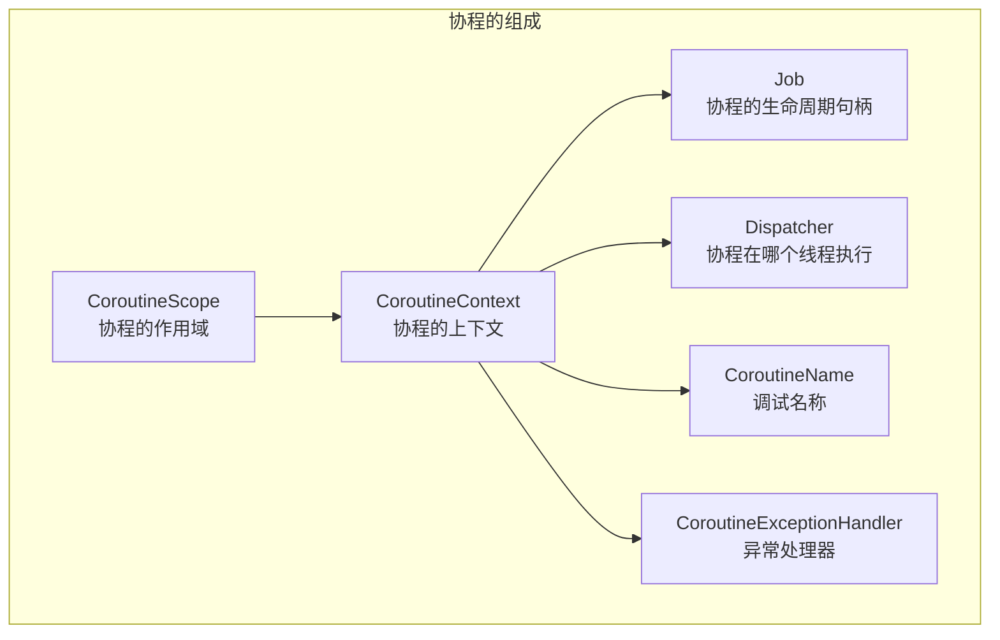
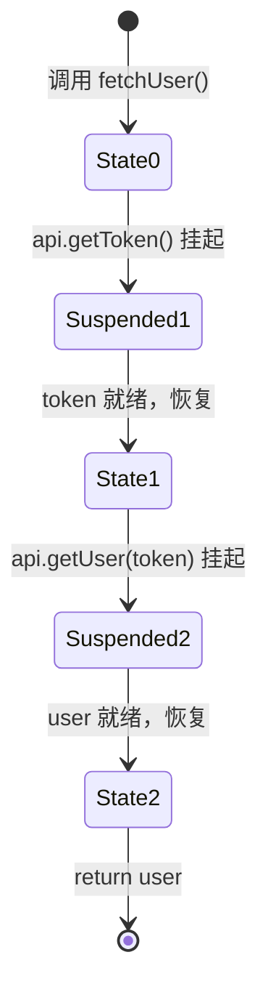
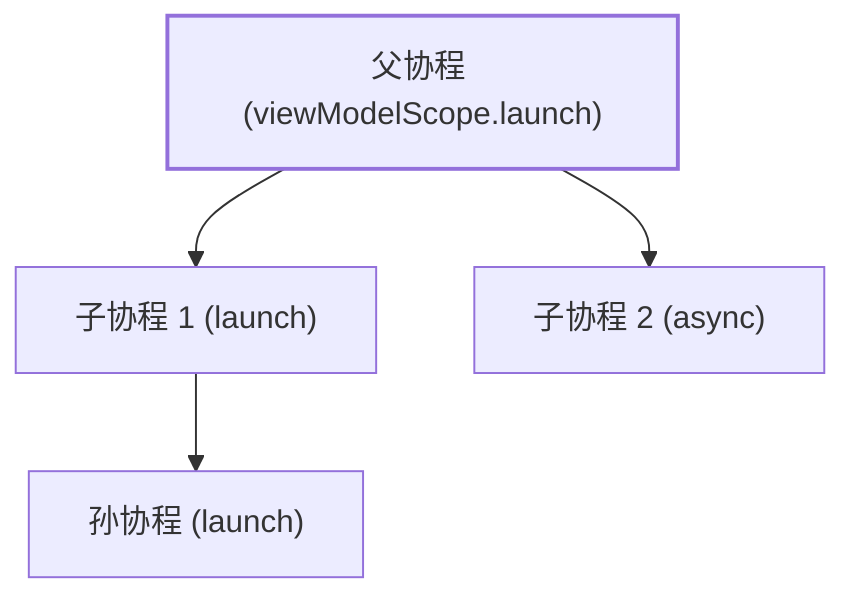
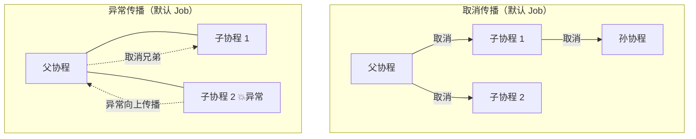
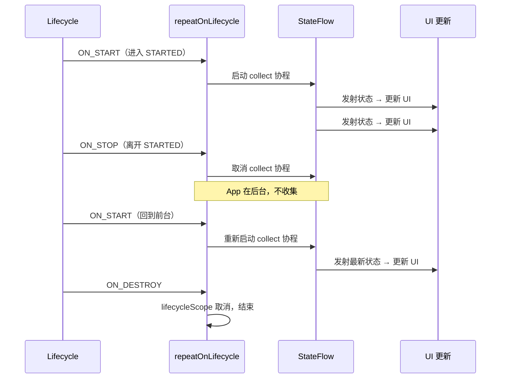
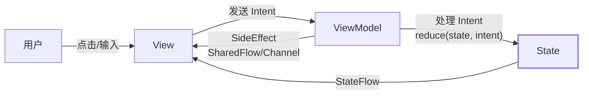
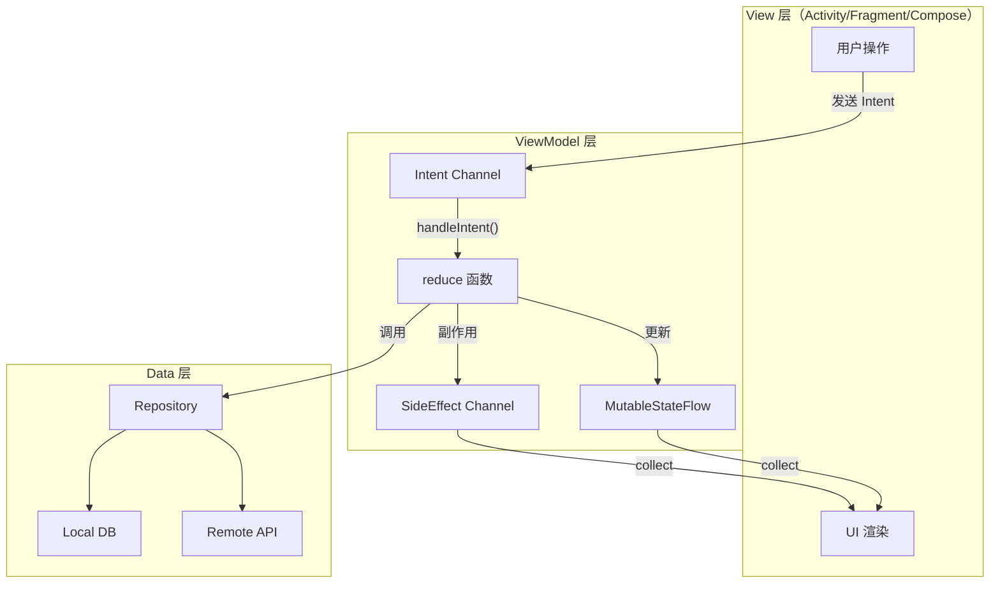

# Kotlin 协程与 Flow 深度解析

> 从原理到实战系统讲解 Kotlin 协程的挂起/恢复机制与状态机变换、Flow 冷热流设计、StateFlow/SharedFlow 的使用场景，以及如何结合 MVI 架构模式构建单向数据流的现代 Android 应用

---

## 1. 协程是什么、为什么需要它

### 1.1 一句话定义

**协程（Coroutine）是一种可以被挂起和恢复的计算实例，它运行在线程之上，但不与某个线程绑定。**

你可以把协程理解为"可以暂停的函数调用"——执行到某个耗时操作时主动让出线程（挂起），等结果回来后再在合适的线程上继续执行（恢复），整个过程对调用者来说就像同步代码。

### 1.2 为什么不能只用 Thread

传统 Android 异步编程的三大痛点：

**回调地狱**：嵌套层层回调，代码难以阅读和维护

```kotlin
// 回调地狱示例
api.getUser(userId, object : Callback<User> {
    override fun onSuccess(user: User) {
        api.getOrders(user.id, object : Callback<List<Order>> {
            override fun onSuccess(orders: List<Order>) {
                api.getOrderDetail(orders[0].id, object : Callback<OrderDetail> {
                    override fun onSuccess(detail: OrderDetail) {
                        runOnUiThread { showDetail(detail) }
                    }
                    override fun onError(e: Exception) { /* ... */ }
                })
            }
            override fun onError(e: Exception) { /* ... */ }
        })
    }
    override fun onError(e: Exception) { /* ... */ }
})
```

**协程的等价写法**：

```kotlin
// 顺序写法，没有嵌套
viewModelScope.launch {
    val user = api.getUser(userId)          // 挂起，不阻塞主线程
    val orders = api.getOrders(user.id)     // 挂起
    val detail = api.getOrderDetail(orders[0].id) // 挂起
    showDetail(detail)                       // 回到主线程更新 UI
}
```

### 1.3 与其他异步方案对比


| 方案            | 线程模型            | 取消支持                   | 结构化并发                        | 学习成本      | 当前状态        |
| ------------- | --------------- | ---------------------- | ---------------------------- | --------- | ----------- |
| **Thread**    | 1:1 系统线程，创建开销大  | 需手动 interrupt + 标志位    | 无                            | 低         | 基础原语        |
| **AsyncTask** | 内部线程池 + Handler | `cancel()` 不可靠         | 无                            | 低         | API 30 废弃   |
| **RxJava**    | Scheduler 调度    | `Disposable.dispose()` | 无（需手动管理 CompositeDisposable） | 高（操作符数百个） | 仍在使用，逐步被替代  |
| **Coroutine** | 调度到线程池/主线程      | 协作式取消，结构化传播            | 内建                           | 中         | Kotlin 官方推荐 |


### 1.4 协程的核心优势


| 优势           | 说明                                                          |
| ------------ | ----------------------------------------------------------- |
| **轻量**       | 一个线程上可运行数万协程，协程本身只占少量堆内存（续体对象），无系统线程创建开销                    |
| **主线程安全**    | `suspend` 函数可以从主线程调用，内部通过 `withContext` 切换到 IO 线程执行，完成后自动切回 |
| **结构化并发**    | 父协程取消时自动取消所有子协程，异常自动向上传播，不会产生泄漏的后台任务                        |
| **顺序表达并发逻辑** | 用顺序代码写异步逻辑，编译器自动生成状态机                                       |


---

## 2. 协程核心概念

### 2.1 四大基石




| 概念                   | 类型                         | 职责                      | 类比                       |
| -------------------- | -------------------------- | ----------------------- | ------------------------ |
| **CoroutineScope**   | 接口，持有 `CoroutineContext`   | 定义协程的生命范围，作用域销毁时取消所有子协程 | Activity/ViewModel 的生命周期 |
| **CoroutineContext** | 接口，类似 `Map<Key, Element>`  | 协程运行时的环境配置集合            | `Map` 容器                 |
| **Job**              | `CoroutineContext.Element` | 协程的生命周期句柄，可查状态、可取消      | `Future` / `Disposable`  |
| **Dispatcher**       | `CoroutineContext.Element` | 决定协程在哪个线程/线程池上执行        | `Scheduler`（RxJava）      |


### 2.2 CoroutineContext 的组合

`CoroutineContext` 使用 `+` 运算符组合，右侧覆盖左侧的同类型元素：

```kotlin
val context = Dispatchers.IO + CoroutineName("fetch") + SupervisorJob()
// 等价于一个包含三个 Element 的 Context
// 再加一个 Dispatcher 会覆盖之前的：
val newContext = context + Dispatchers.Main  // Dispatcher 变为 Main，其余不变
```

### 2.3 四种 Dispatcher


| Dispatcher               | 底层线程池                | 线程数               | 适用场景                      |
| ------------------------ | -------------------- | ----------------- | ------------------------- |
| `Dispatchers.Main`       | Android 主线程（Handler） | 1                 | UI 更新、轻量操作                |
| `Dispatchers.IO`         | 共享线程池                | 默认 max(64, CPU核数) | 网络请求、文件读写、数据库操作           |
| `Dispatchers.Default`    | 共享线程池                | CPU 核数            | CPU 密集计算（JSON 解析、排序、图片处理） |
| `Dispatchers.Unconfined` | 不切换线程，在当前线程恢复        | —                 | 测试、不关心线程的场景（慎用）           |


`Dispatchers.IO` 和 `Dispatchers.Default` 共享同一个线程池（`CommonPool`），但 IO 允许创建更多线程来应对阻塞调用。

### 2.4 suspend 函数与 CPS 变换

`suspend` 关键字标记的函数在编译时会被 Kotlin 编译器进行 **CPS（Continuation-Passing Style）变换**——在函数签名末尾插入一个 `Continuation` 参数，并将函数体转换为状态机。

```kotlin
// 源码
suspend fun fetchUser(id: String): User {
    val token = api.getToken()      // 挂起点 1
    val user = api.getUser(token)   // 挂起点 2
    return user
}

// 编译后的伪代码（简化）
fun fetchUser(id: String, cont: Continuation<User>): Any? {
    val sm = cont as? FetchUserSM ?: FetchUserSM(cont)
    when (sm.label) {
        0 -> {
            sm.label = 1
            val result = api.getToken(sm)          // 传入续体
            if (result == COROUTINE_SUSPENDED) return COROUTINE_SUSPENDED
        }
        1 -> {
            val token = sm.result as String
            sm.label = 2
            val result = api.getUser(token, sm)    // 传入续体
            if (result == COROUTINE_SUSPENDED) return COROUTINE_SUSPENDED
        }
        2 -> {
            return sm.result as User
        }
    }
}
```

### 2.5 状态机可视化




每个 `suspend` 调用是一个**挂起点**，编译器将函数体拆分为挂起点之间的代码块，用 `label` 标记当前状态，中间变量保存在状态机对象的字段中。

### 2.6 Continuation 接口

```kotlin
// kotlin-stdlib
public interface Continuation<in T> {
    public val context: CoroutineContext
    public fun resumeWith(result: Result<T>)
}
```

`Continuation` 就是"续体"——它持有协程的上下文和恢复回调。当异步操作完成时，调用 `resumeWith(Result.success(value))` 恢复协程执行。

### 2.7 协程构建器


| 构建器           | 返回值           | 异常传播            | 使用场景                      |
| ------------- | ------------- | --------------- | ------------------------- |
| `launch`      | `Job`         | 向父协程传播（非根协程）    | 不需要返回结果的异步任务（"发射后不管"）     |
| `async`       | `Deferred<T>` | 在 `await()` 时抛出 | 需要返回结果的并发任务               |
| `runBlocking` | `T`（阻塞当前线程）   | 直接抛出            | 测试、main 函数（Android 中不应使用） |
| `withContext` | `T`（挂起，不阻塞）   | 直接抛出            | 切换 Dispatcher 执行代码块       |


```kotlin
// launch：不需要结果
viewModelScope.launch {
    repository.syncData()
}

// async + await：并发请求，等待结果
viewModelScope.launch {
    val userDeferred = async { api.getUser(id) }
    val ordersDeferred = async { api.getOrders(id) }
    val user = userDeferred.await()
    val orders = ordersDeferred.await()
    updateUI(user, orders)
}

// withContext：切换线程执行
suspend fun readFile(): String = withContext(Dispatchers.IO) {
    File("data.txt").readText()
}
```

---

## 3. 结构化并发

### 3.1 核心原则

结构化并发的核心思想：**每个协程都有一个明确的父级，父级负责管理子级的生命周期**。这与结构化编程中"每个代码块都有明确的入口和出口"的理念一致。

三条规则：

1. **子协程继承父协程的 Context**（除非显式覆盖）
2. **父协程会等待所有子协程完成后才完成**
3. **父协程取消时，所有子协程自动取消；子协程异常时，父协程和兄弟协程也被取消**

### 3.2 父子协程关系




```kotlin
viewModelScope.launch {           // 父协程
    launch {                      // 子协程 1
        launch {                  // 孙协程
            delay(1000)
        }
    }
    val result = async {          // 子协程 2
        api.fetchData()
    }
    // 父协程会等待子协程 1、子协程 2、孙协程全部完成
}
```

### 3.3 取消传播




**默认行为（Job）**：任何一个子协程异常 → 取消父协程 → 取消所有兄弟协程。这种"一损俱损"的行为在很多场景下过于激进。

### 3.4 supervisorScope 与 SupervisorJob

`SupervisorJob` 改变异常传播策略：**子协程的异常不会传播到父级和兄弟协程**。

```kotlin
// supervisorScope：子协程的异常不影响兄弟
viewModelScope.launch {
    supervisorScope {
        launch {
            throw RuntimeException("子协程 1 崩了")
            // 只有子协程 1 自己取消，子协程 2 不受影响
        }
        launch {
            delay(1000)
            println("子协程 2 正常完成")
        }
    }
}
```


| 作用域               | 异常传播              | 适用场景                  |
| ----------------- | ----------------- | --------------------- |
| `coroutineScope`  | 任一子协程异常 → 取消所有子协程 | 多个任务必须全部成功（如事务性操作）    |
| `supervisorScope` | 子协程异常互不影响         | 多个独立任务（如同时加载多个 UI 区块） |


### 3.5 Android 中的 CoroutineScope


| Scope                      | 来源                                           | 绑定的生命周期                   | 底层 Dispatcher                |
| -------------------------- | -------------------------------------------- | ------------------------- | ---------------------------- |
| `viewModelScope`           | `androidx.lifecycle:lifecycle-viewmodel-ktx` | ViewModel.onCleared() 时取消 | `Dispatchers.Main.immediate` |
| `lifecycleScope`           | `androidx.lifecycle:lifecycle-runtime-ktx`   | Lifecycle DESTROYED 时取消   | `Dispatchers.Main.immediate` |
| `rememberCoroutineScope()` | Compose                                      | Composition 离开时取消         | `Dispatchers.Main`           |
| `GlobalScope`              | `kotlinx.coroutines`                         | 无绑定，永不自动取消                | `Dispatchers.Default`        |


**永远不要在 Android 中使用 `GlobalScope`**——它没有结构化并发保障，协程泄漏后无法自动取消。

### 3.6 viewModelScope 实现原理

```kotlin
// lifecycle-viewmodel-ktx 源码（简化）
public val ViewModel.viewModelScope: CoroutineScope
    get() {
        val scope = getTag<CloseableCoroutineScope>(JOB_KEY)
        if (scope != null) return scope
        return setTagIfAbsent(JOB_KEY,
            CloseableCoroutineScope(
                SupervisorJob() + Dispatchers.Main.immediate
            ))
    }

// ViewModel.clear() 时调用 scope.close() → 取消 SupervisorJob → 取消所有子协程
```

关键设计：

- 使用 `SupervisorJob()`：ViewModel 中的多个协程互不干扰
- 使用 `Dispatchers.Main.immediate`：如果已在主线程则不需要 dispatch，减少一次消息队列排队

---

## 4. 协程异常处理

### 4.1 launch vs async 的异常行为差异


| 构建器      | 异常传播时机                                 | 异常去向                                                                          |
| -------- | -------------------------------------- | ----------------------------------------------------------------------------- |
| `launch` | 协程体内异常**立即传播**到父级                      | 通过 Job 层级向上传播，最终到 CoroutineExceptionHandler 或 Thread.uncaughtExceptionHandler |
| `async`  | 异常被**封装在 Deferred 中**，调用 `await()` 时抛出 | 仍会向父级传播（如果 Deferred 未被 await）                                                 |


```kotlin
// launch 的异常直接传播
viewModelScope.launch {
    throw RuntimeException("boom")
    // 异常传播到 viewModelScope 的 CoroutineExceptionHandler
}

// async 的异常延迟到 await
viewModelScope.launch {
    val deferred = async {
        throw RuntimeException("boom")
    }
    // 即使不调用 await()，异常仍会传播到父级
    // 调用 deferred.await() 时会重新抛出
}
```

### 4.2 CoroutineExceptionHandler

`CoroutineExceptionHandler` 是"最后的安全网"，只能安装在**根协程**上：

```kotlin
val handler = CoroutineExceptionHandler { _, exception ->
    Log.e("Coroutine", "未捕获异常: ${exception.message}")
    // 上报 Crashlytics 等
}

viewModelScope.launch(handler) {
    launch {
        throw RuntimeException("boom")
        // 异常向上传播到根协程，被 handler 捕获
    }
}
```

### 4.3 try-catch 使用规则

```kotlin
// 正确：在协程体内用 try-catch 包裹 suspend 调用
viewModelScope.launch {
    try {
        val user = api.getUser(id)  // 可能抛异常
        _state.value = UiState.Success(user)
    } catch (e: Exception) {
        _state.value = UiState.Error(e.message)
    }
}

// 错误：try-catch 无法捕获 launch 内部的异常
try {
    viewModelScope.launch {
        throw RuntimeException("boom")
    }
} catch (e: Exception) {
    // 永远不会执行到这里！
    // launch 是异步的，异常在协程内部传播
}
```

### 4.4 异常处理最佳实践


| 场景                    | 推荐方案                                  | 说明              |
| --------------------- | ------------------------------------- | --------------- |
| 单次网络请求                | `try-catch` 在协程体内                     | 最直观，错误可转为 UI 状态 |
| 多个独立请求                | `supervisorScope` + 每个子协程 `try-catch` | 互不干扰            |
| 全局兜底                  | 根协程安装 `CoroutineExceptionHandler`     | 防止未处理异常导致崩溃     |
| Flow 收集               | `catch` 操作符                           | 详见第 5 章         |
| CancellationException | **不要捕获**（或捕获后重新抛出）                    | 这是协程取消的正常信号     |


### 4.5 CancellationException 是特殊的

协程被取消时抛出 `CancellationException`，这是**正常行为**而非错误。如果你 catch 了所有 Exception 却没有重新抛出 `CancellationException`，会导致取消机制失效：

```kotlin
// 危险：吞掉了 CancellationException
try {
    delay(1000)
} catch (e: Exception) {
    // CancellationException 也被捕获，协程无法正常取消
    Log.e("TAG", "error", e)
}

// 安全写法
try {
    delay(1000)
} catch (e: CancellationException) {
    throw e  // 重新抛出，让取消正常传播
} catch (e: Exception) {
    Log.e("TAG", "error", e)
}

// 更简洁：使用 runCatching 的协程安全版本
suspend fun <T> safeCatch(block: suspend () -> T): Result<T> {
    return try {
        Result.success(block())
    } catch (e: CancellationException) {
        throw e
    } catch (e: Exception) {
        Result.failure(e)
    }
}
```

---

## 5. Flow 基础：冷流

### 5.1 什么是 Flow

**Flow 是 Kotlin 协程中用于处理异步数据流的 API，概念上类似 RxJava 的 Observable，但更轻量且与协程深度集成。**

核心特征是**冷流（Cold Stream）**：只有在有收集者（collector）时才开始执行，每个收集者都会触发独立的执行。

```kotlin
// 类比：冷流像点播视频，每次打开都从头播放
val flow = flow {
    println("Flow 开始")
    emit(1)
    delay(100)
    emit(2)
    delay(100)
    emit(3)
}

// 第一个收集者：触发一次独立执行
flow.collect { println("收集者A: $it") }
// 第二个收集者：再触发一次完整执行
flow.collect { println("收集者B: $it") }
```

### 5.2 Flow vs 其他异步数据模式


| 模式   | 单值/多值 | 同步/异步 | Kotlin 对应                      |
| ---- | ----- | ----- | ------------------------------ |
| 单值同步 | 单值    | 同步    | `fun getValue(): T`            |
| 单值异步 | 单值    | 异步    | `suspend fun getValue(): T`    |
| 多值同步 | 多值    | 同步    | `fun getValues(): Sequence<T>` |
| 多值异步 | 多值    | 异步    | `fun getValues(): Flow<T>`     |


### 5.3 Flow Builder


| Builder            | 说明                          | 示例                          |
| ------------------ | --------------------------- | --------------------------- |
| `flow { }`         | 通用构建器，在 lambda 中调用 `emit()` | `flow { emit(1); emit(2) }` |
| `flowOf(vararg)`   | 从固定值创建                      | `flowOf(1, 2, 3)`           |
| `asFlow()`         | 从集合/序列/范围转换                 | `(1..3).asFlow()`           |
| `callbackFlow { }` | 封装基于回调的 API                 | 监听器、第三方 SDK 回调              |
| `channelFlow { }`  | 允许在不同协程中 `send()`           | 需要并发发射时                     |


### 5.4 常用操作符

**转换操作符**：


| 操作符                 | 说明                  | RxJava 对应        |
| ------------------- | ------------------- | ---------------- |
| `map { }`           | 一对一转换               | `map()`          |
| `filter { }`        | 过滤                  | `filter()`       |
| `transform { }`     | 自定义转换，可 emit 0~N 个值 | `flatMap()` 的灵活版 |
| `flatMapConcat { }` | 按顺序展开内部 Flow        | `concatMap()`    |
| `flatMapMerge { }`  | 并发展开内部 Flow         | `flatMap()`      |
| `flatMapLatest { }` | 新值到来时取消旧的内部 Flow    | `switchMap()`    |


**功能操作符**：


| 操作符                       | 说明                               |
| ------------------------- | -------------------------------- |
| `onEach { }`              | 每个值发射时执行副作用（不修改值）                |
| `onStart { }`             | 收集开始前执行                          |
| `onCompletion { }`        | 收集完成或异常时执行                       |
| `catch { }`               | 捕获上游异常（不捕获下游）                    |
| `flowOn(dispatcher)`      | 改变**上游**的执行线程                    |
| `debounce(ms)`            | 防抖，指定时间内只取最后一个值                  |
| `distinctUntilChanged()`  | 去重，连续相同值只发射一次                    |
| `combine(other) { }`      | 合并两个 Flow，任一发射时组合最新值             |
| `zip(other) { }`          | 配对合并，等两个 Flow 都发射后组合             |
| `stateIn()` / `shareIn()` | 将冷流转为 StateFlow / SharedFlow（热流） |


### 5.5 flowOn 的线程切换

`flowOn` 改变的是**上游**（它之前的操作符）的执行线程，不影响下游：

```kotlin
flow {
    // 运行在 IO 线程
    emit(readFromDisk())
}
.map { data ->
    // 运行在 IO 线程（flowOn 上游）
    parseJson(data)
}
.flowOn(Dispatchers.IO)       // 分界线：以上在 IO
.filter { it.isValid }        // 运行在 collect 所在线程
.collect { data ->
    // 运行在 collect 所在线程（通常是 Main）
    updateUI(data)
}
```

### 5.6 Flow 异常处理

```kotlin
flow {
    emit(1)
    throw RuntimeException("上游异常")
    emit(2)  // 不会执行
}
.catch { e ->
    // 捕获上游异常，可以发射兜底值
    emit(-1)
}
.onCompletion { cause ->
    // 无论正常完成还是异常都会执行
    // cause != null 表示异常完成
    if (cause != null) Log.e("Flow", "异常完成", cause)
}
.collect { value ->
    println(value)  // 输出 1, -1
}
```

`catch` 只捕获**上游**的异常。如果 `collect` 中抛出异常，`catch` 无法捕获。要处理下游异常，需要在 `collect` 内部 try-catch 或将逻辑移到 `onEach` 中：

```kotlin
// 安全模式：用 onEach + catch 替代在 collect 中处理
flow
    .onEach { value -> updateUI(value) }     // 逻辑移到这里
    .catch { e -> showError(e) }             // 现在能捕获 onEach 的异常
    .collect()                                // 空 collect，仅触发收集
```

### 5.7 背压处理

Flow 天然支持背压——`emit` 是 `suspend` 函数，当下游处理慢时，`emit` 会自动挂起等待：

```kotlin
flow {
    repeat(100) {
        emit(it)  // 如果下游处理慢，这里会挂起等待
    }
}
.buffer()                    // 添加缓冲区，允许上游先行发射
.conflate()                  // 合并：下游处理慢时只保留最新值
.collectLatest { value ->    // 收集最新：新值到来时取消旧的处理
    heavyProcess(value)
}
```


| 策略     | 操作符             | 行为        | 适用场景           |
| ------ | --------------- | --------- | -------------- |
| 默认（挂起） | 无               | 上游等待下游    | 每个值都必须处理       |
| 缓冲     | `buffer()`      | 上游先发射到缓冲区 | 上下游速度差异不大      |
| 合并     | `conflate()`    | 下游忙时丢弃中间值 | UI 更新（只关心最新状态） |
| 收集最新   | `collectLatest` | 新值来时取消旧处理 | 搜索输入（只处理最新查询）  |


---

## 6. StateFlow 与 SharedFlow：热流

### 6.1 冷流 vs 热流


| 特征   | 冷流（Flow）    | 热流（StateFlow / SharedFlow）            |
| ---- | ----------- | ------------------------------------- |
| 执行时机 | 有收集者才执行     | 没有收集者也可以产生数据                          |
| 独立性  | 每个收集者触发独立执行 | 多个收集者共享同一个数据源                         |
| 历史数据 | 每次从头开始      | StateFlow 保留最新值；SharedFlow 可配置 replay |
| 类比   | 点播视频        | 直播 / 电台                               |


### 6.2 StateFlow：状态容器

**StateFlow 是一个始终持有当前值的热流，新收集者立即收到最新状态，且自动去重（`distinctUntilChanged`）。**

```kotlin
class UserViewModel : ViewModel() {
    // 内部可变
    private val _uiState = MutableStateFlow(UserUiState())
    // 对外只读
    val uiState: StateFlow<UserUiState> = _uiState.asStateFlow()

    fun loadUser(id: String) {
        viewModelScope.launch {
            _uiState.value = _uiState.value.copy(isLoading = true)
            try {
                val user = repository.getUser(id)
                _uiState.value = _uiState.value.copy(
                    isLoading = false,
                    user = user
                )
            } catch (e: Exception) {
                _uiState.value = _uiState.value.copy(
                    isLoading = false,
                    error = e.message
                )
            }
        }
    }
}

data class UserUiState(
    val isLoading: Boolean = false,
    val user: User? = null,
    val error: String? = null
)
```

StateFlow 的关键特性：


| 特性     | 说明                                         |
| ------ | ------------------------------------------ |
| 必须有初始值 | 构造时必须传入 `initialValue`                     |
| 自动去重   | 连续 emit 相同值（`equals` 判断）不会通知收集者            |
| 始终有值   | `.value` 属性可随时同步读取                         |
| 不会完成   | StateFlow 永不调用 `onCompletion`（除非 scope 取消） |
| 线程安全   | 内部使用 CAS 操作更新值                             |


### 6.3 SharedFlow：事件广播

**SharedFlow 是一个可配置 replay 缓存的热流，适合发射"一次性事件"（如 Toast、导航、Snackbar）。**

```kotlin
class UserViewModel : ViewModel() {
    // replay = 0 表示不缓存，新收集者不会收到旧事件
    private val _events = MutableSharedFlow<UiEvent>()
    val events: SharedFlow<UiEvent> = _events.asSharedFlow()

    fun onDeleteClicked() {
        viewModelScope.launch {
            repository.deleteUser()
            _events.emit(UiEvent.ShowToast("删除成功"))
            _events.emit(UiEvent.NavigateBack)
        }
    }
}

sealed class UiEvent {
    data class ShowToast(val message: String) : UiEvent()
    data object NavigateBack : UiEvent()
}
```

SharedFlow 构造参数：


| 参数                    | 默认值       | 说明                                                    |
| --------------------- | --------- | ----------------------------------------------------- |
| `replay`              | 0         | 新收集者能收到的历史值数量                                         |
| `extraBufferCapacity` | 0         | 额外的缓冲容量（`replay + extra` = 总缓冲区大小）                    |
| `onBufferOverflow`    | `SUSPEND` | 缓冲区满时的策略：`SUSPEND`（挂起）/ `DROP_OLDEST` / `DROP_LATEST` |


### 6.4 StateFlow vs SharedFlow vs LiveData


| 维度        | StateFlow                  | SharedFlow | LiveData                         |
| --------- | -------------------------- | ---------- | -------------------------------- |
| 必须初始值     | 是                          | 否          | 否（`MutableLiveData()` 可不传）       |
| 去重        | 是（`distinctUntilChanged`）  | 否          | 否                                |
| 生命周期感知    | 否（需配合 `repeatOnLifecycle`） | 否          | 是（内建）                            |
| 线程安全      | 是                          | 是          | `postValue` 线程安全，`setValue` 仅主线程 |
| Kotlin 优先 | 是                          | 是          | 也支持 Java                         |
| replay    | 固定 1                       | 可配置 0~N    | 固定 1（粘性事件）                       |
| 适用场景      | UI 状态                      | 一次性事件      | 传统 MVVM UI 状态                    |


**迁移建议**：新项目用 `StateFlow` 替代 `LiveData` 管理 UI 状态，用 `SharedFlow`（replay=0）或 `Channel` 替代 `SingleLiveEvent` 发送一次性事件。

### 6.5 Channel vs SharedFlow 发送一次性事件


| 维度    | Channel             | SharedFlow(replay=0)    |
| ----- | ------------------- | ----------------------- |
| 消费模式  | 每个事件只被一个消费者处理       | 每个事件被所有收集者处理            |
| 无收集者时 | 事件缓存在 Channel 中等待消费 | 事件丢失（无收集者时 emit 会挂起或丢弃） |
| 适用场景  | 导航事件、一次性操作          | 需要多个观察者的事件              |


```kotlin
// Channel 方式（推荐用于一次性事件）
private val _events = Channel<UiEvent>(Channel.BUFFERED)
val events = _events.receiveAsFlow()  // 转为 Flow 供 View 层收集
```

---

## 7. Flow 生命周期感知收集

### 7.1 问题：为什么不能直接 collect

```kotlin
// 危险写法：App 进入后台后 Flow 仍在收集，浪费资源
lifecycleScope.launch {
    viewModel.uiState.collect { state ->
        updateUI(state)
    }
}
```

`lifecycleScope.launch` 启动的协程直到 `DESTROYED` 才取消。这意味着即使 Activity 进入后台（`STOPPED`），Flow 仍在被收集——持续接收位置更新、网络数据等，浪费电量和资源。

### 7.2 repeatOnLifecycle：正确姿势

```kotlin
lifecycleScope.launch {
    repeatOnLifecycle(Lifecycle.State.STARTED) {
        // 进入 STARTED 时启动收集
        // 进入 STOPPED 时自动取消
        // 重新进入 STARTED 时重新启动
        viewModel.uiState.collect { state ->
            updateUI(state)
        }
    }
}
```

### 7.3 收集流程时序




### 7.4 多个 Flow 并行收集

```kotlin
lifecycleScope.launch {
    repeatOnLifecycle(Lifecycle.State.STARTED) {
        // 在 repeatOnLifecycle 内部启动多个协程并行收集
        launch {
            viewModel.uiState.collect { updateMainUI(it) }
        }
        launch {
            viewModel.events.collect { handleEvent(it) }
        }
    }
}
```

### 7.5 flowWithLifecycle：单 Flow 便捷写法

```kotlin
// 等价于 repeatOnLifecycle 中只收集一个 Flow
lifecycleScope.launch {
    viewModel.uiState
        .flowWithLifecycle(lifecycle, Lifecycle.State.STARTED)
        .collect { state ->
            updateUI(state)
        }
}
```

### 7.6 收集方式对比


| 方式                                  | 生命周期感知               | 多 Flow 支持      | 推荐程度        |
| ----------------------------------- | -------------------- | -------------- | ----------- |
| `lifecycleScope.launch { collect }` | 仅 DESTROYED 取消       | 是              | 不推荐（后台浪费资源） |
| `repeatOnLifecycle { collect }`     | STARTED/STOPPED 自动启停 | 是（内部多个 launch） | 推荐          |
| `flowWithLifecycle().collect`       | STARTED/STOPPED 自动启停 | 否（单 Flow）      | 单 Flow 时推荐  |
| `LiveData.observe()`                | 内建 STARTED 感知        | 否              | 传统方案        |


---

## 8. MVI 架构模式

### 8.1 什么是 MVI

**MVI（Model-View-Intent）是一种基于单向数据流的 UI 架构模式**，强调：

- **唯一可信数据源**：UI 状态来自单一的 State 对象
- **单向数据流**：用户操作 → Intent → 状态变换 → 新 State → UI 渲染
- **不可变状态**：State 是 `data class`，每次变化都是新对象

### 8.2 MVI 三要素


| 要素                  | 角色                        | Kotlin 表达                               |
| ------------------- | ------------------------- | --------------------------------------- |
| **Intent**（用户意图）    | 用户操作的抽象，如点击、输入、刷新         | `sealed class`/`sealed interface`       |
| **State**（UI 状态）    | 描述 UI 当前应该呈现的完整状态         | `data class`（不可变）                       |
| **SideEffect**（副作用） | 一次性事件，如 Toast、导航、Snackbar | `sealed class` + `SharedFlow`/`Channel` |


### 8.3 MVI 数据流




**完整数据流**：

1. **用户操作** → View 捕获（点击、滑动、输入）
2. **View 发送 Intent** → ViewModel 接收
3. **ViewModel 处理 Intent** → 调用 Repository / UseCase
4. **生成新 State** → 通过 reduce 函数合并
5. **StateFlow 发射新 State** → View 自动渲染
6. **一次性事件** → 通过 SideEffect 通道单独发送

### 8.4 MVI vs MVP vs MVVM


| 维度     | MVP                  | MVVM                                 | MVI                                  |
| ------ | -------------------- | ------------------------------------ | ------------------------------------ |
| 数据流向   | 双向（View ↔ Presenter） | 双向（View ↔ ViewModel via DataBinding） | **单向**（View → Intent → State → View） |
| 状态管理   | 分散在 Presenter 中      | 分散在多个 LiveData/StateFlow 中           | **集中在单个 State**                      |
| UI 一致性 | 容易出现状态不同步            | 多个 LiveData 可能不同步                    | **State 是唯一可信源**，不会不同步               |
| 可测试性   | 中（需 mock View 接口）    | 中                                    | **高**（reduce 是纯函数）                   |
| 复杂度    | 低                    | 中                                    | 中偏高（多一层 Intent 抽象）                   |
| 适用场景   | 简单页面                 | 大多数场景                                | 复杂交互、状态多变的页面                         |


### 8.5 为什么选择 MVI

1. **状态一致性**：整个页面的 UI 由一个 `data class` 描述，不存在"加载中 + 错误信息 + 数据列表"三个变量各自为战的问题
2. **可预测性**：`newState = reduce(currentState, intent)` 是纯函数，给定相同的输入必定产生相同的输出
3. **时间旅行调试**：记录所有 State 变化序列，可以回放任意时刻的 UI 状态
4. **与 Compose 天然契合**：Compose 的 `State` → UI 重组模型与 MVI 的 State → Render 完全一致

### 8.6 MVI + Coroutine + Flow 架构




---

## 9. 协程在 Android 中的最佳实践

### 9.1 Repository 层：withContext 保证主线程安全

Repository 暴露的 `suspend` 函数应该保证**主线程安全**——调用者无需关心线程切换：

```kotlin
class UserRepository(
    private val api: UserApi,
    private val dao: UserDao,
    private val ioDispatcher: CoroutineDispatcher = Dispatchers.IO
) {
    // 调用者可以从主线程直接调用，内部自行切换线程
    suspend fun getUser(id: String): User = withContext(ioDispatcher) {
        val cached = dao.getUserById(id)
        if (cached != null) return@withContext cached

        val user = api.fetchUser(id)
        dao.insertUser(user)
        return@withContext user
    }
}
```

### 9.2 不暴露 Mutable 类型

```kotlin
// 正确：对外暴露只读类型
class MyViewModel : ViewModel() {
    private val _state = MutableStateFlow(UiState())
    val state: StateFlow<UiState> = _state.asStateFlow()

    private val _events = MutableSharedFlow<Event>()
    val events: SharedFlow<Event> = _events.asSharedFlow()
}

// 错误：暴露 MutableStateFlow，View 层可以随意修改
class BadViewModel : ViewModel() {
    val state = MutableStateFlow(UiState())  // View 层可以直接 state.value = ...
}
```

### 9.3 stateIn / shareIn：冷流转热流

当 Repository 返回 `Flow`（冷流）时，ViewModel 需要将其转为热流以供 View 层收集：

```kotlin
class MyViewModel(repository: MyRepository) : ViewModel() {

    val uiState: StateFlow<UiState> = repository.observeData()
        .map { data -> UiState.Success(data) }
        .stateIn(
            scope = viewModelScope,
            started = SharingStarted.WhileSubscribed(5_000), // 5秒无订阅者停止
            initialValue = UiState.Loading
        )
}
```

`SharingStarted` 策略：


| 策略                             | 行为                              | 适用场景                    |
| ------------------------------ | ------------------------------- | ----------------------- |
| `Eagerly`                      | scope 启动时立即开始，永不停止              | 始终需要的数据（如登录状态）          |
| `Lazily`                       | 首个收集者出现时开始，永不停止                 | 延迟初始化但需持续的数据            |
| `WhileSubscribed(stopTimeout)` | 最后一个收集者消失后等 `stopTimeout` 毫秒再停止 | UI 状态（推荐 5000ms，覆盖屏幕旋转） |


`**WhileSubscribed(5_000)` 的 5 秒设计**：屏幕旋转时 Activity 销毁重建，中间大约 1-2 秒没有收集者。设置 5 秒超时避免在旋转期间重新执行上游 Flow（如数据库查询）。

### 9.4 取消安全

协程的取消是**协作式**的——`suspend` 函数需要在挂起点检查取消状态：

```kotlin
// kotlinx.coroutines 的 suspend 函数（delay、withContext 等）天然支持取消
// 自定义 suspend 函数中的密集计算需要手动检查
suspend fun processItems(items: List<Item>) {
    items.forEach { item ->
        ensureActive()  // 检查是否已取消，已取消则抛出 CancellationException
        heavyComputation(item)
    }
}

// 或使用 yield()
suspend fun processItems(items: List<Item>) {
    items.forEach { item ->
        yield()  // 让出执行权并检查取消
        heavyComputation(item)
    }
}
```

### 9.5 测试中的协程

```kotlin
// 使用 kotlinx-coroutines-test
@OptIn(ExperimentalCoroutinesApi::class)
class UserViewModelTest {

    @get:Rule
    val mainDispatcherRule = MainDispatcherRule()  // 替换 Main dispatcher

    @Test
    fun `loadUsers should update state`() = runTest {
        val repository = FakeUserRepository()
        val viewModel = UserListViewModel(repository)

        viewModel.handleIntent(UserListContract.Intent.LoadUsers)
        advanceUntilIdle()  // 等待所有协程完成

        val state = viewModel.state.value
        assertFalse(state.isLoading)
        assertTrue(state.users.isNotEmpty())
        assertNull(state.error)
    }
}

// MainDispatcherRule：替换 Dispatchers.Main 为 TestDispatcher
class MainDispatcherRule(
    private val dispatcher: TestDispatcher = UnconfinedTestDispatcher()
) : TestWatcher() {
    override fun starting(description: Description) {
        Dispatchers.setMain(dispatcher)
    }
    override fun finished(description: Description) {
        Dispatchers.resetMain()
    }
}
```

### 9.6 常见反模式


| 反模式                                        | 问题                 | 正确做法                                    |
| ------------------------------------------ | ------------------ | --------------------------------------- |
| 使用 `GlobalScope.launch`                    | 无结构化并发，协程可能泄漏      | 使用 `viewModelScope` / `lifecycleScope`  |
| 在 `lifecycleScope.launch` 中直接 `collect`    | 后台仍在收集，浪费资源        | 使用 `repeatOnLifecycle`                  |
| 在 ViewModel 中使用 `Dispatchers.IO` 直接 launch | ViewModel 不应知道线程细节 | Repository 层用 `withContext(IO)`         |
| catch 吞掉 `CancellationException`           | 取消机制失效             | catch 后 rethrow `CancellationException` |
| 暴露 `MutableStateFlow`                      | View 层可能意外修改状态     | 对外暴露 `StateFlow`（只读）                    |
| `runBlocking` 在主线程                         | 阻塞主线程导致 ANR        | 永远不要在 Android 主线程用 `runBlocking`        |


---

## 10. 面试高频问题

### Q1：协程和线程有什么区别？

协程是运行在线程之上的轻量级任务单元。线程是操作系统级别的资源，创建开销大（~1MB 栈内存），上下文切换昂贵；协程只占少量堆内存（续体对象），切换是在用户空间完成的函数调用，一个线程上可以运行数万协程。协程通过 Dispatcher 调度到线程执行，可以在挂起点切换线程而不阻塞原线程。

### Q2：suspend 函数的原理是什么？

Kotlin 编译器对 `suspend` 函数进行 CPS（Continuation-Passing Style）变换：在函数签名末尾添加一个 `Continuation` 参数，将函数体转换为状态机。每个挂起点是一个状态（`label`），中间变量保存在状态机对象的字段中。函数返回 `COROUTINE_SUSPENDED` 时表示真正挂起，异步操作完成后通过 `Continuation.resumeWith()` 恢复执行。

### Q3：协程的取消是怎么实现的？

协程的取消是**协作式**的。调用 `job.cancel()` 会将 Job 标记为取消状态，但协程不会立即停止。协程需要在挂起点检查取消状态：`kotlinx.coroutines` 库的所有挂起函数（`delay`、`withContext`、`yield` 等）都会检查取消。密集计算的循环中需要手动调用 `ensureActive()` 或 `yield()`。取消时抛出 `CancellationException`，这是正常信号不应被捕获。

### Q4：coroutineScope 和 supervisorScope 有什么区别？

`coroutineScope` 是"一损俱损"——任一子协程异常会取消所有兄弟协程和自身。`supervisorScope` 是"各管各的"——子协程的异常不会传播到父级和兄弟。`viewModelScope` 内部使用 `SupervisorJob`，所以 ViewModel 中多个并行的 `launch` 互不影响。选择依据：如果多个任务必须全部成功用 `coroutineScope`；如果是独立任务用 `supervisorScope`。

### Q5：Flow 的冷流和热流有什么区别？

冷流（`flow {}`）：只有收集时才执行，每个收集者触发独立的执行，没有收集者时不消耗资源。热流（`StateFlow`/`SharedFlow`）：没有收集者也可以持有/发射数据，多个收集者共享同一个数据源。StateFlow 始终持有最新值且自动去重，适合 UI 状态；SharedFlow 可配置 replay，适合事件。

### Q6：StateFlow 和 LiveData 有什么区别？为什么推荐 StateFlow？

两者都可以持有 UI 状态。StateFlow 的优势：(1) 纯 Kotlin，不依赖 Android Framework，ViewModel 单元测试更方便；(2) 自带 `distinctUntilChanged`，避免重复渲染；(3) 支持 Flow 操作符链式转换；(4) 无粘性事件问题（LiveData 的 observe 会重放最新值，StateFlow 配合 `repeatOnLifecycle` 行为更可预测）。劣势是需要手动配合 `repeatOnLifecycle` 实现生命周期感知，LiveData 内建此能力。

### Q7：为什么不能直接在 lifecycleScope.launch 中 collect Flow？

`lifecycleScope.launch` 启动的协程在 `DESTROYED` 时才取消。如果 Activity 进入后台（`STOPPED`），Flow 仍在被收集，持续消耗资源。正确做法是使用 `repeatOnLifecycle(Lifecycle.State.STARTED)`，它会在进入 `STARTED` 时启动收集协程，在 `STOPPED` 时取消，在重新进入 `STARTED` 时重新启动。

### Q8：MVI 中的 Intent、State、SideEffect 分别是什么？

**Intent** 是用户操作的抽象（点击、输入、刷新），用 `sealed class/interface` 定义。**State** 是页面 UI 的完整快照，用不可变 `data class` 定义，通过 `StateFlow` 持有。**SideEffect** 是一次性事件（Toast、导航、Snackbar），不属于持久 UI 状态，通过 `Channel` 或 `SharedFlow(replay=0)` 发送。

### Q9：MVI 相比 MVVM 的优势是什么？

MVI 将整个页面的 UI 状态集中到单个 `State` 对象中，不会出现 MVVM 中多个 LiveData/StateFlow 状态不同步的问题。状态变换通过 reduce 纯函数完成，可预测、可测试、可追踪。缺点是有额外的 Intent 抽象层，简单页面可能 over-engineering。推荐在状态复杂、交互多变的页面使用 MVI，简单页面用 MVVM 足够。

### Q10：如何处理搜索输入的防抖？用协程和 Flow 怎么实现？

```kotlin
// 在 ViewModel 中
private val searchQuery = MutableStateFlow("")

val searchResults: StateFlow<List<User>> = searchQuery
    .debounce(300)                    // 300ms 防抖
    .distinctUntilChanged()            // 去重
    .filter { it.isNotBlank() }        // 过滤空输入
    .flatMapLatest { query ->          // 新查询取消旧请求
        flow { emit(repository.searchUsers(query)) }
    }
    .stateIn(viewModelScope, SharingStarted.WhileSubscribed(5_000), emptyList())

fun onSearchQueryChanged(query: String) {
    searchQuery.value = query
}
```

`debounce` 等待用户停止输入 300ms 后才发射；`distinctUntilChanged` 避免重复查询；`flatMapLatest` 确保只处理最新查询，旧请求自动取消。

### Q11：stateIn 的 WhileSubscribed(5000) 为什么用 5 秒？

屏幕旋转时 Activity 销毁重建，中间约 1-2 秒没有收集者。设置 5 秒超时可以覆盖这个间隙，避免在旋转期间停止上游 Flow（如数据库监听），从而不需要重新查询。如果超时设为 0，每次旋转都会触发重新加载。5 秒是 Google 推荐的默认值，足够覆盖大多数配置变更场景。

### Q12：Dispatchers.IO 和 Dispatchers.Default 的区别？什么时候用哪个？

两者共享同一个底层线程池，但 `Default` 的线程数限制为 CPU 核数（适合 CPU 密集型计算），`IO` 允许创建更多线程（默认 max(64, CPU核数)）来应对阻塞调用。规则：CPU 密集（JSON 解析、排序、加密）用 `Default`；阻塞 IO（网络、文件、数据库）用 `IO`。不要在 `Default` 上做阻塞 IO，会耗尽有限的线程导致其他协程饥饿。

---

## 11. AI 交互建议

阅读源码和实际开发时，可以向 AI 提问以下问题加深理解：

### 协程原理

1. `帮我追踪一个 suspend 函数被编译后生成的状态机代码，标注每个 label 对应源码的哪几行`
2. `Continuation 的 resumeWith 最终是怎么调度回目标线程的？追踪 Dispatchers.Main 的实现链路`
3. `协程的 Job 树形结构是怎么建立的？launch 内部创建子 Job 的源码在哪里？`

### Flow 机制

1. `StateFlow 内部是怎么实现 distinctUntilChanged 的？比较逻辑在哪里？`
2. `flowOn 是怎么做到只改变上游线程而不影响下游的？内部是用了 Channel 吗？`
3. `repeatOnLifecycle 是怎么在 STARTED/STOPPED 之间自动启停收集协程的？源码怎么实现的？`

### MVI 架构

1. `帮我对比 MVI 中用 Channel 和 SharedFlow(replay=0) 发送一次性事件的优劣，分别在什么场景下事件会丢失？`
2. `如果页面有多个独立的 UI 区块，MVI 的 State 应该用一个大 data class 还是拆分为多个 StateFlow？各有什么利弊？`
3. `MVI 中如何实现乐观更新（Optimistic Update）？失败时如何回滚状态？`

### 性能与调试

1. `如何用 Android Studio Profiler 追踪协程的线程切换和挂起/恢复时机？`
2. `协程创建了太多导致 OOM，怎么排查？有什么工具可以监控活跃协程数量？`
3. `Kotlin 协程的调试 agent（-Dkotlinx.coroutines.debug）提供了什么能力？如何在 Android 上开启？`

---

## 12. 关联文档

- [Activity与Fragment](./Activity与Fragment.md) — Lifecycle、ViewModel 架构组件的设计原理
- [Service组件](./Service组件.md) — Service 中使用协程的场景与生命周期绑定

