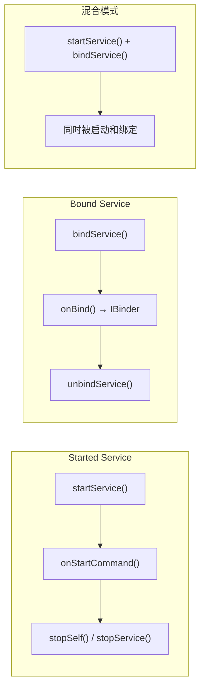
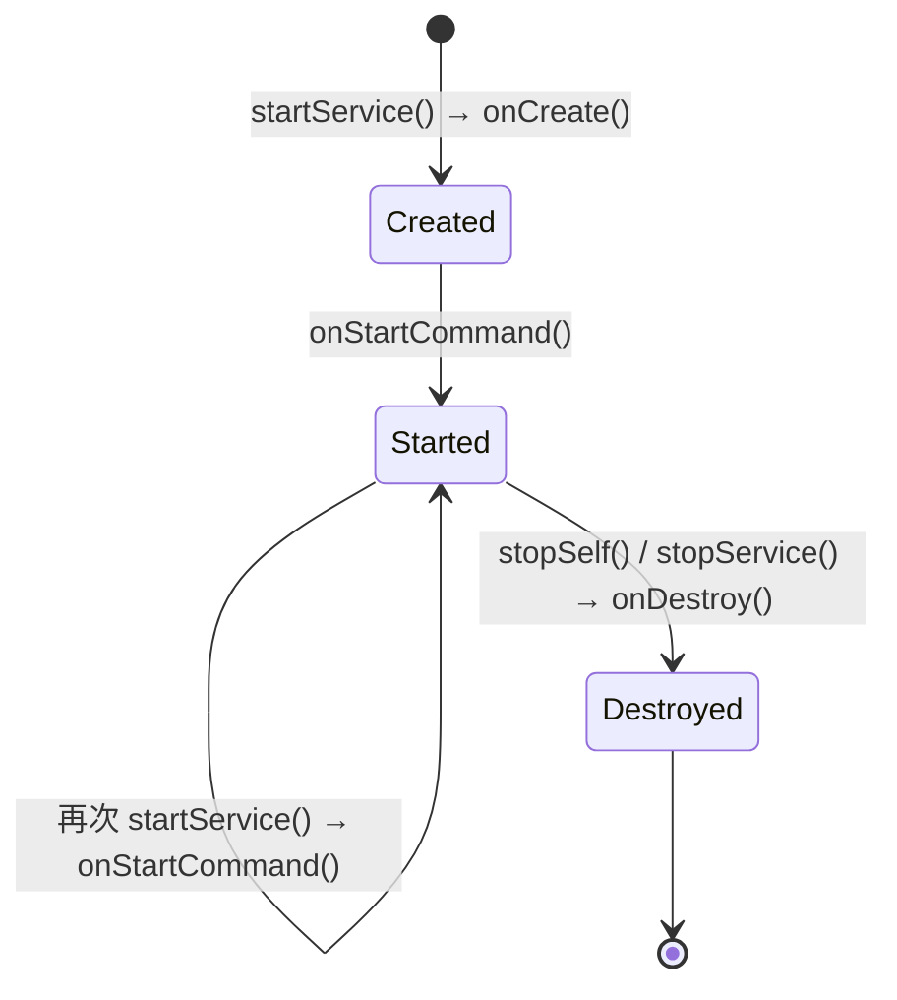
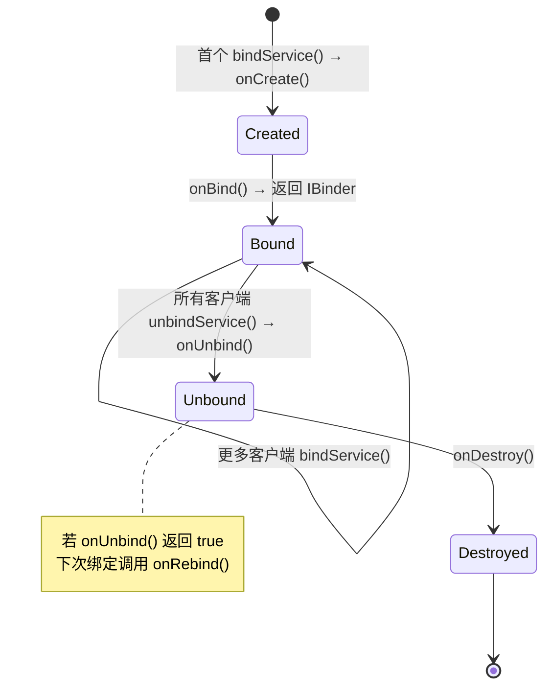
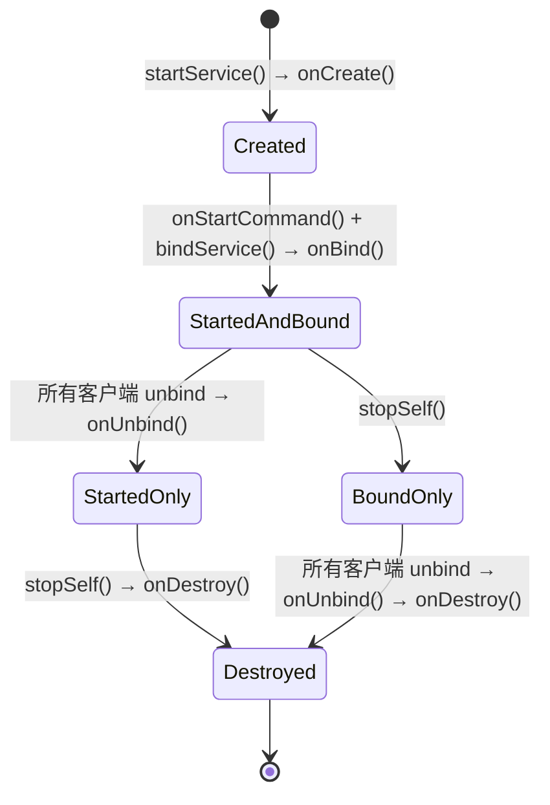
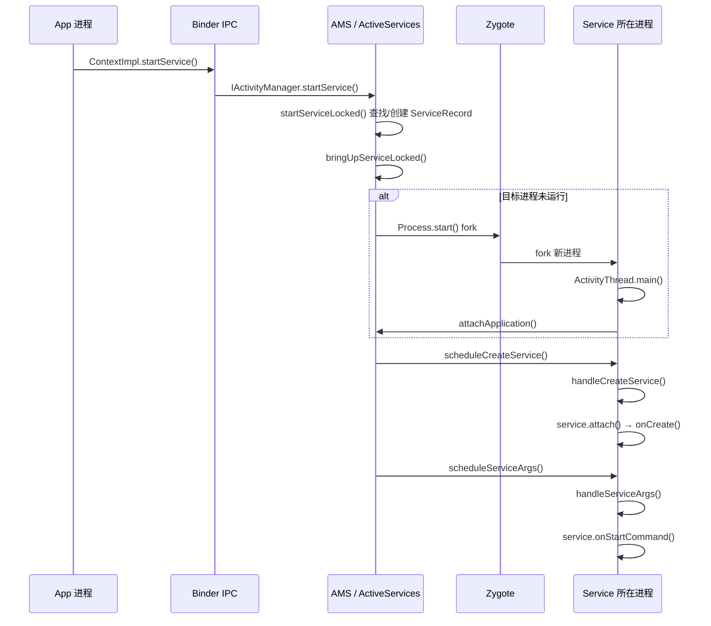
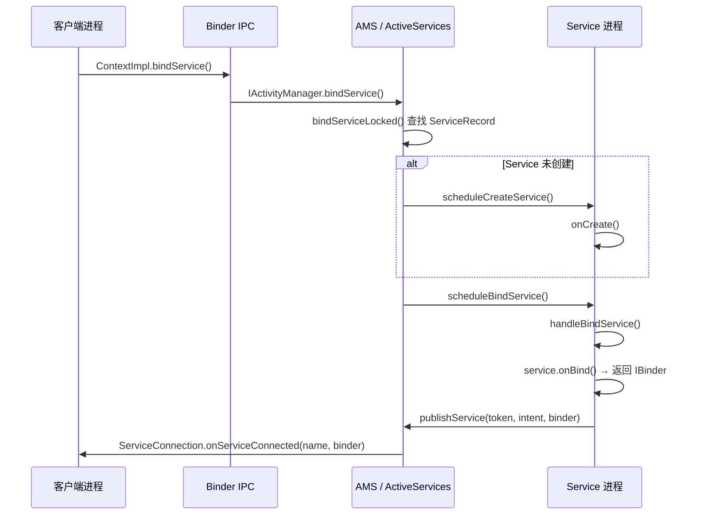

# Android Service 深度解析

> 从 AOSP 源码视角全面解析 Service 组件的核心用途、生命周期驱动机制、startService/bindService 完整链路、前台服务演进、进程优先级与 ANR，以及 Android 14/15 的限制变化

---

## 目录

1. [Service 是什么、为什么需要它](#1-service-是什么为什么需要它)
2. [Service 分类与基本概念](#2-service-分类与基本概念)
3. [Service 生命周期全景图](#3-service-生命周期全景图)
4. [startService 启动完整链路（系统侧）](#4-startservice-启动完整链路系统侧)
5. [bindService 绑定完整链路](#5-bindservice-绑定完整链路)
6. [前台服务（Foreground Service）](#6-前台服务foreground-service)
7. [Service 与进程优先级](#7-service-与进程优先级)
8. [IntentService（已废弃）与替代方案](#8-intentservice已废弃与替代方案)
9. [跨进程绑定：Messenger 与 AIDL](#9-跨进程绑定messenger-与-aidl)
10. [常用调试命令与 Perfetto 实操](#10-常用调试命令与-perfetto-实操)
11. [面试高频问题](#11-面试高频问题)
12. [AI 交互建议](#ai-交互建议)
13. [真机实操](#真机实操)
14. [下一步学习建议](#下一步学习建议)

---

## 1. Service 是什么、为什么需要它

### 1.1 一句话定义

**Service 是 Android 四大组件之一，没有用户界面，专门用于在后台执行"用户看不到、但必须持续运行"的任务。**

你可以把 Service 理解为一个"没有脸的 Activity"——它拥有自己的生命周期，由系统（AMS）统一管理，但不会显示任何 UI。

### 1.2 为什么不能用 Thread 代替 Service

很多开发者会问："我直接 `new Thread()` 不行吗？为什么要用 Service？"

核心区别在于 **进程保活** 和 **系统感知**：

| 对比项 | Thread | Service |
|--------|--------|---------|
| 系统是否感知 | 不感知，只是进程内的一个线程 | AMS 持有 `ServiceRecord`，系统知道这个组件在运行 |
| 进程优先级影响 | 无，线程不影响进程的 oom_adj | 有，Started/Bound/Foreground Service 会提升进程优先级 |
| Activity 退出后 | 线程可能还在跑，但进程随时可能被杀 | Service 仍在运行，系统会尽量保留该进程 |
| 跨进程通信 | 不支持 | Bound Service 天然支持通过 Binder 跨进程暴露接口 |
| 生命周期管理 | 需要自己管理 | 系统管理 `onCreate → onStartCommand/onBind → onDestroy` |

**一句话总结**：Thread 只是一个执行单元，系统不知道它的存在；Service 是一个"有身份"的组件，系统会根据它的状态来决定进程的存亡。

### 1.3 六大典型使用场景

| 场景 | 真实例子 | 为什么必须用 Service |
|------|----------|---------------------|
| **音乐/音频播放** | 网易云音乐、Spotify 后台播放 | 用户退出 Activity 后音乐仍需播放，前台服务保持进程不被杀，通知栏显示播放控制 |
| **文件下载/上传** | 微信发送大文件、应用商店后台下载 | 耗时操作不能依赖 Activity 生命周期，需要独立于界面持续执行 |
| **位置追踪** | 运动 App 记录跑步轨迹、外卖骑手定位 | 持续采集 GPS，需要前台服务 + `FOREGROUND_SERVICE_TYPE_LOCATION` |
| **消息推送保活** | 微信、Telegram 维持长连接 | 进程需要存活以接收推送消息，Service 提升进程优先级 |
| **跨进程服务端** | 系统服务（AMS/WMS/PMS）、支付 SDK | Bound Service 通过 Binder/AIDL 向其他进程暴露接口 |
| **定时/周期性任务** | 数据同步、日志上报、缓存清理 | 结合 JobScheduler/WorkManager 在后台周期执行 |

### 1.4 不该用 Service 的反模式

| 反模式 | 应该怎么做 |
|--------|-----------|
| CPU 密集型计算（图片处理、加密） | 使用 `Thread` / `Coroutine` / `ExecutorService` |
| 一次性网络请求 | 使用 `WorkManager`（可靠调度）或 Coroutine |
| 很短暂的后台任务（< 几秒） | Android 8+ 后台 Service 会被限制，用 `WorkManager` |
| 只为了保活而保活 | 系统会越来越严格地杀掉空 Service，用 FCM 推送替代 |

### 1.5 Android 版本演进对 Service 的影响

```
Android 8 (O)    后台执行限制：后台 App 无法 startService()，
                 必须用 startForegroundService() + 5秒内调用 startForeground()
        ↓
Android 12 (S)   前台服务启动限制：后台 App 禁止启动前台服务
                 （除特定豁免：如 FCM 高优先级消息、地理围栏触发等）
        ↓
Android 14 (U)   foregroundServiceType 强制声明：必须在 Manifest 中
                 声明具体的前台服务类型，并申请对应权限
        ↓
Android 15 (V)   SHORT_SERVICE 超时机制：短时前台服务有时间限制，
                 超时后系统自动停止
```

### 1.6 应用 Service vs 系统服务（AMS/WMS）：同名不同源

Android 中有两种东西都叫"Service"，但它们是**完全不同的概念**，初学者极易混淆：

| 对比维度 | 应用层 Service（本文主题） | 系统服务（AMS / WMS / PMS 等） |
|---------|--------------------------|-------------------------------|
| **本质** | 四大组件之一，继承 `android.app.Service` | 运行在 system_server 进程中的 Binder 服务对象 |
| **运行进程** | App 自己的进程（也可通过 `android:process` 指定独立进程） | 几乎全部运行在 **system_server** 进程 |
| **注册方式** | 在 `AndroidManifest.xml` 中用 `<service>` 标签声明 | 启动时通过 `ServiceManager.addService()` 注册到全局 ServiceManager |
| **获取方式** | `startService()` / `bindService()` → 经由 AMS 调度 | `ServiceManager.getService("activity")` 或 `Context.getSystemService()` → 直接拿到 Binder 代理 |
| **生命周期** | 由 AMS 管理 `onCreate → onStartCommand/onBind → onDestroy` | **没有标准生命周期**，随 system_server 进程启动而存在，直到设备关机 |
| **启动时机** | 用户/App 主动发起 | system_server 在 `SystemServer.main()` 中按 boot phase 批量启动 |
| **可被杀死** | 是，受 LMK/oom_adj 影响，进程被杀则 Service 销毁 | 否，system_server 崩溃 = 系统重启（触发 Zygote 的 `waitpid` 检测） |
| **基类/接口** | `android.app.Service`（继承 `ContextWrapper`） | 通常继承 `SystemService` 或直接实现 AIDL Stub（如 `IActivityManager.Stub`） |
| **Binder 角色** | 作为 Bound Service 时，通过 `onBind()` 返回 IBinder 给客户端 | 天然就是 Binder 服务端，客户端通过 AIDL 代理远程调用 |
| **AMS 关系** | **被 AMS 管理**（AMS 持有 ServiceRecord） | AMS **本身就是**系统服务之一 |

它们的关系可以这样理解：

```
ServiceManager（全局注册中心）
  ├── "activity"   → ActivityManagerService (AMS)      ← 系统服务
  ├── "window"     → WindowManagerService  (WMS)       ← 系统服务
  ├── "package"    → PackageManagerService (PMS)       ← 系统服务
  └── ...

AMS（系统服务之一）
  └── 管理所有 App 的四大组件
        ├── ActivityRecord    （Activity 的档案）
        ├── ServiceRecord     （Service 的档案）      ← 应用层 Service
        ├── BroadcastRecord   （Broadcast 的档案）
        └── ContentProviderRecord
```

**一句话总结**：应用 Service 是"被 AMS 管的打工人"，AMS/WMS 是"管别人的系统基础设施"。前者的 `Service` 继承自 `android.app.Service`、跑在 App 进程、有生命周期、可被杀死；后者是 system_server 里的常驻 Binder 对象，不受四大组件生命周期约束。

> 更多系统服务细节参见 [AMS与WMS核心服务](../framework/AMS与WMS核心服务.md)

---

## 2. Service 分类与基本概念

### 2.1 源码位置

```
frameworks/base/core/java/android/app/Service.java
```

类声明（L318）：

```java
public abstract class Service extends ContextWrapper
        implements ComponentCallbacks2,
                   ContentCaptureManager.ContentCaptureClient {
```

### 2.2 三种运行模式



| 模式 | 启动方式 | 销毁条件 | 典型场景 |
|------|---------|----------|---------|
| **Started** | `startService()` / `startForegroundService()` | 调用 `stopSelf()` 或 `stopService()` | 音乐播放、文件下载 |
| **Bound** | `bindService()` | 所有客户端 `unbindService()` 后自动销毁 | 跨进程通信、SDK 接口 |
| **混合** | 先 `startService()` 再 `bindService()` | 必须同时满足 stop + 全部 unbind | 音乐播放器（需要后台运行 + Activity 交互控制） |

### 2.3 运行线程

**Service 默认运行在主线程（UI 线程）上。** 这是最常见的误区之一。

- `onCreate()`、`onStartCommand()`、`onBind()` 等回调都在主线程执行
- 耗时操作必须自行开启子线程，否则会导致 ANR（前台 20 秒、后台 200 秒）

### 2.4 关键字段

```
// Service.java L1034-1045
private ActivityThread mThread = null;     // 所在进程的 ActivityThread
private String mClassName = null;          // Service 类名
private IBinder mToken = null;             // 在 AMS 中的唯一标识
private Application mApplication = null;   // 所属 Application
private IActivityManager mActivityManager; // AMS Binder 代理
```

---

## 3. Service 生命周期全景图

### 3.1 Started Service 生命周期



### 3.2 Bound Service 生命周期



### 3.3 混合模式生命周期



### 3.4 生命周期回调源码对照

| 回调方法 | 源码位置 | 说明 |
|---------|---------|------|
| `onCreate()` | Service.java L366 | 首次创建，初始化资源 |
| `onStartCommand()` | Service.java L526 | 每次 `startService()` 调用，返回重启策略 |
| `onBind()` | Service.java L570 | 首个客户端绑定，返回 `IBinder` 通信接口 |
| `onUnbind()` | Service.java L586 | 所有客户端解绑，返回 `true` 则后续触发 `onRebind()` |
| `onRebind()` | Service.java L601 | `onUnbind()` 返回 `true` 后的再次绑定 |
| `onDestroy()` | Service.java L537 | 销毁，释放资源 |

### 3.5 onStartCommand 返回值

| 常量 | 值 | 行为 | 适用场景 |
|------|----|------|---------|
| `START_STICKY` | 1 (L413) | 进程被杀后重建 Service，`onStartCommand()` 收到 `null` Intent | 音乐播放、后台持续运行 |
| `START_NOT_STICKY` | 2 (L437) | 进程被杀后不重建，等待下次显式启动 | 定时轮询（有 Alarm 兜底） |
| `START_REDELIVER_INTENT` | 3 (L452) | 进程被杀后重建，重新投递最后的 Intent | 文件下载（需要恢复任务） |
| `START_STICKY_COMPATIBILITY` | 0 (L389) | `START_STICKY` 的兼容版本，不保证重调 `onStartCommand` | 历史遗留 |

---

## 4. startService 启动完整链路（系统侧）

### 4.1 关键源码文件

| 文件 | 路径 | 角色 |
|------|------|------|
| `ContextImpl.java` | `frameworks/base/core/java/android/app/ContextImpl.java` | App 侧入口 |
| `ActiveServices.java` | `frameworks/base/services/core/java/com/android/server/am/ActiveServices.java` | system_server 侧 Service 管理核心（L266） |
| `ServiceRecord.java` | `frameworks/base/services/core/java/com/android/server/am/ServiceRecord.java` | 服务状态记录（L81） |
| `ActivityThread.java` | `frameworks/base/core/java/android/app/ActivityThread.java` | App 进程侧生命周期处理 |

### 4.2 startService 完整调用链

```
App 进程                          system_server                          App 进程
───────                          ─────────────                          ───────
ContextImpl.startService()
  → ContextImpl.startServiceCommon()
    → IActivityManager.startService()
      ──── Binder IPC ────→
                              AMS.startService()
                                → ActiveServices.startServiceLocked()     (L916)
                                  → ActiveServices.startServiceInnerLocked()
                                    → ActiveServices.bringUpServiceLocked()  (L5717)
                                      (若进程不存在 → AMS.startProcessLocked() → Zygote fork)
                                      → ActiveServices.realStartServiceLocked() (L6013)
                                        → thread.scheduleCreateService()       (L6068)
      ←── Binder IPC ─────
                                                                       ActivityThread.handleCreateService() (L4930)
                                                                         → 实例化 Service
                                                                         → service.attach()
                                                                         → service.onCreate()
                                        → sendServiceArgsLocked()
      ←── Binder IPC ─────
                                                                       ActivityThread.handleServiceArgs()   (L5135)
                                                                         → service.onStartCommand()
```

### 4.3 时序图



### 4.4 ServiceRecord 关键字段

`ServiceRecord` 是 Service 在 system_server 侧的"档案"（L81）：

```java
final class ServiceRecord extends Binder
        implements ComponentName.WithComponentName {
    final ActivityManagerService ams;
    final ComponentName name;          // 组件名
    final ServiceInfo serviceInfo;     // AndroidManifest 中的声明信息
    ProcessRecord app;                 // 运行在哪个进程
    boolean startRequested;            // 是否被 startService() 启动过
    boolean isForeground;              // 是否是前台服务
    int foregroundId;                  // 前台通知 ID
    Notification foregroundNoti;       // 前台通知对象
    final ArrayMap<Intent.FilterComparison, IntentBindRecord> bindings;  // 绑定记录
    final ArrayMap<IBinder, ArrayList<ConnectionRecord>> connections;    // 连接记录
}
```

### 4.5 realStartServiceLocked 核心逻辑

`ActiveServices.realStartServiceLocked()`（L6013）是真正启动 Service 的地方：

1. `r.setProcess(app, thread, pid, uidRecord)` — 关联进程
2. `bumpServiceExecutingLocked()` — 设置 ANR 超时计时器
3. `updateLruProcessLocked()` — 更新进程 LRU 列表
4. `thread.scheduleCreateService()` — 通过 Binder 回调 App 进程创建 Service（L6068）

### 4.6 ActivityThread.handleCreateService

App 进程收到 `scheduleCreateService` 后（L4930）：

```java
private void handleCreateService(CreateServiceData data) {
    // 1. 实例化 Service
    service = packageInfo.getAppFactory()
            .instantiateService(cl, data.info.name, data.intent);
    // 2. 创建 Context
    ContextImpl context = ContextImpl.getImpl(
            service.createServiceBaseContext(this, packageInfo));
    // 3. attach：关联 ActivityThread、Token、Application、AMS 代理
    service.attach(context, this, data.info.name, data.token,
            app, ActivityManager.getService());
    // 4. 调用 onCreate
    service.onCreate();
    // 5. 存入 mServices 映射表
    mServices.put(data.token, service);
}
```

---

## 5. bindService 绑定完整链路

### 5.1 绑定流程时序图



### 5.2 ActivityThread.handleBindService

App 进程处理绑定请求（L4995）：

```java
private void handleBindService(BindServiceData data) {
    Service s = mServices.get(data.token);
    if (s != null) {
        if (!data.rebind) {
            // 首次绑定：调用 onBind()，将返回的 IBinder 发布给 AMS
            IBinder binder = s.onBind(data.intent);
            ActivityManager.getService().publishService(
                    data.token, data.intent, binder);
        } else {
            // 重新绑定：onUnbind() 返回 true 后的再次绑定
            s.onRebind(data.intent);
        }
    }
}
```

### 5.3 handleUnbindService

```java
private void handleUnbindService(BindServiceData data) {
    Service s = mServices.get(data.token);
    if (s != null) {
        boolean doRebind = s.onUnbind(data.intent);
        if (doRebind) {
            // onUnbind 返回 true → 通知 AMS 下次绑定走 onRebind
            ActivityManager.getService().unbindFinished(
                    data.token, data.intent, doRebind);
        }
    }
}
```

### 5.4 ServiceConnection 接口

`ServiceConnection`（`frameworks/base/core/java/android/content/ServiceConnection.java` L28）：

| 回调 | 说明 |
|------|------|
| `onServiceConnected(ComponentName, IBinder)` | 绑定成功，收到 Service 返回的 IBinder 对象 |
| `onServiceDisconnected(ComponentName)` | Service 所在进程崩溃或被杀时回调（**不是** `unbindService()` 触发的） |
| `onBindingDied(ComponentName)` | 绑定通道永久失效（如 Service 所在 App 被更新），需要重新 unbind + bind |
| `onNullBinding(ComponentName)` | Service 的 `onBind()` 返回了 `null` |

### 5.5 bindService Flags

| Flag | 说明 |
|------|------|
| `BIND_AUTO_CREATE` | 绑定时自动创建 Service（最常用） |
| `BIND_IMPORTANT` | 提升 Service 进程为前台优先级 |
| `BIND_ABOVE_CLIENT` | Service 进程优先级高于客户端 |
| `BIND_NOT_FOREGROUND` | 不将 Service 进程提升到前台调度 |
| `BIND_WAIVE_PRIORITY` | 不影响 Service 进程的调度优先级 |

---

## 6. 前台服务（Foreground Service）

### 6.1 什么是前台服务

前台服务是一种用户可感知的 Service：必须显示一个持续的通知栏通知，系统会大幅提升其所在进程的优先级，使其几乎不会被杀死。

典型场景：音乐播放、导航、运动记录、文件下载进度显示。

### 6.2 使用方式

```java
// 1. 启动前台服务（Android 8+ 必须用这个方法）
context.startForegroundService(intent);

// 2. 在 Service.onCreate() 或 onStartCommand() 中，5 秒内调用：
startForeground(NOTIFICATION_ID, notification);
```

`startForeground()` 源码（Service.java L773）：

```java
public final void startForeground(int id, Notification notification) {
    final ComponentName comp = new ComponentName(this, mClassName);
    mActivityManager.setServiceForeground(
            comp, mToken, id,
            notification, 0, FOREGROUND_SERVICE_TYPE_MANIFEST);
}
```

### 6.3 前台服务类型（Android 14+ 强制声明）

`ServiceInfo.java` 中定义了 13 种前台服务类型：

| 类型 | 常量 | 值 | 需要的权限 |
|------|------|----|-----------|
| 数据同步 | `FOREGROUND_SERVICE_TYPE_DATA_SYNC` | 1 << 0 | `FOREGROUND_SERVICE_DATA_SYNC` |
| 媒体播放 | `FOREGROUND_SERVICE_TYPE_MEDIA_PLAYBACK` | 1 << 1 | `FOREGROUND_SERVICE_MEDIA_PLAYBACK` |
| 电话 | `FOREGROUND_SERVICE_TYPE_PHONE_CALL` | 1 << 2 | `FOREGROUND_SERVICE_PHONE_CALL` |
| 位置 | `FOREGROUND_SERVICE_TYPE_LOCATION` | 1 << 3 | `FOREGROUND_SERVICE_LOCATION` + `ACCESS_*_LOCATION` |
| 连接设备 | `FOREGROUND_SERVICE_TYPE_CONNECTED_DEVICE` | 1 << 4 | `FOREGROUND_SERVICE_CONNECTED_DEVICE` |
| 媒体投射 | `FOREGROUND_SERVICE_TYPE_MEDIA_PROJECTION` | 1 << 5 | `FOREGROUND_SERVICE_MEDIA_PROJECTION` |
| 相机 | `FOREGROUND_SERVICE_TYPE_CAMERA` | 1 << 6 | `FOREGROUND_SERVICE_CAMERA` + `CAMERA` |
| 麦克风 | `FOREGROUND_SERVICE_TYPE_MICROPHONE` | 1 << 7 | `FOREGROUND_SERVICE_MICROPHONE` + `RECORD_AUDIO` |
| 健康 | `FOREGROUND_SERVICE_TYPE_HEALTH` | 1 << 8 | `FOREGROUND_SERVICE_HEALTH` |
| 远程消息 | `FOREGROUND_SERVICE_TYPE_REMOTE_MESSAGING` | 1 << 9 | `FOREGROUND_SERVICE_REMOTE_MESSAGING` |
| 系统豁免 | `FOREGROUND_SERVICE_TYPE_SYSTEM_EXEMPTED` | 1 << 10 | `FOREGROUND_SERVICE_SYSTEM_EXEMPTED` |
| 短时服务 | `FOREGROUND_SERVICE_TYPE_SHORT_SERVICE` | 1 << 11 | 无需额外权限，但有超时限制 |
| 特殊用途 | `FOREGROUND_SERVICE_TYPE_SPECIAL_USE` | 1 << 30 | `FOREGROUND_SERVICE_SPECIAL_USE` |

Manifest 声明示例：

```xml
<service
    android:name=".MusicPlaybackService"
    android:foregroundServiceType="mediaPlayback"
    android:exported="false" />
```

### 6.4 Android 版本限制汇总

| 版本 | 限制 |
|------|------|
| Android 8 (O / API 26) | 后台 App 不能 `startService()`，必须 `startForegroundService()` + 5秒内 `startForeground()` |
| Android 9 (P / API 28) | 需声明 `FOREGROUND_SERVICE` 权限 |
| Android 10 (Q / API 29) | 引入 `foregroundServiceType`，可选声明 |
| Android 12 (S / API 31) | 后台 App 禁止启动前台服务（有豁免列表） |
| Android 14 (U / API 34) | `foregroundServiceType` **强制声明**，否则抛 `MissingForegroundServiceTypeException` |
| Android 15 (V / API 35) | `SHORT_SERVICE` 类型有超时限制，`dataSync` 有使用期限限制 |

### 6.5 stopForeground 策略

| 常量 | 值 | 行为 |
|------|----|------|
| `STOP_FOREGROUND_REMOVE` | 1 (L336) | 移除前台状态，同时移除通知 |
| `STOP_FOREGROUND_DETACH` | 2 (L343) | 移除前台状态，但通知保留显示（与 Service 生命周期脱钩） |

---

## 7. Service 与进程优先级

### 7.1 进程优先级等级

Android 系统根据运行的组件决定进程优先级，从高到低：

| 等级 | oom_adj | 说明 | Service 相关 |
|------|---------|------|-------------|
| 前台进程 | 0 | 用户正在交互 | 前台 Service 所在进程 |
| 可见进程 | 100 | 可见但不在前台 | 绑定了可见 Activity 的 Service |
| 服务进程 | 500 | 运行 Started Service | 普通 Started Service |
| 缓存进程 | 900+ | 后台进程 | 已停止的 Service 所在进程 |

### 7.2 Service 对 oom_adj 的影响

- **前台服务**：进程 oom_adj 降至 `PERCEPTIBLE_APP_ADJ`（200）或更低，几乎不会被杀
- **Started Service**：进程 oom_adj 降至 `SERVICE_ADJ`（500），高于纯缓存进程
- **Bound Service**：取决于客户端进程的优先级；`BIND_IMPORTANT` 可将 Service 进程提至与客户端同级
- **无组件运行**：进程降为缓存进程，随时可能被 LMK 杀死

### 7.3 ANR 超时机制

当 AMS 调度 Service 生命周期时，会通过 `bumpServiceExecutingLocked()` 设置超时计时器：

| 场景 | 超时时间 | 说明 |
|------|---------|------|
| 前台服务 | 20 秒 | `onCreate()`、`onStartCommand()`、`onBind()` 等回调必须在 20 秒内完成 |
| 后台服务 | 200 秒 | 较宽松，但仍不应做重度 I/O 或网络 |

超时后系统弹出 ANR 对话框，对应 Perfetto 中的 `Service ANR` trace 事件。

---

## 8. IntentService（已废弃）与替代方案

### 8.1 IntentService 架构

源码：`frameworks/base/core/java/android/app/IntentService.java`（L63）

```java
@Deprecated
public abstract class IntentService extends Service {
    private volatile Looper mServiceLooper;
    private volatile ServiceHandler mServiceHandler;
```

内部架构：


工作原理：
1. `onCreate()` 中创建 `HandlerThread`（独立工作线程）
2. 每次 `onStartCommand()` 将 Intent 封装为 Message 发送到工作线程
3. `onHandleIntent()` 在工作线程中顺序执行（串行队列，一次处理一个）
4. 处理完毕自动 `stopSelf()`

### 8.2 为什么被废弃

- Android 8+ 后台执行限制，后台 `startService()` 被禁止
- 不支持 Kotlin Coroutine
- 不保证任务持久化（进程被杀则任务丢失）

### 8.3 替代方案对比

| 方案 | 特点 | 适用场景 |
|------|------|---------|
| **WorkManager** | 可靠调度、支持约束条件、进程重启后继续 | 定时同步、条件触发任务、可延迟任务 |
| **JobScheduler** | 系统级调度、支持条件约束 | 需要精确控制执行条件的后台任务 |
| **Coroutine + Service** | 灵活、支持并发和取消 | 需要 Service 生命周期 + 异步执行 |
| **Foreground Service** | 用户可感知、高优先级 | 必须持续运行的任务（音乐、导航） |

---

## 9. 跨进程绑定：Messenger 与 AIDL

### 9.1 Messenger 模式

Messenger 是对 AIDL 的轻量封装，底层使用 `IMessenger.aidl`，所有请求在 Service 端排队串行处理。

```
客户端                   Service 端
──────                  ──────────
new Messenger(handler)
  │
  ├─ bindService() ────→ onBind(): return mMessenger.getBinder()
  │
  ├─ onServiceConnected(binder)
  │   └─ serverMessenger = new Messenger(binder)
  │
  └─ serverMessenger.send(msg) ─→ Handler.handleMessage(msg)
```

**优点**：简单，不需要写 AIDL 文件
**缺点**：串行处理，不支持并发；不支持直接返回值

### 9.2 AIDL 模式

AIDL（Android Interface Definition Language）支持多线程并发调用，是系统服务（AMS、WMS、PMS）使用的方式。

```
客户端                         Service 端
──────                        ──────────
IMyService.Stub.asInterface()
  │
  ├─ 调用接口方法 ───Binder IPC──→ IMyService.Stub.onTransact()
  │                              └─ 分发到具体实现方法
  │                              （在 Binder 线程池中执行，多线程并发）
  │
  └─ 同步返回结果 ←──────────────
```

**优点**：支持多线程并发、复杂数据类型、同步返回
**缺点**：需要编写 `.aidl` 文件、处理线程安全

### 9.3 对比选择

| 维度 | Messenger | AIDL |
|------|-----------|------|
| 线程模型 | 串行（Handler 队列） | 并发（Binder 线程池） |
| 复杂度 | 低，无需 .aidl 文件 | 高，需编写 .aidl + 处理线程安全 |
| 返回值 | 不支持直接返回，需回调 | 支持同步返回 |
| 性能 | 适合低频调用 | 适合高频/高并发调用 |
| 系统服务使用 | 极少 | 所有系统服务均使用 AIDL |

> 更多 Binder 机制细节参见 [Binder与跨进程通信](../framework/Binder与跨进程通信.md)

---

## 10. 常用调试命令与 Perfetto 实操

### 10.1 dumpsys 命令

```bash
# 查看所有正在运行的 Service
adb shell dumpsys activity services

# 查看指定包名的 Service 详情
adb shell dumpsys activity services <package_name>

# 查看 Service 的简要信息（包含前台/后台状态）
adb shell dumpsys activity services -p <package_name>

# 查看前台服务列表
adb shell dumpsys activity services | grep "isForeground=true"

# 查看 Service 相关的 ANR 信息
adb shell dumpsys activity anr
```

输出关键字段解读：

| 字段 | 含义 |
|------|------|
| `ServiceRecord{...}` | Service 的唯一标识 |
| `intent={...}` | 启动 Service 时的 Intent |
| `app=ProcessRecord{...}` | Service 所在进程 |
| `isForeground=true/false` | 是否为前台服务 |
| `startRequested=true` | 是否通过 `startService()` 启动 |
| `connections=<...>` | 当前绑定的客户端列表 |
| `lastActivity=<timestamp>` | 最后一次活动时间 |

### 10.2 adb shell 命令

```bash
# 手动启动 Service
adb shell am startservice -n com.example.app/.MyService

# 手动启动前台 Service（Android 8+ 需 startforegroundservice）
adb shell am start-foreground-service -n com.example.app/.MyForegroundService

# 手动停止 Service
adb shell am stopservice -n com.example.app/.MyService
```

### 10.3 Perfetto 中的 Service 相关 Trace

在 Perfetto 中抓取 `am` 和 `ams` tag 可以看到 Service 相关的 trace slice：

| Trace Slice | 含义 |
|-------------|------|
| `startService` | `ActiveServices.startServiceLocked()` 执行 |
| `bringUpServiceLocked` | 启动 Service 的核心流程 |
| `realStartServiceLocked` | 真正调度 App 进程创建 Service |
| `bindService` | 绑定 Service 流程 |
| `Service ANR` | Service 回调超时，即将触发 ANR |

Perfetto SQL 查询示例：

```sql
-- 查找 Service 启动相关的 trace slice
SELECT ts, dur, name
FROM slice
WHERE name LIKE '%Service%'
  AND dur > 0
ORDER BY ts;

-- 查找 Service ANR 事件
SELECT ts, dur, name
FROM slice
WHERE name LIKE '%Service ANR%'
ORDER BY ts;
```

### 10.4 前台服务通知排查

```bash
# 查看所有通知（包含前台服务通知）
adb shell dumpsys notification

# 过滤前台服务通知
adb shell dumpsys notification | grep -A 5 "isForegroundService=true"
```

---

## 11. 面试高频问题

### Q1：Service 和 Thread 的区别是什么？

Service 是四大组件之一，由 AMS 管理生命周期，会影响进程优先级（oom_adj），系统可以感知其存在并据此决定进程存亡。Thread 只是进程内的执行线程，系统不感知，不影响进程优先级。Service 默认运行在主线程，耗时操作仍需开子线程。

### Q2：startService 和 bindService 的区别？

- `startService()`：Service 独立于调用者生命周期运行，必须主动 `stopSelf()` / `stopService()` 才停止
- `bindService()`：Service 生命周期绑定到客户端，所有客户端 `unbindService()` 后自动销毁；通过 `IBinder` 返回通信接口
- 混合使用时，必须同时 stop + unbind 才会销毁

### Q3：onStartCommand 的返回值有什么区别？

- `START_STICKY`：进程被杀后重建 Service，但 Intent 为 null → 适合音乐播放等持续运行场景
- `START_NOT_STICKY`：不重建 → 适合可丢弃的任务
- `START_REDELIVER_INTENT`：重建并重新投递 Intent → 适合文件下载等需要恢复的任务

### Q4：前台服务从 Android 8 到 Android 15 经历了哪些限制？

Android 8 要求后台 App 使用 `startForegroundService()` + 5秒内 `startForeground()`；Android 12 限制后台启动前台服务；Android 14 强制声明 `foregroundServiceType`；Android 15 新增 `SHORT_SERVICE` 超时和 `dataSync` 使用期限限制。

### Q5：Service 如何提升进程优先级？

前台服务将进程 oom_adj 降至约 200（`PERCEPTIBLE_APP_ADJ`），几乎不被杀；普通 Started Service 降至 500（`SERVICE_ADJ`）；Bound Service 取决于客户端优先级和 bind flags（如 `BIND_IMPORTANT`）。

### Q6：Service 的 ANR 超时是多少？

前台服务 20 秒，后台服务 200 秒。AMS 在调度 Service 回调时通过 `bumpServiceExecutingLocked()` 设置超时定时器，超时则触发 ANR。

### Q7：IntentService 为什么被废弃，用什么替代？

IntentService 内部使用 HandlerThread 串行处理任务，但 Android 8+ 后台 `startService()` 被限制，且不支持 Coroutine、不保证任务持久化。推荐用 WorkManager（可靠调度）、Coroutine + Service 或前台服务替代。

### Q8：Messenger 和 AIDL 有什么区别？

Messenger 基于 Handler 串行处理，简单但不支持并发和直接返回值；AIDL 在 Binder 线程池中多线程并发处理，支持同步返回，但需要处理线程安全。系统服务全部使用 AIDL。

### Q9：bindService 的 `BIND_AUTO_CREATE` 是什么意思？

`BIND_AUTO_CREATE` 表示绑定时如果 Service 不存在则自动创建。不加这个 flag 则只绑定已存在的 Service，如果 Service 未运行则绑定失败。这是最常用的 flag。

### Q10：如何排查"Service 被系统杀死"的问题？

1. `adb shell dumpsys activity services` 查看 Service 状态
2. `adb shell dumpsys meminfo` 查看内存压力
3. Perfetto 抓取 `am` tag 查看 `bringDownServiceLocked` 事件
4. 检查 `onStartCommand()` 返回值是否为 `START_STICKY`
5. 检查是否需要改为前台服务提升优先级

### Q11：Service 的 onDestroy 一定会被调用吗？

不一定。如果进程被系统直接杀死（如 LMK 回收内存），`onDestroy()` 不会被调用。只有正常的 `stopService()` / `stopSelf()` / 全部 unbind 路径才会触发。因此不应在 `onDestroy()` 中做关键数据持久化。

### Q12：同一个 Service 可以同时被 startService 和 bindService 吗？

可以。这就是混合模式。`onCreate()` 只调用一次；`onStartCommand()` 和 `onBind()` 各自被调用。销毁时必须同时满足 stop（或 `stopSelf()`）和所有客户端 unbind，两个条件都满足后才调用 `onDestroy()`。

---

## AI 交互建议

阅读源码时，可以向 AI 提问以下问题加深理解：

### 启动与绑定

1. `帮我追踪 ContextImpl.startService() 的完整调用链，从 App 进程到 system_server 的 ActiveServices`
2. `bindService 的 BIND_AUTO_CREATE flag 在 ActiveServices 中如何影响 Service 创建逻辑？`
3. `ServiceRecord 的 bindings 和 connections 字段分别记录了什么？`

### 前台服务

4. `Android 14 中 foregroundServiceType 的校验逻辑在哪里？不声明会抛什么异常？`
5. `startForeground() 调用后，AMS 如何修改进程的 oom_adj？`

### 进程与 ANR

6. `bumpServiceExecutingLocked() 如何设置 ANR 超时？超时后的处理流程是什么？`
7. `AMS 如何根据 Service 的前台/后台状态计算进程的 oom_adj？`

---

## 真机实操

### 1. 查看 Service 运行状态

```bash
# 查看所有运行中的 Service
adb shell dumpsys activity services

# 查看指定包名
adb shell dumpsys activity services com.android.systemui
```

**预期**：看到 `ServiceRecord` 列表，包含组件名、进程、前台状态、绑定关系等。

### 2. 手动启停 Service

```bash
# 启动
adb shell am startservice -n com.example.app/.MyService

# 停止
adb shell am stopservice -n com.example.app/.MyService

# 前后对比
adb shell dumpsys activity services com.example.app
```

### 3. 观察前台服务

```bash
# 查看前台服务
adb shell dumpsys activity services | grep -B 2 "isForeground=true"

# 查看对应通知
adb shell dumpsys notification | grep -A 5 "isForegroundService"
```

### 4. 观察 Service 对进程优先级的影响

```bash
# 查看进程 oom_adj
adb shell cat /proc/<pid>/oom_score_adj

# 或通过 dumpsys
adb shell dumpsys activity processes | grep -A 5 "com.example.app"
```

启动前台服务前后对比 `oom_score_adj` 的变化。

### 5. 模拟 Service ANR

在 `onStartCommand()` 中 `Thread.sleep(25000)` (> 20秒前台超时)，观察：

```bash
# 查看 ANR 信息
adb shell dumpsys activity anr

# 抓取 traces
adb pull /data/anr/traces.txt
```

---

## 下一步学习建议

- 阅读 `ActiveServices.java` 的 `startServiceLocked()` 和 `bindServiceLocked()` 完整实现
- 结合 [AMS与WMS核心服务](../framework/AMS与WMS核心服务.md) 理解 AMS 进程管理与 Service 的关系
- 结合 [Binder与跨进程通信](../framework/Binder与跨进程通信.md) 理解 Service 跨进程通信的底层机制
- 结合 [Activity与Fragment](./Activity与Fragment.md) 对比 Activity 与 Service 的生命周期差异
- 阅读 `OomAdjuster.java` 了解 Service 对进程优先级的影响细节
