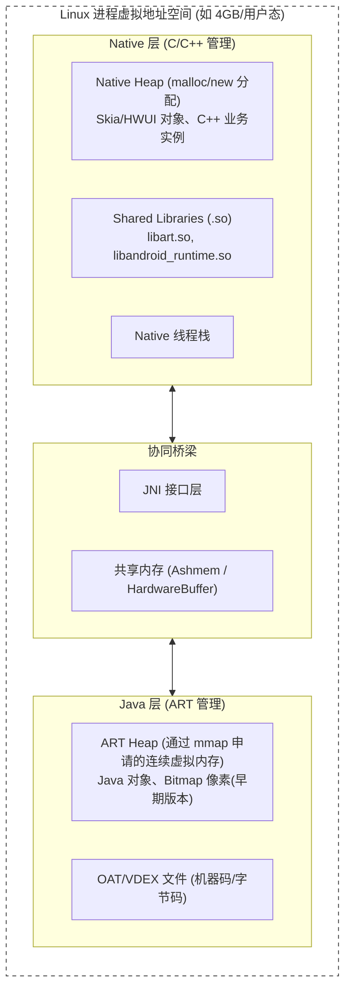
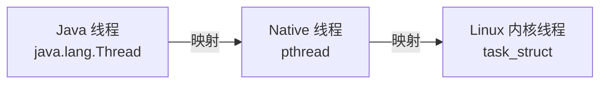

# ART与Native协同机制深度解析

> 从操作系统架构视角，深度解析 Android 进程中 ART 虚拟机与 Native 层在内存、对象管理、GC 感知、CPU 线程调度及异常生命周期等维度的协同工作机制

---

## 目录

1. [Android 进程的本质：没有“纯 Java 进程”](#1-android-进程的本质没有纯-java-进程)
2. [内存维度的协同：割裂与统一](#2-内存维度的协同割裂与统一)
3. [垃圾回收（GC）的跨层联动](#3-垃圾回收gc的跨层联动)
4. [CPU 与线程维度的协同](#4-cpu-与线程维度的协同)
5. [执行模式：从 Java 字节码到 Native 机器码](#5-执行模式从-java-字节码到-native-机器码)
6. [生命周期与异常处理的协同](#6-生命周期与异常处理的协同)
7. [分析工具中的协同视角](#7-分析工具中的协同视角)
8. [最佳协同实践与反模式](#8-最佳协同实践与反模式)
9. [面试高频问题](#9-面试高频问题)
10. [AI 交互建议](#10-ai-交互建议)
11. [关联文档](#11-关联文档)

---

## 1. Android 进程的本质：没有“纯 Java 进程”

### 1.1 一句话点透进程本质

**Android App 进程本质上是一个加载了 `libart.so`（ART 虚拟机引擎）的普通 Linux C/C++ 进程。**

在 Android 系统中，不存在所谓的“纯 Java 进程”。所有的 Java 代码（App 逻辑、Framework API）都跑在一个 C/C++ 编写的程序（ART 虚拟机）之上，而这个 C/C++ 程序本身运行在 Linux 内核之上。

### 1.2 从 Zygote 到 App 的演进

App 进程的创建并非从零开始，而是通过 Zygote 进程 `fork` 出来的。

Zygote 本身就是一个启动了 ART 虚拟机的 Native 进程。它在启动阶段：
1. 创建 ART 虚拟机（`JNI_CreateJavaVM`）。
2. 预加载了近万个 Framework Java 类到 ART 堆中。
3. 预加载了常用的 Native so 库（如 `libandroid_runtime.so`、`libhwui.so` 等）。

当 AMS 请求启动新 App 时，Zygote 执行 Linux 的 `fork()` 系统调用。根据 Linux 的 COW（Copy-On-Write，写时复制）机制：
- 子进程（App 进程）瞬间继承了父进程的整个内存空间映射。
- **App 进程直接拥有了已经处于运行状态的 ART 虚拟机、预加载的 Java 对象和 Native 库**，无需再次经历启动虚拟机的耗时过程。

### 1.3 协同架构全景图

在一个 Android 进程的虚拟地址空间中，Java 域和 Native 域是物理共存的：



---

## 2. 内存维度的协同：割裂与统一

在内存管理上，Android 进程面临着“双头政治”：一部分内存由 ART 的 GC 管理，另一部分由 Native 层手动管理。

### 2.1 虚拟内存空间的划分

**ART Heap 的本质**：
Java 程序员口中的“Java 堆”，在底层看来，只是 ART 虚拟机在进程启动时，通过 Linux 的 `mmap` 系统调用，向操作系统申请的一块（或多块）**巨大的连续虚拟内存**。ART 内部实现了一套内存分配器（如 RosAlloc、BumppPointerAllocator）在这块内存上划地盘给 Java 对象。

**Native Heap**：
由 C/C++ 的标准库函数（`malloc`、`new`）分配。Android 底层经历了 `dlmalloc` → `jemalloc` → `scudo`（Android 11+）的演进。这些内存散布在虚拟地址空间的各个空闲区域。

| 维度 | Java Heap (ART) | Native Heap |
|------|-----------------|-------------|
| **分配主体** | ART 虚拟机内存分配器 | libc 内存分配器 (scudo/jemalloc) |
| **分配方式** | `new Object()` | `malloc()`, `new CppObject()` |
| **回收机制** | 垃圾回收 (GC) | 手动释放 (`free`, `delete`) |
| **连续性** | 逻辑上连续（受 `-Xmx` 限制） | 碎片化，无绝对上限（受物理内存和虚拟地址空间限制） |

### 2.2 Java 对象与 Native 对象的关联模式

Android Framework 中有大量类（如 `Bitmap`, `Surface`, `Canvas`, `RenderNode`）在 Java 层只是一个“空壳”，真实数据和逻辑在 C++ 层。它们如何关联？

**模式 A：Java 指向 Native（jlong 句柄）**
Java 对象通过一个 `long` 类型的字段，保存 C++ 对象的内存地址指针。

```java
// Java 层
public class Surface {
    private long mNativeObject; // 存储 C++ Surface 对象的指针

    public Surface(SurfaceTexture surfaceTexture) {
        // 调用 JNI，返回 C++ 对象的指针地址
        mNativeObject = nativeCreateFromSurfaceTexture(surfaceTexture);
    }
}
```

**模式 B：Native 指向 Java（Global Reference）**
C++ 层需要长久持有 Java 对象的引用，或者需要在回调时找到 Java 对象。

```cpp
// Native 层使用 JNIEnv->NewGlobalRef 创建全局引用，防止 Java 对象被 GC
jobject gJavaListener = env->NewGlobalRef(javaListenerObj);
// ...
env->DeleteGlobalRef(gJavaListener); // 必须手动释放
```

### 2.3 共享内存：跨越边界的零拷贝

当需要在 Java 和 Native 之间传递大量数据（如图像像素、音频流）时，JNI 数组拷贝（`GetIntArrayElements`）开销极大。Android 提供了多种共享内存方案：

**1. DirectByteBuffer (NIO)**
- **原理**：在 Native 分配内存（`malloc`），在 Java 层创建一个 `DirectByteBuffer` 对象，将其内部的 `address` 变量指向这块 Native 内存。
- **协同**：Java 层的读写（`buffer.get()`）直接编译为对应内存地址的指针访问指令，完全绕过 JNI 拷贝。

**2. Ashmem / HardwareBuffer**
- **原理**：Android 特有的匿名共享内存机制，跨进程的终极零拷贝方案。
- **协同**：底层在 Native 创建 `AHardwareBuffer`，Java 层封装为 `HardwareBuffer`，通过 JNI 传递句柄。

---

## 3. 垃圾回收（GC）的跨层联动

### 3.1 Native 引用如何阻止 Java 对象回收

ART 的 GC 是基于可达性分析的。除了 Java 线程栈和静态变量，**JNI Reference Table 也是 GC Root 的重要组成部分**。
- 只要 Native 层持有 Java 对象的 `Global Reference` 或 `Local Reference`，GC 就绝对不会回收该对象。
- 如果 Native 层忘记 `DeleteGlobalRef`，不仅会导致 JNI 表溢出，还会导致 Java 堆严重内存泄漏。

### 3.2 Java GC 如何回收 Native 内存

当 Java 对象只是个“空壳”（如 Bitmap），其实际占用的内存都在 Native 堆时，Java 对象被 GC 回收后，如何触发 Native 内存的释放？

**历史方案：`finalize()`**
过去，Java 对象重写 `finalize()` 方法，在其中调用 JNI 方法去 `delete` Native 对象。但 `finalize()` 机制性能极差，已被 Java 和 Android 官方废弃。

**现代方案：`Cleaner` 机制（PhantomReference）**
Android Framework 现在普遍使用 `sun.misc.Cleaner` 或 `java.lang.ref.Cleaner`：
```java
// 伪代码：当 javaObject 变成不可达时，执行 runnable
Cleaner.create(javaObject, new Runnable() {
    @Override
    public void run() {
        nativeRelease(nativePtr); // 释放 Native 内存
    }
});
```

### 3.3 Native 内存压力如何触发 Java GC

这是一个极其关键的协同机制。如果 Java 对象很小（几十字节），但其背后的 Native 对象极大（如 10MB 的 Bitmap），如果短时间内创建大量此类对象，Java 堆可能完全没满，但 Native 堆已经 OOM 了！ART 怎么知道 Native 堆有压力？

**引入 `NativeAllocationRegistry`（MallocTracker 机制）**：
Android 8.0+ 引入了 `NativeAllocationRegistry`。每当 Native 分配大块内存绑定到 Java 对象时，都要向 ART 注册这块内存的大小。

```java
// 向 ART 注册：这个 Java 对象背后还占了 10MB 的 Native 内存
NativeAllocationRegistry registry = NativeAllocationRegistry.createNonmalloced(
        classLoader, nativeFreeFunctionPtr, 10 * 1024 * 1024);
registry.registerNativeAllocation(javaObject, nativePtr);
```

**协同效果**：ART 在计算 GC 阈值时，会将这 10MB 的 Native 内存一并考虑。如果累计的 Native 内存达到阈值，即使 Java 堆很空，ART 也会**主动触发一次 Concurrent GC**，加速回收那些空壳 Java 对象，进而释放底层的 Native 内存。

---

## 4. CPU 与线程维度的协同

### 4.1 线程的本质统一

在 Android 进程中，Java 线程和 Native 线程本质上是同一种东西，它们都对应 Linux 内核的一个任务（`task_struct`）。



当你在 Java 中调用 `new Thread().start()`，其底层的全链路是：
1. `Thread.java` 调用 `nativeCreate()`。
2. ART 的 `Thread::CreateNativeThread()` 执行。
3. 调用 Bionic libc 的 `pthread_create()` 创建 Native 线程。
4. Linux 内核调用 `clone()` 系统调用创建内核任务。

### 4.2 线程状态的映射与区别

Java 线程的状态（Runnable, Blocked, Waiting 等）是对上层的抽象，而 Linux 内核只能看到 R（运行）, S（可中断睡眠）, D（不可中断睡眠）等状态。

| Java 线程状态 | ART 内部状态 | Linux 内核状态 | 场景举例 |
|---------------|--------------|----------------|----------|
| `RUNNABLE` | `Runnable` / `Native` | `R` (Running) | 正在执行 Java 代码或 JNI 代码 |
| `BLOCKED` | `Blocked` | `S` (Sleeping) | 等待 `synchronized` 锁 |
| `WAITING` | `Waiting` | `S` (Sleeping) | `Object.wait()`, `LockSupport.park()` |
| — | `Suspended` | `S` (Sleeping) | GC 暂停（Stop-The-World）期间 |

### 4.3 CPU 调度的统一管理

Linux 内核的 CFS（完全公平调度器）**根本不知道什么是 Java，什么是 C++**。调度器只认 `task_struct`，并根据进程的优先级和 `cgroups`（控制组）分配 CPU 时间片。

无论是 Java 的 UI 线程，还是 Native 的 RenderThread，只要它们被 Android 系统（通过 AMS 调度）放入了“前台 cgroup”，就能获得更多 CPU 资源；如果退到后台，就会被放入“后台 cgroup”，限制 CPU 使用率。这是一种完全跨越语言边界的系统级协同。

---

## 5. 执行模式：从 Java 字节码到 Native 机器码

### 5.1 编译机制的同化

在早期的 Dalvik 时代，Java 字节码是解释执行的，和 Native 的机器码在执行效率上有天壤之别。

但在 ART 时代（AOT/JIT 编译），Java 字节码会在安装时或空闲时被编译为针对目标架构（ARM/ARM64）的**本地机器码（.oat / .vdex 文件）**。

**协同效应**：
在 CPU 看来，执行编译后的 Java 方法和执行 C++ 编译出来的 Native 函数，**没有本质区别**，都是直接运行指令集。这极大地抹平了 Java 与 Native 的性能鸿沟。

### 5.2 JNI 上下文切换开销

虽然都是机器码，但 Java 调用 Native 并不是一个简单的 `B` 或 `BL`（跳转指令），而是存在所谓的“JNI 上下文切换开销”。

当 Java 线程调用 Native 方法时，ART 需要做一系列协同操作：
1. **状态转换**：将线程的内部状态从 `Runnable`（正在执行受控的 Java 代码）切换为 `Native`（正在执行不受控的 C/C++ 代码）。
2. **内存屏障**：在状态切换时插入内存屏障。
3. **GC 协同**：如果 ART 刚好要进行并发 GC 的回收阶段，需要暂停所有处于 `Runnable` 状态的线程。而对于处于 `Native` 状态的线程，ART **不会暂停它**（它可以在 Native 世界自由奔跑），但如果该线程试图调用 JNI 函数切回 Java，就会在状态转换处被阻塞，直到 GC 结束。

这就是为什么 JNI 调用有一定开销（约几倍普通函数调用），主要是为了**确保 GC 和内存模型的安全**而做出的协同妥协。

---

## 6. 生命周期与异常处理的协同

### 6.1 LMK (Low Memory Killer) 杀进程

当系统内存不足时，LMK 机制会杀掉一些后台进程。LMK 是 Linux 内核级别的操作，它直接向进程发送 `SIGKILL` 信号。
- **协同点**：这是一种无差别打击，无论是 Java 堆占用了内存，还是 Native 堆占用了内存，只要进程总物理内存（PSS）达到阈值，整个进程（包含 ART 和 Native 资源）会被瞬间强制回收，没有任何 `onDestroy` 回调。

### 6.2 ANR 的跨层抓取

当 App 发生 ANR 时，系统需要记录当时的线程堆栈信息（`traces.txt`）。

1. AMS 发现某 App ANR，向该 App 进程发送 `SIGQUIT`（Signal 3）信号。
2. 进程中所有正在跑的线程（不管 Java 还是 Native）被打断。
3. ART 内部专门有一个 Native 线程叫 **`SignalCatcher`**，它拦截了这个信号。
4. `SignalCatcher` 遍历所有的 `pthread`，触发一种统一的 dump 机制：
   - 对于 Java 线程，挂起并遍历 Java 栈帧。
   - 对于 Native 线程，使用 `libunwind` 解卷 Native 栈帧。
5. 最终将 Java 和 Native 的混合堆栈写入文件，这完美体现了两层的生命周期协同。

### 6.3 崩溃的区别：OOM 与 SEGFAULT

| 崩溃类型 | 触发原因 | 处理机制 | 协同影响 |
|----------|----------|----------|----------|
| **Java OOM** | ART 堆满，无法分配对象 | ART 抛出 `java.lang.OutOfMemoryError` | Java 代码可通过 `try-catch` 捕获并处理，进程不一定立即死掉。 |
| **Native OOM** | `malloc` 失败或主动 `abort` | 发送 `SIGABRT`（Signal 6） | **整个进程立即崩溃**，Java 层无法捕获，生成 Tombstone 日志。 |
| **Native Crash**| 空指针、越界写等 | 操作系统发送 `SIGSEGV`（Signal 11） | **整个进程立即崩溃**，底层崩溃会无情地带走上层的 ART 虚拟机。 |

---

## 7. 分析工具中的协同视角

在性能优化中，必须用融合的视角来看待工具的输出：

### 7.1 内存视角：dumpsys meminfo

```bash
adb shell dumpsys meminfo <package_name>
```

| 字段 | 含义 |
|------|------|
| `Java Heap` | ART 虚拟机占用的内存（纯 Java 对象） |
| `Native Heap` | C/C++ `malloc`/`new` 占用的内存（包括 Skia, 业务 .so 等） |
| `Code` | 映射的代码段（包括 `.dex`, `.oat`, `.so` 等） |
| `Graphics` | 图形缓冲（GL, EGL, Surface 等），大部分其实分配在 Native 或驱动层 |

> 注意：如果 Native Heap 很大而 Java Heap 很小，说明内存大头在 C++ 层（可能是 Bitmap 缓存，或者是 C++ 业务引擎），需要使用 Android Studio Profiler 的 Native 内存跟踪来排查。

### 7.2 线程视角：Perfetto / Systrace

在 Perfetto 的 UI 界面中，每一个 Track 代表一个线程。
你会看到，同一个线程（例如 UI Thread，TID = PID），它的 timeline 会在调用 `ViewRootImpl.performTraversals`（Java）后，接着出现 `RenderNode::prepareTree`（Native C++）的 slice。

在 Perfetto 眼里，没有 Java 和 C++ 的区别，只有函数执行耗时。通过 ATrace 埋点，Java 层的 `Trace.beginSection()` 和 Native 层的 `ATRACE_BEGIN()` 最终都写入同一个 Linux ftrace 缓冲区，这就是监控维度的极致协同。

---

## 8. 最佳协同实践与反模式

### 8.1 协同反模式

**反模式 1：Native “暗度陈仓”导致 OOM**
- **做法**：JNI 调用一个 Native 函数，在其中 `malloc` 了 100MB 内存，并且将指针绑到一个只占几字节的 Java 对象上，但不告诉 ART。
- **后果**：ART 认为内存很充裕，不执行 GC。大量此类 Java 对象堆积，最终导致系统耗尽物理内存，被 LMK 杀掉，或者引发 Native 层的分配失败崩溃。
- **修正**：必须使用 `NativeAllocationRegistry` 注册，让 ART 的 GC 策略感知这 100MB 的存在。

**反模式 2：无限创建 Java 线程耗尽 Native 资源**
- **做法**：`for(;;)` 循环里不断 `new Thread().start()`。
- **后果**：每次创建 Java 线程，底层都要创建一个 `pthread`，并分配 1MB（默认）的线程栈（Native 内存）。最终会导致 Native 虚拟内存耗尽，抛出 `OutOfMemoryError: pthread_create (1040KB stack) failed`。
- **修正**：使用统一的线程池（如 Kotlin 协程的 Dispatchers 或 Java 的 ExecutorService）来管理并发。

### 8.2 最佳实践总结

1. **JNI 传递大对象用共享内存**：超过几 KB 的数据，不要用 `jbyteArray` 拷来拷去，改用 `DirectByteBuffer`。
2. **谨慎使用 Global Reference**：它的杀伤力比 Java 层的静态强引用还大，极易引发跨层内存泄漏，必须配对调用 `DeleteGlobalRef`。
3. **正确释放 Native 资源**：首选 `Cleaner` 机制绑定释放逻辑，其次在 `onDestroy()` 这种生命周期函数中主动调用 `nativeRelease()`。

---

## 9. 面试高频问题

### Q1：Android 进程和普通的 Linux 进程有什么区别？
Android App 进程就是普通的 Linux 进程，只不过它在启动时加载了 ART 虚拟机引擎（`libart.so`），并通过 Zygote 的 fork 机制继承了预加载的 Java Framework 和 Native 库。

### Q2：在 Java 代码中 new Thread()，操作系统底层发生了什么？
Java 层的 `Thread` 类调用 native 方法，ART 虚拟机通过 JNI 进入底层，调用 libc 的 `pthread_create`。接着 libc 会发起 Linux 内核的 `clone()` 系统调用，创建一个新的内核任务（`task_struct`）。所以 Java 线程与系统线程是一一对应的。

### Q3：Native 内存的 OOM 会抛出异常给 Java 层吗？
不会。如果 `malloc` 失败，通常是直接返回空指针导致程序后续的段错误（SIGSEGV），或者某些库（如 Skia）在分配失败时会主动调用 `abort()`（SIGABRT）。这两种情况都会导致整个进程瞬间崩溃，生成 Tombstone 日志，Java 层的 `try-catch` 是无法捕获系统级信号的。只有当创建线程失败等极少数 ART 感知到的情况，ART 才会主动抛出 Java 的 OOM 异常。

### Q4：为什么会有 `NativeAllocationRegistry`？解决什么问题？
解决的是 Java 壳对象与巨大 Native 负载不对等导致 GC 延迟的问题。当 Java 对象极小但绑定的 Native 内存极大时，如果不通知 ART，ART 内存压力小就不会触发 GC，导致那些实际上已经不用的 Java 壳对象迟迟无法回收，连带 Native 内存也无法释放。通过该 Registry，ART 可以感知 Native 分配量，从而及时触发 GC。

### Q5：JNIEnv 可以在不同线程共享吗？
绝对不能。JNIEnv 是线程局部存储（TLS）绑定的，不同线程的 JNIEnv 指针不同。如果要在 Native 自己创建的线程（通过 `pthread_create`）中调用 Java 代码，必须先通过全局保存的 `JavaVM*` 指针调用 `AttachCurrentThread`，获取属于该线程的 JNIEnv，用完后调用 `DetachCurrentThread`。

### Q6：Java 的 GC 期间，正在执行的 Native 线程会被暂停吗？
不会立即暂停。ART 采用了并发 GC，在少数需要 Stop-The-World（STW）的阶段，处于 `Runnable` 状态的线程会被暂停。但是，处于 `Native` 状态的线程（正在执行不受控的 C/C++ 代码）**不会被立刻挂起**。然而，如果这个 Native 线程试图调用 JNI 函数或者返回 Java 层（此时状态需要切回 `Runnable`），就会在转换的边界被阻塞，直到 GC 的 STW 阶段结束。

---

## 10. AI 交互建议

在排查跨层协同问题时，可以通过向 AI 提问来辅助定位：

### 内存与泄漏排查
1. `我用 dumpsys meminfo 发现 Native Heap 占用极大，Java Heap 正常，如何用 Android Studio Profiler 的 Native 追踪器定位是哪段 C++ 代码在泄露？`
2. `帮我写一个使用 NativeAllocationRegistry 的正确示例，将一个 5MB 的 C++ 对象生命周期绑定到一个 Java 包装类上。`

### 崩溃分析
3. `我的 App 出现了 tombstone 崩溃，信号是 SIGSEGV (Signal 11)，backtrace 停留在 libart.so 内部，如何分析这种底层的 Native Crash？`
4. `发生 ANR 时，traces.txt 文件中 Java 线程的 "Waiting" 状态和 Native 线程的 "sys_epoll_wait" 是什么映射关系？`

### 性能优化
5. `在使用 ByteBuffer 进行 JNI 零拷贝传输时，DirectByteBuffer 和普通的 HeapByteBuffer 在底层分配上有什么区别？`
6. `JNI 调用的状态切换（Runnable 到 Native）到底有多大的性能开销？我是否应该把循环操作放在 C++ 层而不是频繁通过 JNI 调用？`

---

## 11. 关联文档

- [Android系统启动流程](../framework/Android系统启动流程.md) —— Zygote 孵化机制的源头
- [Binder与跨进程通信](../framework/Binder与跨进程通信.md) —— Binder 机制中大量的跨层协同（Java Proxy -> JNI -> Binder 驱动）
- [JNI桥接机制](../framework/JNI桥接机制.md) —— 本章的基础，深入了解 JNI 的具体实现和类型映射
- [Perfetto使用指南](../perfetto/Perfetto使用指南.md) —— 使用 Perfetto 在统一的时间轴上观察 Java 线程与 Native 执行的轨迹
- [HWUI渲染管线](../framework/HWUI渲染管线.md) —— 典型的跨层架构：Java 构建 DisplayList，RenderThread (Native) 执行 GPU 绘制