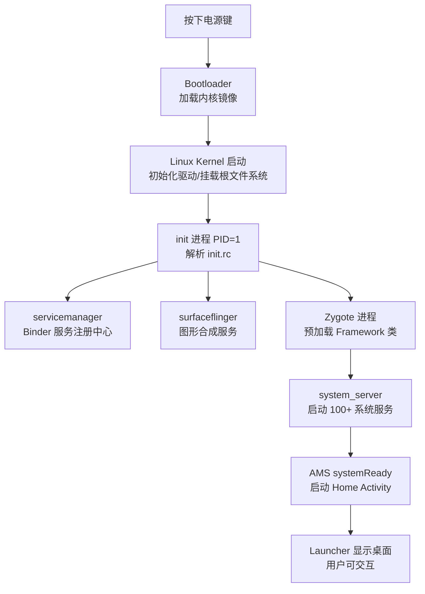
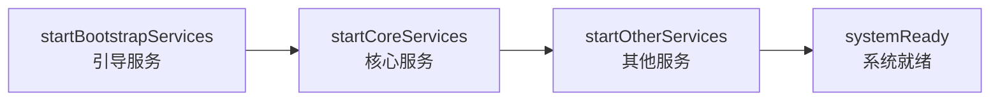

# Android 系统启动流程

>  从按下电源键到 Launcher 显示桌面，逐阶段剖析 Android 系统的完整启动链路，标注每步对应的 AOSP 源码路径

---

## 1. 启动全景图




### 各阶段概览


| 阶段           | 层级            | 源码位置                                                  | 典型耗时               |
| ------------ | ------------- | ----------------------------------------------------- | ------------------ |
| Bootloader   | 硬件/固件         | 芯片厂商私有                                                | ~1s                |
| Linux Kernel | 内核            | `kernel/`                                             | ~2-5s              |
| init 进程      | Native 用户空间   | `system/core/init/`                                   | ~1-2s              |
| Zygote       | Native → Java | `frameworks/base/cmds/app_process/`                   | ~2-3s              |
| SystemServer | Java          | `frameworks/base/services/java/.../SystemServer.java` | ~3-8s              |
| Launcher 显示  | Java          | `packages/apps/Launcher3/`                            | ~1-2s              |
| **总计**       | —             | —                                                     | **~10-20s**（因设备而异） |


---

## 2. Bootloader 与 Linux Kernel 启动

### 2.1 Bootloader

按下电源键后，CPU 从固定地址开始执行 Bootloader 代码：


| 步骤  | 操作                                  |
| --- | ----------------------------------- |
| 1   | 初始化 CPU、内存控制器、时钟                    |
| 2   | 检测启动模式（正常启动 / Recovery / Fastboot）  |
| 3   | 验证 boot.img 签名（Verified Boot / AVB） |
| 4   | 加载 Linux Kernel 和 ramdisk 到内存       |
| 5   | 跳转到 Kernel 入口地址                     |


Bootloader 代码由芯片厂商提供（如高通的 ABL、联发科的 preloader + lk），不在 AOSP 开源范围内。

### 2.2 Linux Kernel

Kernel 接管后执行标准 Linux 启动流程：

```
start_kernel()                    // 内核入口
  → 初始化内存管理、调度器、中断
  → 初始化设备驱动（Binder 驱动在此注册）
  → 挂载根文件系统（rootfs）
  → 启动第一个用户空间进程：/init（PID = 1）
```

**Binder 驱动**在内核启动阶段注册，源码位于 `kernel/drivers/android/binder.c`。这是 Android 所有跨进程通信的基础，在任何用户空间进程启动之前就已就绪。

---

## 3. init 进程（PID 1）

### 3.1 源码位置

```
system/core/init/main.cpp          ← 入口 main()
system/core/init/init.cpp          ← 核心逻辑
system/core/init/action.cpp        ← init.rc action 解析
system/core/init/service.cpp       ← 服务启动管理
system/core/rootdir/init.rc        ← 主启动脚本
```

### 3.2 三大核心职责


| 职责             | 说明                                                               |
| -------------- | ---------------------------------------------------------------- |
| **解析 init.rc** | 读取启动脚本，按 trigger（on early-init / on init / on boot 等）依次执行        |
| **启动守护进程**     | 启动 servicemanager、surfaceflinger、zygote 等关键 Native 进程            |
| **属性服务**       | 管理系统属性（`ro.build.type`、`persist.sys.`* 等），提供 `getprop`/`setprop` |


### 3.3 init.rc 关键段落

`system/core/rootdir/init.rc` 中的关键 service 定义：

```
# 启动 servicemanager — Binder 服务的注册中心，必须最先启动
service servicemanager /system/bin/servicemanager
    class core animation
    user system
    critical

# 启动 surfaceflinger — 图形合成
service surfaceflinger /system/bin/surfaceflinger
    class core animation
    user system
    onrestart restart zygote

# 启动 zygote — App 进程孵化器
service zygote /system/bin/app_process64 -Xzygote /system/bin \
        --zygote --start-system-server
    class main
    socket zygote stream 660 root system
```

### 3.4 启动顺序

```
init 解析 init.rc
  │
  ├─ on early-init
  │    → 创建文件系统挂载点、设置 SELinux
  │
  ├─ on init
  │    → 创建目录、设置权限、挂载 tmpfs
  │
  ├─ class_start core
  │    → servicemanager（Binder DNS）
  │    → surfaceflinger（图形合成）
  │    → logd（日志服务）
  │
  ├─ class_start main
  │    → zygote（注意 --start-system-server 参数）
  │
  └─ on boot
       → 设置网络、电源等属性
```

---

## 4. Zygote 进程

### 4.1 为什么需要 Zygote

每个 Android App 都运行在独立的 Dalvik/ART 虚拟机中。如果每次启动 App 都从头初始化虚拟机和加载 Framework 类，冷启动会非常慢（想象加载上万个 Framework 类）。

**Zygote 的设计**：提前启动一个"模板进程"，预加载所有常用类和资源，之后每个 App 进程通过 `fork()` 从 Zygote 复制而来。由于 Linux 的 **COW（Copy-On-Write）** 机制，fork 后父子进程共享内存页，只有写入时才真正复制，极大节省内存和启动时间。

### 4.2 启动流程

```
init 启动 zygote
  │
  ▼ Native 入口
  app_main.cpp :: main()
  源码: frameworks/base/cmds/app_process/app_main.cpp
  → 创建 AppRuntime（继承自 AndroidRuntime）
  → runtime.start("com.android.internal.os.ZygoteInit")
  → 启动 ART 虚拟机
  │
  ▼ Java 入口
  ZygoteInit.main()
  源码: frameworks/base/core/java/com/android/internal/os/ZygoteInit.java
  │
  ├─ preload()
  │    → preloadClasses()       // 预加载 ~8000+ Framework 类
  │    → preloadResources()     // 预加载系统资源（drawable/layout 等）
  │    → preloadSharedLibraries()  // 预加载 .so（libandroid_runtime 等）
  │    → nativePreloadAppProcessHALs()
  │
  ├─ ZygoteServer()
  │    → 创建 LocalServerSocket("zygote")
  │    → 等待 AMS 通过 Socket 发来 fork 请求
  │
  ├─ forkSystemServer()         // ★ fork 出 system_server
  │    → Zygote.forkSystemServer()
  │    → 子进程进入 SystemServer.main()
  │
  └─ zygoteServer.runSelectLoop()
       → 进入无限循环，监听 Socket
       → 收到请求后 fork 新 App 进程
```

### 4.3 关键源码


| 文件                                                                        | 职责                            |
| ------------------------------------------------------------------------- | ----------------------------- |
| `frameworks/base/cmds/app_process/app_main.cpp`                           | Zygote 的 Native 入口，启动 ART 虚拟机 |
| `frameworks/base/core/java/com/android/internal/os/ZygoteInit.java`       | Java 入口，预加载、fork SystemServer |
| `frameworks/base/core/java/com/android/internal/os/ZygoteServer.java`     | Socket 监听循环，接收 fork 请求        |
| `frameworks/base/core/java/com/android/internal/os/Zygote.java`           | Native fork 的 Java 封装         |
| `frameworks/base/core/java/com/android/internal/os/ZygoteConnection.java` | 处理单个 fork 请求的参数解析             |


---

## 5. SystemServer 启动

### 5.1 源码位置

```
frameworks/base/services/java/com/android/server/SystemServer.java
```

### 5.2 启动入口

Zygote fork 出 system_server 进程后，执行 `SystemServer.main()`：

```
ZygoteInit.forkSystemServer()
  → 子进程
  → ZygoteInit.handleSystemServerProcess()
  → SystemServer.main()
  → new SystemServer().run()
```

### 5.3 三阶段启动

`run()` 方法中按顺序启动三组服务：




| 阶段            | 方法                         | 启动的关键服务                                                                                                                                     |
| ------------- | -------------------------- | ------------------------------------------------------------------------------------------------------------------------------------------- |
| **Bootstrap** | `startBootstrapServices()` | Installer、DeviceIdentsPolicyService、**AMS**、**PMS**、PowerManagerService、DisplayManagerService                                               |
| **Core**      | `startCoreServices()`      | BatteryService、UsageStatsService、WebViewUpdateService                                                                                       |
| **Other**     | `startOtherServices()`     | **WMS**、**InputManagerService**、NetworkManagementService、ConnectivityService、AudioService、CameraService、NotificationManagerService 等 60+ 服务 |


### 5.4 服务启动的关键依赖顺序

```
AMS 必须先启动 → 其他服务需要通过 AMS 注册
  ↓
PMS 必须早启动 → 需要扫描所有已安装 APK
  ↓
DisplayManagerService → WMS 依赖它
  ↓
WMS 启动 → 需要 InputManagerService
  ↓
所有服务就绪 → AMS.systemReady() → 启动 Launcher
```

### 5.5 systemReady — 触发 Launcher 启动

`startOtherServices()` 的最后调用 `mActivityManagerService.systemReady()`，在其回调中：

```java
// SystemServer.java -> startOtherServices() 末尾
mActivityManagerService.systemReady(() -> {
    // 启动 SystemUI
    startSystemUi(context, windowManagerF);
    // 其他 systemReady 回调...
}, t);
```

AMS 在 `systemReady()` 内部调用 `startHomeActivityLocked()`，启动 Home（Launcher）。

---

## 6. App 进程创建（Zygote fork）

### 6.1 完整链路

当 AMS 需要启动一个新的 App 进程时（如启动 Activity 但目标进程不存在）：

```
AMS: startProcessLocked()
  │
  ▼
ProcessList: startProcess()
  │
  ▼
ZygoteProcess.start()
  源码: frameworks/base/core/java/android/os/ZygoteProcess.java
  → 通过 LocalSocket 连接 Zygote
  → 发送参数（uid、gid、target class 等）
  │
  ▼
Zygote: ZygoteConnection.processCommand()
  → Zygote.forkAndSpecialize()
  → 底层调用 fork() 系统调用
  │
  ├─ 父进程（Zygote）：返回子进程 PID，继续 runSelectLoop
  │
  └─ 子进程（新 App）：
     → ZygoteInit.childZygoteInit() 或 ZygoteInit.zygoteInit()
     → RuntimeInit.applicationInit()
     → 反射调用 ActivityThread.main()
```

### 6.2 ActivityThread.main() — App 进程的起点

```
ActivityThread.main()
  源码: frameworks/base/core/java/android/app/ActivityThread.java
  │
  ├─ Looper.prepareMainLooper()     // 创建主线程消息循环
  ├─ new ActivityThread()
  ├─ thread.attach(false)            // 通过 Binder 向 AMS 注册
  │    → AMS.attachApplication()
  │    → AMS 回调 bindApplication()
  │    → 创建 Application 对象，调用 onCreate()
  └─ Looper.loop()                   // 进入消息循环（永不返回）
```

### 6.3 fork 带来的优势


| 优势      | 说明                               |
| ------- | -------------------------------- |
| **启动快** | 不需要重新加载 Framework 类（COW 共享父进程内存） |
| **省内存** | 所有 App 共享 Zygote 预加载的只读内存页       |
| **安全**  | fork 后子进程有独立地址空间，进程间互不影响         |


---

## 7. Launcher 启动 — 开机完成

### 7.1 触发入口

```
SystemServer
  → AMS.systemReady()
  → startHomeActivityLocked()
  → 查找 CATEGORY_HOME 的 Activity
  → 启动 Launcher3 的主 Activity
```

### 7.2 Launcher 启动流程

```
AMS 发现 Home Intent 匹配 Launcher3
  → Zygote fork Launcher 进程
  → ActivityThread.main()
  → Application.onCreate()
  → Launcher Activity.onCreate()
  → 加载桌面数据（App 列表、Widget）
  → 首帧渲染上屏
  → 开机动画结束
  → 用户看到桌面，可以交互
```

### 7.3 开机动画与 Launcher 的衔接


| 事件            | 描述                                      |
| ------------- | --------------------------------------- |
| 开机动画播放        | `bootanim` 进程在 SurfaceFlinger 就绪后开始播放   |
| Launcher 首帧就绪 | WMS 收到 Launcher 的 Surface 绘制完成通知        |
| 停止开机动画        | AMS 设置 `service.bootanim.exit=1`，动画进程退出 |
| 显示桌面          | SurfaceFlinger 开始合成 Launcher 的 Surface  |


---

## 8. 真机实操验证

### 8.1 查看启动各阶段耗时

```bash
# 查看各阶段 boottime（单位：纳秒）
adb shell getprop | grep boottime

# 关键属性：
# ro.boottime.init          — init 进程启动时间
# ro.boottime.zygote        — Zygote 启动时间
# ro.boottime.surfaceflinger — SF 启动时间
```

### 8.2 查看内核启动日志

```bash
# 内核 dmesg 日志（需 root 或 userdebug 版本）
adb shell dmesg | head -50

# 查看 Binder 驱动注册
adb shell dmesg | grep -i binder
```

### 8.3 查看系统启动事件

```bash
# 启动相关的 event log
adb logcat -b events | grep -E "boot|sf_stop|wm_home"

# 查看 SystemServer 启动各服务的耗时
adb logcat -s SystemServer | head -50
```

### 8.4 用 Perfetto 抓启动 trace

```bash
# 1. 配置 trace（抓取启动全过程）
adb shell perfetto \
  -c - --txt \
  -o /data/misc/perfetto-traces/boot_trace.pb << 'EOF'
duration_ms: 30000
buffers: { size_kb: 63488  fill_policy: RING_BUFFER }
data_sources: {
  config {
    name: "linux.ftrace"
    ftrace_config {
      ftrace_events: "sched/sched_switch"
      ftrace_events: "sched/sched_wakeup"
      ftrace_events: "power/cpu_frequency"
      atrace_apps: "*"
    }
  }
}
EOF

# 2. 重启设备（trace 会在开机后自动抓取 30 秒）
adb reboot

# 3. 等待设备启动完成后拉取 trace
adb pull /data/misc/perfetto-traces/boot_trace.pb

# 4. 在 ui.perfetto.dev 中打开分析
```

在 Perfetto 中关注：


| 进程/线程           | 关注点                               |
| --------------- | --------------------------------- |
| `init`          | 各 service 启动时间点                   |
| `zygote`        | preload 耗时、forkSystemServer 时间点   |
| `system_server` | 各系统服务启动耗时                         |
| Launcher 进程     | Application.onCreate → 首帧 doFrame |


---

## 9. 面试高频问题

### Q1：Android 系统启动的大致流程？

> Bootloader 加载 Kernel → Kernel 启动第一个用户进程 init (PID 1) → init 解析 init.rc 启动 servicemanager、surfaceflinger、zygote → Zygote 预加载 Framework 类后 fork 出 system_server → SystemServer 启动 AMS/WMS/PMS 等 100+ 系统服务 → AMS.systemReady() 启动 Launcher → 用户看到桌面。

### Q2：为什么 Android 用 Zygote 来孵化 App 进程，而不是直接启动？

> Zygote 预加载了 ~8000+ Framework 类和系统资源。通过 fork + COW 机制，子进程直接共享这些只读内存页，不需要重新加载。这使得 App 冷启动从"加载虚拟机 + 加载 Framework"缩短为"fork + 加载 App 代码"，节省约 2-3 秒启动时间和数十 MB 内存。

### Q3：system_server 和 surfaceflinger 为什么不在同一个进程？

> 隔离和稳定性。system_server 是 Java 进程，承载大量系统服务，如果 OOM 或崩溃需要重启整个 Java Framework；surfaceflinger 是 C++ Native 进程，负责图形合成，对实时性要求极高。将两者分开，任一崩溃不会直接影响另一个（虽然 SF 崩溃后 init 会触发 zygote 重启）。

### Q4：AMS 是在哪个阶段启动的？

> 在 SystemServer 的 `startBootstrapServices()` 阶段，属于最早一批启动的服务。因为后续几乎所有服务和应用都需要通过 AMS 注册和管理。

### Q5：init.rc 中 Zygote 的 `--start-system-server` 参数有什么作用？

> 这个参数告诉 Zygote 在完成预加载后，自动 fork 出 system_server 进程。如果去掉这个参数，Zygote 只会进入 runSelectLoop 等待 fork 请求，system_server 不会启动，系统服务无法运行。

### Q6：App 进程是如何创建的？

> AMS 调用 `startProcessLocked()` → 通过 `ZygoteProcess` 以 LocalSocket 方式向 Zygote 发送 fork 请求（包含 uid、gid、目标类名等参数）→ Zygote 调用 `fork()` 创建子进程 → 子进程通过反射调用 `ActivityThread.main()` → 创建主线程 Looper、向 AMS 注册 → AMS 回调 `bindApplication()` 创建 Application → 进入消息循环。

---

**相关文档**：

- [Android系统架构全景](./Android系统架构全景.md) — 系统分层架构、SystemServer 服务概览
- [Binder与跨进程通信](./Binder与跨进程通信.md) — 启动链路中大量使用的 IPC 机制
- [AMS与WMS核心服务](./AMS与WMS核心服务.md) — SystemServer 中启动的核心服务详解
- [Launcher3架构](../system-ui-app/Launcher3架构.md) — 启动链路的最后一环
- [启动分析流程](../perfetto/启动分析流程.md) — App 冷启动性能分析

