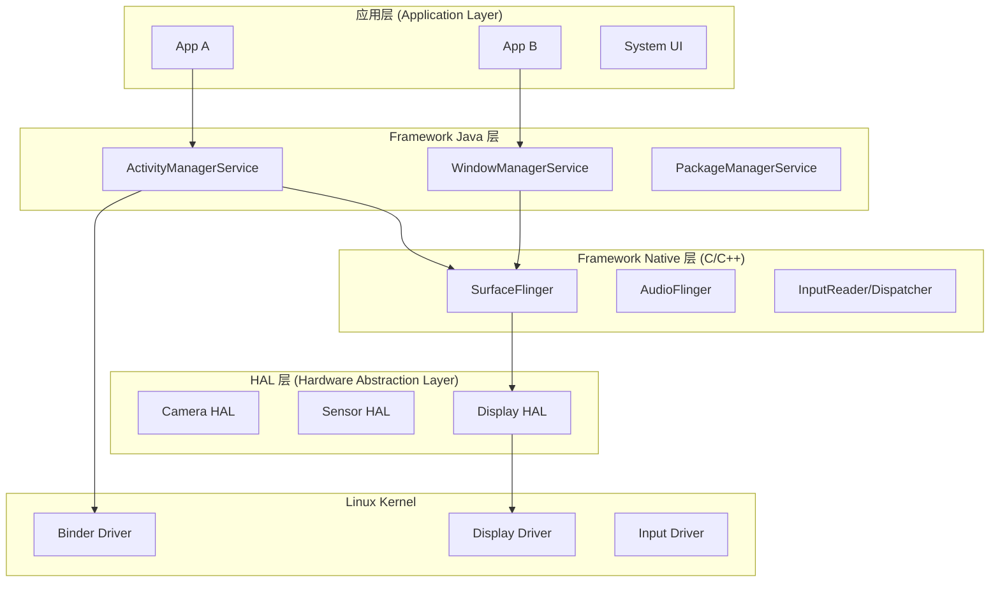
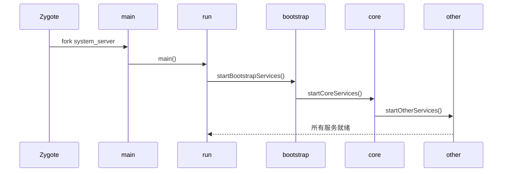

# Android 系统架构全景

---

## 目录

1. [一、Android 系统分层架构](#一android-系统分层架构)
2. [二、核心系统进程](#二核心系统进程)
3. [三、SystemServer 启动流程](#三systemserver-启动流程)
4. [四、探索工具：adb 命令](#四探索工具adb-命令)
5. [五、AI 交互建议](#五ai-交互建议)
6. [六、真机实操](#六真机实操)

---

## 一、Android 系统分层架构

Android 系统采用分层的软件架构，从应用层到内核层，各层职责清晰，协作完成系统功能。




### 1.1 各层职责简介


| 层级                   | 语言          | 典型组件                         | 说明                 |
| -------------------- | ----------- | ---------------------------- | ------------------ |
| **App**              | Java/Kotlin | 普通应用、系统应用                    | 用户可见的应用程序          |
| **Framework Java**   | Java        | AMS, WMS, PMS                | 提供应用 API，管理系统资源    |
| **Framework Native** | C/C++       | SurfaceFlinger, AudioFlinger | 图形、音频等高性能服务        |
| **HAL**              | C/C++       | 各类 HAL 实现                    | 屏蔽硬件差异，对接 Linux 驱动 |
| **Kernel**           | C           | Binder、显示、输入等驱动              | 直接操作硬件，进程调度等       |


---

## 二、核心系统进程

Android 系统启动后，会运行一系列关键进程，它们是整个系统的基础设施。


| 进程名                | 作用     | 备注                           |
| ------------------ | ------ | ---------------------------- |
| **zygote**         | 孵化器进程  | 预加载 Framework 类，fork 新应用进程   |
| **system_server**  | 系统服务容器 | 承载 AMS、WMS、PMS 等核心服务         |
| **surfaceflinger** | 图形合成   | 负责图层合成与显示输出                  |
| **app_process**    | 应用进程   | 普通 App 的宿主进程名（如 com.xxx.app） |
| **servicemanager** | 服务注册中心 | Binder 服务名的“DNS”，最先启动        |


### 2.1 进程启动顺序（简述）

```
init → zygote → system_server
         └── fork → app_process (各 App)
init → servicemanager (独立启动，最早)
init → surfaceflinger
```

### 2.2 App 进程内部线程


| 线程                    | 创建位置                    | 职责                        |
| --------------------- | ----------------------- | ------------------------- |
| **main**（UI 线程）       | `ActivityThread.main()` | Looper 消息循环，处理 UI 事件和生命周期 |
| **RenderThread**      | HWUI 首次绘制时              | 回放 DisplayList，驱动 GPU 渲染  |
| **Binder:xxx** (1-15) | 首次 Binder 调用时           | 处理来自其他进程的 Binder 请求       |
| **FinalizerDaemon**   | ART 自动创建                | 执行 finalize()             |
| **HeapTaskDaemon**    | ART 自动创建                | GC 并发标记                   |


---

## 三、SystemServer 启动流程

`SystemServer` 是 Java 层的“系统服务容器”，在 zygote fork 出 system_server 进程后由 main 入口启动。

### 3.1 源码路径

```
frameworks/base/services/java/com/android/server/SystemServer.java
```

### 3.2 启动流程概览




### 3.3 各阶段职责


| 阶段            | 方法                         | 主要启动的服务                                                            |
| ------------- | -------------------------- | ------------------------------------------------------------------ |
| **Bootstrap** | `startBootstrapServices()` | PowerManagerService, ActivityManagerService, PackageManagerService |
| **Core**      | `startCoreServices()`      | BatteryService, UsageStatsService, WebViewUpdateService            |
| **Other**     | `startOtherServices()`     | InputManagerService, WindowManagerService, DisplayManagerService 等 |


### 3.4 关键服务注册

- **AMS (ActivityManagerService)**：四大组件、任务栈、进程管理
- **WMS (WindowManagerService)**：窗口管理、布局、Surface
- **PMS (PackageManagerService)**：应用安装、权限、PackageInfo
- **InputManagerService**：输入事件分发
- **SurfaceFlinger**：通过 DisplayManagerService 间接对接，负责图形合成

---

## 四、探索工具：adb 命令

### 4.1 查看系统进程

```bash
# 查看所有进程
adb shell ps -A

# 筛选 system_server、zygote 等
adb shell ps -A | grep -E "system_server|zygote|surfaceflinger|servicemanager"
```

### 4.2 查看服务列表

```bash
# 所有 dumpsys 可用的服务
adb shell dumpsys -l

# 查看服务列表（Binder 方式注册的）
adb shell service list
```

### 4.3 查看具体服务

```bash
# Activity 相关
adb shell dumpsys activity

# 窗口相关
adb shell dumpsys window

# 包管理
adb shell dumpsys package
```

---

## 五、AI 交互建议

阅读源码或调试时，可以向 AI 提问以下类型的问题，加深理解：

1. **流程类**：`SystemServer.java 中 startBootstrapServices() 具体启动了哪些服务？按顺序说明。`
2. **关系类**：`AMS 和 zygote 如何协作 fork 新应用进程？`
3. **调用链类**：`点击桌面图标到 Activity 显示，涉及哪些 Framework 层调用？`
4. **对比类**：`system_server 和 surfaceflinger 分别负责什么，为什么分开？`
5. **调试类**：`如何用 adb 确认某个服务是否正常运行？`

---

## 六、真机实操

在真实设备或模拟器上依次执行，验证对系统架构的理解。

### 6.1 确认核心进程存在

```bash
adb shell ps -A | grep -E "zygote|system_server|surfaceflinger|servicemanager"
```

预期：能查到上述进程名及其 PID。

### 6.2 确认 SystemServer 中的服务

```bash
adb shell service list | head -30
```

预期：能看到 `activity`、`window`、`package` 等服务名。

### 6.3 查看 AMS 简要信息

```bash
adb shell dumpsys activity --help
adb shell dumpsys activity top
```

预期：能输出当前顶部 Activity 信息。

### 6.4 查看 WMS 信息

```bash
adb shell dumpsys window displays
```

预期：能看到显示屏分辨率、density 等。

