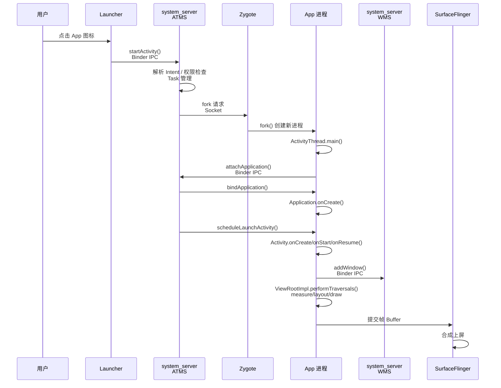

# Android App 启动流程

>  从用户点击图标到首帧上屏，逐阶段剖析 App 启动的跨进程完整链路，标注每步对应的 AOSP 源码路径

---

## 1. App 启动全景图

### 1.1 完整启动序列




### 1.2 冷启动 / 温启动 / 热启动


| 类型      | 进程状态              | 启动路径                                                        | 典型耗时   |
| ------- | ----------------- | ----------------------------------------------------------- | ------ |
| **冷启动** | 进程不存在             | Zygote fork → Application.onCreate → Activity.onCreate → 首帧 | 1-3s   |
| **温启动** | 进程存在，Activity 被销毁 | Activity.onCreate → 首帧（跳过进程创建和 Application 初始化）             | 0.3-1s |
| **热启动** | 进程存在，Activity 在后台 | Activity.onRestart → onStart → onResume                     | <0.3s  |


冷启动是面试和性能优化的重点，涵盖了完整链路。下文以冷启动为主线展开。

---

## 2. Launcher 发起启动请求

### 2.1 调用链

```
用户点击图标
  │
  ▼
Launcher.startActivitySafely()
  源码: packages/apps/Launcher3/src/com/android/launcher3/Launcher.java
  │
  ▼
Activity.startActivity(intent)
  源码: frameworks/base/core/java/android/app/Activity.java
  │
  ▼
Instrumentation.execStartActivity()
  源码: frameworks/base/core/java/android/app/Instrumentation.java
  → 将 Intent 打包为 Parcel
  → 通过 Binder 调用 ATMS
  │
  ▼
IActivityTaskManager.Stub.Proxy.startActivity()
  → Binder IPC 跨进程到 system_server
```

### 2.2 关键源码


| 文件                     | 方法                         | 职责                        |
| ---------------------- | -------------------------- | ------------------------- |
| `Activity.java`        | `startActivity()`          | 用户 API 入口                 |
| `Activity.java`        | `startActivityForResult()` | 实际启动逻辑，调用 Instrumentation |
| `Instrumentation.java` | `execStartActivity()`      | 组装参数，发起 Binder 调用         |


### 2.3 Binder 跨进程的关键点

`Instrumentation.execStartActivity()` 中调用：

```java
int result = ActivityTaskManager.getService()
    .startActivity(whoThread, who.getOpPackageName(), ..., intent, ...);
```

`ActivityTaskManager.getService()` 返回的是 `IActivityTaskManager` 的 Binder 代理对象，调用 `startActivity()` 时数据通过 Binder Driver 从 Launcher 进程传输到 system_server 进程。

---

## 3. system_server 处理启动请求

### 3.1 核心调用链

```
ActivityTaskManagerService.startActivity()
  源码: frameworks/base/services/core/java/com/android/server/wm/
        ActivityTaskManagerService.java
  │
  ▼
ActivityTaskManagerService.startActivityAsUser()
  → 权限检查、UserId 处理
  │
  ▼
ActivityStarter.execute()
  源码: frameworks/base/services/core/java/com/android/server/wm/
        ActivityStarter.java
  │
  ├─ resolveIntent()          // 通过 PMS 解析目标 Activity
  ├─ resolveActivity()        // 确定目标 ComponentName
  ├─ 检查权限（AppOps、权限模型）
  ├─ 处理 Task 和 ActivityStack
  │    → 创建或复用 Task
  │    → 计算启动模式（standard/singleTop/singleTask/singleInstance）
  │
  ▼
ActivityStarter.startActivityUnchecked()
  → ActivityStarter.startActivityInner()
  │
  ▼
RootWindowContainer.resumeFocusedTasksTopActivities()
  源码: frameworks/base/services/core/java/com/android/server/wm/
        RootWindowContainer.java
  │
  ▼
判断目标进程是否存在？
  ├─ 已存在 → 直接调度 Activity 生命周期
  └─ 不存在 → 请求创建新进程（见第 4 章）
```

### 3.2 Intent 解析过程


| 步骤                  | 说明                                        |
| ------------------- | ----------------------------------------- |
| `resolveIntent()`   | 调用 PMS 根据 Intent 查找匹配的 Activity           |
| `resolveActivity()` | 从解析结果中取出目标 `ComponentName`                |
| 权限检查                | exported 属性、permission 声明、AppOps 检查       |
| 启动模式处理              | 根据 `launchMode` + Intent Flags 决定 Task 归属 |


### 3.3 启动模式决策

```
ATMS 收到 startActivity 请求
  │
  ├─ FLAG_ACTIVITY_NEW_TASK? → 创建新 Task
  ├─ singleTask / singleInstance? → 查找已有 Task
  ├─ singleTop + 栈顶匹配? → 调用 onNewIntent()，不创建新 Activity
  └─ standard? → 在当前 Task 栈顶创建新 Activity 实例
```

### 3.4 关键源码文件


| 文件                                | 职责                       |
| --------------------------------- | ------------------------ |
| `ActivityTaskManagerService.java` | ATMS 主类，接收 Binder 调用     |
| `ActivityStarter.java`            | 启动逻辑核心，处理 Intent/Task/权限 |
| `RootWindowContainer.java`        | 管理所有 Display 和 Task 的容器  |
| `Task.java`                       | Task 栈管理                 |
| `ActivityRecord.java`             | 单个 Activity 的服务端记录       |
| `ActivityClientController.java`   | 控制客户端 Activity 生命周期回调    |


---

## 4. Zygote fork 新进程（冷启动）

当 ATMS 发现目标进程不存在时，需要通过 Zygote 创建新进程。

### 4.1 调用链

```
ATMS 发现目标进程不存在
  │
  ▼
ActivityManagerService.startProcessLocked()
  → ProcessList.startProcess()
  │
  ▼
ZygoteProcess.start()
  源码: frameworks/base/core/java/android/os/ZygoteProcess.java
  → 通过 LocalSocket 连接 Zygote
  → 发送参数（uid, gid, niceName, entryPoint = "android.app.ActivityThread"）
  │
  ▼
Zygote 端: ZygoteConnection.processCommand()
  源码: frameworks/base/core/java/com/android/internal/os/ZygoteConnection.java
  → Zygote.forkAndSpecialize()   // 底层 fork()
  │
  ├─ 父进程（Zygote）：返回子进程 PID，继续监听
  │
  └─ 子进程（新 App）：
     → ZygoteInit.zygoteInit()
     → RuntimeInit.applicationInit()
     → 反射调用 ActivityThread.main()   // entryPoint
```

### 4.2 为什么用 fork 而不是新建进程


| 优势      | 说明                                         |
| ------- | ------------------------------------------ |
| **启动快** | 共享 Zygote 已预加载的 ~8000+ Framework 类（COW 机制） |
| **省内存** | 所有 App 共享只读内存页，只有写入时才复制                    |
| **一致性** | 所有 App 进程的初始状态相同，减少兼容性问题                   |


> 详细的 Zygote fork 机制参见 [01-1-Android系统启动流程.md](./01-1-Android系统启动流程.md) 第 4、6 章。

---

## 5. ActivityThread — App 进程初始化

### 5.1 ActivityThread.main()

```
ActivityThread.main()
  源码: frameworks/base/core/java/android/app/ActivityThread.java
  │
  ├─ Looper.prepareMainLooper()     // 创建主线程消息循环
  │
  ├─ new ActivityThread()
  │
  ├─ thread.attach(false, startSeq)  // 关键步骤
  │    │
  │    ├─ 获取 AMS 的 Binder 代理
  │    └─ mgr.attachApplication(mAppThread, startSeq)
  │         → Binder IPC 到 system_server
  │         → AMS 收到后回调 bindApplication()
  │
  └─ Looper.loop()                   // 进入消息循环，永不返回
```

### 5.2 handleBindApplication() — Application 创建

当 AMS 通过 `attachApplication()` 回调到 App 进程时：

```
AMS.attachApplicationLocked()
  → thread.bindApplication(...)   // 跨进程回调
  │
  ▼
ActivityThread.handleBindApplication()
  │
  ├─ 创建 LoadedApk（APK 信息和 ClassLoader）
  │
  ├─ 创建 Instrumentation 对象
  │
  ├─ 创建 Application 对象
  │    → mInstrumentation.newApplication(cl, appClass, appContext)
  │
  ├─ ★ 初始化 ContentProvider（在 Application.onCreate 之前！）
  │    → installContentProviders(app, providers)
  │    → 每个 ContentProvider 的 onCreate() 被调用
  │
  └─ ★ mInstrumentation.callApplicationOnCreate(app)
       → Application.onCreate()    // 开发者的初始化代码在这里执行
```

### 5.3 ContentProvider 的初始化陷阱

```
执行顺序：
  Application 构造函数
  → Application.attachBaseContext()
  → ContentProvider.onCreate()     // ★ 先于 Application.onCreate
  → Application.onCreate()
```

这是一个常见的性能陷阱：很多第三方 SDK 通过 ContentProvider 实现"无侵入初始化"，它们的 `onCreate()` 在 `Application.onCreate()` 之前执行，可能显著增加启动耗时。

---

## 6. Activity 生命周期启动

### 6.1 ATMS 调度 Activity 启动

AMS 完成 `attachApplication` 后，发现有等待启动的 Activity，于是：

```
AMS.attachApplicationLocked()
  → mAtmInternal.attachApplication(...)
  → RootWindowContainer.attachApplication(wpc)
  → realStartActivityLocked(activityRecord, wpc)
  → ClientLifecycleManager.scheduleTransaction(...)
       → 通过 Binder 回调到 App 进程
```

### 6.2 handleLaunchActivity()

```
ActivityThread.handleLaunchActivity()
  │
  ▼
performLaunchActivity()
  │
  ├─ mInstrumentation.newActivity()
  │    → 通过反射创建 Activity 实例
  │
  ├─ activity.attach(...)
  │    → 创建 PhoneWindow
  │    → 关联 WindowManager
  │    → 设置 Callback（事件分发链的起点）
  │
  ├─ mInstrumentation.callActivityOnCreate(activity, ...)
  │    → Activity.onCreate(savedInstanceState)
  │    → 开发者在这里调用 setContentView()
  │         → PhoneWindow.setContentView()
  │         → LayoutInflater.inflate() 解析 XML 创建 View 树
  │
  └─ activity.performStart()
       → Activity.onStart()
```

### 6.3 handleResumeActivity()

```
ActivityThread.handleResumeActivity()
  │
  ├─ activity.performResume()
  │    → Activity.onResume()
  │
  └─ ★ WindowManager.addView(decor, layoutParams)
       → WindowManagerImpl.addView()
       → WindowManagerGlobal.addView()
       → 创建 ViewRootImpl
       → ViewRootImpl.setView(decorView, ...)
```

`addView()` 是从 Activity 生命周期跳转到渲染管线的关键桥梁。在 `onResume()` 之后，DecorView 才被添加到窗口系统，首帧渲染才会开始。

---

## 7. Window 创建与首帧渲染

### 7.1 ViewRootImpl.setView()

```
ViewRootImpl.setView(view, attrs, panelParentView)
  源码: frameworks/base/core/java/android/view/ViewRootImpl.java
  │
  ├─ requestLayout()                    // 触发首次布局请求
  │    → scheduleTraversals()
  │    → Choreographer.postCallback(CALLBACK_TRAVERSAL, mTraversalRunnable)
  │    → 等待下一个 VSYNC-app 信号
  │
  └─ mWindowSession.addToDisplayAsUser(...)
       → Binder IPC 到 WMS
       → WMS.addWindow()               // 在 system_server 注册窗口
       → 分配 Surface（通过 SurfaceControl）
```

### 7.2 首帧 performTraversals()

收到 VSync 信号后，Choreographer 触发：

```
ViewRootImpl.performTraversals()
  │
  ├─ performMeasure(childWidthMeasureSpec, childHeightMeasureSpec)
  │    → DecorView.measure() → 递归测量整棵 View 树
  │
  ├─ performLayout(lp, desiredWindowWidth, desiredWindowHeight)
  │    → DecorView.layout() → 递归布局整棵 View 树
  │
  └─ performDraw()
       → draw(fullRedrawNeeded, usingAsyncReport)
       → mAttachInfo.mThreadedRenderer.draw(...)
       → HWUI 录制 DisplayList → RenderThread 提交 GPU 渲染
       → 帧 Buffer 通过 BufferQueue 传递给 SurfaceFlinger
       → SurfaceFlinger 合成上屏
       → 用户看到 App 首帧画面
```

### 7.3 首帧渲染涉及的关键组件


| 组件             | 层级             | 职责                      | 源码路径                                                        |
| -------------- | -------------- | ----------------------- | ----------------------------------------------------------- |
| ViewRootImpl   | Java Framework | 驱动 measure/layout/draw  | `frameworks/base/core/java/android/view/ViewRootImpl.java`  |
| Choreographer  | Java Framework | VSync 信号接收和帧调度          | `frameworks/base/core/java/android/view/Choreographer.java` |
| HWUI           | Native         | 硬件加速渲染，DisplayList 录制回放 | `frameworks/base/libs/hwui/`                                |
| BufferQueue    | Native         | 生产者-消费者帧缓冲队列            | `frameworks/native/libs/gui/`                               |
| SurfaceFlinger | Native         | 图层合成，输出到屏幕              | `frameworks/native/services/surfaceflinger/`                |


> 详细的渲染管线参见 [03-View绘制体系.md](./03-View绘制体系.md)、[04-HWUI渲染管线.md](./04-HWUI渲染管线.md)、[07-渲染全链路.md](./07-渲染全链路.md)。

---

## 8. 启动耗时指标与调试

### 8.1 adb 测量启动时间

```bash
# 冷启动测量（先 force-stop 确保进程不存在）
adb shell am force-stop com.example.app
adb shell am start -W -n com.example.app/.MainActivity
```

输出示例：

```
Status: ok
LaunchState: COLD
Activity: com.example.app/.MainActivity
TotalTime: 1523
WaitTime: 1547
ThisTime: 1523
```


| 指标              | 含义                                                  |
| --------------- | --------------------------------------------------- |
| **WaitTime**    | 系统从收到 startActivity 请求到 App 完成 resume 的总耗时（含排队等待）   |
| **TotalTime**   | App 自身从启动到 onResume 完成的耗时                           |
| **ThisTime**    | 当前 Activity 的启动耗时（从 pause 上一个 Activity 到 resume 当前） |
| **LaunchState** | COLD / WARM / HOT 标识启动类型                            |


### 8.2 reportFullyDrawn()

`TotalTime` 只衡量到 `onResume()`，但用户真正感知的"启动完成"往往是首页数据加载完毕。可以在数据加载完成后手动调用：

```java
// Activity 中，在首页数据加载完成后
reportFullyDrawn();
```

对应 logcat 中会输出 `Fully drawn ... +Xms`，Perfetto 中也会记录对应的 slice。

### 8.3 Perfetto 关键 Slice

在 Perfetto trace 中，App 启动的关键事件可通过以下 slice 定位：


| Slice 名称                | 所在进程             | 含义                          |
| ----------------------- | ---------------- | --------------------------- |
| `bindApplication`       | App 进程           | Application 初始化阶段           |
| `activityStart`         | App 进程           | Activity.onCreate/onStart   |
| `activityResume`        | App 进程           | Activity.onResume           |
| `Choreographer#doFrame` | App 进程           | 首帧渲染（含 measure/layout/draw） |
| `DrawFrame`             | App RenderThread | HWUI 渲染提交                   |
| `onMessageRefresh`      | SurfaceFlinger   | SF 合成上屏                     |


```sql
-- Perfetto SQL: 查找 App 启动各阶段耗时
SELECT name, dur / 1000000.0 AS ms
FROM slice
WHERE name IN ('bindApplication', 'activityStart', 'activityResume')
ORDER BY ts;

-- 查找首帧 doFrame 耗时
SELECT ts, dur / 1000000.0 AS ms
FROM slice
WHERE name LIKE '%doFrame%'
ORDER BY ts
LIMIT 5;
```

### 8.4 各阶段典型耗时分布（冷启动）

```
总启动时间 ~1500ms 的典型分布：

Zygote fork + 进程初始化    ██░░░░░░░░░░░░░░  ~100ms (7%)
bindApplication             ████████░░░░░░░░  ~500ms (33%)
  ├─ ContentProvider.onCreate  ██░░░░░░░░░░░░  ~150ms
  └─ Application.onCreate      ██████░░░░░░░░  ~350ms
Activity.onCreate           ████░░░░░░░░░░░░  ~300ms (20%)
  └─ setContentView (inflate)  ███░░░░░░░░░░░  ~200ms
Activity.onResume           █░░░░░░░░░░░░░░░  ~50ms  (3%)
首帧渲染                     ████████████░░░░  ~550ms (37%)
  ├─ measure + layout          ███░░░░░░░░░░░  ~150ms
  ├─ draw + HWUI               ███░░░░░░░░░░░  ~200ms
  └─ SF 合成                   ██░░░░░░░░░░░░  ~200ms
```

> 详细的启动性能分析方法参见 [12-启动与内存分析实战.md](./12-启动与内存分析实战.md)。

---

## 9. 面试高频问题

### Q1：描述一下 Android App 的冷启动完整流程？

> 用户点击图标 → Launcher 通过 `startActivity()` 发起请求 → 经 Instrumentation 打包后 Binder IPC 到 system_server 的 ATMS → ATMS 解析 Intent、处理 Task、发现目标进程不存在 → 通过 Socket 请求 Zygote fork → 子进程执行 `ActivityThread.main()` → 创建 Looper、向 AMS 注册 → AMS 回调 `bindApplication()` 创建 Application → 调度 `handleLaunchActivity()` 执行 Activity 生命周期 → `onResume()` 后通过 `WindowManager.addView()` 创建 ViewRootImpl → 等待 VSync 后执行 `performTraversals()`（measure/layout/draw）→ HWUI 提交帧给 SurfaceFlinger 合成上屏。

### Q2：冷启动、温启动、热启动有什么区别？

> **冷启动**：进程不存在，需要 Zygote fork + Application 创建 + Activity 创建，最慢。**温启动**：进程存在但 Activity 被销毁，跳过进程创建和 Application 初始化。**热启动**：进程和 Activity 都在后台，只需 onRestart → onStart → onResume，最快。面试时重点关注冷启动，因为它涉及最完整的系统交互链路。

### Q3：为什么 ContentProvider 会影响启动速度？

> ContentProvider 的 `onCreate()` 在 `Application.onCreate()` 之前被调用（在 `handleBindApplication()` 中先 `installContentProviders` 再 `callApplicationOnCreate`）。很多第三方 SDK（如 Firebase、LeakCanary）利用 ContentProvider 实现"无侵入自动初始化"，每个 ContentProvider 的 `onCreate()` 都会在冷启动时串行执行，显著拖慢启动速度。优化手段：使用 `androidx.startup` 合并初始化、延迟加载非必要 SDK。

### Q4：首帧是在什么时候渲染的？

> 在 `Activity.onResume()` 之后。`handleResumeActivity()` 中先调用 `onResume()`，然后执行 `WindowManager.addView(decorView)`，此时创建 ViewRootImpl 并调用 `requestLayout()`，向 Choreographer 注册一次遍历回调。等下一个 VSync 信号到达时，Choreographer 触发 `performTraversals()`，依次执行 measure → layout → draw，完成首帧渲染。

### Q5：Activity 的 Window 和 ViewRootImpl 是什么关系？

> 每个 Activity 持有一个 `PhoneWindow`（在 `activity.attach()` 时创建），PhoneWindow 内部包含一个 `DecorView` 作为 View 树的根。当 `onResume()` 后 DecorView 通过 `WindowManager.addView()` 被添加到窗口系统时，会创建一个 `ViewRootImpl` 作为 DecorView 和 WMS 之间的桥梁。ViewRootImpl 负责：(1) 向 WMS 注册窗口、(2) 驱动 View 树的 measure/layout/draw、(3) 分发输入事件。

### Q6：startActivity 是同步还是异步的？ATMS 如何通知 App 启动 Activity？

> `startActivity()` 本身是同步 Binder 调用（等待 ATMS 处理完 Intent 解析和 Task 管理后返回结果码），但 Activity 的实际创建和生命周期回调是异步的。ATMS 通过 `ClientLifecycleManager` 将生命周期事务（`LaunchActivityItem`、`ResumeActivityItem`）打包为 `ClientTransaction`，通过 Binder 回调到 App 进程的 `ApplicationThread`，再通过 Handler 投递到主线程消息队列异步执行。

### Q7：如何优化 App 冷启动时间？

> 按阶段优化：(1) **Application.onCreate** — 延迟加载非必要 SDK，使用 `androidx.startup` 合并 ContentProvider，异步初始化。(2) **Activity.onCreate** — 减少 setContentView 中的布局层级，使用 ViewStub 延迟加载、异步 Inflate。(3) **首帧渲染** — 减少 View 数量、避免 `requestLayout` 嵌套、使用 `postponeEnterTransition` 控制过渡动画时机。(4) **全局** — 设置启动主题（windowBackground）给用户视觉反馈，避免白屏感知。

---

**相关文档**：

- [01-1-Android系统启动流程](./01-1-Android系统启动流程.md) — 系统启动到 Launcher 显示，本文从 Launcher 点击开始
- [02-Binder与跨进程通信](./02-Binder与跨进程通信.md) — 启动链路中 Launcher↔ATMS↔App 的 Binder IPC 机制
- [02-1-AMS与WMS核心服务](./02-1-AMS与WMS核心服务.md) — ATMS/AMS 处理 startActivity 的服务端逻辑
- [03-View绘制体系](./03-View绘制体系.md) — 首帧 performTraversals 的 measure/layout/draw 详解
- [04-HWUI渲染管线](./04-HWUI渲染管线.md) — 首帧 draw 后 HWUI 的 DisplayList 录制与 GPU 渲染
- [07-渲染全链路](./07-渲染全链路.md) — 从触摸到像素上屏的完整渲染路径
- [12-启动与内存分析实战](./12-启动与内存分析实战.md) — 使用 Perfetto 分析冷启动性能瓶颈

