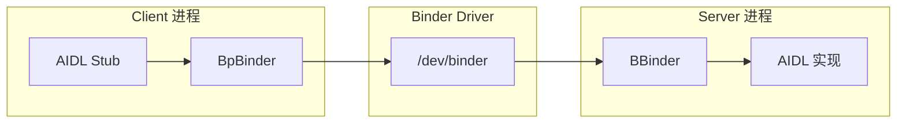
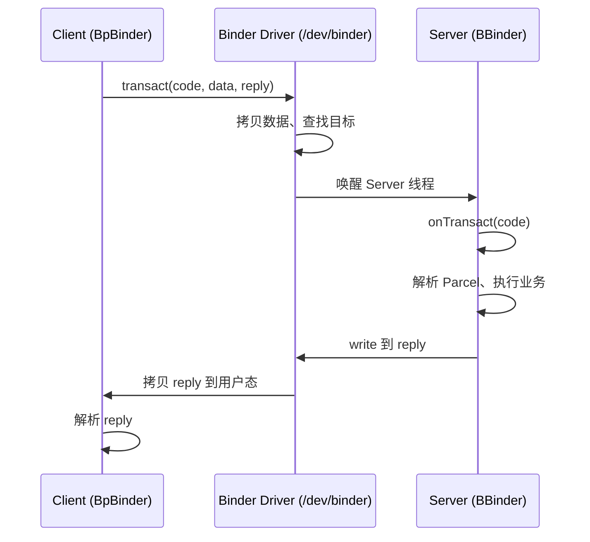
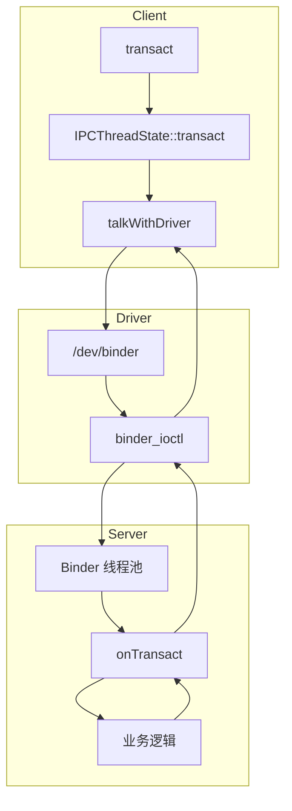

# Binder 与跨进程通信

> 系统学习 Framework 中的 IPC 机制

---

## 目录

1. [一、为什么选择 Binder？](#一为什么选择-binder)
2. [二、Binder 架构概览](#二binder-架构概览)
3. [三、Binder 事务流程](#三binder-事务流程)
4. [四、Java 层：Binder、IBinder、AIDL](#四java-层binderibinderaidl)
5. [五、Native 层：IPCThreadState 与 ProcessState](#五native-层ipcthreadstate-与-processstate)
6. [六、ServiceManager：服务的“DNS”](#六servicemanager服务的dns)
7. [七、AIDL 工作原理（从 App 到内核）](#七aidl-工作原理从-app-到内核)
8. [八、Binder 线程池与限制](#八binder-线程池与限制)
9. [九、Mermaid：Binder 事务流程（详细）](#九mermaidbinder-事务流程详细)
10. [十、AI 交互建议](#十ai-交互建议)
11. [十一、真机实操](#十一真机实操)
12. [十二、源码阅读建议](#十二源码阅读建议)
13. [十三、下一步学习建议](#十三下一步学习建议)

---

## 一、为什么选择 Binder？

Android 需要一种高效的跨进程通信（IPC）机制，用于 App 与系统服务（如 AMS、PMS）的交互。相比其他方案，Binder 有其独特优势。

### 1.1 与其他 IPC 方式对比

| 方式 | 数据拷贝次数 | 安全性 | 典型场景 |
|------|-------------|--------|----------|
| **共享内存** | 0 次 | 需自行校验 UID/PID | 高性能本地共享 |
| **Socket** | 2 次 | 需自行实现校验 | 网络、跨主机 |
| **Pipe** | 2 次 | 无身份信息 | 管道、重定向 |
| **Binder** | **1 次** | 内核校验 UID/PID | Android 系统 IPC |

### 1.2 Binder 的典型优势

1. **一次拷贝**：通过 mmap 在内核与用户态之间共享映射，减少一次拷贝，性能更好。
2. **安全身份**：内核可获取调用方 UID/PID，支持权限校验，适合多应用、多进程环境。
3. **面向对象**：天然支持“远程对象引用”，与 Java 的接口风格一致。
4. **引用计数**：内核管理 Binder 对象引用，自动回收，避免泄漏。

---

## 二、Binder 架构概览



### 2.1 角色说明

| 角色 | 类/组件 | 职责 |
|------|---------|------|
| **Client** | BpBinder (Proxy) | 持有 Binder 引用，发起 transact() |
| **Driver** | /dev/binder | 内核驱动，完成跨进程数据搬运和调度 |
| **Server** | BBinder (Base) | 实现 onTransact()，处理请求并返回结果 |

---

## 三、Binder 事务流程



---

## 四、Java 层：Binder、IBinder、AIDL

### 4.1 核心类

| 类/接口 | 说明 |
|---------|------|
| `IBinder` | 跨进程对象引用的抽象接口 |
| `Binder` | 服务端基类，实现 `IBinder`，子类重写 `onTransact()` |
| `BinderProxy` | 客户端代理，内部持有 native BpBinder |

### 4.2 源码路径

```
frameworks/base/core/java/android/os/Binder.java
```

### 4.3 AIDL 生成代码的作用

从 App 开发视角，AIDL 用来声明接口并自动生成 Stub（服务端）和 Proxy（客户端）：

- **Stub**：继承 `Binder`，实现 `onTransact()`，根据 `code` 分发到对应方法。
- **Proxy**：实现 AIDL 接口，内部持有 `IBinder`，调用时通过 `transact()` 发送数据。

底层仍然是 Binder 的 `transact()` + `onTransact()`，AIDL 只是自动生成封装代码。

---

## 五、Native 层：IPCThreadState 与 ProcessState

### 5.1 源码路径

```
frameworks/native/libs/binder/IPCThreadState.cpp
frameworks/native/libs/binder/ProcessState.cpp
```

### 5.2 关键逻辑

| 文件 | 主要职责 |
|------|----------|
| **ProcessState.cpp** | 单例，`open_driver()` 打开 `/dev/binder`，`mmap()` 建立映射 |
| **IPCThreadState.cpp** | 线程局部单例，`talkWithDriver()` 与内核交互，执行 `BR_*`/`BC_*` 命令 |

### 5.3 典型调用链

```
Client: transact() → IPCThreadState::transact() → talkWithDriver()
Server: Looper 收到 BR_TRANSACTION → onTransact() → 业务逻辑 → 写 reply
```

---

## 六、ServiceManager：服务的“DNS”

ServiceManager 是 Binder 体系中的“服务注册中心”，负责：

- 存储服务名 → Binder 句柄的映射
- 提供 `getService(name)`、`addService(name, binder)` 等接口

### 6.1 源码路径

```
frameworks/native/cmds/servicemanager/
```

### 6.2 典型流程

1. Server 启动后调用 `addService("activity", ams_binder)` 注册。
2. Client 调用 `getService("activity")` 获取 IBinder。
3. Client 通过该 IBinder 向 AMS 发起 Binder 调用。

---

## 七、AIDL 工作原理（从 App 到内核）

### 7.1 App 开发者视角

1. 定义 `.aidl` 文件，声明接口方法。
2. 编译后生成 `Xxx.Stub` 和 `Xxx.Proxy`。
3. 服务端继承 `Stub` 并实现业务逻辑。
4. 客户端通过 `asInterface(binder)` 得到 Proxy，按接口调用。

### 7.2 底层实际流程（标注每步所处层级）

```
Client 进程                          Server 进程
─────────────────────────────────────────────────────────

[Java 层]
1. Proxy.method(args)
   → 将参数写入 Parcel
   → 调用 mRemote.transact(code, data, reply)

[Native 层 - 用户空间]
2. IPCThreadState::transact()
   → talkWithDriver()
   → ioctl(fd, BINDER_WRITE_READ, &bwr)
   ─ ─ ─ ─ ─ ─ ─ ─ 系统调用边界 ─ ─ ─ ─ ─ ─ ─ ─

[Linux Kernel - 内核空间]               
3. binder_ioctl() → binder_thread_write()
   → 根据句柄找到目标进程的 binder_node
   → binder_transaction(): 分配目标进程的内核缓冲区
   → copy_from_user(): 将数据从 Client 拷贝到内核
   → 内核缓冲区已 mmap 映射到 Server 进程（零拷贝）
   → 唤醒 Server 端 Binder 线程
   源码: kernel/drivers/android/binder.c

   ─ ─ ─ ─ ─ ─ ─ ─ 系统调用边界 ─ ─ ─ ─ ─ ─ ─ ─
[Native 层 - Server 端]
4. IPCThreadState::executeCommand()
   → 读取事务数据

[Java 层 - Server 端]
5. Stub.onTransact(code, data, reply)
   → 根据 code 调用对应业务方法
   → 将返回值写入 reply

[反向路径: reply 原路返回]
6. reply 数据经 Kernel → Client IPCThreadState → Proxy
   → Proxy 从 reply 解析返回值并返回给调用者
```

**关键点**：步骤 3 是整个 Binder 通信中唯一发生在 **Linux 内核态** 的部分。内核负责：
- 进程间数据拷贝（利用 `mmap` 实现"一次拷贝"）
- 根据 Binder 句柄查找目标进程
- 线程唤醒和调度
- 安全校验（UID/PID 验证）

---

## 八、Binder 线程池与限制

- 每个 Binder 进程有一个**默认 Binder 线程池**，处理收到的 Binder 事务。
- 默认最大线程数（常见实现）约 15 个（`BINDER_SET_MAX_THREADS`）。
- 若事务堆积、线程全部阻塞，新事务会排队，可能导致 ANR。
- 耗时的 Binder 调用应尽量移到业务线程，避免长时间占用 Binder 线程。

---

## 九、Mermaid：Binder 事务流程（详细）



---

## 十、AI 交互建议

阅读 Binder 相关源码或排查问题时，可以向 AI 提问：

1. **机制类**：`Binder 相比 Socket 为什么只需一次拷贝？mmap 在这里的作用是什么？`
2. **流程类**：`一次 AIDL 调用的完整路径是怎样的？从 Proxy 到 Stub。`
3. **实现类**：`IPCThreadState::talkWithDriver() 与内核交互的具体流程是什么？`
4. **调试类**：`如何确认某个服务是否通过 Binder 正常注册？`
5. **性能类**：`Binder 线程池满了会怎样？如何避免 Binder 调用导致 ANR？`

---

## 十一、真机实操

在设备或模拟器上执行以下命令，验证对 Binder 与服务的理解。

### 11.1 查看所有 Binder 服务

```bash
adb shell service list
```

预期：能看到 `activity`、`window`、`package`、`input` 等系统服务名。

### 11.2 通过 dumpsys 查看服务状态

```bash
# 查看 activity 服务
adb shell dumpsys activity

# 查看 input 服务
adb shell dumpsys input
```

说明：`dumpsys` 本质上是通过 Binder 调用对应服务的 `dump()` 方法。

### 11.3 查看 Binder 统计（需 root 或 debug 内核）

```bash
adb shell cat /sys/kernel/debug/binder/stats
```

说明：部分设备需 `adb root` 或使用 userdebug 镜像才能访问。可看到各进程的 Binder 事务数、对象数等。

### 11.4 查看进程的 Binder 线程

```bash
adb shell ps -T -p $(adb shell pidof system_server)
```

说明：`-T` 可展示线程信息，配合 `system_server` 可观察其 Binder 线程。

---

## 十二、源码阅读建议

建议按以下顺序阅读：

1. **Java**：`Binder.java`、`BinderProxy` 的 `transact()` 实现
2. **Native**：`ProcessState.cpp` 的 `open_driver()`、`IPCThreadState.cpp` 的 `talkWithDriver()`
3. **驱动**：`kernel/drivers/android/binder.c`（若有 kernel 源码）
4. **ServiceManager**：`servicemanager/` 的 `main()` 与 `addService`/`getService` 实现

---

## 十三、下一步学习建议

- 结合 [Android系统架构全景](./Android系统架构全景.md) 理解各系统服务如何通过 Binder 对外提供能力
- 自行编写一个简单的 AIDL 服务，并用 `service list`、`dumpsys` 观察其注册与调用
- 学习 Binder 驱动源码，深入理解一次拷贝与 mmap 的实现
