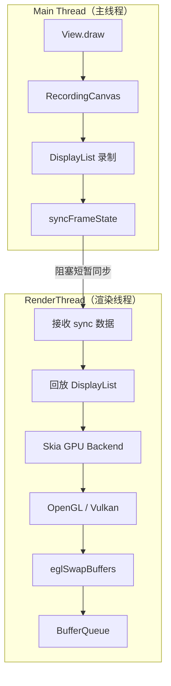
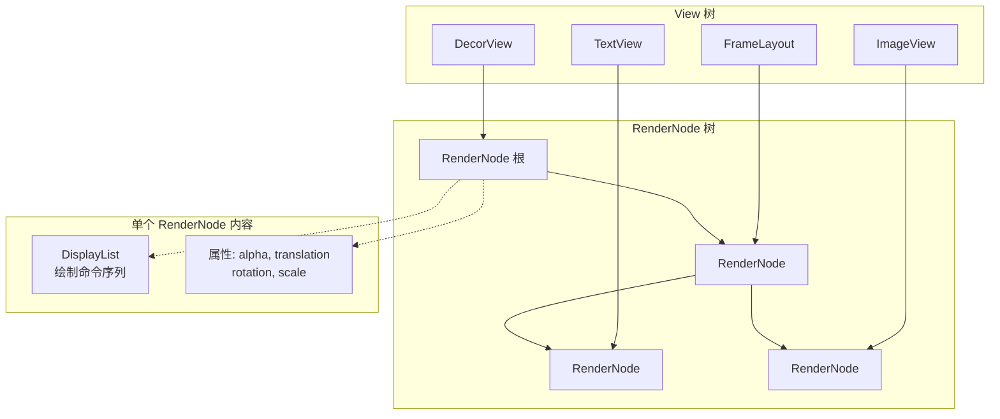
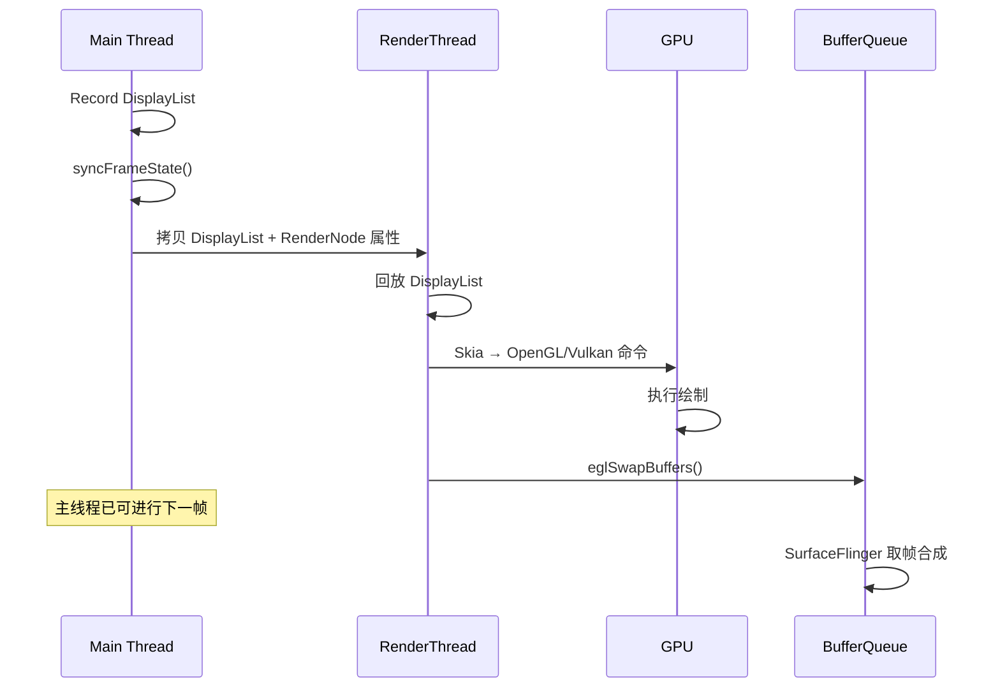

# HWUI 硬件加速渲染管线

> 深入理解 HWUI 双线程渲染架构、DisplayList 录制回放与 GPU 渲染统计

---

## 1. 为什么需要硬件加速

### 1.1 Software Rendering 的局限

在**软件渲染**模式下：

- CPU 通过 **Skia** 2D 图形库逐像素绘制到 Bitmap
- 每次绘制都要遍历像素、执行复杂的混合与抗锯齿运算
- 对于复杂 UI（大量 View、圆角、阴影、渐变等），CPU 负担极重
- 主线程长时间被占用，导致掉帧、卡顿

### 1.2 Hardware Acceleration 的优势

**硬件加速**模式下：

- **GPU** 承担绘制、合成等图形运算，天然适合并行处理
- CPU 主要做「记录」工作，将绘制命令序列化
- GPU 擅长纹理采样、光栅化、混合等操作，效率远高于 CPU 逐像素处理

### 1.3 历史演进


| 版本                          | 硬件加速状态                       |
| --------------------------- | ---------------------------- |
| **Android 3.0 (Honeycomb)** | 引入 HWUI，开发者可手动开启             |
| **Android 4.0 (ICS)**       | 默认开启硬件加速                     |
| **Android 5.0+**            | 默认使用 Skia + OpenGL/Vulkan 管线 |


### 1.4 核心设计思想

> **将「录制」（Main Thread）与「渲染」（RenderThread）分离**

主线程只负责把 View 的 `draw()` 调用「录」成 DisplayList，真正发往 GPU 的命令在独立的 RenderThread 上执行。这样主线程可以尽快释放，去处理下一帧的输入、动画和业务逻辑。

---

## 2. 双线程渲染模型

### 2.1 架构概览

HWUI 采用**双线程渲染模型**，这是整个 HWUI 架构的核心洞察：


| 线程               | 职责                                      | 关键类                         |
| ---------------- | --------------------------------------- | --------------------------- |
| **Main Thread**  | 记录绘制操作到 DisplayList（通过 RecordingCanvas） | View, ThreadedRenderer      |
| **RenderThread** | 回放 DisplayList，向 GPU 发送命令               | RenderThread, CanvasContext |


### 2.2 源码位置

```
frameworks/base/libs/hwui/renderthread/RenderThread.cpp
```

RenderThread 是**每进程单例**，在首次需要硬件加速绘制时创建。

### 2.3 双线程协作流程

```
Main Thread                    RenderThread
    │                               │
    ├─ Canvas.drawRect()            │
    ├─ Canvas.drawText()            │
    ├─ → recorded to DisplayList    │
    ├─ syncFrameState() ─────────→  │
    │   (blocks briefly)            ├─ replay DisplayList
    │                               ├─ Skia GPU backend
    │                               ├─ OpenGL/Vulkan commands
    │                               ├─ eglSwapBuffers()
    │                               └─ → Buffer 进入 BufferQueue
```

### 2.4 双线程渲染管线图




---

## 3. 核心类详解

### 3.1 RenderNode

**源码位置：**

```
frameworks/base/libs/hwui/RenderNode.cpp
```

**职责：**

- 每个 **View** 映射一个 **RenderNode**
- 持有 **DisplayList**（绘制命令序列）+ 变换属性（alpha、translation、rotation、scale）
- 这些属性可以**单独更新**，无需重新录制 DisplayList

**优化意义：**

`View.setTranslationX()` 之所以开销小，就是因为只需更新 RenderNode 的 `translationX` 属性，RenderThread 回放时应用该变换即可，不必重新走一遍 `onDraw()` 和 DisplayList 录制。


| 属性类型                             | 更新方式              | 是否需重新录制 DisplayList |
| -------------------------------- | ----------------- | ------------------- |
| translation、rotation、scale、alpha | 直接改 RenderNode 属性 | 否                   |
| 内容变化（如文字、图片改变）                   | 需重新 onDraw → 重新录制 | 是                   |


### 3.2 CanvasContext

**源码位置：**

```
frameworks/base/libs/hwui/renderthread/CanvasContext.cpp
```

**职责：**

- 管理**单个 Surface** 的渲染管线
- `**draw()`** 是 RenderThread 执行渲染的入口
- 根据设备能力选择 **SkiaOpenGLPipeline** 或 **SkiaVulkanPipeline**

### 3.3 ThreadedRenderer

**源码位置：**

```
frameworks/base/core/java/android/view/ThreadedRenderer.java
```

**职责：**

- Java 层对 Native 渲染管线的**代理**
- 在 `ViewRootImpl.performDraw()` 中被调用
- 调用链：`draw()` → `syncAndDrawFrame()` → Native `nSyncAndDrawFrame()`

### 3.4 SkiaOpenGLPipeline / SkiaVulkanPipeline

**源码位置：**

```
frameworks/base/libs/hwui/pipeline/skia/
```

**Skia** 是 2D 图形库，负责将高级绘制命令转换为 OpenGL/Vulkan 指令：


| 管线                     | 说明              | 默认情况         |
| ---------------------- | --------------- | ------------ |
| **SkiaOpenGLPipeline** | 使用 OpenGL ES 后端 | 大多数设备默认      |
| **SkiaVulkanPipeline** | 使用 Vulkan 后端    | 新设备支持更好，性能更优 |


### 3.5 RenderNode 树结构图




---

## 4. DisplayList 录制与回放

### 4.1 录制流程


| 层级     | 类                       | 说明              |
| ------ | ----------------------- | --------------- |
| Java   | **RecordingCanvas**     | 包装绘制 API，将调用序列化 |
| Native | **SkiaRecordingCanvas** | 实际录制实现          |
| 产物     | **DisplayList**         | 紧凑格式的绘制命令序列     |


### 4.2 录制生命周期

```
RenderNode.beginRecording()
    ↓
Canvas.drawRect() / drawText() / drawPath() ...
    ↓  (命令被序列化到 DisplayList)
RenderNode.endRecording()
```

### 4.3 回放与优化的好处

- DisplayList 可以**多次回放**，无需重新调用 `onDraw()`
- 支持 **diff**：仅对有变化的 RenderNode 做局部更新
- 主线程录制与 RenderThread 回放**解耦**，提高并发效率

---

## 5. 帧同步机制

### 5.1 syncFrameState() 的作用

`**syncFrameState()`** 是主线程与 RenderThread 的**同步点**：

- 将 Main Thread 上脏的 RenderNode 数据**拷贝**到 RenderThread
- 拷贝待更新的 DisplayList
- 主线程会**短暂阻塞**，等待 sync 完成

### 5.2 sync 后的分工

- **sync 后**：主线程可立即开始下一帧的 measure/layout 工作
- **RenderThread**：独立回放 DisplayList，执行 GPU 命令，完成 `eglSwapBuffers()` 将 Buffer 送入 BufferQueue

### 5.3 帧生命周期：Record → Swap




---

## 6. GPU 渲染统计

### 6.1 查看帧渲染统计

```bash
# 查看指定应用的帧渲染统计
adb shell dumpsys gfxinfo <package_name>
```

### 6.2 关键指标解读


| 指标          | 含义                       |
| ----------- | ------------------------ |
| **Draw**    | 主线程绘制时间（DisplayList 录制）  |
| **Prepare** | sync 同步时间                |
| **Process** | RenderThread 处理时间        |
| **Execute** | GPU 执行时间（含 swap buffers） |


若 **Draw** 或 **Prepare** 过高，说明主线程压力大或 sync 阻塞明显；若 **Execute** 高，则 GPU 负载较重。

### 6.3 渲染管线相关命令

```bash
# 查看当前使用的渲染管线类型
adb shell getprop debug.hwui.renderer

# 强制使用 Skia Vulkan 管线（需设备支持）
adb shell setprop debug.hwui.renderer skiavk
```

### 6.4 GPU 渲染模式分析条形图

在「开发者选项 → GPU 渲染模式分析 → 在 adb shell dumpsys gfxinfo 中」中：

- 不同颜色条代表不同阶段耗时
- 绿色横线表示 16ms（60fps）或 8ms（120fps）的基准
- 超出基准的帧会产生视觉卡顿（Jank）

---

## AI 交互建议

可与 AI 进行如下提问，加深理解：

1. **「帮我解读 CanvasContext::draw() 的完整流程」**
2. **「RenderNode 的属性更新为什么比重新录制 DisplayList 更高效？」**
3. **「解释 syncFrameState 中主线程和 RenderThread 的同步机制」**
4. **「Skia 在 HWUI 中扮演什么角色？」**

---

## 真机实操

### 7.1 dumpsys gfxinfo 分析

```bash
# 以微信为例
adb shell dumpsys gfxinfo com.tencent.mm

# 关注 Janky frames、Number Missed Vsync、High input latency 等统计
```

### 7.2 GPU 渲染模式分析条形图解读

开启方式：**设置 → 开发者选项 → GPU 渲染模式分析 → 在屏幕上显示为条形图**

每帧显示一根竖条，竖条由多个颜色段组成，从下到上对应一帧渲染的各阶段：


| 颜色  | 阶段                   | 对应代码位置                               | 含义                                       |
| --- | -------------------- | ------------------------------------ | ---------------------------------------- |
| 深绿  | **Input Handling**   | `ViewRootImpl.processInputEvents()`  | 处理输入事件（触摸、按键）的回调耗时                       |
| 浅绿  | **Animation**        | `Choreographer` CALLBACK_ANIMATION   | 执行动画计算（ObjectAnimator、ValueAnimator 等）   |
| 青色  | **Measure/Layout**   | `View.measure()` / `View.layout()`   | View 树的测量和布局                             |
| 深蓝  | **Draw**             | `View.draw()` → DisplayList 录制       | 主线程录制绘制指令到 DisplayList                   |
| 浅蓝  | **Sync & Upload**    | `syncFrameState()` + 纹理上传            | 主线程与 RenderThread 同步 + Bitmap 上传为 GPU 纹理 |
| 红色  | **Command Issue**    | Skia → OpenGL/Vulkan 指令提交            | RenderThread 将 DisplayList 回放为 GPU 命令    |
| 橙色  | **Swap Buffers**     | `eglSwapBuffers()` / `queueBuffer()` | 将渲染完的 Buffer 提交到 BufferQueue             |
| 黄色  | **Misc/Vsync Delay** | —                                    | 等待 VSync 或其他杂项耗时                         |


绿色水平线 = **16.67ms**（60fps 帧预算），竖条超过此线就是掉帧。

**快速定位瓶颈**：

```
竖条哪个颜色段最长 → 就是瓶颈所在

青色(Measure/Layout) → 布局复杂或频繁 requestLayout()
占大头                 优化：用 ConstraintLayout 扁平化、避免嵌套 LinearLayout 权重

深蓝(Draw)占大头     → 主线程 View.draw() 太重
                       优化：减少 View 层级、简化 onDraw()、避免 onDraw 中分配对象

浅蓝(Sync & Upload)  → 大 Bitmap 首次上传为纹理
占大头                 优化：预加载纹理、减小图片尺寸、使用硬件 Bitmap

红色(Command Issue)  → GPU 指令太多（过度绘制、复杂 Path）
占大头                 优化：减少 overdraw、简化自定义绘制、降低阴影/圆角复杂度
```

---

## 小结


| 组件/概念                | 职责                                                |
| -------------------- | ------------------------------------------------- |
| **双线程模型**            | Main Thread 录制 DisplayList，RenderThread 回放并驱动 GPU |
| **RenderNode**       | 每个 View 对应一个，含 DisplayList + 变换属性，属性可单独更新         |
| **ThreadedRenderer** | Java 层代理，连接 ViewRootImpl 与 Native 渲染管线            |
| **CanvasContext**    | 管理单个 Surface 的渲染，选择 OpenGL/Vulkan 管线              |
| **syncFrameState()** | 主线程与 RenderThread 的同步点，拷贝脏数据                      |
| **Skia**             | 2D 图形库，将绘制命令转换为 OpenGL/Vulkan 指令                  |


