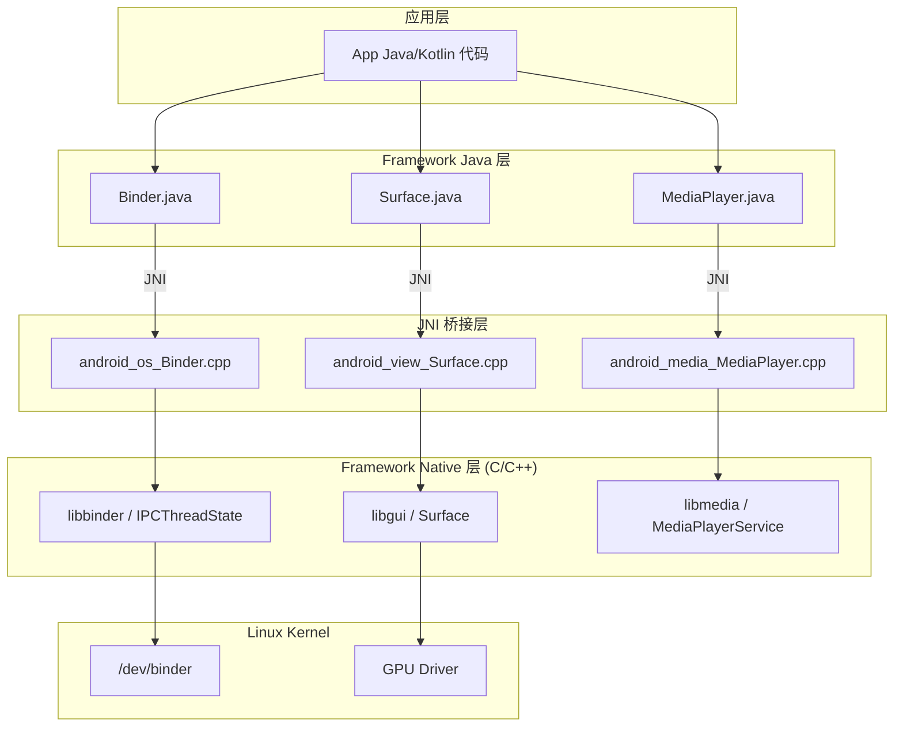
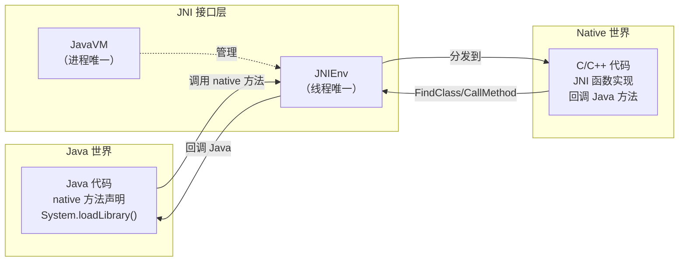
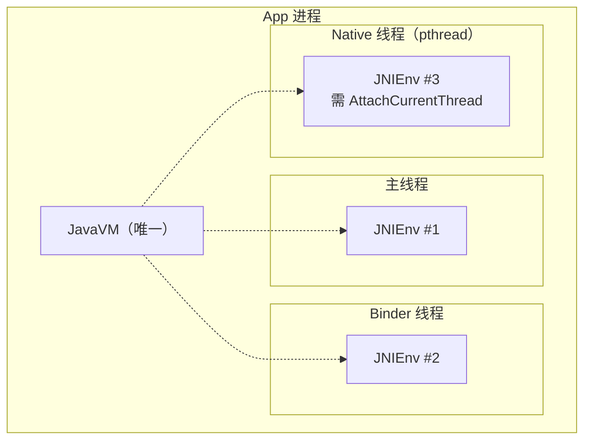
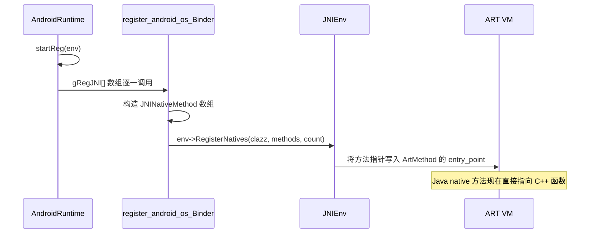
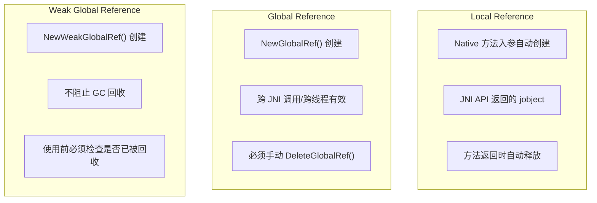
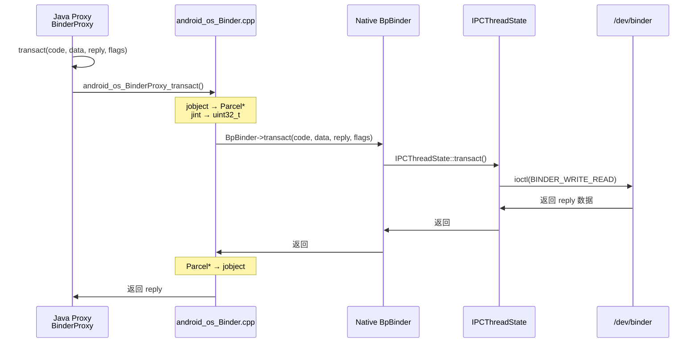

# JNI 桥接机制深度解析

> 系统讲解 JNI（Java Native Interface）在 JVM 与 Native（C/C++）之间的桥梁作用，涵盖核心 API（JavaVM/JNIEnv）、数据类型映射、静态/动态注册、双向调用链路、引用管理，并深入 AOSP 源码展示 Android Framework 如何大规模使用 JNI 连接 Java 层与 Native 层

---

## 目录

1. [JNI 是什么、为什么需要它](#1-jni-是什么为什么需要它)
2. [JNI 架构全景图](#2-jni-架构全景图)
3. [JavaVM 与 JNIEnv](#3-javavm-与-jnienv)
4. [数据类型映射 — Java 与 Native 的"翻译表"](#4-数据类型映射-java-与-native-的翻译表)
5. [JNI 函数注册 — 静态注册 vs 动态注册](#5-jni-函数注册-静态注册-vs-动态注册)
6. [Java 调用 Native — 下行桥梁](#6-java-调用-native-下行桥梁)
7. [Native 调用 Java — 上行桥梁](#7-native-调用-java-上行桥梁)
8. [JNI 引用管理 — 防止内存泄漏](#8-jni-引用管理-防止内存泄漏)
9. [JNI 在 AOSP 中的典型应用](#9-jni-在-aosp-中的典型应用)
10. [性能与最佳实践](#10-性能与最佳实践)
11. [面试高频问题](#11-面试高频问题)
12. [AI 交互建议](#12-ai-交互建议)
13. [关联文档](#13-关联文档)

---

## 1. JNI 是什么、为什么需要它

### 1.1 一句话定义

**JNI（Java Native Interface）是 JVM 提供的标准编程接口，允许 Java 代码调用 C/C++函数，也允许 C/C++ 代码回调 Java 方法——它是 Java 世界与 Native 世界之间的双向桥梁。**

你可以把 JNI 想象成一个"翻译官"：Java 说的是"面向对象、GC 管理内存"的语言，C/C++ 说的是"指针、手动内存管理"的语言，JNI 负责在两者之间翻译数据格式、调用约定和内存管理规则。

### 1.2 Android 为什么离不开 JNI

Android 系统的架构天然是"Java 层 + Native 层"的双层设计。Framework Java 层（AMS、WMS、PMS）向上提供 App API，但底层的高性能实现（图形渲染、音视频编解码、Binder 驱动交互）都在 Native C/C++ 层。JNI 是连接这两层的唯一标准通道。




### 1.3 需要 JNI 的典型场景


| 场景                 | 真实例子                                                 | 为什么不能纯 Java                       |
| ------------------ | ---------------------------------------------------- | --------------------------------- |
| **性能敏感计算**         | 图片处理（Skia）、加密解密（BoringSSL）、音视频编解码（FFmpeg/MediaCodec） | C/C++ 无 GC 停顿、可直接 SIMD/NEON 优化    |
| **复用 C/C++ 库**     | OpenGL ES、Vulkan、SQLite、zlib、libpng                  | 数十年积累的成熟 Native 库无需用 Java 重写      |
| **访问操作系统 API**     | Linux syscall（fork、mmap、ioctl）、Binder 驱动交互           | Java 无法直接调用内核接口                   |
| **Framework 底层实现** | SurfaceFlinger 交互、HWUI 渲染、InputDispatcher 事件分发       | 高性能要求的系统组件必须用 C++ 实现              |
| **硬件 HAL 对接**      | Camera HAL、Sensor HAL、Audio HAL                      | HAL 接口定义为 C/C++，需要 JNI 桥接到 Java 层 |


### 1.4 与其他跨边界机制对比


| 机制                   | 跨越的边界                        | 通信范围    | 底层实现                      | 延迟    | 典型场景                        |
| -------------------- | ---------------------------- | ------- | ------------------------- | ----- | --------------------------- |
| **JNI**              | Java ↔ C/C++（**语言边界**）       | 进程内     | 函数调用 + 数据类型转换             | 纳秒~微秒 | Framework Java 调用 Native 实现 |
| **Binder**           | 进程 A ↔ 进程 B（**进程边界**）        | 跨进程     | 内核驱动 `/dev/binder` + mmap | 百微秒   | App ↔ system_server         |
| **Platform Channel** | Dart ↔ Java/Kotlin（**语言边界**） | 进程内     | JNI + 二进制编解码              | 微秒    | Flutter ↔ Android 原生        |
| **Socket**           | 主机 A ↔ 主机 B（**网络边界**）        | 跨主机/跨进程 | TCP/UDP                   | 毫秒    | 网络通信                        |


**关键理解**：Binder 和 JNI 不是替代关系，而是协作关系。一次 AIDL 调用的完整路径是：Java Proxy → **JNI** → Native IPCThreadState → **Binder 驱动** → Native Server → **JNI** → Java Stub。JNI 穿越语言边界，Binder 穿越进程边界。

---

## 2. JNI 架构全景图

### 2.1 三个核心角色




| 角色            | 职责                                              | 生命周期                             |
| ------------- | ----------------------------------------------- | -------------------------------- |
| **Java 代码**   | 声明 `native` 方法、加载 so 库、提供被回调的 Java 方法           | 由 JVM 管理                         |
| **JNI 接口层**   | 提供 `JNIEnv`（所有 JNI API 的入口）和 `JavaVM`（进程级虚拟机引用） | `JavaVM` 与进程同生命周期；`JNIEnv` 与线程绑定 |
| **Native 代码** | 实现 JNI 函数、通过 `JNIEnv` 回调 Java 层、管理 Native 资源    | 手动管理，需注意与 Java GC 的交互            |


### 2.2 双向调用链路

```
┌──────────────────────────────────────────────────────────────────┐
│                        Java 世界 (JVM)                          │
│                                                                  │
│  class Surface {                                                 │
│      native void nativeCreate(...);   ← 声明 native 方法        │
│  }                                                               │
│                          │                         ▲             │
│                          │ 下行调用                │ 上行回调     │
│                          ▼                         │             │
├──────────────────── JNI 边界 ────────────────────────────────────┤
│                          │                         │             │
│                          ▼                         │             │
│  JNIEnv* env                                                     │
│  ├── env->FindClass()        // 查找 Java 类                     │
│  ├── env->GetMethodID()      // 获取方法 ID                      │
│  ├── env->CallVoidMethod()   // 调用 Java 方法（上行）            │
│  ├── env->NewStringUTF()     // 创建 Java 字符串                 │
│  └── env->GetIntField()      // 读取 Java 字段                   │
│                          │                         │             │
│                          ▼                         │             │
│                     Native 世界 (C/C++)                          │
│                                                                  │
│  static void android_view_Surface_create(                        │
│      JNIEnv* env, jobject thiz, ...) {                           │
│      sp<Surface> surface = new Surface(...);                     │
│      env->SetLongField(thiz, gNativePtr, (jlong)surface.get());  │
│  }                                                               │
└──────────────────────────────────────────────────────────────────┘
```

### 2.3 AOSP 中 JNI 代码的核心目录

```
frameworks/base/core/jni/                       ← Framework 核心 JNI 桥接
├── android_view_Surface.cpp                    ← Surface/Canvas
├── android_view_SurfaceControl.cpp             ← SurfaceControl
├── android_view_InputEventReceiver.cpp         ← 输入事件
├── android_os_Binder.cpp                       ← Binder Java/Native 桥接
├── android_os_MessageQueue.cpp                 ← MessageQueue / Looper
├── android_media_MediaPlayer.cpp               ← 多媒体播放
├── android_hardware_Camera.cpp                 ← 相机
├── com_android_internal_os_Zygote.cpp          ← Zygote fork 进程
├── AndroidRuntime.cpp                          ← JNI 注册入口
└── android_util_Log.cpp                        ← Log 系统

libnativehelper/
├── include/nativehelper/jni.h                  ← JNI 标准头文件
├── include/nativehelper/JNIHelp.h              ← Android JNI 辅助宏
└── JNIHelp.cpp                                 ← 辅助函数实现
```

### 2.4 JNI 在 Android 启动链路中的位置

App 进程由 Zygote fork 而来，JNI 的初始化发生在 `AndroidRuntime::start()` 中：

```
Zygote fork 新进程
  → ActivityThread.main()
    → 进程已有 JVM（从 Zygote 继承）
    → JNI 方法表已注册（Zygote 阶段完成）
    → App 可直接调用 native 方法
```

Zygote 启动时的 JNI 注册链路：

```
app_process main()
  → AndroidRuntime::start("com.android.internal.os.ZygoteInit")
    → startVm()           // 创建 ART 虚拟机（JavaVM）
    → startReg()          // 注册所有 Framework JNI 方法
      → register_jni_procs(gRegJNI, ...)
        → 逐个调用 register_android_os_Binder()
        →            register_android_view_Surface()
        →            register_android_media_MediaPlayer()
        →            ... 数百个注册函数
```

---

## 3. JavaVM 与 JNIEnv

### 3.1 JavaVM — 进程级虚拟机引用

```c
// jni.h 中的定义（简化）
struct JavaVM {
    // 获取当前线程的 JNIEnv
    jint GetEnv(void** env, jint version);
    // 将当前线程附加到 JVM
    jint AttachCurrentThread(JNIEnv** env, void* args);
    // 将当前线程从 JVM 分离
    jint DetachCurrentThread();
    // 销毁 JVM
    jint DestroyJavaVM();
};
```


| 特性   | 说明                                            |
| ---- | --------------------------------------------- |
| 数量   | 每个进程**只有一个** `JavaVM`（Android 中由 ART 实现）      |
| 获取方式 | `JNI_OnLoad()` 参数传入；或 `JNI_CreateJavaVM()` 创建 |
| 线程安全 | 可以在任何线程使用                                     |
| 核心用途 | 获取 `JNIEnv`、管理线程与 JVM 的关联                     |


### 3.2 JNIEnv — 线程级 JNI 函数表

```c
// jni.h 中的定义（简化）
struct JNIEnv {
    // 类操作
    jclass FindClass(const char* name);

    // 方法操作
    jmethodID GetMethodID(jclass clazz, const char* name, const char* sig);
    void CallVoidMethod(jobject obj, jmethodID methodID, ...);
    jobject CallObjectMethod(jobject obj, jmethodID methodID, ...);

    // 字段操作
    jfieldID GetFieldID(jclass clazz, const char* name, const char* sig);
    jint GetIntField(jobject obj, jfieldID fieldID);

    // 字符串操作
    jstring NewStringUTF(const char* utf);
    const char* GetStringUTFChars(jstring str, jboolean* isCopy);

    // 引用管理
    jobject NewGlobalRef(jobject obj);
    void DeleteGlobalRef(jobject obj);
    void DeleteLocalRef(jobject obj);

    // ... 数百个函数
};
```


| 特性   | 说明                                         |
| ---- | ------------------------------------------ |
| 数量   | 每个线程**各一个**（Thread-Local Storage 绑定）       |
| 获取方式 | JNI 函数的第一个参数自动传入；或通过 `JavaVM::GetEnv()` 获取 |
| 线程安全 | **不能跨线程使用**——线程 A 的 `JNIEnv`* 不能在线程 B 中调用  |
| 核心用途 | 所有 JNI 操作的入口（查类、调方法、读写字段、管理引用等）            |


### 3.3 线程与 JNIEnv 的关系




**关键场景：Native 线程回调 Java**

```cpp
// Native 线程（如 HWUI RenderThread）需要回调 Java 时：
void onFrameComplete(JavaVM* vm) {
    JNIEnv* env = nullptr;
    // 1. 将当前 Native 线程附加到 JVM
    vm->AttachCurrentThread(&env, nullptr);

    // 2. 现在可以使用 env 调用 Java 方法
    jclass clazz = env->FindClass("android/view/Choreographer");
    // ...

    // 3. 用完后分离（可选，如果线程会持续使用则不必）
    vm->DetachCurrentThread();
}
```

### 3.4 JNI_OnLoad 与 JNI_OnUnload

当 Java 层调用 `System.loadLibrary("mylib")` 时，JVM 加载 `libmylib.so`，并自动查找并调用其中的 `JNI_OnLoad` 函数：

```cpp
// 标准 JNI_OnLoad 模板
JNIEXPORT jint JNICALL JNI_OnLoad(JavaVM* vm, void* reserved) {
    JNIEnv* env = nullptr;
    if (vm->GetEnv((void**)&env, JNI_VERSION_1_6) != JNI_OK) {
        return JNI_ERR;
    }

    // 动态注册 native 方法（AOSP 主流方式）
    registerNativeMethods(env);

    return JNI_VERSION_1_6;  // 返回所需 JNI 版本
}

// JNI_OnUnload：so 卸载时调用（Android 中极少触发）
JNIEXPORT void JNICALL JNI_OnUnload(JavaVM* vm, void* reserved) {
    // 清理全局资源
}
```

---

## 4. 数据类型映射 — Java 与 Native 的"翻译表"

### 4.1 基本类型映射

JNI 基本类型与 Java/C 类型一一对应，**无需转换**，直接传值：


| Java 类型   | JNI 类型     | C/C++ 类型   | 大小   |
| --------- | ---------- | ---------- | ---- |
| `boolean` | `jboolean` | `uint8_t`  | 1 字节 |
| `byte`    | `jbyte`    | `int8_t`   | 1 字节 |
| `char`    | `jchar`    | `uint16_t` | 2 字节 |
| `short`   | `jshort`   | `int16_t`  | 2 字节 |
| `int`     | `jint`     | `int32_t`  | 4 字节 |
| `long`    | `jlong`    | `int64_t`  | 8 字节 |
| `float`   | `jfloat`   | `float`    | 4 字节 |
| `double`  | `jdouble`  | `double`   | 8 字节 |
| `void`    | `void`     | `void`     | —    |


### 4.2 引用类型映射

引用类型在 JNI 中统一表现为不透明指针（`jobject` 及其子类型），不能直接访问内部数据，必须通过 `JNIEnv` 的 API 操作：


| Java 类型     | JNI 类型         | 说明                      |
| ----------- | -------------- | ----------------------- |
| `Object`    | `jobject`      | 所有引用类型的基类               |
| `Class`     | `jclass`       | `jobject` 子类型，表示 Java 类 |
| `String`    | `jstring`      | `jobject` 子类型，Java 字符串  |
| `Throwable` | `jthrowable`   | `jobject` 子类型，异常对象      |
| `Object[]`  | `jobjectArray` | 对象数组                    |
| `int[]`     | `jintArray`    | 基本类型数组                  |
| `byte[]`    | `jbyteArray`   | 字节数组                    |


继承关系：

```
jobject
  ├── jclass
  ├── jstring
  ├── jthrowable
  ├── jarray
  │     ├── jobjectArray
  │     ├── jintArray
  │     ├── jbyteArray
  │     ├── jfloatArray
  │     └── ...
  └── jweak（弱全局引用）
```

### 4.3 字符串处理

Java 字符串（UTF-16）与 C 字符串（char*）之间需要转换：

```cpp
// Java String → C 字符串
void nativeSetName(JNIEnv* env, jobject thiz, jstring jname) {
    // 获取 UTF-8 字符串指针（可能拷贝，可能直接指向 JVM 内存）
    const char* name = env->GetStringUTFChars(jname, nullptr);

    // 使用 name ...
    ALOGD("name = %s", name);

    // 必须释放！否则内存泄漏（如果是拷贝）或阻止 GC（如果是直接引用）
    env->ReleaseStringUTFChars(jname, name);
}

// C 字符串 → Java String
jstring nativeGetName(JNIEnv* env, jobject thiz) {
    const char* name = "Hello JNI";
    return env->NewStringUTF(name);  // 返回新建的 Java String 对象
}
```

**注意：Modified UTF-8**。JNI 使用的 `GetStringUTFChars` 返回的是 **Modified UTF-8** 编码（空字符 `\0` 用 `0xC0 0x80` 编码，4 字节 Unicode 用代理对），与标准 UTF-8 有细微差异。大多数场景无影响，但处理包含空字符或罕见 Unicode 字符时需注意。

### 4.4 数组处理

```cpp
// Java int[] → C 端处理
void nativeProcessArray(JNIEnv* env, jobject thiz, jintArray jarr) {
    jint length = env->GetArrayLength(jarr);

    // 方式 1：获取指针（可能拷贝，可能直接引用）
    jint* elements = env->GetIntArrayElements(jarr, nullptr);
    for (int i = 0; i < length; i++) {
        elements[i] *= 2;  // 修改
    }
    // 释放并写回（0 = 拷贝回去并释放，JNI_COMMIT = 拷贝回去不释放，JNI_ABORT = 不拷贝直接释放）
    env->ReleaseIntArrayElements(jarr, elements, 0);

    // 方式 2：区域拷贝（大数组部分读取时更高效）
    jint buf[10];
    env->GetIntArrayRegion(jarr, 0, 10, buf);  // 拷贝前 10 个元素到 buf
}
```


| API                         | 操作            | 是否拷贝          | 适用场景                 |
| --------------------------- | ------------- | ------------- | -------------------- |
| `Get<Type>ArrayElements`    | 获取整个数组的指针     | 可能（取决于 VM 实现） | 需要读写整个数组             |
| `GetArrayRegion`            | 拷贝数组的一个区间     | 是             | 只需要部分数据              |
| `GetPrimitiveArrayCritical` | 获取数组指针（禁止 GC） | 不拷贝           | 性能关键路径（使用时不能调其他 JNI） |


### 4.5 JNI 类型签名（Type Signature）

JNI 使用字符串描述符表示 Java 类型，用于 `GetMethodID`、`GetFieldID` 等 API：


| Java 类型      | JNI 签名                 |
| ------------ | ---------------------- |
| `boolean`    | `Z`                    |
| `byte`       | `B`                    |
| `char`       | `C`                    |
| `short`      | `S`                    |
| `int`        | `I`                    |
| `long`       | `J`                    |
| `float`      | `F`                    |
| `double`     | `D`                    |
| `void`       | `V`                    |
| `String`     | `Ljava/lang/String;`   |
| `int[]`      | `[I`                   |
| `Object[]`   | `[Ljava/lang/Object;`  |
| `String[][]` | `[[Ljava/lang/String;` |


方法签名格式：`(参数签名)返回值签名`


| Java 方法                               | JNI 方法签名                  |
| ------------------------------------- | ------------------------- |
| `void foo()`                          | `()V`                     |
| `int bar(int a, String b)`            | `(ILjava/lang/String;)I`  |
| `String[] baz(long[] arr)`            | `([J)[Ljava/lang/String;` |
| `void callback(int code, String msg)` | `(ILjava/lang/String;)V`  |


---

## 5. JNI 函数注册 — 静态注册 vs 动态注册

### 5.1 静态注册

按照 JNI 规范的命名约定，Native 函数名必须为 `Java_包名_类名_方法名`（`.` 替换为 `_`）。JVM 加载 so 后通过 `dlsym` 按名字查找。

```java
// Java 声明
package com.example.app;
public class NativeLib {
    static { System.loadLibrary("mylib"); }
    public native String getMessage();
}
```

```cpp
// C++ 实现：函数名必须严格匹配
extern "C" JNIEXPORT jstring JNICALL
Java_com_example_app_NativeLib_getMessage(JNIEnv* env, jobject thiz) {
    return env->NewStringUTF("Hello from JNI");
}
```

### 5.2 动态注册

在 `JNI_OnLoad` 中通过 `RegisterNatives` 手动建立 Java 方法与 Native 函数的映射。**这是 AOSP 的主流方式**。

```cpp
// Native 函数（名字可以随意取）
static jstring nativeGetMessage(JNIEnv* env, jobject thiz) {
    return env->NewStringUTF("Hello from JNI");
}

// 方法映射表
static const JNINativeMethod gMethods[] = {
    // { Java 方法名,  方法签名,        Native 函数指针 }
    { "getMessage", "()Ljava/lang/String;", (void*)nativeGetMessage },
};

// 在 JNI_OnLoad 中注册
JNIEXPORT jint JNICALL JNI_OnLoad(JavaVM* vm, void* reserved) {
    JNIEnv* env = nullptr;
    vm->GetEnv((void**)&env, JNI_VERSION_1_6);

    jclass clazz = env->FindClass("com/example/app/NativeLib");
    env->RegisterNatives(clazz, gMethods, sizeof(gMethods) / sizeof(gMethods[0]));

    return JNI_VERSION_1_6;
}
```

### 5.3 两种方式对比


| 维度      | 静态注册                           | 动态注册                    |
| ------- | ------------------------------ | ----------------------- |
| 命名要求    | 函数名必须严格遵循 `Java_包名_类名_方法名`     | 函数名随意，通过表映射             |
| 查找方式    | JVM 通过 `dlsym` 按名字搜索（较慢）       | 直接通过函数指针（快）             |
| 首次调用性能  | 首次调用需 `dlsym` 查找               | 注册时已绑定，首次调用无开销          |
| 维护成本    | 包名/类名改动需同步改函数名                 | 只需改注册表中的字符串             |
| 错误发现时机  | 运行时才发现（`UnsatisfiedLinkError`） | `RegisterNatives` 时即可发现 |
| AOSP 使用 | 极少                             | **几乎全部**                |
| App 开发  | 常用（Android Studio 默认生成）        | 中大型项目推荐                 |


### 5.4 AOSP 动态注册链路




AOSP 源码中的注册入口 `AndroidRuntime.cpp`：

```
frameworks/base/core/jni/AndroidRuntime.cpp

static const RegJNIRec gRegJNI[] = {
    REG_JNI(register_android_os_Binder),
    REG_JNI(register_android_view_Surface),
    REG_JNI(register_android_view_SurfaceControl),
    REG_JNI(register_android_media_MediaPlayer),
    REG_JNI(register_android_hardware_Camera),
    // ... 数百个注册项
};
```

---

## 6. Java 调用 Native — 下行桥梁

### 6.1 完整流程

```
Java 代码调用 native 方法
  │
  ├─ 1. Java 类声明 native 方法
  │     public native void nativeCreate(long nativeObject);
  │
  ├─ 2. 静态初始化块加载 so 库
  │     static { System.loadLibrary("android_runtime"); }
  │
  ├─ 3. JVM 查找对应的 Native 函数
  │     ├─ 静态注册：dlsym 按名字查找
  │     └─ 动态注册：直接从注册表获取函数指针
  │
  ├─ 4. ART 跳转到 Native 函数
  │     ├─ 自动传入 JNIEnv* 和 jobject/jclass
  │     ├─ Java 参数自动转为 JNI 类型
  │     └─ 切换到 Native 栈帧
  │
  └─ 5. Native 函数执行并返回
        └─ 返回值自动转回 Java 类型
```

### 6.2 代码示例

**Java 侧**：

```java
// Surface.java（简化）
public class Surface implements Parcelable {
    // mNativeObject 存储 Native 层 Surface 对象的指针
    long mNativeObject;

    // 声明 native 方法
    private static native long nativeCreateFromSurfaceTexture(SurfaceTexture st);
    private static native void nativeRelease(long nativeObject);
    private static native boolean nativeIsValid(long nativeObject);
    private static native void nativeLock(long nativeObject, Canvas canvas, Rect dirty);
    private static native void nativeUnlockAndPost(long nativeObject, Canvas canvas);

    static {
        System.loadLibrary("android_runtime");
    }
}
```

**C++ 侧**：

```cpp
// android_view_Surface.cpp（简化）
static jlong nativeCreateFromSurfaceTexture(JNIEnv* env, jclass clazz,
        jobject surfaceTextureObj) {
    // 从 Java SurfaceTexture 对象获取 Native 层的 IGraphicBufferProducer
    sp<IGraphicBufferProducer> producer(
        SurfaceTexture_getProducer(env, surfaceTextureObj));

    // 创建 Native Surface 对象
    sp<Surface> surface(new Surface(producer, true));

    // 将 Native 指针作为 jlong 返回给 Java 层保存
    surface->incStrong(&sRefBaseOwner);
    return jlong(surface.get());
}

// 注册表
static const JNINativeMethod gSurfaceMethods[] = {
    { "nativeCreateFromSurfaceTexture", "(Landroid/graphics/SurfaceTexture;)J",
        (void*)nativeCreateFromSurfaceTexture },
    { "nativeRelease", "(J)V", (void*)nativeRelease },
    { "nativeIsValid", "(J)Z", (void*)nativeIsValid },
    // ...
};
```

### 6.3 AOSP 常见模式：jlong 存储 Native 指针

AOSP 中大量使用"**Java 对象的 `long` 字段存储 Native 对象指针**"的模式：

```
Java 对象                           Native 对象
┌─────────────────────┐            ┌─────────────────────┐
│ Surface.java        │            │ Surface (C++)       │
│                     │            │                     │
│  mNativeObject: long├──(指针)──→│  BufferQueue        │
│                     │            │  IGraphicBufferProducer │
└─────────────────────┘            └─────────────────────┘
```

这是 JNI 中管理 Java/Native 对象关联的标准方式：

- `nativeCreate()` 时：在 Native 创建对象，将指针转为 `jlong` 存入 Java 字段
- 后续 `nativeXxx()` 调用时：从 Java 字段取出 `jlong`，转回 Native 指针使用
- `nativeRelease()` 时：释放 Native 对象，将 Java 字段置 0

---

## 7. Native 调用 Java — 上行桥梁

### 7.1 核心 API

```cpp
// 1. 查找 Java 类
jclass clazz = env->FindClass("android/view/Choreographer");

// 2. 获取方法 ID
jmethodID methodID = env->GetMethodID(clazz, "postFrameCallback",
    "(Landroid/view/Choreographer$FrameCallback;)V");

// 3. 调用方法
env->CallVoidMethod(choreographerObj, methodID, callbackObj);
```


| API 类别         | 实例方法               | 静态方法                     |
| -------------- | ------------------ | ------------------------ |
| 获取方法 ID        | `GetMethodID`      | `GetStaticMethodID`      |
| 调用 void 方法     | `CallVoidMethod`   | `CallStaticVoidMethod`   |
| 调用返回 int 方法    | `CallIntMethod`    | `CallStaticIntMethod`    |
| 调用返回 Object 方法 | `CallObjectMethod` | `CallStaticObjectMethod` |
| 获取字段 ID        | `GetFieldID`       | `GetStaticFieldID`       |
| 读取 int 字段      | `GetIntField`      | `GetStaticIntField`      |
| 写入 int 字段      | `SetIntField`      | `SetStaticIntField`      |


### 7.2 完整代码示例：Native 回调 Java

```cpp
// 场景：Native 层完成图片解码后回调 Java 层
void notifyDecodeComplete(JNIEnv* env, jobject listener, int width, int height) {
    // 1. 获取 listener 对象的类
    jclass listenerClass = env->GetObjectClass(listener);

    // 2. 查找回调方法
    jmethodID onComplete = env->GetMethodID(
        listenerClass, "onDecodeComplete", "(II)V");

    // 3. 调用 Java 方法
    env->CallVoidMethod(listener, onComplete, width, height);

    // 4. 清理 Local Reference
    env->DeleteLocalRef(listenerClass);
}
```

### 7.3 字段访问

```cpp
// 读取 Java 对象的字段
jclass surfaceClass = env->FindClass("android/view/Surface");
jfieldID nativePtrField = env->GetFieldID(surfaceClass, "mNativeObject", "J");

// 读取
jlong nativePtr = env->GetLongField(surfaceObj, nativePtrField);

// 写入
env->SetLongField(surfaceObj, nativePtrField, (jlong)newNativePtr);
```

### 7.4 AOSP 实例：InputDispatcher 回调 Java 层

Android 输入系统中，`InputDispatcher`（C++）将触摸事件分发到 App 进程后，最终通过 JNI 回调 Java 层：

```
InputDispatcher (C++, system_server)
  → InputChannel (Socket 传输到 App 进程)
    → NativeInputEventReceiver (C++, App 进程)
      → env->CallVoidMethod(receiverObj, gInputEventReceiverMethods.dispatchInputEvent, ...)
        → InputEventReceiver.dispatchInputEvent() (Java)
          → ViewRootImpl.enqueueInputEvent()
            → View.dispatchTouchEvent()
```

### 7.5 异常处理

Native 调用 Java 方法时，Java 可能抛出异常。必须在 Native 侧检查并处理：

```cpp
env->CallVoidMethod(obj, methodID, args);

// 检查是否有未处理的 Java 异常
if (env->ExceptionCheck()) {
    // 选择 1：打印并清除异常，继续执行
    env->ExceptionDescribe();  // 打印到 logcat
    env->ExceptionClear();     // 清除异常状态

    // 选择 2：让异常传播回 Java 层（直接 return）
    return;
}
```

**规则**：发生异常后，除了异常处理相关的 JNI 函数（`ExceptionCheck`、`ExceptionClear` 等），其他 JNI 调用的行为都是未定义的。必须先处理异常才能继续其他 JNI 操作。

---

## 8. JNI 引用管理 — 防止内存泄漏

### 8.1 三种引用类型




| 引用类型            | 创建方式                 | 释放方式                                 | 是否阻止 GC | 有效范围             | 典型场景                       |
| --------------- | -------------------- | ------------------------------------ | ------- | ---------------- | -------------------------- |
| **Local**       | JNI API 自动创建         | Native 方法返回自动释放；或 `DeleteLocalRef()` | 是       | 当前 Native 方法调用期间 | 临时使用的 Java 对象              |
| **Global**      | `NewGlobalRef()`     | 必须 `DeleteGlobalRef()`               | 是       | 任何线程、任何时间        | 跨调用保持的 Java 对象（如缓存 jclass） |
| **Weak Global** | `NewWeakGlobalRef()` | `DeleteWeakGlobalRef()`              | **否**   | 任何线程，但可能随时被 GC   | 缓存场景（命中则用，被回收则重建）          |


### 8.2 Local Reference 的陷阱

```cpp
// 危险：循环中创建大量 Local Reference
void processAll(JNIEnv* env, jobjectArray items) {
    int len = env->GetArrayLength(items);
    for (int i = 0; i < len; i++) {
        // 每次循环创建一个 Local Reference
        jobject item = env->GetObjectArrayElement(items, i);
        jstring name = (jstring)env->CallObjectMethod(item, getNameMethod);
        const char* nameStr = env->GetStringUTFChars(name, nullptr);

        // 处理 nameStr ...

        env->ReleaseStringUTFChars(name, nameStr);
        // 如果不手动释放，Local Reference 会堆积
        // ART 默认上限约 512 个，超过会崩溃
        env->DeleteLocalRef(name);
        env->DeleteLocalRef(item);
    }
}

// 更优雅的方式：PushLocalFrame / PopLocalFrame
void processAllBetter(JNIEnv* env, jobjectArray items) {
    int len = env->GetArrayLength(items);
    for (int i = 0; i < len; i++) {
        env->PushLocalFrame(16);  // 预留 16 个 Local Reference 容量

        jobject item = env->GetObjectArrayElement(items, i);
        jstring name = (jstring)env->CallObjectMethod(item, getNameMethod);
        // ... 使用

        env->PopLocalFrame(nullptr);  // 自动释放此帧内所有 Local Reference
    }
}
```

### 8.3 Global Reference 的使用

```cpp
// 典型场景：在 JNI_OnLoad 中缓存 jclass 和 jmethodID
static jclass gSurfaceClass = nullptr;
static jmethodID gSurfacePostEventMethod = nullptr;

int register_android_view_Surface(JNIEnv* env) {
    // FindClass 返回 Local Reference，需要转为 Global Reference 才能长期持有
    jclass clazz = env->FindClass("android/view/Surface");
    gSurfaceClass = (jclass)env->NewGlobalRef(clazz);
    env->DeleteLocalRef(clazz);

    // jmethodID 和 jfieldID 不是 jobject，不需要做 Global Reference
    // 它们只要 jclass 有效就有效
    gSurfacePostEventMethod = env->GetMethodID(
        gSurfaceClass, "postEventFromNative", "(IIILjava/lang/Object;)V");

    return 0;
}
```

**关键区分**：

- `jclass` / `jobject` / `jstring` → **是引用**，需要管理
- `jmethodID` / `jfieldID` → **不是引用**，是值类型标识符，只要对应的类未被卸载就一直有效（Android 中类几乎不会被卸载）

### 8.4 引用管理生命周期对比

```
时间线 ──────────────────────────────────────────────────→

Native 方法调用
│                                                        │
├── Local Ref A（自动创建）                               │
│   ├── 使用中 ...                                       │
│   └── ×（方法返回自动释放）                              │
│                                                        │
├── Global Ref B（NewGlobalRef 创建）                     │
│   ├── 使用中 ...                    使用中 ...          │
│   └── ── ── ── ──→ 跨越多次 JNI 调用 ── ── ── ──→     │
│                     直到 DeleteGlobalRef               │
│                                                        │
├── Weak Global Ref C（NewWeakGlobalRef 创建）            │
│   ├── 使用中 ...   可能被 GC → null                     │
│   └── ── ── ── ──→ 使用前必须 IsSameObject 检查        │
│                                                        │
方法返回 ─────────────────────────────────────────────────
```

---

## 9. JNI 在 AOSP 中的典型应用

### 9.1 核心 JNI 桥接文件一览


| JNI 桥接文件                                | 对应的 Java 类                        | 桥接的 Native 库        | 功能领域              |
| --------------------------------------- | --------------------------------- | ------------------- | ----------------- |
| `android_os_Binder.cpp`                 | `Binder.java`, `BinderProxy.java` | `libbinder`         | 跨进程通信             |
| `android_view_Surface.cpp`              | `Surface.java`                    | `libgui`            | 图形 Surface 管理     |
| `android_view_SurfaceControl.cpp`       | `SurfaceControl.java`             | `libgui`            | SurfaceFlinger 控制 |
| `android_view_InputEventReceiver.cpp`   | `InputEventReceiver.java`         | `libinput`          | 输入事件接收            |
| `android_os_MessageQueue.cpp`           | `MessageQueue.java`               | `libutils` (Looper) | 消息循环              |
| `android_media_MediaPlayer.cpp`         | `MediaPlayer.java`                | `libmedia`          | 音视频播放             |
| `android_media_MediaCodec.cpp`          | `MediaCodec.java`                 | `libstagefright`    | 硬件编解码             |
| `android_hardware_Camera.cpp`           | `Camera.java`                     | `libcamera_client`  | 相机                |
| `android_hardware_SensorManager.cpp`    | `SensorManager.java`              | `libsensor`         | 传感器               |
| `com_android_internal_os_Zygote.cpp`    | `Zygote.java`                     | libc (`fork`)       | 进程孵化              |
| `android_util_Log.cpp`                  | `Log.java`                        | `liblog`            | 日志系统              |
| `android_database_SQLiteConnection.cpp` | `SQLiteConnection.java`           | `libsqlite`         | 数据库               |


### 9.2 深入案例：Binder 的 JNI 桥接

Binder 是 JNI 桥接的典型案例——Java 层的 `Binder.java` 通过 JNI 调用 Native 层的 `libbinder`，最终与内核 Binder 驱动交互。




`android_os_Binder.cpp` 中的关键函数：

```cpp
// Java BinderProxy.transact() → Native 实现
static jboolean android_os_BinderProxy_transact(
        JNIEnv* env, jobject obj,
        jint code, jobject dataObj, jobject replyObj, jint flags) {
    // 1. 从 Java Parcel 对象获取 Native Parcel 指针
    Parcel* data = parcelForJavaObject(env, dataObj);
    Parcel* reply = parcelForJavaObject(env, replyObj);

    // 2. 从 Java BinderProxy 对象获取 Native BpBinder 指针
    IBinder* target = getBPNativeData(env, obj)->mObject.get();

    // 3. 调用 Native Binder transact（最终到内核驱动）
    status_t err = target->transact(code, *data, reply, flags);

    // 4. 检查错误并转换为 Java 异常
    if (err == NO_ERROR) {
        return JNI_TRUE;
    }
    signalExceptionForError(env, obj, err, true, data->dataSize());
    return JNI_FALSE;
}
```

### 9.3 深入案例：Zygote fork 的 JNI 桥接

Zygote 进程 fork 新 App 进程时，从 Java 层穿越 JNI 到 Native 层调用 `fork()`：

```
Zygote.java
  → Zygote.forkAndSpecialize()
    → nativeForkAndSpecialize()          // Java native 方法
      → JNI → com_android_internal_os_Zygote_nativeForkAndSpecialize()
        → ForkCommon()
          → fork()                        // Linux syscall
          → 子进程：设置 uid/gid、capabilities、selinux context
          → 子进程：返回 pid = 0
          → 父进程：返回子进程 pid
```

### 9.4 MessageQueue 的 JNI 桥接：Java Looper ↔ Native Looper

```
MessageQueue.java                          android_os_MessageQueue.cpp
┌──────────────────────┐                  ┌──────────────────────────┐
│ nativeInit()          │──JNI──→         │ 创建 NativeMessageQueue  │
│ nativePollOnce(ptr,   │──JNI──→         │ → 创建 Native Looper     │
│                timeout)│                 │ → Looper::pollOnce()     │
│ nativeWake(ptr)       │──JNI──→         │ → Looper::wake()         │
│ nativeDestroy(ptr)    │──JNI──→         │ → 销毁 NativeMessageQueue│
└──────────────────────┘                  └──────────────────────────┘
```

Java 的 `MessageQueue.next()` 在没有消息时会调用 `nativePollOnce()` 阻塞在 Native Looper 的 `epoll_wait` 上。有消息到来或 `nativeWake()` 时唤醒。这是 Android 消息机制中 Java 层与 Native 层协作的关键点。

---

## 10. 性能与最佳实践

### 10.1 JNI 调用的开销


| 操作                          | 相对耗时      | 说明                              |
| --------------------------- | --------- | ------------------------------- |
| 普通 Java 方法调用                | 1x（基准）    | 编译后可内联                          |
| JNI 调用（Java → Native）       | **2-5x**  | 需要切换栈帧、参数转换、引用管理                |
| JNI 调用（Native → Java）       | **5-10x** | 需要 FindClass/GetMethodID + 方法调度 |
| `FindClass` + `GetMethodID` | 很慢（首次）    | 涉及类加载器搜索和方法签名解析                 |
| `GetStringUTFChars`         | 中等        | 可能涉及 UTF-16 → UTF-8 拷贝          |
| `Get<Type>ArrayElements`    | 中等~慢      | 可能拷贝整个数组                        |


### 10.2 性能优化原则

**原则 1：缓存 ID，减少查找**

```cpp
// 正确：在初始化时缓存，后续直接使用
static jclass gMyClass;
static jmethodID gOnCompleteMethod;
static jfieldID gDataField;

void init(JNIEnv* env) {
    jclass clazz = env->FindClass("com/example/MyClass");
    gMyClass = (jclass)env->NewGlobalRef(clazz);
    gOnCompleteMethod = env->GetMethodID(gMyClass, "onComplete", "(I)V");
    gDataField = env->GetFieldID(gMyClass, "data", "I");
}

// 错误：每次调用都查找（极慢）
void badCallback(JNIEnv* env, jobject obj) {
    jclass clazz = env->FindClass("com/example/MyClass");          // 每次查
    jmethodID mid = env->GetMethodID(clazz, "onComplete", "(I)V"); // 每次查
    env->CallVoidMethod(obj, mid, 42);
}
```

**原则 2：减少跨边界调用次数**

```cpp
// 不好：逐个元素跨 JNI 传输
for (int i = 0; i < 1000; i++) {
    jint val = env->CallIntMethod(list, getMethod, i);
    process(val);
}

// 好：批量传输
jintArray arr = (jintArray)env->CallObjectMethod(list, toArrayMethod);
jint* elements = env->GetIntArrayElements(arr, nullptr);
for (int i = 0; i < 1000; i++) {
    process(elements[i]);
}
env->ReleaseIntArrayElements(arr, elements, JNI_ABORT);
```

**原则 3：使用 Critical Region 获取数组**

```cpp
// GetPrimitiveArrayCritical：直接获取数组内存地址，无拷贝
// 但使用期间不能调用其他 JNI 函数、不能阻塞
jint* data = (jint*)env->GetPrimitiveArrayCritical(array, nullptr);
memcpy(nativeBuffer, data, length * sizeof(jint));
env->ReleasePrimitiveArrayCritical(array, data, 0);
```

### 10.3 ART 优化注解：@FastNative / @CriticalNative

Android ART 虚拟机提供了两种加速 JNI 调用的注解：


| 注解                | 优化               | 限制                                      | 加速比   |
| ----------------- | ---------------- | --------------------------------------- | ----- |
| `@FastNative`     | 跳过部分 JNI 入口检查    | 函数仍接收 `JNIEnv*` 和 `jobject`/`jclass`    | ~2-3x |
| `@CriticalNative` | 跳过所有 JNI 开销，直接调用 | **不传 `JNIEnv*` 和 `jobject`**，只能使用基本类型参数 | ~5-8x |


```java
// Java 侧声明
public class MyNative {
    @FastNative
    native void fastMethod(int a, int b);

    @CriticalNative
    static native int criticalAdd(int a, int b);
}
```

```cpp
// C++ 侧
// @FastNative：仍有 JNIEnv* 和 jobject
static void fastMethod(JNIEnv* env, jobject thiz, jint a, jint b) {
    // ...
}

// @CriticalNative：没有 JNIEnv* 和 jobject，只有纯参数
static jint criticalAdd(jint a, jint b) {
    return a + b;
}
```

### 10.4 常见反模式


| 反模式                                  | 问题                      | 正确做法                                                |
| ------------------------------------ | ----------------------- | --------------------------------------------------- |
| 每次调用都 `FindClass` + `GetMethodID`    | 性能极差，涉及类搜索和签名解析         | 初始化时缓存到全局变量                                         |
| 在循环中不释放 Local Reference              | 超过上限（约 512 个）后崩溃        | `DeleteLocalRef` 或 `PushLocalFrame`/`PopLocalFrame` |
| 持有 Local Reference 跨多次 JNI 调用        | 方法返回后 Local Ref 失效，悬垂引用 | 用 `NewGlobalRef` 转为 Global Reference                |
| 跨线程使用 `JNIEnv*`                      | 未定义行为，可能崩溃              | 通过 `JavaVM::AttachCurrentThread` 获取当前线程的 `JNIEnv`   |
| 忽略 JNI 调用后的异常检查                      | 后续 JNI 调用行为未定义          | `ExceptionCheck()` + `ExceptionClear()` 或返回         |
| `GetStringUTFChars` 后不 `Release`     | 内存泄漏或 GC 被阻塞            | 使用后立即 `ReleaseStringUTFChars`                       |
| `NewGlobalRef` 后忘记 `DeleteGlobalRef` | 永久阻止 GC 回收 → 内存泄漏       | 配对使用，考虑 RAII 封装                                     |


---

## 11. 面试高频问题

### Q1：JNI 是什么？它在 Android 系统中起什么作用？

JNI（Java Native Interface）是 JVM 提供的标准接口，让 Java 代码和 C/C++代码可以双向调用。在 Android 中，Framework Java 层（AMS、WMS、Surface 等）通过 JNI 调用 Native C++ 层的实现（libbinder、libgui、libmedia 等），是连接 Java 世界和 Native 世界的唯一标准桥梁。AOSP 的 `frameworks/base/core/jni/` 目录下有数百个 JNI 桥接文件。

### Q2：静态注册和动态注册有什么区别？AOSP 用哪种？

静态注册按 `Java_包名_类名_方法名` 命名约定，JVM 通过 `dlsym` 按名字查找，首次调用慢，包名改动需同步改函数名。动态注册在 `JNI_OnLoad` 中通过 `RegisterNatives` 建立映射，注册时即绑定函数指针，更灵活高效。AOSP 几乎全部使用动态注册，在 Zygote 启动时通过 `AndroidRuntime::startReg()` 批量注册数百个 JNI 方法。

### Q3：JNIEnv 能在线程之间传递使用吗？

不能。`JNIEnv` 是 Thread-Local Storage 绑定的，每个线程有自己独立的 `JNIEnv`。Native 线程（如 pthread 创建的线程）要调用 JNI，必须先通过 `JavaVM::AttachCurrentThread()` 将自己附加到 JVM 获取属于该线程的 `JNIEnv`。用完后可以 `DetachCurrentThread()` 分离。

### Q4：JNI 有哪三种引用类型？各自的生命周期和使用场景是什么？

Local Reference：JNI API 自动创建，当前 Native 方法返回时自动释放，适合临时使用。Global Reference：`NewGlobalRef()` 创建，跨方法/跨线程有效，必须手动 `DeleteGlobalRef()` 释放，适合长期持有 Java 对象（如缓存 `jclass`）。Weak Global Reference：`NewWeakGlobalRef()` 创建，不阻止 GC 回收，使用前必须检查是否已被回收，适合缓存场景。

### Q5：JNI 调用有性能开销吗？如何优化？

有。Java → Native 调用约 2-5 倍于普通 Java 方法调用，Native → Java 更慢（5-10 倍）。优化手段：(1) 缓存 `jclass`、`jmethodID`、`jfieldID`，避免重复查找；(2) 减少跨边界调用次数，批量传输数据；(3) 使用 `GetPrimitiveArrayCritical` 避免数组拷贝；(4) 使用 ART 的 `@FastNative`/`@CriticalNative` 注解减少 JNI 入口开销。

### Q6：AOSP 中 "jlong 存指针" 是什么模式？

AOSP 大量使用这种模式：Java 对象的 `long` 字段存储 Native 对象的指针值。例如 `Surface.java` 的 `mNativeObject` 字段存储 C++ `Surface` 对象的指针。创建时通过 JNI 将 Native 指针转为 `jlong` 写入 Java 字段；使用时取出 `jlong` 转回 Native 指针；销毁时释放 Native 对象并置零。这是管理 Java/Native 对象关联的标准方式。

### Q7：JNI 和 Binder 是什么关系？

JNI 和 Binder 跨越不同的边界，是协作关系。JNI 跨越**语言边界**（Java ↔ C++，进程内），Binder 跨越**进程边界**（App ↔ system_server）。一次完整的 AIDL 调用会同时经过两者：Java Proxy → JNI → Native BpBinder → Binder 驱动 → Native BBinder → JNI → Java Stub。`android_os_Binder.cpp` 就是 Binder 的 JNI 桥接文件。

### Q8：在 Native 调用 Java 方法时抛出异常怎么办？

调用 `CallXxxMethod` 后必须用 `ExceptionCheck()` 检查是否有 Java 异常。如果有异常但不处理就继续调用其他 JNI 函数，行为是未定义的。处理方式：(1) `ExceptionDescribe()` + `ExceptionClear()` 打印并清除异常；(2) 直接 return 让异常传播回 Java 层。

### Q9：FindClass 在哪些场景会失败？

(1) 类名拼写错误（注意 JNI 用 `/` 而非 `.` 分隔包名）。(2) 在 Native 线程调用 `FindClass`——Native 线程 attach 到 JVM 后使用的 ClassLoader 是 BootClassLoader，找不到 App 的类。解决方案：在 Java 主线程的 JNI 调用中预先 `FindClass` 并缓存为 Global Reference。(3) 类未加载或不在 classpath 中。

### Q10：如何排查 JNI 相关的崩溃和内存泄漏？

(1) `CheckJNI` 模式：`adb shell setprop debug.checkjni 1` 开启，会检测 JNI 使用错误（无效引用、类型不匹配等），崩溃时给出详细信息。(2) Local Reference 泄漏：开启 CheckJNI 后超限会报 `local reference table overflow`。(3) Global Reference 泄漏：`adb shell dumpsys meminfo <pid>` 可看 JNI Global Reference 数量异常增长。(4) Native 崩溃堆栈：`tombstone` 文件中的 backtrace 可定位到 JNI 层函数。

---

## 12. AI 交互建议

阅读 AOSP 源码或开发 JNI 代码时，可以向 AI 提问以下问题加深理解：

### 机制原理

1. `帮我追踪 System.loadLibrary("mylib") 的完整链路，从 Java 到 dlopen 到 JNI_OnLoad`
2. `ART 虚拟机中，native 方法的 entry_point 是如何从 JNI 函数指针跳转的？和普通 Java 方法的 entry_point 有什么区别？`
3. `JNIEnv 的函数表（JNINativeInterface）是怎么实现的？为什么用函数指针表而不是直接调用？`
4. `@CriticalNative 注解在 ART 中是如何实现跳过 JNI 开销的？`

### AOSP 应用

1. `帮我分析 android_os_Binder.cpp 中 BinderProxy.transact() 的 JNI 实现，数据是如何从 Java Parcel 转到 Native Parcel 的？`
2. `android_view_Surface.cpp 中 nativeLockCanvas() 的实现链路是什么？Canvas 是怎么从 Native 层传回 Java 层的？`
3. `Zygote fork 进程时，JNI 层做了哪些事情？为什么 fork 后不需要重新注册 JNI 方法？`

### 调试排查

1. `如何用 CheckJNI 模式排查 JNI 引用泄漏？有什么典型的报错信息？`
2. `tombstone 文件中的 JNI 崩溃堆栈怎么看？如何定位到是哪个 JNI 函数出了问题？`
3. `如何监控一个进程的 Global Reference 数量？数量异常增长怎么排查？`

---

## 13. 关联文档

- [Android系统架构全景](../framework/Android系统架构全景.md) — JNI 在 Framework Java 层与 Native 层之间的分层位置
- [Binder与跨进程通信](../framework/Binder与跨进程通信.md) — Binder 的 Java/Native 桥接依赖 JNI（`android_os_Binder.cpp`）
- [Android系统启动流程](../framework/Android系统启动流程.md) — Zygote 启动时通过 JNI 注册 Framework 方法
- [App启动流程](../framework/App启动流程.md) — App 进程继承 Zygote 的 JNI 注册表
- [Flutter渲染框架](../multi-platform/Flutter渲染框架.md) — Flutter Platform Channel 底层使用 JNI 桥接 Dart ↔ Java
- [Activity与Fragment](../app/Activity与Fragment.md) — Activity 生命周期的 ClientTransaction 从 Java 层穿越 JNI

