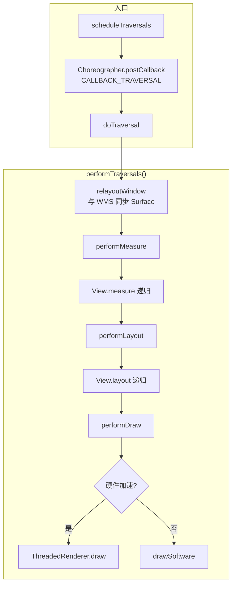
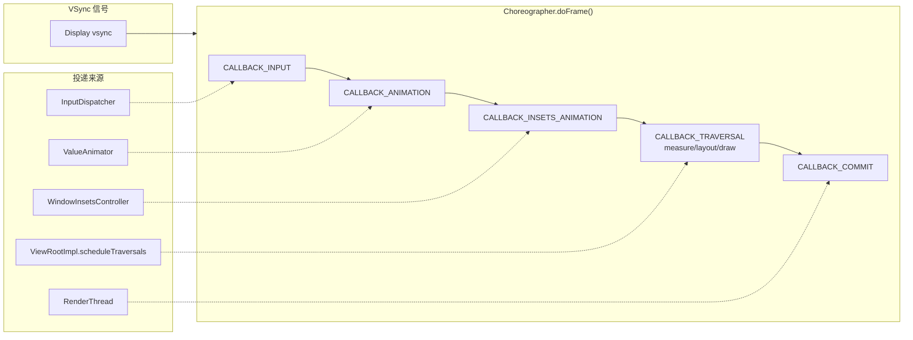
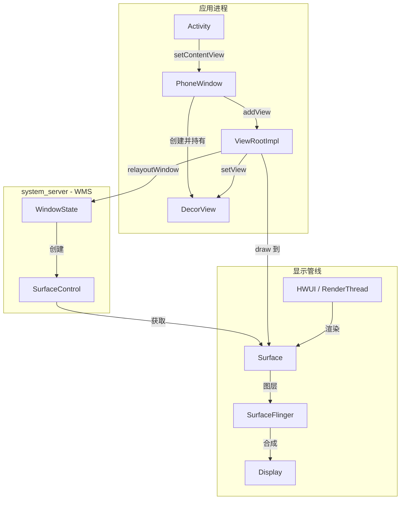

# View 绘制体系

> 深入学习 View 测量、布局、绘制的完整流程与 VSync 驱动的帧调度机制

---

## 目录

1. [View 绘制入口：ViewRootImpl](#1-view-绘制入口viewrootimpl)
2. [Choreographer：VSync 驱动的帧调度](#2-choreographervsync-驱动的帧调度)
3. [View.draw() 完整流程](#3-viewdraw-完整流程)
4. [DecorView → ViewRootImpl → Surface 的关系](#4-decorview-viewrootimpl-surface-的关系)
5. [MeasureSpec 机制](#5-measurespec-机制)
6. [AI 交互建议](#ai-交互建议)
7. [真机实操](#真机实操)
8. [小结](#小结)

---

## 1. View 绘制入口：ViewRootImpl

### 1.1 源码位置

```
frameworks/base/core/java/android/view/ViewRootImpl.java
```

### 1.2 角色与职责

**ViewRootImpl** 是 View 树与 **WindowManagerService (WMS)** 之间的桥梁，承担以下核心职责：


| 职责                     | 说明                       |
| ---------------------- | ------------------------ |
| 连接 View 树与 WMS         | 将应用侧的 View 层级与系统的窗口管理关联  |
| 分发输入事件                 | 将 InputEvent 传递给正确的 View |
| 驱动 measure/layout/draw | 发起并协调整个 View 树的遍历与绘制     |
| 与 Surface 交互           | 管理绘制目标，对接 SurfaceFlinger |


### 1.3 创建时机

ViewRootImpl 在调用 `**WindowManager.addView()`** 时创建，典型场景包括：

- Activity 首次显示时，通过 `WindowManagerImpl.addView(decorView, params)` 添加 DecorView
- Dialog 显示时
- 通过 WindowManager 添加悬浮窗时

### 1.4 核心方法：performTraversals()

`performTraversals()` 是整个 View 绘制流程的**主入口**，负责一次完整的 measure → layout → draw 遍历。

### 1.5 调用链路

```
scheduleTraversals()
    ↓
Choreographer.postCallback(CALLBACK_TRAVERSAL, mTraversalRunnable, null)
    ↓
下一帧 VSync 到来
    ↓
Choreographer.doFrame() 执行 CALLBACK_TRAVERSAL
    ↓
mTraversalRunnable.run()
    ↓
doTraversal()
    ↓
performTraversals()  ← 真正执行 measure/layout/draw
```

### 1.6 performTraversals() 内部流程

在 `performTraversals()` 中，依次执行三大阶段：

1. **performMeasure()** → 调用 `View.measure()`，递归执行各 View 的 `onMeasure()`
2. **performLayout()** → 调用 `View.layout()`，递归执行各 View 的 `onLayout()`
3. **performDraw()** → 调用 `draw()` 链，最终到 `drawSoftware()` 或 `ThreadedRenderer.draw()`（硬件加速路径）

### 1.7 performTraversals() 流程图




---

## 2. Choreographer：VSync 驱动的帧调度

### 2.1 源码位置

```
frameworks/base/core/java/android/view/Choreographer.java
```

### 2.2 角色与职责

**Choreographer** 接收来自显示子系统的 **VSync** 信号，按固定节奏驱动帧回调，保证：

- 绘制与显示器刷新率同步，避免撕裂、卡顿
- 各类回调按预定顺序执行

### 2.3 回调类型（按执行顺序）


| 优先级 | 类型                            | 典型用途                                           |
| --- | ----------------------------- | ---------------------------------------------- |
| 1   | **CALLBACK_INPUT**            | 输入事件处理                                         |
| 2   | **CALLBACK_ANIMATION**        | 动画更新（属性动画等）                                    |
| 3   | **CALLBACK_INSETS_ANIMATION** | Inset 动画（如软键盘、状态栏）                             |
| 4   | **CALLBACK_TRAVERSAL**        | measure/layout/draw（`scheduleTraversals` 投递于此） |
| 5   | **CALLBACK_COMMIT**           | 绘制完成后的提交（如同步到 SurfaceFlinger）                  |


### 2.4 核心方法：doFrame()

`doFrame()` 在每次 VSync 到来时被调用，按上述顺序依次执行各类型的 callbacks，完成一帧的完整处理。

### 2.5 FrameInfo 与性能监控

Choreographer 内部通过 **FrameInfo** 记录每帧的时间戳，用于：

- Jank 检测（掉帧分析）
- Systrace / Perfetto 性能追踪
- 开发者在 `Choreographer.FrameCallback` 中获取帧耗时

### 2.6 scheduleTraversals() 与 Choreographer 的关系

`ViewRootImpl.scheduleTraversals()` 通过：

```java
mChoreographer.postCallback(Choreographer.CALLBACK_TRAVERSAL, mTraversalRunnable, null);
```

将 `mTraversalRunnable` 投递到 **CALLBACK_TRAVERSAL** 队列。下一帧 VSync 到来时，Choreographer 在 `doFrame()` 中执行该 Runnable，进而触发 `doTraversal()` → `performTraversals()`。

### 2.7 Choreographer 回调管道图




---

## 3. View.draw() 完整流程

### 3.1 源码位置

```
frameworks/base/core/java/android/view/View.java
```

### 3.2 draw() 方法步骤

`View.draw(Canvas canvas)` 按以下顺序执行：


| 步骤  | 方法/逻辑                            | 说明                        |
| --- | -------------------------------- | ------------------------- |
| 1   | `drawBackground(canvas)`         | 绘制背景                      |
| 2   | 若需要，保存 Canvas 层（用于 fading edges） | `saveLayer()` 等           |
| 3   | `onDraw(canvas)`                 | 绘制 View 自身内容（子类重写）        |
| 4   | `dispatchDraw(canvas)`           | 绘制子 View（ViewGroup 重写，递归） |
| 5   | 绘制装饰                             | 前景、滚动条等                   |


### 3.3 硬件加速路径

开启硬件加速后，绘制不再直接操作 Canvas 像素，而是：

- 使用 **RecordingCanvas** 记录绘制命令
- 生成 **DisplayList**（RenderNode）
- 由 RenderThread 在 GPU 上执行，最终合成到 Surface

`ThreadedRenderer` 负责将 DisplayList 提交到 RenderThread，实现真正的 GPU 绘制。

### 3.4 invalidate() 与重绘

调用 `View.invalidate()` 时：

1. 标记该 View 及其父级需要重绘的脏区
2. 最终会触发 `ViewRootImpl.scheduleTraversals()`
3. 下一帧 Choreographer 执行 TRAVERSAL 时，`performDraw()` 会重绘脏区内的 View

---

## 4. DecorView → ViewRootImpl → Surface 的关系

### 4.1 链路概览


| 阶段  | 调用/动作                                      | 产物                         |
| --- | ------------------------------------------ | -------------------------- |
| 1   | `Activity.setContentView(layoutId)`        | 设置内容布局 ID                  |
| 2   | `PhoneWindow.setContentView()`             | 创建 DecorView，解析并添加内容       |
| 3   | `WindowManager.addView(decorView, params)` | 将 DecorView 交给 WMS         |
| 4   | 创建 `ViewRootImpl`                          | View 树的根，连接 WMS            |
| 5   | `ViewRootImpl.setView(decorView)`          | 将 DecorView 设为根 View       |
| 6   | `WMS.addWindow()`                          | WMS 管理窗口，创建 SurfaceControl |
| 7   | `SurfaceControl` → `Surface`               | 得到可绘制的 Surface             |
| 8   | HWUI 渲染到 Surface                           | 最终由 SurfaceFlinger 合成显示    |


### 4.2 关系链图




### 4.3 关键点总结

- **DecorView**：整棵 View 树的根，包含系统窗口装饰（标题栏、内容区等）
- **ViewRootImpl**：连接 DecorView 与 WMS，驱动 measure/layout/draw，持有 Surface
- **Surface**：真正的绘制目标，HWUI 将像素写入 Surface，SurfaceFlinger 再将其合成到屏幕

---

## 5. MeasureSpec 机制

### 5.1 结构

**MeasureSpec** 是一个 32 位 int，由两部分组成：

- **mode**（高 2 位）：测量模式
- **size**（低 30 位）：尺寸值

```java
int spec = (mode << 30) | size;
int mode = (spec >> 30) & 0x3;
int size = spec & 0x3FFFFFFF;
```

### 5.2 三种模式


| 模式              | 常量  | 含义                                         |
| --------------- | --- | ------------------------------------------ |
| **EXACTLY**     | 1   | 父布局已确定子 View 的精确尺寸，对应 `match_parent` 或具体数值 |
| **AT_MOST**     | 2   | 父布局给出最大可用空间，子 View 不得超出，对应 `wrap_content`  |
| **UNSPECIFIED** | 0   | 父布局不限制，如 ScrollView 内部测量子 View 时           |


### 5.3 父布局如何约束子 View

父 View 在 `measureChild()` / `measureChildWithMargins()` 中，根据自身测量结果和子 View 的 `LayoutParams`，通过 `**getChildMeasureSpec()`** 得到子 View 的 MeasureSpec，再调用 `child.measure(childSpec)`。

### 5.4 getChildMeasureSpec() 逻辑简表


| 父布局 mode         | 子 LayoutParams | 子 MeasureSpec                |
| ---------------- | -------------- | ---------------------------- |
| EXACTLY + 父 size | match_parent   | EXACTLY + 父 size             |
| EXACTLY + 父 size | wrap_content   | AT_MOST + 父 size             |
| EXACTLY + 父 size | 具体 dp          | EXACTLY + 该 dp               |
| AT_MOST + 父 size | match_parent   | AT_MOST + 父 size             |
| AT_MOST + 父 size | wrap_content   | AT_MOST + 父 size             |
| UNSPECIFIED      | 任意             | UNSPECIFIED + 0（或父 size，视实现） |


---

## AI 交互建议

可与 AI 进行如下提问，加深理解：

1. **「帮我解读 ViewRootImpl.performTraversals() 中从 performMeasure 到 performDraw 的完整逻辑」**
2. **「解释 Choreographer 如何通过 VSync 驱动 View 的刷新」**
3. **「invalidate() 和 requestLayout() 的区别是什么，从源码层面解释」**

### 补充：invalidate() vs requestLayout()


| 方法                  | 作用                      | 触发流程                                                                     |
| ------------------- | ----------------------- | ------------------------------------------------------------------------ |
| **invalidate()**    | 标记需要重绘（draw）            | 脏区传播 → scheduleTraversals → performDraw                                  |
| **requestLayout()** | 标记需要重新 measure + layout | 向上传播 → scheduleTraversals → performMeasure + performLayout + performDraw |


`requestLayout()` 会触发完整的一次 Traversal，而 `invalidate()` 在部分优化路径下可能只重绘，不重新 measure/layout；但通常都会走 `scheduleTraversals()`，在下一帧统一处理。

---

## 真机实操

```bash
# 显示布局边界（便于查看 measure/layout 结果）
adb shell setprop debug.layout true

# 开启 GPU 过度绘制检查（不同颜色表示叠加层数）
adb shell setprop debug.hwui.overdraw show

# 查看当前顶部窗口的 View 层级
adb shell dumpsys activity top
```

> 修改上述属性后需重启应用或重新打开界面方能生效；调试结束后建议恢复默认：
> `adb shell setprop debug.layout false` 和 `adb shell setprop debug.hwui.overdraw false`

---

## 小结


| 组件                | 职责                                                        |
| ----------------- | --------------------------------------------------------- |
| **ViewRootImpl**  | View 树与 WMS 的桥梁，驱动 performTraversals（measure/layout/draw） |
| **Choreographer** | 接收 VSync，按序执行 INPUT → ANIMATION → TRAVERSAL → COMMIT      |
| **View.draw()**   | background → onDraw → dispatchDraw → decorations          |
| **Surface**       | 实际绘制目标，由 ViewRootImpl 经 WMS 获取，供 HWUI 渲染                  |
| **MeasureSpec**   | 父布局向子 View 传递约束（EXACTLY / AT_MOST / UNSPECIFIED）          |


