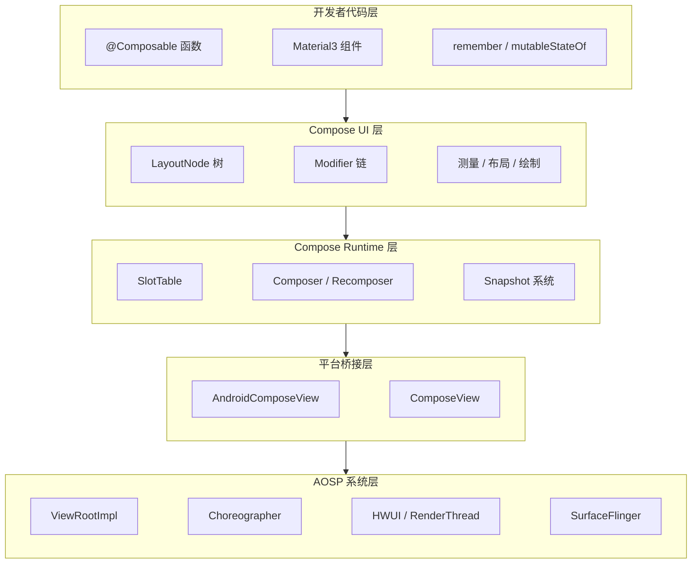
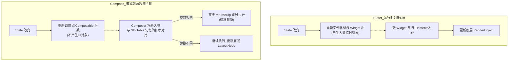
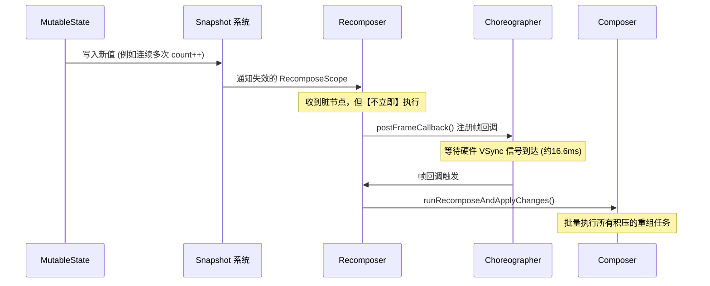
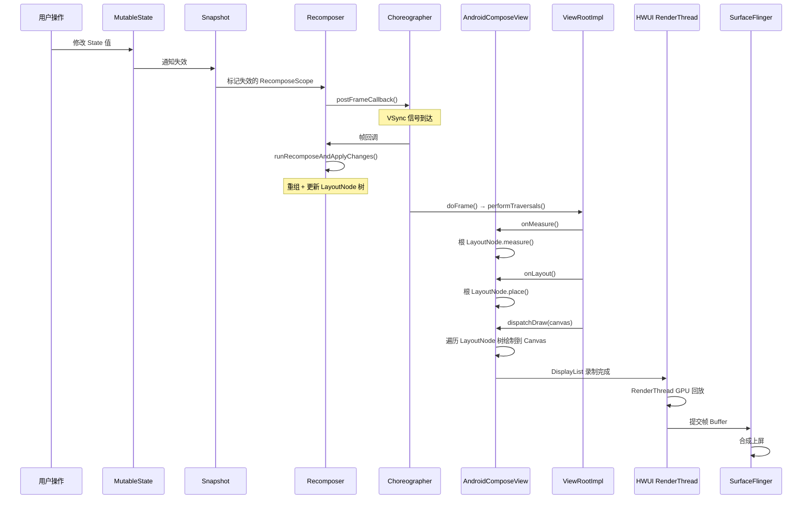
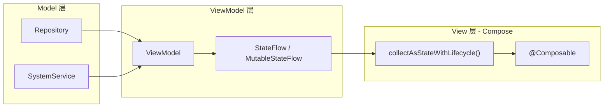

# Jetpack Compose 渲染框架设计

> 从上层声明式 API 逐层向下，剖析 Compose 的组合引擎、布局绘制、平台桥接机制，最终连接到已学习的 AOSP 渲染链路（ViewRootImpl → Choreographer → HWUI → SurfaceFlinger）

---

## 1. 为什么需要 Compose — 从 View 体系的痛点出发

### 1.1 View 体系的核心问题


| 痛点           | 具体表现                                                                               |
| ------------ | ---------------------------------------------------------------------------------- |
| 双重描述         | XML 定义结构 + Java/Kotlin 代码操作状态，两处维护、容易不一致                                           |
| 深层嵌套         | `LinearLayout` 套 `RelativeLayout` 套 `FrameLayout`，每层都是一个 `View` 对象，占用内存且多次 measure |
| 命令式状态管理      | 手动 `setText()`、`setVisibility()`、`notifyDataSetChanged()`，状态分散难以追踪                 |
| 多次测量         | `onMeasure()` 可被父 View 反复调用，复杂布局 O(2^n) 测量次数                                       |
| 自定义 View 门槛高 | 重写 `onMeasure/onLayout/onDraw`，处理 `MeasureSpec`、`padding`、`RTL` 等细节                |


### 1.2 Compose 的设计理念

- **声明式 UI**：描述"UI 应该是什么样"，而非"如何操作 UI"
- **单一数据源**：`State` 驱动 UI，数据变更自动触发 UI 更新
- **组合优于继承**：`@Composable` 函数自由组合，不需要 `View` 类继承体系
- **智能增量更新**：只重新执行受 State 变更影响的 Composable（重组），而非刷新整棵树

### 1.3 View 体系 vs Compose 对比


| 维度     | View 体系                                           | Jetpack Compose                                      |
| ------ | ------------------------------------------------- | ---------------------------------------------------- |
| UI 描述  | XML + 代码                                          | 纯 Kotlin `@Composable` 函数                            |
| 布局嵌套   | ViewGroup 真实嵌套，每层有独立 measure/layout               | LayoutNode 扁平化，无 ViewGroup 层级开销                      |
| 状态管理   | 手动 `set*()` + `notify*()`                         | `mutableStateOf()` 自动追踪和触发更新                         |
| 测量次数   | 允许多次 measure（性能隐患）                                | 严格单次测量（`Constraints`）                                |
| 重绘粒度   | `invalidate()` 标记 View 重绘                         | 精确到单个 Composable 函数的重组                               |
| 动画 API | `ObjectAnimator` / `ValueAnimator` / `Transition` | `animate*AsState` / `Animatable` / `AnimatedContent` |
| 列表     | `RecyclerView` + `Adapter` + `ViewHolder`         | `LazyColumn` / `LazyRow`（内置回收）                       |
| 主题     | XML style + theme                                 | `MaterialTheme` Composable + `CompositionLocal`      |


### 1.4 JD 关联

JD 中"熟悉 Jetpack Compose"是加分项。Compose 正在成为 Android UI 的默认选择：AOSP 的 SystemUI 已大规模迁移到 Compose，Android 15 中 242+ 个 Compose Kotlin 文件用于锁屏、快设、状态栏等核心系统 UI。

---

## 2. Compose 架构分层全景图

### 2.1 四层架构




### 2.2 各层对应的包与关键类


| 层级                | AndroidX 包                     | 关键类                                                                   |
| ----------------- | ------------------------------ | --------------------------------------------------------------------- |
| 开发者代码层            | `androidx.compose.material3`   | `Button`, `Text`, `Column`, `Row`, `LazyColumn`                       |
| Compose UI 层      | `androidx.compose.ui`          | `LayoutNode`, `Modifier`, `MeasurePolicy`, `DrawScope`, `Constraints` |
| Compose Runtime 层 | `androidx.compose.runtime`     | `Composer`, `Recomposer`, `SlotTable`, `Snapshot`, `MutableState`     |
| 平台桥接层             | `androidx.compose.ui.platform` | `AndroidComposeView`, `ComposeView`, `AbstractComposeView`            |
| AOSP 系统层          | `android.view` / Native        | `ViewRootImpl`, `Choreographer`, HWUI C++, SurfaceFlinger C++         |


---

## 3. Compose Runtime — 智能重组引擎

### 3.1 SlotTable — 扁平化的状态记忆库（对比 Flutter Element 树）

SlotTable 是 Compose 存储组合树状态的核心数据结构，它负责记住每一个函数的“执行历史”和“参数状态”。

💡 **【对标 Flutter 架构思考】**

- **Flutter 的 Element 树**：使用真实的**对象树（Tree）**数据结构。界面越复杂，内存中散落的 Element 对象就越多，节点之间通过指针相互连接。增删节点会导致频繁的内存分配和垃圾回收（GC）。
- **Compose 的 SlotTable**：彻底抛弃了树形结构，采用的是**扁平化的线性数组（一维数组）**。它利用一种叫 **Gap Buffer（间隙缓冲区）** 的数据结构来模拟树的层级。因为是一段连续内存，对 CPU 缓存（Cache Line）极度友好，且避免了海量小对象的产生。

#### 1. 什么是 Gap Buffer？

Gap Buffer 最早常用于文本编辑器的底层实现（像你在打字时，光标处的插入和删除）。它是一个连续的数组，但在中间保留了一段空白的“间隙（Gap）”。

```text
[Group1(Column) | Group2(Button) | ______GAP______ | Group8(Row) | Group9(Text)]
                                      ↑
                   当前执行游标 (Cursor) 指向此处
```

**工作原理与例子：**
假设你的代码里有一段条件渲染：`if (showText) Text("Hello")`

- **顺序执行**：当 Compose 重新执行代码时，游标在数组中从左向右移动。
- **插入节点 (showText = true)**：Compose 只需要把游标处的 Gap 填入新的 `Text` 数据，这个操作是 **O(1)** 的，由于是连续内存赋值，极度高效。
`[Group1 | Group2 | Group3(Text) | ___GAP___ | Group8 | Group9]`
- **删除节点 (showText = false)**：Compose 只需要移动游标，将原来的 `Text` 数据覆盖或标记为 Gap。**无需触发真实的内存回收机制去销毁对象**，同样是 O(1)。
- **移动间隙**：如果需要在数组其他位置修改，只要把数组里的元素移动，将 Gap 整体"滑动"到目标位置即可。

因为 UI 的特性往往是**局部连续更新**的（比如某个局部组件展开、收起，或者追加一个列表项），这种“在游标附近频繁修改”的特性，让 Gap Buffer 成为 UI 渲染的完美选择。

#### 2. SlotTable 里面存了什么？（与位置记忆的深度绑定）

在 3.2 节中我们将提到“位置记忆（Positional Memoization）”的魔法，而 **SlotTable 就是这个魔法背后的“实体记忆硬盘”**。

既然是一个一维数组，数组里的每一个坑位（Slot / Group）对应着一次 `@Composable` 函数的调用。它里面存储了 `Composer` 在重组时进行“精准截断（Skip）”和“延续状态（remember）”所需要的一切核心线索：

- **位置标识 (Key)**：这是建立“位置记忆”的根基。在编译期间，Kotlin 编译器插件会根据你在源码中写这个函数的“行号”和“代码结构”，自动生成一个唯一的 Hash 值（魔法数字）。这个 Key 就是函数在 SlotTable 里的“身份证”。
- **参数快照（旧参数）**：记录上一次执行这个函数时传入的参数（比如上一帧的 `text="Hello"`）。当下一次重组时，`Composer` 依靠那个魔法 Key 找到这个坑位，抽出这个“旧参数”和刚传进来的“新参数”做对比（Diff）。如果一样，就触发 Skip 跳过执行。
- **关联的 State（remember 的归宿）**：当你在代码里写下 `val count = remember { mutableStateOf(0) }` 时，这个初始值为 0 的对象，**就被硬生生地塞进了当前函数对应的这个 SlotTable 坑位里**。下一次执行到 `remember` 时，它直接用 Key 去这个坑位里把那个对象掏出来还给你。这就是为什么状态不会因为函数重新执行而丢失的根本原因。
- **树形结构的边界**：虽然是扁平数组，但它记录了子节点的起始和结束索引，从而在一维数组中成功还原并模拟出了 UI 的嵌套层级。

### 3.2 Composer — 组合执行器与"省去第三棵树"的魔法

Composer 是驱动 `@Composable` 函数执行的引擎。
在 [03-2-Flutter渲染框架](./03-2-Flutter渲染框架.md) 中我们知道，Flutter 使用了经典的三棵树：`Widget`（配置树）、`Element`（状态树）、`RenderObject`（渲染树）。而 Compose 只有两棵树：`SlotTable`（状态记忆）和 `LayoutNode`（渲染布局）。

**Compose 到底用了什么黑魔法，把描述 UI 结构的 `Widget 树` 给凭空变没了？**
答案就在于 **Kotlin 编译器插件（Compiler Plugin）的魔法 + Composer 的位置记忆（Positional Memoization）**。

#### 1. Flutter 的痛点：必须建树才能 Diff (面向对象 + 纯运行时)

Flutter 是纯运行时的面向对象框架。当状态改变触发刷新时，它**必须真实地用 `new` 关键字把整个界面的 Widget 对象全部重新实例化一遍**。
每次刷新，哪怕只有一个文字变了，也会造出一大堆临时的 `Widget` 对象（如 Column、Text、Button）。只有把这棵“新对象树”造出来，框架才能拿它去和背后的“旧 Element 树”做 Diff。频繁创建和销毁临时对象会给 GC 带来极大压力。

#### 2. Compose 的降维打击：执行流即 Diff (面向函数 + 编译期注入)

Compose 彻底改变了思维：**UI 不再是对象实例，而是函数的执行控制流。** 
Compose 根本不去创建代表 UI 的中间对象，它是直接**重新执行一遍函数**。

编译器会将每个 `@Composable` 函数注入 `Composer` 参数，并在内部打入追踪和比对代码。

**开发者写的代码：**

```kotlin
@Composable
fun Counter(count: Int) {
    Text("Count: $count")
}
```

**编译器转换后（伪代码）：**

```kotlin
fun Counter(count: Int, $composer: Composer, $changed: Int) {
    // 1. 位置记忆：编译器根据源码位置生成了 0x123456 这个魔法 Key
    // Composer 拿着这个 Key，去 SlotTable 里找到了专属的坑位（Group）
    $composer.startRestartGroup(0x123456)
    
    // 2. 核心黑魔法：参数 Diff 前置！
    // 拿着当前传进来的 count，和 SlotTable 坑位里存的上一次的 count 做对比
    if ($changed and 0b0001 != 0 || !$composer.changed(count)) {
        // 3. 如果没变，直接跳过！不创建任何对象，函数直接在这里提前结束。
        $composer.skipToGroupEnd()
    } else {
        // 4. 如果变了，才真正执行内部逻辑，去生成或更新底层的 LayoutNode
        Text("Count: $count", $composer, ...)
    }
    
    // 5. 离开当前坑位
    $composer.endRestartGroup()
}
```

#### 3. 核心机制对比与总结




**核心能力总结**：

- **化对象为动作**：Flutter 是“先造对象树，再拿着树做 Diff”；Compose 是“不造对象，直接把函数的入参当做 Diff 的条件”。
- **startGroup / endGroup**：在 SlotTable 中记录组合结构（位置记忆）。
- **changed / skip**：Composer 把运行时的 Diff 逻辑，通过编译器硬塞到了每一个函数的入口处。参数未变时直接调用 `skipToGroupEnd()` 结束函数。

没有了中间商（Widget对象）赚差价，Compose 直接实现了极致的轻量级增量更新。

### 3.3 Recomposer — 重组调度器：状态与屏幕刷新的大管家

如果说 `Composer` 是负责干活的（对比参数、修改节点），那么 `Recomposer` 就是统筹全局的调度大管家。它负责监听状态的改变，并决定**什么时候**去叫 `Composer` 重新执行函数。




#### 为什么需要 Recomposer 调度？（举个例子）

假设你写了一个复杂的逻辑，在一个点击事件里连续修改了 3 个不同的状态：

```kotlin
onClick = {
    count.value++         // 状态1改变
    text.value = "Hello"  // 状态2改变
    flag.value = true     // 状态3改变
}
```

**如果没有 Recomposer（灾难场景）**：
当你执行 `count.value++` 时，框架立刻触发界面的重新计算和绘制。等它刚画完，又执行到了 `text.value = "Hello"`，界面又被强制重绘一次。在这短短零点几毫秒的点击事件里，界面会被无意义地疯狂重绘 3 次，引发严重的性能卡顿。

**有了 Recomposer 之后的真实工作流（基于 VSync 的批量处理）**：

1. **只打标签不干活**：当这 3 个状态接连发生变化时，底层的 Snapshot 系统只是给受影响的函数节点打上“已失效（Dirty/Invalid）”的标签，并把这些节点扔给 `Recomposer`。
2. **对接 Choreographer 等待信号**：`Recomposer` 收到这些“脏节点”后，并不会马上重组代码。它通过 `MonotonicFrameClock` 接口，向 Android 原生系统的 `Choreographer` 发送了一个请求（`postFrameCallback`），意思是：“下一帧刷新前叫醒我”，然后它就原地挂起等待。
3. **VSync 到达，批量清算**：当底层硬件发出 `VSync` 垂直同步信号时，`Choreographer` 唤醒了 `Recomposer`。此时 `Recomposer` 把刚才攒在手里的 3 个脏节点打包，一次性丢给 `Composer`：“去吧，把这些都重新执行一遍”。

**总结**：`Recomposer` 的核心价值在于**“防抖与合并”**。它巧妙地利用了 Android 系统的帧调度机制，保证了无论你在同一帧（16.6ms）内多么疯狂地修改状态，UI 都只会等待下一个 VSync 信号到来时，进行**唯一的一次、批量的重组**。这与原生 View 体系中连续调用多次 `requestLayout()` 最终只会等待 `doFrame()` 一起执行的原理高度一致。

### 3.4 Snapshot 系统 — 自动订阅与“MVCC”状态隔离

在传统 View 体系中，当你拿到新数据后，必须手动调用 `textView.setText()` 或者 `adapter.notifyDataSetChanged()` 才能刷新 UI。
而在 Compose 中，这一切都是全自动的：你只需要改变变量的值，UI 自己就会更新。这背后的功臣就是 **Snapshot（快照）系统**。

`mutableStateOf()` 的底层就是由 Snapshot 系统驱动的：

```kotlin
val count = mutableStateOf(0)  // 创建一个 SnapshotMutableState
```

#### 1. 工作原理：读写追踪（举个例子）

假设我们有如下代码：

```kotlin
@Composable
fun Counter() { // 这个函数背后对应一个 RecomposeScope（重组作用域）
    val count = remember { mutableStateOf(0) }
    
    Button(onClick = { count.value++ }) { // 写操作
        Text("点击次数: ${count.value}")  // 读操作
    }
}
```

Snapshot 系统采用了极其聪明的**“隐式订阅”**机制：

1. **读追踪（自动订阅）**：当系统在执行 `Text` 这一行时，由于代码**读取**了 `count.value`，Snapshot 系统会敏锐地捕捉到这个“读”动作。它会立刻把当前的 `Counter()` 作用域（`RecomposeScope`）默默地记录在 `count` 的观察者名单里。（“我记住你了，以后我变了就通知你”）。
2. **写通知（触发失效）**：当用户点击按钮，执行 `count.value++` 也就是**写入**新值时，Snapshot 系统会立刻翻开名册，找到所有曾经读过 `count` 的作用域（这里是 `Counter()`），把它们标记为“已失效（Invalid）”。
3. **提交重组**：这些失效的作用域被打包扔给上一节提到的 `Recomposer`，等待下一个 VSync 信号到来时重新执行。

#### 2. 为什么叫 Snapshot（快照）？—— 数据库级隔离

Snapshot 系统的设计灵感来自于数据库的 **MVCC（多版本并发控制）**。
这不仅仅是一个简单的观察者模式，它还解决了**多线程并发读写**的痛点。

想象一下这个场景：
Compose 正在主线程中火热地遍历 UI 树（即**读**操作），准备把界面画出来；而同时你的后台网络请求刚好回来了，在子线程执行了 `count.value = 100`（即**写**操作）。
如果只是普通变量，这会立刻导致**并发读写崩溃（ConcurrentModificationException）**或 UI 绘制一半是旧值一半是新值的撕裂现象。

**Snapshot 快照的降维打击：**

- 当主线程开始绘制一帧 UI 时，Snapshot 系统会给当前所有的 State **拍下一张全局快照（Snapshot）**。
- 这意味着，在这一帧绘制期间，不管其他线程怎么疯狂修改 `count.value`，主线程在这次快照里读到的永远是拍下快照那一瞬间的**旧值**。
- 等到这帧 UI 稳稳当当地画完，Snapshot 系统才会“提交（Apply）”新版本的快照，让下一帧去读取新值。

通过这种“隔离快照”机制，Compose 实现了绝对线程安全、无锁（Lock-free）的高性能并发读写。开发者可以在任意线程放心大胆地修改 `State`，永远不用担心崩溃或脏读。

#### 3. 延伸：`remember` 到底是干嘛的？

在上述代码中，我们使用了 `val count = remember { mutableStateOf(0) }`。

- **为什么必须加 `remember`？**
在前面 `3.2` 节我们讲过，Compose 重组的本质就是**“重新执行一遍函数”**。如果你只写 `val count = mutableStateOf(0)`，那么每次函数重新执行时，它都会重新 `new` 一个初始值为 0 的全新状态对象，这会导致你的状态永远被重置！
- `**remember` 的本质**：它是一个**“跨越重组的缓存器”**。它把大括号里生成的值，**存到了我们前面讲的 SlotTable 对应的位置（Slot）里**。当下一次函数重新执行到这里时，`remember` 会去 SlotTable 里查：“哎，这个位置我已经存过一个对象了，不用再执行大括号里的代码了，直接把存着的对象还给你”。这就保证了状态在多次函数执行间的延续。

#### 4. 实战：如何监听 ViewModel 中的状态？

在真实开发中，我们很少在 UI 组件内部用 `remember` 直接存取业务数据，而是采用**单向数据流（UDF）**，由 ViewModel 来驱动。
如果你在 ViewModel 里有一个协程的 `StateFlow`（或 `LiveData`），要如何让它接入 Compose 的 Snapshot 追踪系统呢？

**代码示例：**

```kotlin
@Composable
fun CounterScreen(viewModel: CounterViewModel = viewModel()) {
    // 关键点：使用 collectAsStateWithLifecycle 将 StateFlow 转化为 Compose 可追踪的 State
    val count by viewModel.countFlow.collectAsStateWithLifecycle()
    
    // 注：如果你用的是 LiveData，则是：
    // val count by viewModel.countLiveData.observeAsState(0)
    
    Button(onClick = { viewModel.increment() }) {
        Text("点击次数: $count") // 这里发生“读追踪”
    }
}
```

**底层桥接原理**：

1. `collectAsStateWithLifecycle()` 这个扩展函数，底层其实是在 `remember` 内部偷偷创建了一个普通的 `mutableStateOf()`。
2. 然后它开启了一个协程去 `collect` ViewModel 里的 `StateFlow`。一旦流里有新数据过来，它就把新数据塞给那个底层的 `mutableStateOf()`（触发**写通知**）。
3. 当你的 `Text("点击次数: $count")` 读到这个值时（触发**读追踪**），整个流程就完美接通了。

这相当于 Compose 给现有的数据流框架（Flow/LiveData/RxJava）提供了一个**转接头**，把它们全部翻译成了 Compose 引擎能听懂的 Snapshot 语言。

### 3.5 生命周期与副作用 (Side Effects)：对标 View 的 onAttach/onDetach

在传统的 Android View 中，我们常常在 `onAttachedToWindow` 中注册监听器或开启定时器，在 `onDetachedFromWindow` 中取消监听或销毁资源。
在 Compose 这个纯函数的环境里，没有对象的概念，那类似的事情该怎么做呢？这就引入了**副作用（Side Effects）API**。

#### 1. Compose 的极简生命周期

由于 Compose 是基于函数流和 SlotTable 运作的，它的生命周期极其简单，只有三个状态：

- **Enter the Composition（进入组合）**：函数第一次被执行，它的 Key 和状态被分配到 SlotTable 中（类似 View 的 `onAttachedToWindow` / Fragment 的 `onCreate`）。
- **Recompose（重组）**：状态改变，函数被重新执行并更新 SlotTable 里的旧数据。
- **Leave the Composition（离开组合）**：由于外层条件不满足（比如 `if (show) MyComposable()` 中的 `show` 变成了 `false`），该函数不再被执行，它在 SlotTable 中占用的坑位及其内部的所有状态（remember）会被彻底清空销毁（类似 View 的 `onDetachedFromWindow` / Fragment 的 `onDestroy`）。

#### 2. 对标 onAttach / onDetach：`DisposableEffect`

当你想在一个组件显示时注册监听，在组件销毁时注销监听，使用 `DisposableEffect`。
它完美对应了 View 的挂载和卸载机制。

```kotlin
@Composable
fun SensorScreen(sensorManager: SensorManager) {
    // DisposableEffect 会在组件“进入组合”时执行一次大括号里的代码
    DisposableEffect(Unit) { // Unit 表示这个 Effect 不依赖任何外界参数变化
        val listener = SensorEventListener { /* 处理传感器数据 */ }
        sensorManager.registerListener(listener, ...) // 相当于 onAttachedToWindow

        // onDispose 必须写在最后，它会在组件“离开组合”时执行
        onDispose {
            sensorManager.unregisterListener(listener) // 相当于 onDetachedFromWindow
        }
    }
}
```

#### 3. 与协程的完美结合：`LaunchedEffect`

由于 Compose 严重依赖协程，如果你想在组件一显示时就去后台拉取一次网络数据，且当组件销毁时自动取消网络请求，可以使用 `LaunchedEffect`。

```kotlin
@Composable
fun UserProfile(userId: String) {
    val userFlow = remember { MutableStateFlow<User?>(null) }

    // 当 UserProfile 进入组合时，LaunchedEffect 会自动启动一个底层绑定到该节点的协程
    // 当 userId 发生变化时，它会自动取消旧的协程，带着新的 userId 重启一个新的协程！
    LaunchedEffect(userId) {
        userFlow.value = api.fetchUser(userId) // 发起挂起函数的网络请求
    }
    // 如果 UserProfile 离开组合（被销毁），这个协程会自动被 Cancel()，绝不内存泄漏。
}
```

#### 4. 为什么要强调“副作用 (Side Effect)”？

“副作用”是纯函数式编程里的概念。Compose 规定，所有的 `@Composable` 函数都应该是**无副作用的纯函数**（给固定的输入，就渲染固定的 UI，不要在里面写修改全局变量或操作数据库的代码）。
因为 Compose 的重组机制非常激进：

1. **函数可能会被执行无数次**（如果没写进 Effect 里，你的网络请求一帧可能会被发出去 60 次）。
2. **函数可能会被系统直接跳过**（如果参数没变）。
3. **函数可能会在后台线程并发执行**。
4. **函数可能会执行到一半被取消**（系统发现状态又变了，重新开始算）。

因此，所有跳出“纯粹渲染 UI”范畴的动作（如网络请求、操作数据库、修改全局变量、注册系统广播），都**必须被包裹在这些 `Effect` API 的盒子里**，交由 Compose 的生命周期大管家去统一调度，才能保证绝对的安全。

---

## 4. Compose UI — 测量/布局/绘制

### 4.1 LayoutNode 树 vs View 树


| 对比项  | View 树                                                           | LayoutNode 树                                               |
| ---- | ---------------------------------------------------------------- | ---------------------------------------------------------- |
| 节点类型 | 每个 View/ViewGroup 是 Java 对象，有 200+ 个属性字段                         | LayoutNode 是轻量节点，只存储测量/布局/绘制策略                             |
| 嵌套方式 | `ViewGroup` 包含 `View` 子节点（真实对象嵌套）                                | `LayoutNode` 之间扁平化链接，Modifier 链取代 ViewGroup 嵌套             |
| 典型层级 | `ConstraintLayout > LinearLayout > FrameLayout > TextView` (4 层) | `Row > Text` (2 层，padding/background 是 Modifier 而非额外 View) |
| 内存占用 | 每个 View 约 1-2KB                                                  | 每个 LayoutNode 远小于 View                                     |


### 4.2 单次测量约束：告别 O(2^n) 的性能黑洞

Compose 从架构层面**严格禁止对同一个子节点进行多次测量**。

💡 **【对比传统 View 体系的测量灾难】**

- **为什么传统 View 会多次测量？**
在 Android 原生 View 体系中，父容器常常需要"试探性"地测量子 View。例如：
  - `**LinearLayout` + `layout_weight`**：父容器必须先以 `UNSPECIFIED` 或 `AT_MOST` 测量所有子 View 一次，算出它们期望的总大小。然后再根据剩余的可用空间按 `weight` 比例计算出确切尺寸，带着 `EXACTLY` 重新测量所有子 View 第二次。
  - `**RelativeLayout**`：由于组件间可能存在复杂的相互依赖（比如 A 在 B 右边，同时 A 还要和父容器右对齐），框架通常需要横向和纵向各进行至少一次完整测量。
  - **灾难后果**：如果你的布局嵌套了 5 层带 `weight` 的 `LinearLayout`，最底层的叶子节点甚至会被测量 $2^5 = 32$ 次！这就是著名的**指数级测量爆炸（O(2^n) 性能黑洞）**，是导致复杂界面滑动的核心元凶。

💡 **【跨框架对比：Compose 与 Flutter 的单次测量】**
有趣的是，Flutter 和 Compose 都意识到了 View 体系的痛点，并且**都采用了严格的单次测量机制**，但它们的底层思想和突破手段略有不同：

- **相同点（约束向下，尺寸向上）**：
两者都是父节点向下传递严格的“约束（Constraints）”（包含 min/max 的宽高限制），子节点在这个约束范围内决定自己的最终大小（Size）并向上传递。这种契约保证了树的遍历是 $O(N)$ 的。
- **不同点（如何解决“需要试探”的死锁场景？）**：
当遇到类似“子节点想等高（Intrinsic）”或“需要根据父容器大小动态决定排版（动态布局）”这种通常需要两次测量的场景时：
  1. **对于“需要提前知道子节点大小（等高）”**：
    - **Compose** 引入了 `Intrinsic Measurement` 机制，允许通过轻量级的纯数学计算（无副作用）来“询问”子节点的预期尺寸，拿到答案后再下达唯一的 `measure` 指令。
    - **Flutter** 也引入了 `IntrinsicWidth/Height` 组件，它的底层 `RenderBox` 提供了一套类似于 Compose 的 `computeMinIntrinsicWidth` 询问接口。两者在这一点上哲学高度一致，但 Flutter 官方强烈警告这是极其昂贵的操作应尽量少用，而 Compose 的纯函数设计使其相对更轻量。
  2. **对于“需要知道父容器大小再决定如何生成子 UI”**：
    - **Compose** 创造了 `**SubcomposeLayout`（延迟组合）** 机制。允许在执行 `measure` 的中途，突然打断，去现场“组合”出需要的局部 `LayoutNode` 树。
    - **Flutter** 则提供了 `**LayoutBuilder`** 组件。允许在父节点的 `layout` 阶段，通过回调丢出约束，当场执行 `build()` 生成需要的局部的 `Widget` 树。两人可谓是英雄所见略同！

**Compose 强制单次测量的三大基石：**

1. **明确的 Constraints（约束）**：有别于含糊的 `MeasureSpec`，Compose 的父节点向下传递的是界限分明的 `Constraints`（minWidth, maxWidth, minHeight, maxHeight），子节点必须在这个框定的范围内一次性决定自己的大小（Size）并向上传递。
2. **固有特性测量（Intrinsic Measurement）**：如果父节点*确实需要*提前知道子节点"期望的"大小，Compose 提供了一套 `IntrinsicSize` 机制。父节点可以调用 `maxIntrinsicHeight` 进行轻量级的**假设性查询**。
  - **灵魂拷问：查询难道不是算一遍吗？怎么不算多次测量？**
   在 View 体系中，`onMeasure` 是重操作（包含分配对象、写入标志位、更新内部状态）。而 Compose 的 `Intrinsic` 查询是一个**无副作用的纯函数数学计算**。以 `Text` 为例，它仅仅是调用底层文字引擎算一下排版并返回一个 `Int` 数字，**绝对不会**实例化沉重的 `Placeable` 对象，也不会修改 `LayoutNode` 的任何状态。
  - **经典例子：让两个并排的文本框一样高**。假设一个横向的 `Row` 里有两个 `Text`，左边字少，右边字多（三行），中间用竖线分割。竖线想跟最高的三行字一样高。在 Compose 中，通过 `Modifier.height(IntrinsicSize.Min)`，父容器可以不经过真实的 `measure`，只是做数学题般“口头询问”一下子节点们预期高度。拿到右边纯数学计算出的确切高度后，直接下达唯一的一次真实 `measure`（分配对象与状态提交）指令，完美实现单次测量。
3. **延迟组合（SubcomposeLayout）**：像 `BoxWithConstraints` 或 `LazyColumn` 这种必须知道父容器尺寸后，才能决定生成什么子 UI 的组件。Compose 允许将“生成 LayoutNode（组合）”的过程推迟到“测量”阶段。拿到父容器给的尺寸后，再当场组合并一次性测量子节点，完美避开先瞎测一遍再改的逻辑。
  - **经典例子：`BoxWithConstraints`**。在普通的 Compose 布局中，组合（生成哪些 UI 节点）必须在测量之前完成。但如果你想实现：“如果屏幕宽度大于 400dp 显示左右分栏，小于 400dp 显示上下分栏”。
   这就陷入了死锁：不知道父容器给的尺寸，就不知道该生成哪种布局；但没生成布局，又怎么去测量呢？如果在 View 体系中，只能先全都创建出来，测一遍宽之后，再把不要的隐藏（或移除）再测一次。
  - **底层原理**：`SubcomposeLayout` 在自己的 `measure` 逻辑中，先根据父节点给的 `Constraints` 决定分支逻辑，然后当场调用 `subcompose(slotId, content)` 生成对应的`LayoutNode`。生成完毕后立刻对这个新节点进行 `measure` 并返回。这就巧妙地避开了原生 View 中“先瞎测一遍算出大小，再删掉旧 View 换新 View 测第二遍”的低效做法，依然保持了一次性测量的原则。

### 4.3 Modifier 链：拒绝无意义的嵌套

Modifier 是 Compose 最精妙的设计之一。在传统的 View 体系中，为了给一个文字加背景、加边距、加点击水波纹，我们经常不得不给 `TextView` 外面套一层又一层的 `FrameLayout` 或 `CardView`。
Modifier 彻底消灭了这种**为了单一效果而产生的"装饰性嵌套"**（注：用于多个子节点结构排版的 `Row`/`Column` 依然保留）：

```kotlin
Text(
    text = "Hello",
    modifier = Modifier
        .padding(16.dp)        // LayoutModifier: 调整测量约束（无需包一层 FrameLayout 做 padding）
        .background(Color.Red) // DrawModifier: 在内容下方绘制背景
        .clickable { ... }     // PointerInputModifier: 处理触摸事件
        .size(200.dp)          // LayoutModifier: 固定大小
)
```

Modifier 链在 LayoutNode 上顺序串联，按类型参与不同阶段：


| Modifier 类型            | 参与阶段   | 对标 View 体系                                |
| ---------------------- | ------ | ----------------------------------------- |
| `LayoutModifier`       | 测量/布局  | `padding` 不需要包一层 `FrameLayout`            |
| `DrawModifier`         | 绘制     | `background` 不需要设置 `View.setBackground()` |
| `PointerInputModifier` | 输入事件   | `clickable` 不需要 `setOnClickListener()`    |
| `ParentDataModifier`   | 父布局数据  | 类似 `LayoutParams` 但更类型安全                  |
| `SemanticsModifier`    | 无障碍/测试 | 类似 `contentDescription`                   |


### 4.4 绘制流程

```
Composable 函数中的 Canvas {} / drawBehind {} / drawWithContent {}
    ↓
DrawScope (Compose)
    ↓
Canvas (Compose 封装)
    ↓
android.graphics.Canvas (AOSP) — 实际是 HWUI RecordingCanvas
    ↓
DisplayList 录制 (HWUI)
    ↓
RenderThread GPU 回放
    ↓
SurfaceFlinger 合成上屏
```

`DrawScope` 提供了声明式绘图 API（`drawRect`、`drawCircle`、`drawPath` 等），底层全部桥接到 Android 的 `Canvas`，最终进入 HWUI 渲染管线。

---

## 5. 平台桥接 — AndroidComposeView 如何接入 AOSP

这是本文档的核心章节，将 Compose 与已学的 AOSP 渲染链路完全串联。

### 5.1 入口：ComposeView 和 setContent

```kotlin
// Activity 中启动 Compose
class MainActivity : ComponentActivity() {
    override fun onCreate(savedInstanceState: Bundle?) {
        super.onCreate(savedInstanceState)
        setContent {  // 这里是桥接入口
            MyApp()
        }
    }
}
```

`setContent` 的内部链路：

```
ComponentActivity.setContent {}
  → ComposeView(context).apply { setContent(content) }
    → ComposeView 被 addView 到 Activity 的 DecorView
      → ComposeView.onAttachedToWindow()
        → 创建 AndroidComposeView（真正的 Compose 根 ViewGroup）
          → 创建 Recomposer，绑定到 Lifecycle
            → 执行首次组合（初始 Composition）
```

### 5.2 AndroidComposeView — 桥接核心

`AndroidComposeView` 继承自 `ViewGroup`，是 Compose 世界与 AOSP View 世界的唯一交界面。

**关键职责**：


| 职责   | 实现方式                                                              | 对应 AOSP 层                           |
| ---- | ----------------------------------------------------------------- | ----------------------------------- |
| 测量   | `onMeasure()` → 调用根 LayoutNode 的 `measure()`                      | `ViewRootImpl.performMeasure()`     |
| 布局   | `onLayout()` → 调用根 LayoutNode 的 `place()`                         | `ViewRootImpl.performLayout()`      |
| 绘制   | `dispatchDraw()` → 遍历 LayoutNode 树，通过 Canvas 绘制                   | `ViewRootImpl.performDraw()` → HWUI |
| 输入分发 | `dispatchTouchEvent()` → Compose 的 HitTest → PointerInputModifier | `InputDispatcher` → `ViewRootImpl`  |
| 帧调度  | `Choreographer.FrameCallback` → 触发重组                              | `Choreographer.doFrame()`           |
| 无障碍  | `AccessibilityDelegate` → Semantics 树                             | Android AccessibilityService        |


### 5.3 一帧的完整生命周期（Compose + AOSP）




### 5.4 关键 AOSP 桥接点总结


| Compose 侧                               | AOSP 桥接点                                                | 源码位置                  | 已学文档                                            |
| --------------------------------------- | ------------------------------------------------------- | --------------------- | ----------------------------------------------- |
| `MonotonicFrameClock`                   | `Choreographer.postFrameCallback()`                     | `Choreographer.java`  | [06-VSync与帧调度](./06-VSync与帧调度.md)               |
| `AndroidComposeView.onMeasure/onLayout` | `ViewRootImpl.performTraversals()`                      | `ViewRootImpl.java`   | [03-View绘制体系](./03-View绘制体系.md)                 |
| `DrawScope` → `Canvas`                  | HWUI `RecordingCanvas` → DisplayList                    | `libs/hwui/`          | [04-HWUI渲染管线](./04-HWUI渲染管线.md)                 |
| Buffer 提交                               | `Surface` → `BufferQueue` → SurfaceFlinger              | `SurfaceFlinger.cpp`  | [05-SurfaceFlinger合成](./05-SurfaceFlinger合成.md) |
| 触摸事件                                    | `InputDispatcher` → `ViewRootImpl.dispatchTouchEvent()` | `InputDispatcher.cpp` | [07-渲染全链路](./07-渲染全链路.md)                       |


**核心结论**：Compose 并没有绕过 AOSP 的渲染管线，而是通过 `AndroidComposeView` 这个 `ViewGroup` 接入到了完全相同的 `ViewRootImpl → Choreographer → HWUI → SurfaceFlinger` 链路中。Compose 的创新在 ViewGroup 之上（声明式 + SlotTable + Snapshot），之下仍然走的是传统渲染通道。

---

## 6. Compose 动画系统与帧调度

### 6.1 动画 API 层级


| API 层级 | 代表 API                                               | 适用场景        |
| ------ | ---------------------------------------------------- | ----------- |
| 高级     | `AnimatedVisibility`, `AnimatedContent`, `Crossfade` | 组件进入/退出/切换  |
| 中级     | `animate*AsState`, `updateTransition`                | 单值/多值状态驱动动画 |
| 低级     | `Animatable`, `Animation`                            | 完全控制动画执行    |
| 底层     | `withFrameNanos`                                     | 直接请求帧回调     |


### 6.2 动画如何驱动帧

所有 Compose 动画最终都通过 `withFrameNanos` 请求帧回调：

```
animate*AsState 值变更
  → Animatable.animateTo()
    → 循环调用 withFrameNanos { frameTimeNanos -> ... }
      → MonotonicFrameClock.withFrameNanos()
        → Choreographer.postFrameCallback()
          → VSync 到达 → 计算动画插值 → 更新 State → 触发重组
```

每一帧中，动画计算新值 → 写入 State → 触发对应 Composable 重组 → LayoutNode 更新 → 重新绘制，形成闭环。

### 6.3 与 View 动画对比


| 维度    | View 动画                                            | Compose 动画                              |
| ----- | -------------------------------------------------- | --------------------------------------- |
| 驱动方式  | `ValueAnimator` + `Choreographer` + `invalidate()` | `withFrameNanos` + `Choreographer` + 重组 |
| 更新粒度  | 整个 View `invalidate()`                             | 仅受影响的 Composable 重组                     |
| 状态类型  | 支持 float/int/color/自定义                             | 支持任意类型（`TwoWayConverter`）               |
| 中断/切换 | 需手动 `cancel()` + 重新 `start()`                      | `animateTo()` 自动中断前一个动画，平滑过渡            |
| 物理动画  | `SpringAnimation` (AndroidX)                       | `spring()` 内置                           |


### 6.4 性能优势

Compose 动画可以利用 `derivedStateOf` 和 `graphicsLayer` 实现"跳过重组"的动画优化：

```kotlin
val alpha by animateFloatAsState(if (visible) 1f else 0f)

Box(
    modifier = Modifier.graphicsLayer {
        this.alpha = alpha  // 直接修改 RenderNode 属性，不触发重组
    }
)
```

`graphicsLayer` 修改的是底层 HWUI `RenderNode` 的属性（alpha/translationX/scaleX 等），不触发重组和重新测量布局，性能等同于 View 的 `setAlpha()` 硬件层动画。

---

## 7. Compose 与传统 View 的互操作

### 7.1 在 Compose 中嵌入 View：AndroidView

```kotlin
@Composable
fun MapScreen() {
    AndroidView(
        factory = { context -> MapView(context) },
        update = { mapView -> mapView.setCenter(location) }
    )
}
```

实现原理：在 LayoutNode 树中创建一个特殊节点，持有真实的 Android `View`，将其 `addView()` 到 `AndroidComposeView` 中。

### 7.2 在 View 中嵌入 Compose：ComposeView

```kotlin
// 在传统 Activity / Fragment 的 XML 布局中
val composeView = findViewById<ComposeView>(R.id.compose_container)
composeView.setContent {
    MyComposableContent()
}
```

`ComposeView` 是一个标准的 `ViewGroup`，可以放在任何 XML 布局中。

### 7.3 互操作性能注意事项


| 场景                        | 性能影响                               | 建议                                   |
| ------------------------- | ---------------------------------- | ------------------------------------ |
| `AndroidView` 嵌入少量 View   | 低，可接受                              | 适合 MapView、WebView 等无 Compose 替代品的组件 |
| 频繁 `AndroidView` `update` | 中等，每次 update 触发 View 重绘            | 减少 update 频率，用 `remember` 缓存         |
| 多层 `ComposeView` 嵌套       | 高，每个 ComposeView 创建独立的 Composition | 尽量使用单个根 ComposeView                  |
| Compose 与 View 混合滚动       | 可能有嵌套滚动冲突                          | 使用 `NestedScrollInterop`             |


---

## 8. AOSP SystemUI 中的 Compose 实践

### 8.1 目录结构

AOSP Android 15 中 SystemUI 的 Compose 代码位于：

```
frameworks/base/packages/SystemUI/compose/
├── core/           — 通用基础组件（主题、动画、Modifier 扩展）
├── scene/          — 场景过渡框架（SceneTransitionLayout）
├── features/       — 功能模块 UI（锁屏、状态栏、快设）
└── facade/         — 功能开关（enabled/disabled）
```

### 8.2 架构模式：MVVM + StateFlow + Compose

SystemUI 的 Compose 实践采用标准的 MVVM 架构：




典型代码模式：

```kotlin
// ViewModel 暴露 StateFlow
class FooterActionsViewModel {
    val alpha: StateFlow<Float> = ...
    val isVisible: StateFlow<Boolean> = ...
}

// Composable 收集状态
@Composable
fun FooterActions(viewModel: FooterActionsViewModel) {
    val alpha by viewModel.alpha.collectAsStateWithLifecycle()
    val isVisible by viewModel.isVisible.collectAsStateWithLifecycle()

    if (isVisible) {
        Row(
            modifier = Modifier
                .fillMaxWidth()
                .graphicsLayer { this.alpha = alpha }
        ) {
            // 快设面板底部按钮
        }
    }
}
```

### 8.3 场景过渡框架：SceneTransitionLayout

SystemUI 自研了 `SceneTransitionLayout`，用于管理不同"场景"（锁屏、通知、快设等）之间的过渡动画：

```
frameworks/base/packages/SystemUI/compose/scene/src/.../animation/scene/
├── SceneTransitionLayout.kt       — 场景容器
├── SceneTransitionLayoutState.kt  — 场景状态管理
├── Element.kt                     — 场景中的元素
├── MovableElement.kt              — 跨场景移动的共享元素
└── DraggableHandler.kt            — 拖拽过渡处理
```

这是一个高度定制化的 Compose 组件，展示了系统级 UI 开发中 Compose 的高级用法：

- 支持手势驱动的场景切换
- 共享元素在场景间平滑过渡
- 与 SystemUI 的 Dagger 依赖注入集成

### 8.4 从 View 迁移到 Compose 的启示


| 经验           | 具体做法                                                        |
| ------------ | ----------------------------------------------------------- |
| 渐进式迁移        | SystemUI 通过 `facade/enabled` 和 `facade/disabled` 做功能开关，逐步切换 |
| 主题桥接         | `SystemUITheme` 封装了 Material3 主题 + 平台色彩 Token               |
| 性能关键路径       | 锁屏、状态栏等高频刷新界面优先使用 `graphicsLayer` 避免重组                      |
| 自定义 Modifier | `MeasureTracing` Modifier 用于追踪测量耗时                          |


---

## 9. Compose 性能优化与 Perfetto 分析

### 9.1 常见性能陷阱


| 陷阱        | 原因                                      | 解决方案                                                     |
| --------- | --------------------------------------- | -------------------------------------------------------- |
| 不必要的重组    | 不稳定参数（List、lambda）每次创建新实例               | 使用 `@Stable` / `@Immutable` 注解；用 `remember` 缓存           |
| 重组范围过大    | State 在高层级读取，整棵子树重组                     | 将 State 读取下推到最小的 Composable                              |
| 频繁分配      | 每帧创建新的 lambda / 对象                      | `remember { }` 缓存；提取函数引用                                 |
| 大列表性能差    | 使用 `Column` + `forEach` 而非 `LazyColumn` | `LazyColumn` 内置项目回收                                      |
| 动画触发整棵树重绘 | 在非 `graphicsLayer` 中修改视觉属性              | 用 `Modifier.graphicsLayer {}` 修改 alpha/scale/translation |
| 复杂布局测量慢   | 过度使用 `SubcomposeLayout`                 | 尽量用标准 Layout，减少子组合                                       |


### 9.2 稳定性标记

```kotlin
// 不稳定：每次重组参数都是"新的" List，导致无法跳过
@Composable
fun UserList(users: List<User>) { ... }

// 稳定：使用 @Immutable 告知编译器数据不可变
@Immutable
data class User(val id: Int, val name: String)

// 或使用 kotlinx.collections.immutable
@Composable
fun UserList(users: ImmutableList<User>) { ... }
```

### 9.3 Layout Inspector 分析重组

Android Studio 的 Layout Inspector 可以实时显示：

- 每个 Composable 的 **重组次数**（Recomposition Count）
- **跳过次数**（Skip Count）
- 重组次数远大于跳过次数 → 性能问题

### 9.4 Perfetto 中的 Compose Trace

抓取 Perfetto trace 时，确保开启 `view` 和 `am` 标签，可以看到：


| Trace Slice               | 含义                                |
| ------------------------- | --------------------------------- |
| `Recomposer:recompose`    | Recomposer 执行重组                   |
| `Compose:recompose`       | 具体 Composable 重组                  |
| `AndroidComposeView#draw` | Compose 根 View 绘制                 |
| `Choreographer#doFrame`   | 帧调度（与 View 体系共享）                  |
| `DrawFrame`               | HWUI RenderThread 绘制（与 View 体系共享） |


Perfetto SQL 查询 Compose 重组耗时：

```sql
SELECT ts, dur / 1000000.0 AS ms, name
FROM slice
WHERE name LIKE '%recompose%'
  AND dur > 0
ORDER BY dur DESC
LIMIT 20;
```

### 9.5 Compose 性能分析方法论

```
1. Layout Inspector 定位高频重组的 Composable
     ↓
2. 检查参数稳定性（@Stable / @Immutable）
     ↓
3. Perfetto 抓 trace，定位帧级别的耗时
     ↓
4. 分析 recompose slice 与 doFrame slice 的关系
     ↓
5. 优化：缓存 / 下推 State 读取 / graphicsLayer / LazyColumn
```

> 更多 Perfetto 操作参见 [10-Perfetto使用指南](./10-Perfetto使用指南.md)，Layout Inspector 详见 [10-1-AndroidStudioProfiler性能优化](./10-1-AndroidStudioProfiler性能优化.md)

---

## 10. 面试高频问题

### Q1：Compose 的渲染链路和传统 View 有什么异同？

**相同**：Compose 最终通过 `AndroidComposeView`（一个 ViewGroup）接入 `ViewRootImpl → Choreographer → HWUI → SurfaceFlinger` 这条完全相同的渲染管线。Canvas 绑制、DisplayList 录制、GPU 回放、SF 合成都复用了 AOSP 的基础设施。

**不同**：Compose 在 ViewGroup 之上用 LayoutNode 树替代了 View 树，用 SlotTable + Snapshot 实现了智能重组代替手动 invalidate，用 Modifier 链代替 ViewGroup 嵌套，用 Constraints 强制单次测量代替多次 measure。

### Q2：SlotTable 是什么？为什么用 Gap Buffer？

SlotTable 是 Compose 存储组合树结构和状态的核心数据结构。它使用 Gap Buffer（间隙缓冲区）——一段连续数组中维护一个可移动的间隙。插入/删除操作在间隙处 O(1) 完成，非常适合 Compose 中"大部分节点不变、少数节点更新"的场景。相比树结构，Gap Buffer 减少了对象分配和 GC 压力。

### Q3：Compose 的重组是如何触发的？

`mutableStateOf()` 创建的 State 对象基于 Snapshot 系统。当 Composable 函数执行时读取 State，会被自动注册为观察者。State 值被修改时，Snapshot 系统将对应的 RecomposeScope 标记为失效，Recomposer 在下一个 VSync 帧回调中批量执行这些失效 Scope 的重组。

### Q4：Compose 如何保证单次测量？

Compose 的 `Measurable.measure(constraints)` 只能对同一个子节点调用一次，第二次调用会抛异常。这从框架层面杜绝了 View 体系中多次 measure 的性能隐患。需要"先测量子节点再决定布局"的场景使用 `SubcomposeLayout`，它在布局阶段动态创建子组合。

### Q5：AndroidComposeView 是如何桥接到 ViewRootImpl 的？

AndroidComposeView 继承自 ViewGroup，重写了 `onMeasure()` → 触发根 LayoutNode 测量，`onLayout()` → 触发根 LayoutNode 布局，`dispatchDraw()` → 遍历 LayoutNode 树绘制到 Canvas。它被添加到 Activity 的 DecorView 中，因此自然参与 ViewRootImpl 的 `performTraversals()` 流程，最终走 HWUI 渲染管线。

### Q6：Compose 动画和 Choreographer 是什么关系？

所有 Compose 动画最终通过 `withFrameNanos` → `MonotonicFrameClock` → `Choreographer.postFrameCallback()` 请求帧回调。每个 VSync 到来时计算动画插值、更新 State、触发重组，形成"帧驱动"的动画循环。这与 View 体系的 `ValueAnimator` 使用相同的 Choreographer 帧调度。

### Q7：graphicsLayer 为什么性能好？

`Modifier.graphicsLayer {}` 修改的是底层 HWUI RenderNode 的属性（alpha、translationX、scaleX 等），不触发 Compose 重组和重新测量布局。这等同于 View 体系中 `View.setAlpha()` 或 `View.setTranslationX()` 的硬件层属性动画，开销极低。

### Q8：什么是"不稳定参数"？为什么会导致性能问题？

Compose 编译器通过比较参数是否变化来决定是否跳过重组。如果参数类型不稳定（如 `List<T>`、未标记 `@Stable` 的类），编译器无法保证 `equals()` 的可靠性，每次都认为参数"可能变了"，导致无法跳过重组。解决方案是使用 `@Immutable`/`@Stable` 注解或 `kotlinx.collections.immutable`。

### Q9：Compose 和 View 可以混用吗？有什么限制？

可以。`AndroidView {}` 在 Compose 中嵌入传统 View，`ComposeView` 在传统布局中嵌入 Compose。限制是每个 `ComposeView` 创建独立的 Composition，过度嵌套会有额外开销。嵌套滚动场景需要使用 `NestedScrollInterop` 解决冲突。

### Q10：AOSP SystemUI 中 Compose 是怎么用的？

Android 15 的 SystemUI 已有 242+ 个 Compose Kotlin 文件，采用 MVVM + StateFlow + `collectAsStateWithLifecycle()` 架构模式。主要用于锁屏界面（`LockscreenContent`）、快速设置面板（`TileGrid`）、状态栏组件、场景过渡动画（`SceneTransitionLayout`）等。SystemUI 通过 `facade` 模块实现 View/Compose 的渐进式切换。

**SystemUI 中的嵌套混用实践（Interop）**：
由于 SystemUI 是一个极其庞大且历史悠久的模块，AOSP 官方在迁移时大量使用了**相互嵌套**的过渡策略：

1. **原生 View 嵌套 Compose**：在许多传统的原生控制器中（如 `KeyguardViewConfigurator`、`GlanceableHubContainerController`、`ComposeBouncerViewBinder` 等），官方通过 `ComposeView(context).apply { setContent { ... } }` 的方式，将 Compose 局部页面直接塞入旧的 View 树中。
2. **Compose 嵌套原生 View**：对于一些极其复杂且尚未完全 Compose 化的遗留组件（例如某些特定的 StatusBar 状态栏图标视图），官方会在 Compose 函数中使用 `AndroidView(factory = { ... })` 来包裹并复用老代码（参见 `StatusBarSection.kt` 和 `BottomAreaSection.kt`）。

这种“你中有我，我中有你”的渐进式重构方案，是超大型项目迁移到 Compose 的教科书级示范。

---

## AI 交互建议

### 架构理解

1. `Compose 的 LayoutNode 树和 View 树有什么区别？为什么 LayoutNode 更高效？`
2. `帮我讲解 Snapshot 系统如何追踪 State 的读写，并触发重组`
3. `Compose 的 Modifier 链是如何工作的？padding Modifier 如何影响测量？`

### AOSP 桥接

1. `AndroidComposeView 的 dispatchDraw 是如何遍历 LayoutNode 树进行绘制的？`
2. `Compose 的 Recomposer 是如何与 AOSP 的 Choreographer 协作的？`
3. `Compose 的 Canvas 绘制最终如何进入 HWUI 的 RecordingCanvas？`

### 性能分析

1. `帮我在 Perfetto 中找到 Compose 重组相关的 trace slice，分析哪些 Composable 重组频率过高`
2. `如何用 Layout Inspector 检查 Compose 重组次数和跳过次数？`

---

## 真机实操

### 1. 查看 Compose 的 View 层级

```bash
adb shell dumpsys window windows | grep -i compose
```

**预期**：看到 `AndroidComposeView` 出现在 Window 层级中，证实 Compose 最终通过 ViewGroup 接入 WMS。

### 2. 抓取 Compose 帧的 Perfetto Trace

```bash
# 抓取 10 秒 trace，包含 view 和 am 标签
adb shell perfetto -o /data/misc/perfetto-traces/compose.perfetto-trace -t 10s \
  sched freq idle am wm view gfx
```

在 `ui.perfetto.dev` 中打开，搜索 `recompose` 查看重组耗时。

### 3. 使用 GPU 渲染模式分析 Compose 帧

```bash
adb shell setprop debug.hwui.profile true
adb shell setprop debug.hwui.profile.maxframes 128
```

在开发者选项中开启"GPU 渲染模式分析"，对比 Compose 应用与 View 应用的条形图差异。

---

## 下一步学习建议

- 阅读 [03-View绘制体系](./03-View绘制体系.md) 对照 Compose 的测量/布局/绘制差异
- 阅读 [04-HWUI渲染管线](./04-HWUI渲染管线.md) 理解 Compose Canvas 绘制的底层
- 阅读 [06-VSync与帧调度](./06-VSync与帧调度.md) 理解 Compose 动画帧驱动
- 阅读 [07-渲染全链路](./07-渲染全链路.md) 将 Compose 帧放入完整的渲染链路中理解
- 浏览 `frameworks/base/packages/SystemUI/compose/` 了解 Google 如何在系统 UI 中实践 Compose

