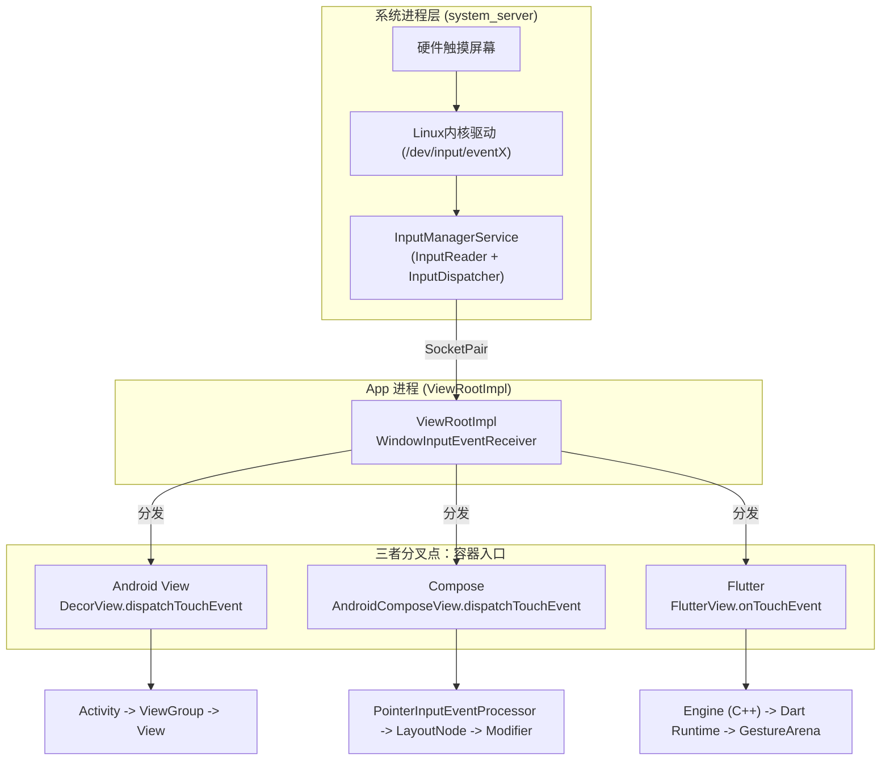

# 跨框架事件分发深度对比：Android View vs Compose vs Flutter

> 本文针对具有丰富 Android 原生经验的开发者，深度对比 Android 传统 View 体系、Jetpack Compose，以及 Flutter 的事件分发机制。
> 从宏观架构、事件传递链路、分发模型、冲突解决到 API 范式，全方位剖析三种 UI 框架在触摸手势处理上的底层差异与设计哲学。
>
> **前置阅读**：
> 1. [View绘制体系](../framework/View绘制体系.md)
> 2. [Compose渲染框架](./Compose渲染框架.md)
> 3. [Flutter渲染框架](./Flutter渲染框架.md)

---

## 目录
1. [架构定位与设计哲学](#1-架构定位与设计哲学)
2. [系统层链路与底层桥接](#2-系统层链路与底层桥接)
3. [分发模型核心差异](#3-分发模型核心差异)
4. [冲突解决与拦截机制](#4-冲突解决与拦截机制)
5. [手势处理与 API 范式](#5-手势处理与-api-范式)
6. [面试高频考点](#6-面试高频考点)

---

## 1. 架构定位与设计哲学

在现代 UI 框架演进过程中，事件分发模型经历了从**“命令式继承与对抗”**到**“声明式组合与协商/竞争”**的深刻转变。

### 1.1 设计范式对比

| 维度 | Android View | Jetpack Compose | Flutter |
|---|---|---|---|
| **核心思想** | 命令式 + 继承。依赖重写。 | 声明式 + 组合。通过 Modifier 链。 | 声明式 + 竞技场。手势识别与分发解耦。 |
| **模型形态** | **U 型分发** (父 -> 子 -> 父) | **三遍遍历** (Initial -> Main -> Final) | **手势竞技场** (竞争决定胜负) |
| **冲突解决** | 强制拦截 vs 禁止拦截（对抗式） | consume 状态标记（协商式） | 胜者通吃（竞争式） |
| **命中规则** | 找到即止（Break）。找到目标 View 后，同级不再遍历。 | 全收集。收集所有命中坐标的 LayoutNode。 | 全收集。收集所有命中坐标的 RenderObject。 |
| **事件归属** | `ACTION_DOWN` 时唯一确定。 | 所有命中节点均可参与。 | 竞技场决出胜者后，其余被踢出。 |

---

## 2. 系统层链路与底层桥接

无论上层 UI 框架怎么变，只要它运行在 Android 系统之上，其硬件到系统进程、再到 App 进程的输入事件分发链路**完全相同**。

### 2.1 链路全景与分叉点

系统层：`硬件产生中断 -> Linux内核驱动 -> InputManagerService -> ViewRootImpl`。三者的分叉点在于接收 `ViewRootImpl` 事件的**“根容器”**不同。



### 2.2 事件对象映射

底层传递的永远是 Android 的 `MotionEvent`，但在进入 Compose 或 Flutter 后，会被包装转换：
- **Android View**: 直接使用 `android.view.MotionEvent`。
- **Compose**: 被包装为 `PointerInputEvent`，通过坐标系转换交由节点处理。
- **Flutter**: 通过 JNI 传给 C++ Engine，最后在 Dart 层转化为 `PointerDataPacket`，再解码成 `PointerDownEvent` 等。

---

## 3. 分发模型核心差异

### 3.1 Android View：U 型经典模型

基于继承体系的三大方法：`dispatchTouchEvent` (分发)、`onInterceptTouchEvent` (拦截，仅 ViewGroup 有)、`onTouchEvent` (消费)。

- **过程**：事件从父 ViewGroup 的 `dispatchTouchEvent` 开始，向下层层传递，到底层叶子 View。如果叶子 View 在 `onTouchEvent` 返回 false，事件会向上层层回溯（U 型）。
- **局限性**：一个事件序列（由 DOWN 开始）一旦被某 View 消费，后续事件（MOVE/UP）就强行绑定给它。如果父容器中途拦截，子 View 只能被迫收到 `ACTION_CANCEL`。

### 3.2 Compose：三遍遍历模型（Initial / Main / Final）

Compose 抛弃了基于继承的事件分发。

1. **全收集**：HitTest 阶段，收集触摸点命中的**所有** `LayoutNode` 上的 `PointerInputModifier`，形成一条命中路径。
2. **三遍遍历**：对于路径上的所有节点（父 -> 中 -> 子），每次手势事件都会遍历三次：
   - **Initial (父 -> 子)**：父节点先看到事件，可提前观察或拦截（类似 View 拦截的协商版）。
   - **Main (子 -> 父)**：子节点先处理事件，大多数手势识别都在这遍进行（类似 View 的 onTouchEvent 阶段）。
   - **Final (父 -> 子)**：父节点最后确认事件是否被子节点消费，做出最终决策。

> 💡 **对比**：View 体系每个 View 只有分发和回传 2 次机会，而 Compose 每个节点有 3 次机会。

### 3.3 Flutter：手势竞技场 (Gesture Arena)

Flutter 的手势分发非常独特，将其分为**“原始指针事件分发”**和**“语义手势识别”**两个独立的阶段。

1. **HitTest 全收集**：与 Compose 类似，找出所有被触摸的 `RenderObject` 并生成 HitTestResult 路径。
2. **入场**：路径上的所有节点（无论是父是子）都会把自己的 `GestureRecognizer` 投入“手势竞技场”。
3. **竞争决胜**：所有节点同时开始识别手势（例如大家都收到 Down、Move）。随着手指移动，某些识别器发现不符合条件（如判定为垂直滑动，而它是水平滑动），就会**被淘汰**（Reject）。
4. **胜者通吃**：当竞技场中只剩下一个识别器，或者某识别器宣告**主动胜出**（Accept）时，它成为唯一胜者，独占后续事件，其他识别器被全部清理。

---

## 4. 冲突解决与拦截机制

### 4.1 Android View：父子对抗

- 父容器通过 `onInterceptTouchEvent` 返回 `true` 强制拦截。
- 子 View 可以调用 `parent.requestDisallowInterceptTouchEvent(true)` 强行剥夺父容器的拦截权。
- **缺点**：这种非此即彼的强制切断模式，导致嵌套滑动（NestedScrolling）需要额外引入复杂的机制来修补（如 `NestedScrollingParent/Child`）。

### 4.2 Compose：状态协商 (consume)

Compose 中没有强硬的“拦截”，而是通过事件对象的 `consume()` 状态来**协商**。
- 事件依旧会传递给所有节点。
- 但如果某个节点在 `Initial` 或 `Main` 阶段调用了 `event.consume()`，下游/上游节点在收到事件时，会看到 `isConsumed == true`。
- 其他节点看到被消费后，可以**自愿选择**不再处理该事件。这是契约，而非强行切断。

### 4.3 Flutter：竞技场竞争获胜

Flutter 解决滑动冲突依靠的是竞技场规则。
- 例如：水平 ListView 嵌套垂直 ListView。斜向滑动时，两者都在识别。谁先达到触发阈值（如移动距离 > 18 像素），谁就宣告获胜。
- 获胜者会触发 `onStart` 和后续滑动，失败者会触发 `onCancel`。这种机制极其天然地解决了绝大部分嵌套冲突问题。

---

## 5. 手势处理与 API 范式

### 5.1 Android View：GestureDetector

重写 `onTouchEvent`，利用 `GestureDetector` 或 `ViewDragHelper` 分析 `MotionEvent` 序列，手动判断 fling 速度、距离。样板代码多，与 UI 逻辑耦合深。

### 5.2 Compose：协程与挂起函数

声明式，代码极其简洁。利用 `Modifier.pointerInput` 结合协程，将异步的事件流变成同步直观的代码。
```kotlin
Modifier.pointerInput(Unit) {
    detectTapGestures(
        onDoubleTap = { /* 双击 */ },
        onTap = { /* 单击 */ }
    )
}
```
并且，基于 `awaitPointerEventScope` 的挂起机制，避免了无穷无尽的回调地狱。

### 5.3 Flutter：GestureDetector Widget

在 UI 树中直接嵌套 `GestureDetector` 或 `Listener`。
```dart
GestureDetector(
  onTap: () { /* 单击 */ },
  onDoubleTap: () { /* 双击 */ },
  child: Container(...),
)
```
底层会自动注册相应的 `TapGestureRecognizer` 参与竞技场。

---

## 6. 面试高频考点

### Q1：Android View 体系和 Compose/Flutter 在处理父子事件分发上的本质区别是什么？
**答**：View 体系是“拦截机制”，父 View 一旦在 `onInterceptTouchEvent` 拦截，子 View 就会收到 `CANCEL` 且以后**再也收不到**后续事件流。
而 Compose 和 Flutter 是“全收集”与“协商/竞技”机制。命中区域的所有节点都会全程参与。Compose 靠 `consume` 标记协商，Flutter 靠竞技场竞争，两者都不会从物理上粗暴阻断事件向下传递的通道。

### Q2：如果在 Flutter 中父子节点都监听了点击事件，谁先响应？
**答**：默认情况下，子节点优先响应。Flutter 在 HitTest 阶段从叶子节点到根节点收集路径，在手势竞技场中，当发生冲突且都在等待同一条件满足（如都在等待抬手判定为 Tap）时，竞技场有一个“兜底（Sweep）”策略：路径上**最深（即子节点）**的识别器胜出。

### Q3：Compose 为什么要设计 Initial / Main / Final 三遍遍历？
**答**：为了让父子节点能更好地“协商”而无需互相硬生生拦截。
- `Initial` 让父节点有机会在子节点处理前做预判（类似拦截功能）。
- `Main` 是主要的子节点到父节点的常规冒泡消费阶段。
- `Final` 给了父节点一个确认阶段，让父节点知道“刚才子节点到底有没有消费”，从而决定自己后续的动画或状态回退。View 体系缺乏这样的闭环确认机制。

### Q4：嵌套滑动（NestedScrolling）在三个框架中是如何处理的？
**答**：
- **View**：传统拦截机制失效，必须实现 `NestedScrollingChild/Parent` 接口，在滑动前向父级 `dispatchNestedPreScroll` 上报偏移量，极其繁琐。
- **Compose**：内置强大的 `NestedScrollConnection` 节点，基于协程调度，事件分发与滑动偏移（Delta）分发天然解耦。
- **Flutter**：底层依靠 Scrollable 和 Viewport 体系。对于同向嵌套滑动冲突，通常不用竞技场，而是借助 `NestedScrollView` 统一调度两个 `ScrollPosition`（类似协调器）。
