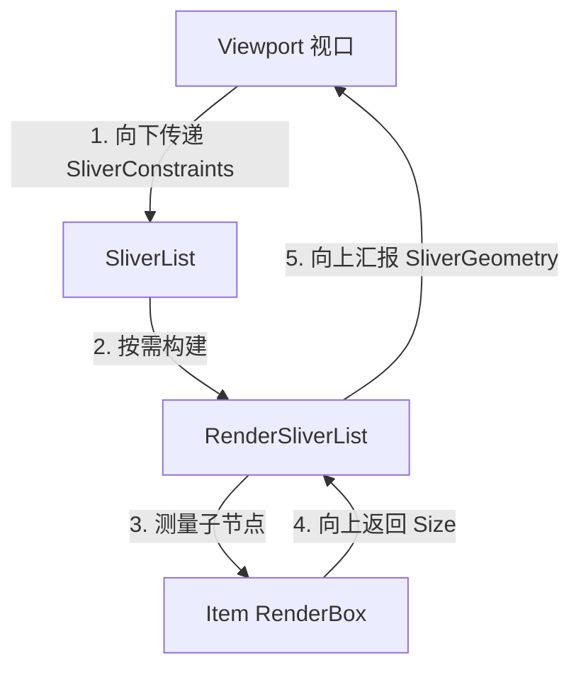
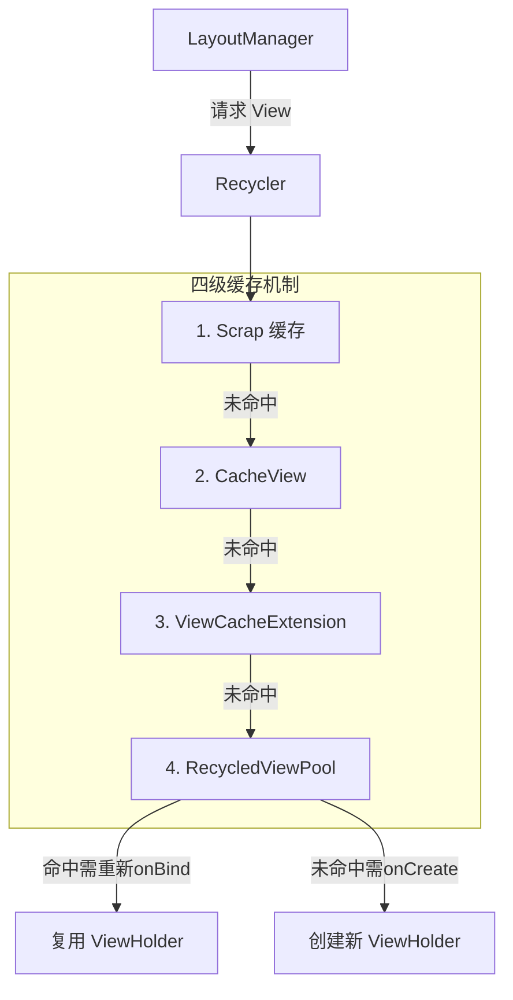
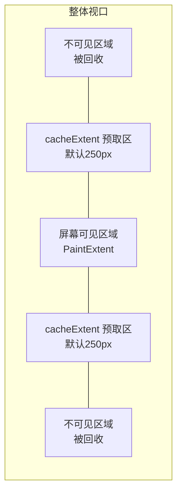

# 跨框架列表组件深度对比：RecyclerView vs Compose vs Flutter

> 本文针对具有丰富 Android 原生经验的开发者，深度对比 Android 传统 View 体系的 `RecyclerView`、Jetpack Compose 的 `LazyColumn`，以及 Flutter 的 `ListView`。
> 从基本使用、布局测量、缓存复用、滑动处理到预取机制，全方位剖析三种声明式/指令式列表组件的底层实现原理。
>
> **前置阅读**：
>
> 1. [03-View绘制体系](./03-View绘制体系.md)
> 2. [03-1-Compose渲染框架](./03-1-Compose渲染框架.md)
> 3. [03-2-Flutter渲染框架](./03-2-Flutter渲染框架.md)
> 4. [RecyclerView原理深度解析](../extra/RecyclerView原理.md)

---

## 目录

1. [架构定位与设计哲学](#1-架构定位与设计哲学)
2. [基本使用与 API 范式](#2-基本使用与-api-范式)
3. [布局与测量机制](#3-布局与测量机制)
4. [回收与复用机制（核心差异）](#4-回收与复用机制核心差异)
5. [滑动处理与手势机制](#5-滑动处理与手势机制)
6. [数据更新与局部刷新](#6-数据更新与局部刷新)
7. [预取机制深度剖析 (Prefetching)](#7-预取机制深度剖析-prefetching)
8. [性能优化最佳实践](#8-性能优化最佳实践)
9. [面试高频考点](#9-面试高频考点)

---

## 1. 架构定位与设计哲学

在现代 UI 框架演进过程中，列表组件一直是被重点优化的对象，因为它是最容易引发卡顿的复杂场景。

### 1.1 设计范式对比


| 框架             | 组件基石                      | 编程范式                 | 核心思想                                                                 | 架构分层定位                                                                    |
| -------------- | ------------------------- | -------------------- | -------------------------------------------------------------------- | ------------------------------------------------------------------------- |
| **Android 原生** | `RecyclerView`            | **指令式（Imperative）**  | 极度解耦的 MVC/MVP。将数据（Adapter）、布局（LayoutManager）、动画（ItemAnimator）职责强制分离。 | 位于 Android Framework 层，重度依赖 View 体系的 measure/layout/draw 流程。              |
| **Compose**    | `LazyColumn` / `LazyRow`  | **声明式（Declarative）** | 状态驱动 UI。UI 是状态的函数，通过局部重组（Recomposition）更新。没有传统的 ViewHolder。          | 构建在 Compose Runtime 的 SlotTable 之上，通过 `SubcomposeLayout` 按需生成 LayoutNode。 |
| **Flutter**    | `ListView` / `SliverList` | **声明式（Declarative）** | 一切皆 Widget。通过 Widget 树生成 Element 树，再生成 RenderObject 树。               | 建立在 Flutter 自身的 Rendering Pipeline 之上，核心依赖于 `Sliver` 协议（视口/滚动协议）。         |


### 1.2 渲染层级与视图嵌套

- **RecyclerView**：列表项是真实的 `View` 对象。每个 Item 往往是一个 `ViewGroup`，如果层级过深，会在 `onMeasure` 阶段带来巨大的递归开销。
- **Compose**：没有传统 View 对象。`LazyColumn` 中的 Item 被展开为扁平的 `LayoutNode` 树，单遍测量（Single-pass layout）消除了深层嵌套带来的性能衰减。
- **Flutter**：类似于 Compose，按需生成 `RenderObject` 参与排版。Flutter 引入了 `Sliver`（滑动碎片）概念，滑动容器内的元素全部遵守 `SliverConstraints` 协议进行扁平化布局。

---

## 2. 基本使用与 API 范式

不同框架在 API 设计上展现了时代的变迁。

### 2.1 RecyclerView：指令式的巅峰与样板代码

需要显式创建 Adapter 和 ViewHolder，手动处理数据绑定。

```java
// 样板代码多：Adapter, ViewHolder, onCreateViewHolder, onBindViewHolder
public class MyAdapter extends RecyclerView.Adapter<MyAdapter.ViewHolder> {
    @Override
    public ViewHolder onCreateViewHolder(ViewGroup parent, int viewType) {
        View view = LayoutInflater.from(parent.getContext()).inflate(R.layout.item, parent, false);
        return new ViewHolder(view);
    }

    @Override
    public void onBindViewHolder(ViewHolder holder, int position) {
        holder.bind(data.get(position));
    }
    // ...
}
// 使用
recyclerView.setLayoutManager(new LinearLayoutManager(context));
recyclerView.setAdapter(new MyAdapter());
```

### 2.2 Compose：DSL 声明式之美

极其简洁，没有 Adapter/ViewHolder 的概念，只需告诉框架“每个索引位置长什么样”。

```kotlin
LazyColumn(
    modifier = Modifier.fillMaxSize(),
    contentPadding = PaddingValues(16.dp)
) {
    items(
        items = dataList,
        key = { item -> item.id }, // 强烈建议提供 key，提升复用与重组性能
        contentType = { item -> item.type } // 提供 contentType 帮助底层节点复用
    ) { item ->
        ItemRow(item)
    }
}
```

### 2.3 Flutter：Sliver 视口与按需构建

使用 `ListView.builder`，提供一个 `itemBuilder` 回调按需构建 Widget。

```dart
ListView.builder(
  itemCount: dataList.length,
  itemBuilder: (context, index) {
    return ItemRow(dataList[index]);
  },
)
```

---

## 3. 布局与测量机制

列表组件的核心难点在于：**只测量和布局屏幕可见范围内的元素**。

### 3.1 RecyclerView：LayoutManager 的两遍测量

`LayoutManager` 是 RecyclerView 的布局引擎。为了支持 Item 增删动画（预测动画），它引入了**两遍布局机制（Pre-layout & Post-layout）**。

1. **Pre-layout（预布局）**：假定所有 Item 动画都已完成之前的状态，计算哪些 View 将会飞出屏幕，哪些会飞入屏幕，提前为它们分配空间和计算位置。
2. **Post-layout（真实布局）**：最终的真实状态布局。

*关键步骤*：在 `onLayoutChildren()` 中，通过 `fill()` 方法向各个方向填充屏幕空间，并在内部调用 `layoutChunk()` 计算单个子 View 的位置，直至剩余可用空间 `remainingSpace` 耗尽。

### 3.2 Compose LazyColumn：SubcomposeLayout (延迟组合)

Compose 的测量是在重组后发生的，但对于无限列表，不能把所有 Item 都组合（Compose）。
因此引入了 `**SubcomposeLayout`**。

- **按需组合**：`LazyColumn` 不会一次性执行传入的 content lambda。只有在滚动到特定位置时，才会触发特定范围内的 `item` 的 Composition（组合），生成对应的 `LayoutNode`。
- **单遍测量**：组合出的节点被交给底层的 `LazyListMeasureResult`。它沿着主轴依次测量每个 `LayoutNode`，直到屏幕空间被填满。
- **测量缓存**：一旦超出可见区域，多余的节点不会被绘制，甚至会被回收（Decompose）。

### 3.3 Flutter ListView：SliverConstraints 与视口协议

Flutter 将列表的滑动和布局抽象为独创的 **Sliver（滑动碎片）** 系统。在 Flutter 看来，所有的滚动视图底层都是一个物理上的“窗口”（`Viewport`）和里面一长串的“胶卷”（`Sliver`）的组合。




#### 举个通俗的例子来理解 Sliver 布局：

假设你有一个固定的相框（**Viewport**），高度是 800px。相框里装着一卷很长很长的清明上河图画卷（**SliverList**）。现在，用户用手指往上滑了 1000px 的距离。

1. **父传子（下达约束 `SliverConstraints`）**：
  此时触发了界面的重新布局。相框（Viewport）会对画卷（SliverList）发号施令：“兄弟，用户现在往下扒拉了 1000px 的距离（`scrollOffset = 1000`），我这个相框还能为你提供 800px 的可见空间（`remainingPaintExtent = 800`），而且我允许你再往下多预加载 250px 的内容（`cacheExtent = 250`）。请你把这部分给我算出来。”
2. **子节点内部消化（按需构建与测量）**：
  `RenderSliverList` 接到这个命令。假设每个卡片的高度是 100px。它在内部一算：
  - “哦，前 1000px 对应的是第 0 到第 9 个卡片，它们都已经滑出相框（甚至滑出缓存区）了，我连对象都不去造，之前的如果造了也直接回收掉（销毁 Element）！”
  - “我需要占据相框的 800px，外加 250px 的预取区。所以我现在当场去触发 `itemBuilder`，把第 10 个到第 20 个卡片实时 `build()` 并 `measure()`（测量）出来。”
3. **子传父（汇报产物 `SliverGeometry`）**：
  画卷（SliverList）把这几个需要的卡片排好版之后，它必须给相框一个交代。它向上传递一个叫做 `SliverGeometry` 的对象：
   “兄弟，你要的部分我排好了。顺便向你汇报一下，虽然我这次只画了 10 几个卡片，但我估算了一下，我这整个画卷如果全拉开，总长大概有 10000px（`scrollExtent = 10000`），你目前这帧真实看到了我 800px 的内容（`paintExtent = 800`）。”
   相框（Viewport）拿到这个 `scrollExtent` 总长度后，才能在屏幕边缘正确地算出并画出那根**滚动条（Scrollbar）**的滑块大小和位置。

> 💡 **灵魂拷问：SliverList 并没有构建所有的子节点，它是怎么知道自己总长（scrollExtent）是多少的？**
>
> 这是一个非常经典的底层问题。答案是：**靠“猜”（估算算法）**。
> 因为懒加载的特性，`RenderSliverList` 绝对不可能提前去把一万个节点全测一遍。它是这样估算的：
> 它会记录它**目前已经构建过**的子节点的总高度，并算出这些已露面节点的**平均高度**。然后用 `已算出的平均高度 * 列表总条目数 (itemCount)`，得出一个粗略的总长度，交差给 Viewport。
>
> - **副作用（滚动条跳变）**：这就是为什么在 Flutter 开发中，如果你的列表项高度不一致（比如有的是 50px，有的是 200px），在你往下滑动时，你会发现右侧的**滚动条滑块会忽长忽短，或者滑动比例会突然跳变**。因为随着你向下滚动，暴露出来的节点越来越多，它的“平均高度”在不断修正，导致向外汇报的总长度 `scrollExtent` 也在实时剧烈波动。
> - **终极优化（itemExtent）**：如果你明确知道每个卡片的高度固定是 100px，**强烈建议在 `ListView` 中强制传入 `itemExtent = 100`**。一旦有了这个参数，底层节点会直接切换成 `SliverFixedExtentList`，总高度的计算直接变成绝对精确的 `100 * itemCount`，不仅滚动条瞬间丝滑完美，更因为在滑动时彻底省去了大量的边界推算逻辑，性能会得到肉眼可见的大幅提升！

**核心差异总结**：
普通的 View（Box布局）传递的是单纯的宽度和高度限制（`BoxConstraints`）。但滚动列表没法这么搞，因此 Flutter 专门发明了 Sliver 协议：**父节点传给子节点的是“滑动状态”（滑到哪了、相框多大），子节点传给父节点的是“物理几何特征”（我总共有多长、我有没有超出边界）。** 这套协议让多个 ListView 可以无缝拼接在同一个滚动视口中（比如 CustomScrollView）。

---

## 4. 回收与复用机制（核心差异）

复用机制是列表性能的分水岭。RecyclerView 将复用做到了极致，而 Compose 和 Flutter 由于没有传统的 View 体系，其复用思想有根本的区别。

### 4.1 RecyclerView 的四级缓存机制 (Recycler)

RecyclerView 设计了极为经典的四级缓存：




- **Scrap**：只在布局期间（如动画、重排）临时保存，不需要重新 bind。
- **CacheView**：精准匹配 `position`。滑出屏幕一点点的 View 保存在此，滑回来时**完全不需要重新 `onBindViewHolder`**，直接复用。
- **RecycledViewPool**：按 `viewType` 缓存。从池中取出的 View 需要重新走 `onBindViewHolder`。支持多个 RecyclerView 共享同一个 Pool。

### 4.2 Compose 的节点复用 (LazyLayoutItemReuse)

Compose 没有 View 和 ViewHolder，它复用的是 `**LayoutNode`**。

- 当一个 Item 滑出屏幕时，其对应的 `LayoutNode` 会被放入 `LazyLayoutItemReuseProvider` 中的池子里。
- 当有新的 Item 进入屏幕且它们的 `**contentType` 相同**时，Compose 会从池中取出旧的 `LayoutNode`。
- 然后利用底层的 SlotTable 更新机制，将新数据映射到旧的 `LayoutNode` 上，完成"重组"（Recomposition）。

> 💡 **对比**：Compose 的 `contentType` 就相当于 RecyclerView 的 `viewType`。如果你不提供 `contentType`，默认所有 item 都认为是同一类型，底层就可以高效复用 Node。

### 4.3 Flutter 的 Element 复用与回收：为什么敢“抛弃池化”？

Flutter 也抛弃了类似 `RecyclerView` 那种复杂的对象池（Object Pool）缓存做法，依赖于自己的响应式树结构。

1. **真实的销毁（默认行为）**：当列表项滑出 `cacheExtent`（预取区域）时，这个 Item 对应的 `Widget`、`Element` 和 `RenderObject` 会被**真实地卸载（unmount）并标记为垃圾等待 GC 回收**。当它再次滑入屏幕时，会重新 `build()` 实例化一整套全新的对象。
2. **状态保留（KeepAlive）**：对于包含昂贵状态的复杂节点（如视频播放器、复杂的表单），可以使用 `AutomaticKeepAliveClientMixin`。此时滑出屏幕的节点不会被卸载，而是被标记为休眠状态（offstage），强行保留在内存中不被回收。

**灵魂拷问：Flutter 为什么敢这么“浪费”？连对象池都不搞？**

在原生 Android 中，由于 `View` 对象极其沉重（包含海量的属性、动画、无障碍状态、甚至关联着底层的 Native 内存），频繁的创建和销毁会导致灾难性的内存抖动（Memory Churn）和卡顿。这也是为什么必须有 `RecyclerView` 这种怪物级缓存池的原因。

但 Flutter 敢这么做的底气在于它的底层引擎设计：

1. **树的轻量化分层**：Flutter 把最频繁重建的 `Widget` 设计成了不可变的、极其轻量的配置类（内部基本只有几个简单字段的引用）。对于现代虚拟机的年轻代（Young Generation）内存回收机制来说，这种短命的小对象创建和销毁速度极快，几乎不造成负担。
2. **真正的干活者能被 Diff 救活**：虽然滑出屏幕的会被销毁，但在**屏幕内部**滚动时，Flutter 会进行 Element Diff。如果新构建的 Widget 的 `runtimeType` 和 `key` 与旧的 Element 一致，那么那棵真正沉重且复杂的 `RenderObject` 树（负责布局、排版、甚至关联着底层的 GPU 纹理资源）就会被**直接复用并就地更新**，而不需要重新实例化。
3. **分代垃圾回收的红利**：Dart 的垃圾回收器对生命周期极短的对象（如滑出屏幕就被废弃的列表项 UI 节点）做了专门的极致优化。相比于手动维护一个庞大且复杂的“对象池（会强引用对象，导致它们进入老年代，反而引发更耗时的 Major GC）”，Flutter 选择相信现代 GC 的能力——随用随扔。

#### 4.4 极限场景拷问：如果列表里全是视频播放器怎么办？

刚才提到，Flutter 默认会销毁滑出屏幕的节点（随用随扔）。但如果我的列表项非常昂贵呢？比如类似于抖音、快手那样的**全屏短视频流**，或者列表里全都是带着复杂 WebView/地图 的节点。

如果你不使用 `KeepAlive`，每次滑入都要重新初始化播放器和网络请求，**性能会极差，卡顿严重**。
如果你对所有视频节点都无脑加了 `AutomaticKeepAliveClientMixin`，那么只要滑过的视频都会被强行保存在内存中不被销毁，**内存会瞬间起飞甚至 OOM（Out Of Memory）**。

**在这种极限业务场景下，Flutter 确实暴露出其“没有原生对象池”的短板。该如何破局？**

**破局方案：业务层手动实现对象池（软接管）**
此时不能再指望 Flutter 框架级的渲染复用，必须由开发者在**业务逻辑层**手动打造一个“池子”（类似 RecyclerView 的思路）：

1. **渲染层解耦**：列表项的 Widget 依然让 Flutter 随用随扔（不加 KeepAlive，保持轻量）。
2. **昂贵对象池化**：但是将真正昂贵的**底层对象（如 `VideoPlayerController`、TextureId）**提取出来，放到一个全局的 `Map` 或 `List` 中池化管理。
3. **动态绑定与解绑**：当一个新的短视频 Widget 滑入屏幕并 `build()` 时，它去全局的池子里“借”一个已经初始化好的、处于空闲状态的 `VideoPlayerController` 绑定给自己。当它滑出屏幕被 `dispose()` 时，它并不销毁控制器，而是把控制器“还”给池子，并暂停播放。

这就相当于：**车厢（Widget/Element）依然是走到哪造到哪、用完就炸，但里面的核心发动机（昂贵资源）只有固定的 3 台，谁上场谁就装上这台发动机**。通过这种方式，Flutter 依然能完美驾驭极其复杂的重型列表流。

---

## 5. 滑动处理与手势机制

### 5.1 RecyclerView (NestedScrolling)

RecyclerView 实现了 `NestedScrollingChild3` 接口，是 Android 嵌套滑动体系的基石。

- 拦截手势（`onInterceptTouchEvent` 和 `onTouchEvent`）。
- 使用 `OverScroller` 处理 Fling（惯性滑动）。
- 当内部滑动到边缘时，会将多余的滑动距离 `dispatchNestedScroll` 分发给父容器（如 `CoordinatorLayout` 或 `AppBarLayout`），实现经典的联动折叠效果。

### 5.2 Compose (Modifier.nestedScroll)

Compose 使用完全不同的事件分发树（PointerInput）和协程体系处理滑动。

- 使用 `ScrollableState`（通常是 `LazyListState`）保存滑动状态。
- 利用 `Modifier.nestedScroll()` 节点构建一个嵌套滑动树（NestedScrollConnection）。
- 滑动事件由 `dispatchRawDelta` 派发，Fling 动效依靠挂起函数 `scroll()` 在协程中逐帧执行，代码极度解耦且容易扩展。

### 5.3 Flutter (Scrollable & Viewport)

- **Scrollable**：监听手势输入，创建并维护 `ScrollPosition`（滚动偏移量）。
- **Viewport**：接收 `ScrollPosition` 的偏移量。
- **Sliver 体系**：根据偏移量，通过 Sliver 协议一层层向下传递 `SliverConstraints`，驱动 Sliver 重新计算并排版。不支持原生 View 的 `NestedScrolling` 协议，除非做平台桥接。

---

## 6. 数据更新与局部刷新

### 6.1 RecyclerView：DiffUtil

早期使用 `notifyDataSetChanged()` 导致全局刷新、无动画且性能差。
现代做法依赖 `**DiffUtil`**（或基于其封装的 `ListAdapter`）：

- 在后台线程对比旧 List 和新 List，使用 Myers 差分算法计算出增删改移的步骤。
- 回调 `notifyItemInserted/Removed/Changed`。
- `ItemAnimator` 捕获这些变化，执行对应的位移/透明度动画。

### 6.2 Compose：Snapshot 状态观测

声明式 UI 的杀手锏：自动局部刷新。

- 当传入 `items` 的数据源（`State<List>`）改变时，触发重组。
- 如果定义了 `key`，Compose 的 SlotTable 知道数据只是移动了位置，底层 `LayoutNode` 会直接发生位移而不是销毁重建。
- 配合 `Modifier.animateItemPlacement()` 可以极简实现列表动画。

### 6.3 Flutter：setState 与 AnimatedList

- 默认的 `ListView.builder` 改变数据后调用 `setState`，会重建所有可见范围内的 Widget，依赖 Element diff 来复用底层 RenderObject。
- 如果需要像 RecyclerView 那样的增删动画，必须使用 `AnimatedList`，并在增删数据时显式调用 `AnimatedListState.insertItem()` 和 `removeItem()`，这是指令式向声明式妥协的产物。

---

## 7. 预取机制深度剖析 (Prefetching)

为了防止快速滑动时产生白屏或卡顿，三种框架都引入了预取机制。

### 7.1 RecyclerView：GapWorker 机制

Android 5.0 引入了 RenderThread。UI 线程将绘制指令（DisplayList）同步给 RenderThread 后，往往会闲置一段时间（等待 VSync）。

- **GapWorker**：RecyclerView 会在这个闲置的"缝隙(Gap)"时间里，利用主线程异步调用 `Adapter.onCreateViewHolder` 和 `onBindViewHolder`，预先准备好下一个即将进入屏幕的 Item。
- **双重预取**：如果使用了嵌套 RecyclerView（如横向滑动的组栏），内部 RecyclerView 的 Item 也会被预取。

### 7.2 Compose：LazyLayoutPrefetchState

- 当列表滑动时，Compose 会计算接下来的滑动趋势。
- 通过 `LazyLayoutPrefetchState.scheduleForPrefetch()` 提早进行即将入场元素的 **Pre-composition（预组合）** 和 **Pre-measure（预测量）**。
- 这个过程利用协程分散在多个帧的空闲时间片中执行，从而避免在某一帧因突然创建庞大 Node 导致的卡顿。

### 7.3 Flutter：cacheExtent (缓存区域)




- Flutter 在视口上下各增加了默认 `250px` 的 `cacheExtent` 区域。
- 处于这个区域的 Item 会被正常执行 `build()` 和 `layout()`，但不会执行 `paint()`（不会光栅化）。
- 这样当用户滑动时，元素早就布局好了，直接参与绘制即可。

---

## 8. 性能优化最佳实践

### 8.1 RecyclerView 优化

1. **减少层级**：尽量扁平化 Item 布局，避免使用 `ConstraintLayout` 造成双重测量，简单布局推荐 `LinearLayout`/`FrameLayout`。
2. **共享 Pool**：嵌套 RecyclerView 场景下，为所有内部列表设置 `setRecycledViewPool(sharedPool)`。
3. **setItemViewCacheSize**：对于包含复杂状态（如 VideoPlayer）的列表，适当调大 CacheView 大小，减少重新 bind 的开销。
4. **异步 DiffUtil**：坚决避免在主线程执行 `DiffUtil.calculateDiff`，使用 `ListAdapter` 自动处理。

### 8.2 Compose LazyColumn 优化

1. **提供 Key 和 ContentType**：
  ```kotlin
   items(data, key = { it.id }, contentType = { it.type }) { ... }
  ```
   没有 Key 会导致插入删除时大量不必要的重组；没有 ContentType 会降低 Node 跨类型复用率。
2. **避免在 Item 内部读取高频状态（状态降级读取）**：
  如果 Item 的 UI（如背景色、透明度）依赖于列表的滚动偏移量，千万不要把偏移量直接当做参数传给 Item 组件。因为滚动是高频触发的，这会导致列表项在每一帧都疯狂触发**重组（Recomposition）甚至重新测量（Measure）**，引发严重卡顿。
   **正确解法：将状态读取推迟到 Draw（绘制）阶段**。

```kotlin
// ❌ 灾难写法：滚动时每帧触发全量重组
@Composable
fun BadItem(scrollOffset: Int) {
    Box(Modifier.offset(y = scrollOffset.dp))
}

// ✅ 最佳实践：使用 Modifier 绘制作用域读取，只触发重绘
@Composable
fun GoodItem(scrollState: LazyListState) {
    Box(
        Modifier.graphicsLayer {
            // 在 graphicsLayer (绘制阶段) 读取状态，完全绕过组合与测量！
            translationY = scrollState.firstVisibleItemScrollOffset.toFloat()
        }
    )
}
```

1. **图片加载避免引发不断重组**：
  在列表项中加载网络图片时，要确保使用带有 `remember` 缓存机制的 API。
   **反例**：如果在 `LazyColumn` 里使用一个每次都会返回新 `Painter` 实例的自定义函数，那么当列表稍微滑动引发微小重组时，图片就会不断闪烁重新加载。
   **正例**：使用 Coil 等标准库的 `rememberAsyncImagePainter` 或 `AsyncImage`。

```kotlin
// Coil 底层会自动 remember 请求状态，即使外部发生重组，只要 imageUrl 没变，绝不重新拉取
AsyncImage(
    model = item.imageUrl,
    contentDescription = "Avatar"
)
```

### 8.3 Flutter ListView 优化

1. **const 构造器**：尽可能为 Item 中的静态组件加上 `const` 修饰符，Flutter 在重建树时会直接短路（Short-circuit）跳过这些 Widget 的构建。
2. **itemExtent / prototypeItem**：如果 Item 高度固定，必须设置 `itemExtent`。这能让 ListView 直接计算出滚动范围，避免在滚动时逐个测量 RenderBox 带来的卡顿。
3. **按需 KeepAlive**：不要滥用 `AutomaticKeepAliveClientMixin`。这会导致内存中积压大量 RenderObject，引发 GC 压力和 Raster 卡顿。

---

## 9. 面试高频考点

### Q1：这三个框架在回收复用机制上最根本的区别是什么？

**答**：RecyclerView 复用的是重量级的 UI 实例（`ViewHolder` 包装的 `View`），具有精细的四级缓存来区分"无需重绑"（Cache）和"需重绑"（Pool）。Compose 没有对象缓存，而是复用底层的 `LayoutNode` 并通过状态驱动局部重组（重走组合流程替换数据）。Flutter 则更轻量，由于 `Widget` 极度廉价直接销毁重建，它依赖 `Element` 树的 diff 匹配来复用底层开销稍大的 `RenderObject`，出了 `cacheExtent` 就彻底销毁。

### Q2：RecyclerView 的 `CacheView` 对应到 Flutter 和 Compose 中是什么机制？

**答**：`CacheView` 缓存的是位置精确匹配、无需重新绑定的视图。
在 Flutter 中，这对应于 `cacheExtent` 区域内的元素。它们被保留在 Element 树和 RenderObject 树中，只是没有被绘制。
在 Compose 中，由于声明式重组的特性，没有直接等价的缓存，但通过提供唯一 `key`，滑出后再滑回来的元素可以保持内部状态（`remember` 的值不丢失），达到类似避免重新初始化的效果。

### Q3：它们的滑动卡顿（Jank）排查方向有什么不同？

**答**：

- **RecyclerView**：重点看 `onBindViewHolder` 是否存在耗时计算或主线程阻塞，以及 Item 布局层级过深导致的 `measure` 耗时（可用 Systrace / Perfetto `Choreographer#doFrame` 确认）。
- **Compose**：重点查是否缺失 `key` 导致了大面积的无效重组（Recomposition），以及状态读取位置不对导致在滚动时频繁触发重组而不是重绘（可用 Layout Inspector 查看重组次数）。
- **Flutter**：分清是 UI Thread（`build`/`layout` 卡顿）还是 Raster Thread（光栅化卡顿）。UI 卡顿多为没用 `const` 或没设 `itemExtent`；Raster 卡顿多为图片解码或复杂的 `Clip`/`SaveLayer` 操作（可用 DevTools Performance 火焰图排查）。

### Q4：Flutter 列表滑出屏幕直接销毁节点，如果列表项是视频播放器这种昂贵组件，如何避免性能崩溃或 OOM？

**答**：这是一个区分普通开发者和资深架构师的极限场景考题。
由于 Flutter 依赖 GC 随用随扔，没有类似 RecyclerView 的全局对象缓存池。

- 如果不保留状态，每次滑入都重新初始化底层 C++ 播放引擎，滑动会**极度卡顿**。
- 如果无脑给所有视频加上 `KeepAlive`，滑过的视频全部强驻内存晋升老年代，会**瞬间引发 OOM**。
**大厂的标准破局方案是“业务层手动池化，张冠李戴”**：

1. **解耦**：列表项的 UI 外壳（Widget/Element，包含点赞、评论等UI）依然不加 KeepAlive，让 Flutter 按需随用随扔，保持轻量。
2. **池化核心引擎**：将真正昂贵的底层对象（如 `VideoPlayerController` 或 TextureId）抽离出来，在全局维护一个定长（如 3-5 个）的数组作为**对象池**。
3. **动态绑定**：当新的视频 Widget 滑入屏幕 `build()` 时，去池子里“借”一个空闲的播放器插在自己身上；当它滑出屏幕被 `dispose()` 销毁时，不要销毁播放器，而是将其重置并“归还”给全局池子。从而实现**“UI 随用随扔，引擎全局复用”**。

