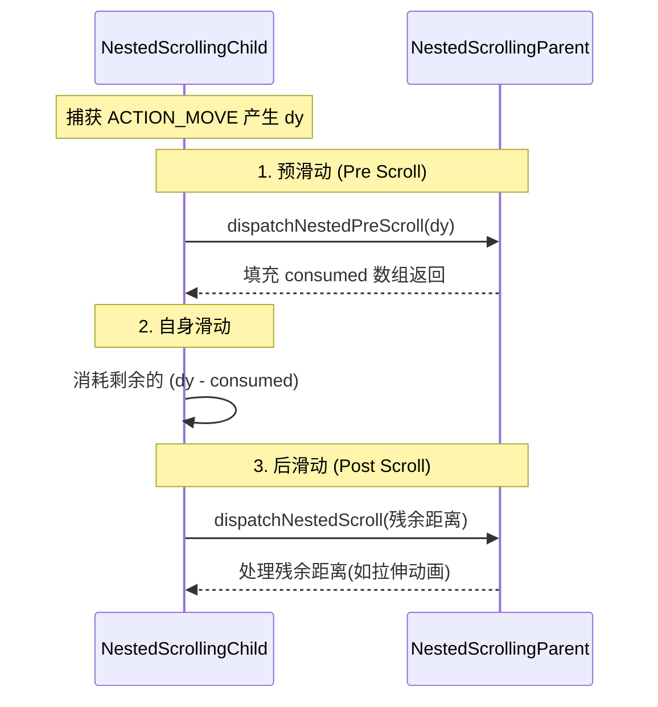
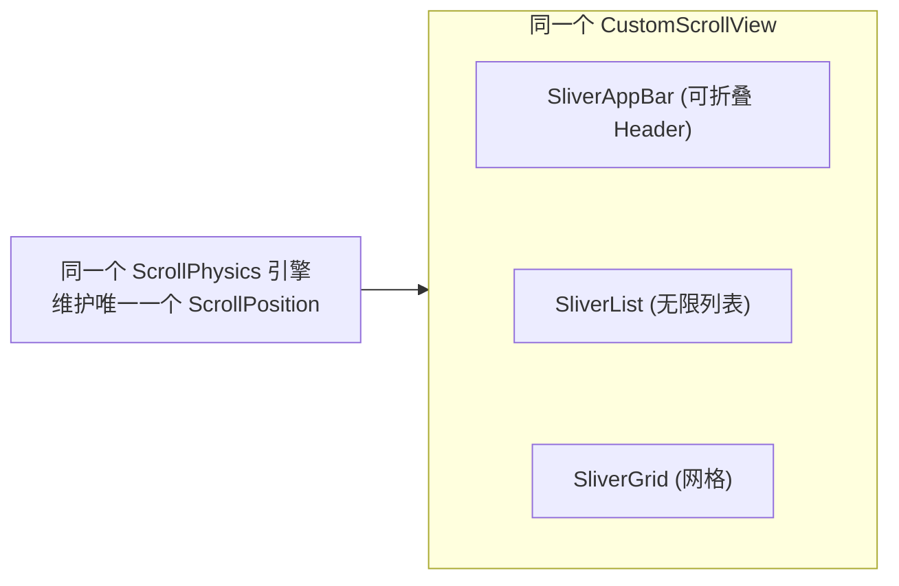

# 嵌套滚动跨框架对比：RecyclerView vs Compose vs Flutter

> 本文深度剖析 Android 原生 View（RecyclerView）、Jetpack Compose 与 Flutter 三大 UI 框架在处理嵌套滚动（Nested Scrolling）时的不同架构设计。从传统的 NestedScrolling 接口协议，到 Compose 的修饰符与协程流，再到 Flutter 的 Sliver 物理引擎共享，带你全面掌握嵌套滑动的底层演进与实现哲学。
>
> **前置阅读**：
>
> 1. [事件分发跨框架对比](./事件分发跨框架对比.md)
> 2. [列表组件跨框架对比](./列表组件跨框架对比.md)

---

## 目录

1. [背景与痛点：为什么需要嵌套滚动机制？](#1-背景与痛点为什么需要嵌套滚动机制)
2. [Android 原生 (RecyclerView)：接口协议流](#2-android-原生-recyclerview接口协议流)
3. [Jetpack Compose：Modifier 修饰符与协程流](#3-jetpack-composemodifier-修饰符与协程流)
4. [Flutter：Sliver 物理共享与视口碎片](#4-fluttersliver-物理共享与视口碎片)
5. [跨框架横向对比（核心总结）](#5-跨框架横向对比核心总结)
6. [面试高频考点](#6-面试高频考点)

---

## 1. 背景与痛点：为什么需要嵌套滚动机制？

### 1.1 传统事件分发的局限性

在处理同向的滑动冲突（例如一个垂直的 ScrollView 内部嵌套一个垂直的 RecyclerView）时，传统的事件分发机制显得力不从心。
基于 `onInterceptTouchEvent` 的传统机制是一个**“对抗式”的独占模型**：**一个事件序列（从 DOWN 到 UP）一旦被某个 View 决定消费，后续的所有事件都会强行分配给它。**

这导致了一个死结：

- 如果父容器拦截了事件，内部列表就永远滑不动。
- 如果内部列表滑动到了顶部/底部，想要把后续的滑动操作平滑地**“交接”**给父容器继续滑动，传统机制**做不到**。因为一旦父容器在半路强行拦截，子节点会立刻收到 `ACTION_CANCEL` 并彻底失去后续触摸事件，导致滑动瞬间断层。

### 1.2 嵌套滚动的核心理念：从“拦截”到“协同”

为了打破这种“独占式”的局限，现代 UI 框架无一例外地引入了**嵌套滚动（Nested Scrolling）机制**。
它的核心思想从“事件拦截”转变为**“滑动距离的协同分配”**：
无论手指放在哪里，优先让最底层的滑动组件（Child）捕获事件，但在它消耗滑动距离之前和之后，必须按契约向上级（Parent）汇报并允许父容器优先消耗。这样就实现了父子组件之间完美的滑动距离接力。

---

## 2. Android 原生 (RecyclerView)：接口协议流

在 Android View 体系中，嵌套滚动机制是通过一对强解耦的接口（`NestedScrollingChild` 和 `NestedScrollingParent`）同步调用的方式实现的。

### 2.1 核心角色与三步协同流

- `**NestedScrollingChild`**：事件的产生者（通常是内层可滑动的 View，如 `RecyclerView`）。负责捕获手势并计算滑动偏移量。
- `**NestedScrollingParent`**：事件的消费者（通常是包裹在外层的容器，如 `CoordinatorLayout`）。接收子 View 的滑动报告并做出响应。

它们之间的协同工作流是一个经典的**三步走（PreScroll -> Scroll -> PostScroll）同步调用模型**：




### 2.2 协议演进与 V3 核心实现

原生的 NestedScrolling 最终演进到了 **V3 协议** (`NestedScrollingChild3` / `NestedScrollingParent3`)。
V3 协议最核心的特性是：

1. **Fling 变 Scroll（降维打击）**：通过引入 `type` 参数（`TYPE_TOUCH` / `TYPE_NON_TOUCH`），将原本一次性抛出的惯性滑动速度（Fling Velocity），转化为动画引擎中一帧帧的位移量（dy），伪装成普通的 Scroll 分发，完美实现了父子之间的惯性滑动顺滑接力。
2. **双向消费感知**：在 PostScroll 阶段的 `onNestedScroll` 回调中新增了 `consumed` 数组参数，让子 View 能够确切知道父容器在后续接力中究竟消费了多少残余距离。

#### V3 版本父子两层列表嵌套实现伪代码

以下展示了一个标准父容器（实现 `Parent3`）和子容器（实现 `Child3`）的核心嵌套滑动交互逻辑：

```java
// ==================== 【子容器 (如内部 RecyclerView)】 ====================
public class NestedChildList extends View implements NestedScrollingChild3 {
    private final NestedScrollingChildHelper mChildHelper = new NestedScrollingChildHelper(this);

    @Override
    public boolean onTouchEvent(MotionEvent event) {
        // 1. 滑动开始，通知父容器寻找能够接收滑动的 Parent
        startNestedScroll(ViewCompat.SCROLL_AXIS_VERTICAL, ViewCompat.TYPE_TOUCH);
        
        int dy = calculateScrollDistance(event);
        int[] consumed = new int[2];
        int[] offsetInWindow = new int[2];

        // 2. PreScroll：子容器自己滑动前，先问父容器要不要"拦截"部分距离
        if (dispatchNestedPreScroll(0, dy, consumed, offsetInWindow, ViewCompat.TYPE_TOUCH)) {
            // 父容器消费了 consumed[1] 的距离，子容器减去被消费的部分
            dy -= consumed[1]; 
        }

        // 3. 子容器自身消费剩余的滑动距离
        int scrollConsumed = childScrollSelf(dy);
        int unconsumed = dy - scrollConsumed; // 子容器到底了没滑完的残余距离

        // 4. PostScroll：子容器滑完了，将剩余的残余距离分发给父容器
        int[] parentConsumed = new int[2]; // V3 特有：记录父容器在 PostScroll 消费的量
        dispatchNestedScroll(
            0, scrollConsumed, // 子容器已消费
            0, unconsumed,     // 子容器未消费
            offsetInWindow, 
            ViewCompat.TYPE_TOUCH, 
            parentConsumed     // V3 新增参数传入
        );
        
        return true;
    }

    // 惯性滑动 (Fling) 时，子组件通过 OverScroller 每一帧计算出位移后分发
    private void fling(int velocityY) {
        startNestedScroll(ViewCompat.SCROLL_AXIS_VERTICAL, ViewCompat.TYPE_NON_TOUCH);
        // ... 在动画回调中每帧计算 dy，并按照 TYPE_NON_TOUCH 走相同的 dispatch 流程 ...
    }
}

// ==================== 【父容器 (如外部 AppBarLayout/CoordinatorLayout)】 ====================
public class NestedParentLayout extends ViewGroup implements NestedScrollingParent3 {
    private final NestedScrollingParentHelper mParentHelper = new NestedScrollingParentHelper(this);

    // 1. 决定是否接受子容器的嵌套滑动请求
    @Override
    public boolean onStartNestedScroll(View child, View target, int axes, int type) {
        return (axes & ViewCompat.SCROLL_AXIS_VERTICAL) != 0;
    }

    // 2. PreScroll：在子容器自身滑动之前，父容器可以优先消费（比如往上拉时，Header 优先收起）
    @Override
    public void onNestedPreScroll(View target, int dx, int dy, int[] consumed, int type) {
        if (dy > 0 && canHeaderScrollUp()) {
            int scrolled = scrollHeaderUp(dy);
            consumed[1] = scrolled; // 记录父容器优先消费了多少
        }
    }

    // 3. PostScroll：子容器自身滑动结束后的残余距离，交由父容器处理（比如往下接力滑动）
    @Override
    public void onNestedScroll(View target, int dxConsumed, int dyConsumed, 
                               int dxUnconsumed, int dyUnconsumed, int type, int[] consumed) {
        // 如果子容器滑到底了 (dyUnconsumed > 0)，并且父容器还能往上拉
        if (dyUnconsumed > 0 && canScrollSelfUp()) {
            int scrolled = scrollSelfUp(dyUnconsumed);
            // V3 核心改进：把父容器的接力消费量塞回 consumed 数组，让子容器知道
            consumed[1] += scrolled; 
        }
    }
}
```

---

## 3. Jetpack Compose：Modifier 修饰符与协程流

Compose 彻底抛弃了面向对象的强接口继承机制，转而采用**修饰符（Modifier）与协程（Coroutine）**来构建更现代的嵌套滚动体系。

### 3.1 Modifier.nestedScroll 的极致解耦

在 Compose 中，你不需要让组件去实现任何接口。任何想要参与嵌套滑动的组件（不论父子），只需要挂载一个 `Modifier.nestedScroll(connection)` 即可。
Compose 底层通过 Modifier 树的层级关系，自动建立起一个滑动事件的分发链条。

```kotlin
// 父容器的滑动连接器
val nestedScrollConnection = remember {
    object : NestedScrollConnection {
        // 等价于 onNestedPreScroll
        override fun onPreScroll(available: Offset, source: NestedScrollSource): Offset {
            // 父容器优先消耗滑动距离 (比如让 Header 向上折叠)
            return Offset.Zero 
        }
        
        // 等价于 onNestedScroll
        override fun onPostScroll(consumed: Offset, available: Offset, source: NestedScrollSource): Offset {
            return Offset.Zero
        }
        
        // 挂起函数：处理惯性滑动
        override suspend fun onPreFling(available: Velocity): Velocity {
            return Velocity.Zero
        }
    }
}

// 极其简洁的嵌套挂载
Box(Modifier.nestedScroll(nestedScrollConnection)) {
    LazyColumn { ... }
}
```

### 3.2 协程加持下的 Fling 异步处理

Compose 方案对比 Android 原生最大的进步在于**对 Fling 的异步处理**。
在 `NestedScrollConnection` 中，处理惯性滑动的 `onPreFling` 和 `onPostFling` 被设计成了 `suspend` 挂起函数。

- **原生 View 的痛点**：`dispatchNestedPreFling` 是同步的。如果父容器想在惯性滑动时执行一段复杂的展开/折叠动画，主线程必须立即返回结果，这会导致动画处理极其僵硬。
- **Compose 的降维打击**：由于是挂起函数，父容器在收到 Fling 速度时，可以**挂起当前协程，去慢慢执行一个带弹簧效果的物理动画（Animatable）**。等动画舒舒服服地执行完毕后，再将剩余的速度恢复返回给子节点继续滑动。这种基于协程的时间切片控制，让复杂的手势动画串联变得轻而易举。

---

## 4. Flutter：Sliver 物理共享与视口碎片

如果说 Compose 是优化了传统的父子通信模型，那么 Flutter 则是直接把桌子掀了——**在 Flutter 的世界里，根本不存在“父子容器互相嵌套沟通”的概念！**

### 4.1 核心思想：打平一切的 Sliver 体系

在 Flutter 中处理复杂的滑动页面（例如带吸顶 Header 的列表），官方强烈推荐使用 `CustomScrollView` + `Sliver`。
在底层，Flutter 会把内部所有的组件全部“打平”，它们不再是包含与被包含的滑动冲突关系，而是拼接在**同一个巨大的 Viewport（视口）里的连续胶卷碎片（Sliver）**。




由于它们共享同一个滚动引擎（`ScrollPhysics`）和滚动位置（`ScrollPosition`），当用户滑动时，引擎只是简单地在这个线性空间里移动偏移量。**根本没有冲突，自然也就不需要什么嵌套滑动接力协议！**

### 4.2 终极嵌套：NestedScrollView 破局

虽然 Sliver 体系能解决 90% 的场景，但如果你的 UI 需求是：外层一个纵向列表，里层有一个 `TabBarView`（左右滑动），里面又包着好几个**互相独立的纵向 `ListView`**。
这时候它们无法被融合成同一个 Sliver，必须存在真实的父子嵌套。为此，Flutter 提供了专用的 `NestedScrollView` 组件。

`**NestedScrollView` 的巧妙机制：Inner / Outer ScrollController**
它在内部巧妙地维护了两个 `ScrollController`：

1. **Outer Controller**：控制外层的 Header 部分（如 `SliverAppBar`）。
2. **Inner Controller**：通过 `PrimaryScrollController` 隐式地注入给里层的那个激活状态的 `ListView`。

当用户在里层 `ListView` 向上滑动时，它会将滑动事件抛给一个统一的协调器（`_NestedScrollCoordinator`）。协调器会人为地按照“先 Outer，后 Inner”的顺序去手动计算两个 Controller 的偏移量，从而用一套类似“代理”的模式，在原本互不相通的两个滚动视图间搭起了一座通信的桥梁。

---

## 5. 经典实战场景：吸顶效果 (Sticky Header) 跨框架实现对比

嵌套滑动与列表滚动最常见的业务场景之一就是“标题吸顶”。这三个框架在这个经典需求上展现出了截然不同的设计哲学：

### 5.1 Android 原生：两套割裂的方案

在 Android 原生中，实现吸顶取决于你吸顶元素的层级，通常有两种非常割裂的做法：

1. **页面级顶部吸顶（利用 NestedScrolling）**：
  必须引入一层厚重的 `CoordinatorLayout` + `AppBarLayout`。把吸顶元素放在 `AppBarLayout` 中，配置 `app:layout_scrollFlags="scroll"`，而下方的 `RecyclerView` 必须挂载 `app:layout_behavior`。其底层本质就是 **NestedScrolling 机制**，RecyclerView 将滑动距离分发给 AppBarLayout 产生联动位移。
2. **列表内部分组吸顶（利用 Canvas 绘制）**：
  如果是在 RecyclerView 内部实现类似联系人列表的“A、B、C字母吸顶”，原生的做法堪称折磨。通常需要自定义 `ItemDecoration`，重写 `onDrawOver`，手动计算当前可见 Item 的位置，然后用 Canvas **画出**一个吸顶的 View。这纯粹是绘制层面的“障眼法”，不仅代码极其复杂，而且要处理吸顶 View 的点击事件更是难上加难。

### 5.2 Jetpack Compose：开箱即用的降维打击

Compose 彻底摒弃了复杂的事件分发或手动绘制来做吸顶。得益于其全新的单向数据流和灵活的测量布局机制，`LazyColumn` 直接原生内置了 `stickyHeader` DSL，做到了真正的零门槛。

```kotlin
LazyColumn {
    // 1. 分组吸顶标题！只需包裹一层 stickyHeader
    stickyHeader {
        Text(
            "我是分组 A", 
            modifier = Modifier.fillMaxWidth().background(Color.Gray)
        )
    }
    
    // 2. 列表内容
    items(10) { i -> Text("A组 Item $i") }
    
    // 可以有无数个 stickyHeader
    stickyHeader { ... }
}
```

**底层原理**：不依赖滑动冲突处理。在 `LazyList` 的布局 (Placement) 阶段，当引擎计算可视元素的偏移量时，一旦发现当前 `stickyHeader` 的顶部超出了视口上边缘，就会在放置阶段（Place）强行将它的 Y 坐标“钉”在 `0` 的位置，纯粹是数学坐标计算的胜利。

### 5.3 Flutter：Sliver 视口的魔法

Flutter 和 Compose 类似，也是在布局阶段通过引擎直接搞定，完全不需要业务层去写复杂的滑动事件拦截。一切皆 `Sliver`！

1. **页面级顶部吸顶**：
  使用 `SliverAppBar`，仅仅需要设置一个参数 `pinned: true` 即可。由于它们都处在同一个 `CustomScrollView` 视口下，滑动物理引擎是天然打通的。
2. **列表内部分组吸顶**：
  使用 `SliverPersistentHeader` 组件。你需要传入一个 Delegate 来定义最大/最小高度。在 Render 层，Flutter 的 Viewport 会计算 `SliverConstraints`，当发现它到达顶部时，会改变其 paintOrigin 和 layoutOffset，将其死死固定在顶部边界。

---

## 6. 跨框架横向对比（核心总结）

针对复杂的滑动场景，现代 UI 框架的解题思路产生了极大分化：


| 特性           | Android 原生 (RecyclerView)                        | Jetpack Compose                            | Flutter                                           |
| ------------ | ------------------------------------------------ | ------------------------------------------ | ------------------------------------------------- |
| **底层机制**     | 面向对象的**接口协议** (`NestedScrollingChild/Parent`)    | 面向切面的**修饰符与协程** (`NestedScrollConnection`) | 面向连续视口的**物理碎片** (`Viewport` + `Sliver`)           |
| **耦合度**      | **高**。必须强继承并实现接口，常常需要写自定义 ViewGroup 来调度。         | **极低**。通过 Modifier 链挂载，完全不侵入 UI 节点逻辑。      | **无/低**。同视口下直接打平融合；多视口通过 `NestedScrollView` 代理协调。 |
| **通信模型**     | **同步**方法调用。                                      | **异步**挂起函数 (`suspend`)。允许跨帧动画与滑动完美衔接。      | 共享状态机，约束（Constraints）向下，几何属性（Geometry）向上。         |
| **Fling 处理** | V2 靠自己把速度拆成一帧帧的 Scroll 位移去分发 (`TYPE_NON_TOUCH`)。 | 直接分发速度，父容器用协程开启物理动画慢慢消费，非常优雅。              | 所有 Sliver 共享一个弹簧/滚动物理引擎，自带连续惯性。                   |


---

## 7. 面试高频考点

### Q1：传统 View 的 onInterceptTouchEvent 为什么解决不了同向嵌套滑动冲突？

**答**：这是一个对抗式模型。一旦父容器在 `onInterceptTouchEvent` 中返回 `true` 拦截了事件，按照 Android 的事件分发机制，子 View 就会收到 `ACTION_CANCEL`，且该事件序列的后续（MOVE/UP）将全部被直接交给父容器的 `onTouchEvent` 处理，**子 View 再也收不到该事件**。这意味着绝不可能实现"子 View 滑到底部后，顺滑地把剩余距离交还给父容器继续滑"的接力效果。

### Q2：NestedScrolling V2 是如何解决惯性滑动（Fling）不连贯的问题的？

**答**：在 V1 中，Fling 分发是直接传递初始速度（Velocity），一旦父容器接手处理了 Fling，子容器就完全停下，无法中途交接。
V2 引入了 `TYPE_NON_TOUCH`。当子 View 触发惯性滑动时，它利用内部的 `OverScroller` 将惯性速度转化为**每一帧计算出的位移量(dy)**。它把这些因惯性产生的位移，以 `TYPE_NON_TOUCH` 的标识，通过普通的 Scroll 方法不断分发给父容器。这样，惯性滑动就被巧妙地**降维成普通的距离分配**，完美实现了连贯的滑动接力。

### Q3：Compose 的 `NestedScrollConnection` 相比原生有什么架构优势？

**答**：

1. **彻底解耦**：不再需要重写 View，只需挂载 Modifier。
2. **异步动画能力**：原生的 Fling 分发是主线程同步调用，导致动画处理极其僵硬；Compose 将 `onPreFling` 设计为 `suspend` 挂起函数，父容器可以直接在这里挂起协程去执行一段物理弹簧动画，执行完再将残余速度还回去，代码极其优雅且不阻塞。

### Q4：Flutter 中如果想实现类似 Android 的嵌套滑动，应该用什么机制？有什么坑？

**答**：
Flutter 不提倡嵌套，首选是将所有可滚动区域打平拼接到同一个 `CustomScrollView` 中，作为不同的 `Sliver`。
如果必须嵌套（比如一个纵向列表内部包含一个可横向滑动的 TabBarView，里面又是纵向列表），则必须使用 `NestedScrollView`。
**坑点与原理**：`NestedScrollView` 内部维护了两个 `ScrollController`（Inner 和 Outer），并通过 `_NestedScrollCoordinator` 协调器将里层 ListView 的滑动事件手动分发给外层的 SliverAppBar。常见的坑在于里层的 ListView 必须能够隐式接收到 `PrimaryScrollController`，如果不小心给里层显式设置了独立的 controller 或者禁用了 `primary` 属性，就会导致内外层滑动断层，无法联动。