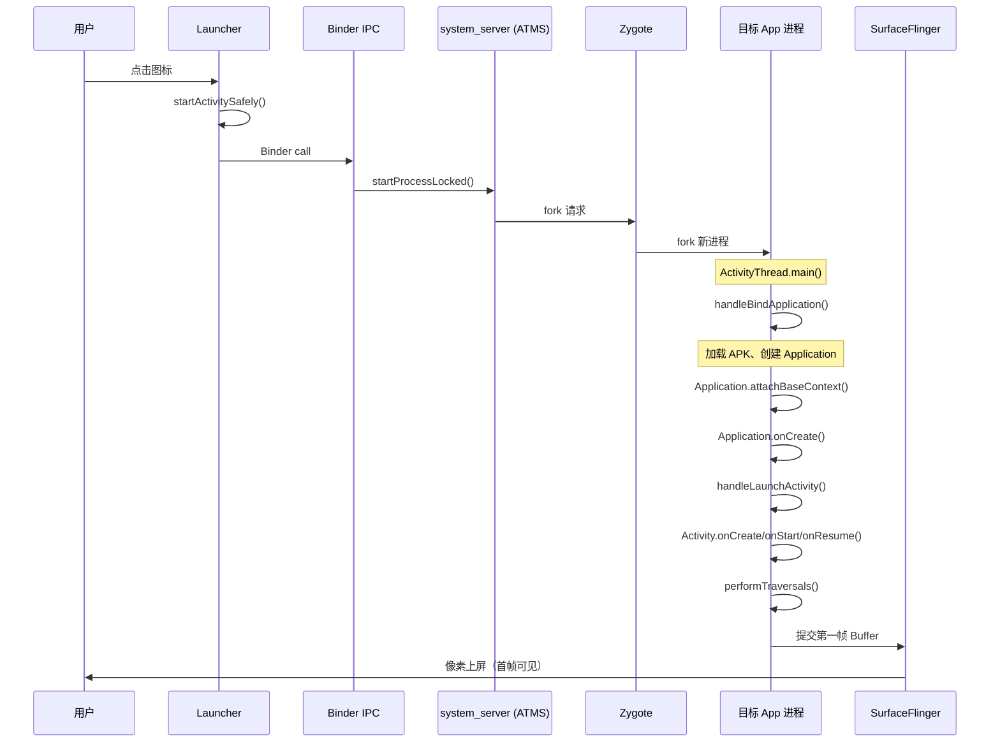
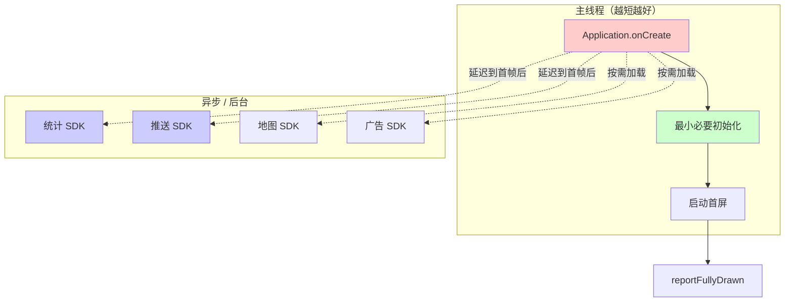

# App 冷启动优化

> 通过真实的线上问题，掌握从复现、采集、分析到优化的完整冷启动排查方法论

---

## 目录

1. [场景描述](#场景描述)
2. [第一步：理解启动阶段模型](#第一步理解启动阶段模型)
3. [第二步：数据采集](#第二步数据采集)
4. [第三步：Perfetto Trace 分析](#第三步perfetto-trace-分析)
5. [第五步：优化方案总结](#第五步优化方案总结)
6. [问题：冷启动耗时 3s+](#问题冷启动耗时-3s)
7. [AI 交互建议](#ai-交互建议)
8. [小结](#小结)

---

## 场景描述

> **线上反馈**：App 点击图标到首页完全展示需要 3 秒以上，竞品只需要 1 秒。特别是首次安装后首次启动更慢，约 5 秒。PM 要求优化到 1.5 秒以内。

这是一个典型的 **Cold Start（冷启动）** 性能问题。你可能已经了解 Application.onCreate、懒加载等基础手段，但面对「各阶段具体耗时如何拆分」「Perfetto 如何精确定位瓶颈」「如何设计可落地的优化方案」时，仍需要系统化的工具和方法。本节将通过 AI 模拟的 bug 报告，带你走完一次真实的冷启动优化实战流程。

---

## 第一步：理解启动阶段模型

### 1.1 冷启动的完整阶段（含源码路径）

从用户点击图标到首帧上屏，Android 系统经历了以下完整链路：

```
用户点击图标
→ Launcher.startActivitySafely()
→ Binder IPC → system_server (ATMS)
→ AMS/ATMS: startProcessLocked()
→ Zygote fork 新进程
  (frameworks/base/core/java/com/android/internal/os/ZygoteInit.java)
→ ActivityThread.main()
  (frameworks/base/core/java/android/app/ActivityThread.java)
→ ActivityThread.handleBindApplication()
  - 加载 APK、创建 Application
  - Application.attachBaseContext()
  - Application.onCreate()
→ ActivityThread.handleLaunchActivity()
  - Activity.onCreate()
  - Activity.onStart()
  - Activity.onResume()
→ ViewRootImpl.performTraversals() — 第一帧绘制
→ 第一帧 Buffer 提交 → SurfaceFlinger → 像素上屏
```

**时序图**（Mermaid Sequence Diagram）：




理解这条链路，是后续在 Perfetto 中精确定位各阶段耗时的前提。

### 1.2 三种启动类型


| 类型      | 英文         | 特征                     | 典型耗时     |
| ------- | ---------- | ---------------------- | -------- |
| **冷启动** | Cold Start | 进程不存在，从零开始 fork + 加载   | 1–5s     |
| **温启动** | Warm Start | 进程存活，但 Activity 已被销毁   | 0.5–2s   |
| **热启动** | Hot Start  | Activity 在内存中，仅从后台切回前台 | 0.1–0.5s |


**如何测量**：使用 `adb shell am start -W` 获取启动耗时，关注以下字段：


| 字段            | 含义                                                           |
| ------------- | ------------------------------------------------------------ |
| **TotalTime** | App 自身从启动到 `onResume` 完成的耗时                                  |
| **WaitTime**  | 系统从收到 startActivity 到 App 完成 resume 的总耗时（含 system_server 排队） |
| **ThisTime**  | 当前 Activity 的启动耗时（从 pause 上一个到 resume 当前）                    |


> 💡 **提示**：冷启动优化通常关注 **TotalTime**，它直接反映 App 从启动到首屏 ready 的用时。

---

## 第二步：数据采集

### 2.1 启动时间测量

```bash
# 冷启动测量（先 force-stop 确保进程被杀）
adb shell am force-stop <package>
adb shell am start -W <package>/<activity>
# 关注 TotalTime 和 WaitTime

# 多次测量取平均（降低方差）
for i in $(seq 1 5); do
  adb shell am force-stop <package>
  sleep 2
  adb shell am start -W <package>/<activity> 2>&1 | grep TotalTime
done
```

示例输出：

```
Status: ok
Activity: com.example.app/.MainActivity
ThisTime: 2847
TotalTime: 2847
WaitTime: 2892
Complete
```

### 2.2 Perfetto Trace 抓取

**推荐流程**：先启动 Perfetto 录制，再执行冷启动。

```bash
# 1. 先开始录制（15 秒足够覆盖冷启动）
adb shell perfetto -o /data/misc/perfetto-traces/trace_startup.pb -t 15s \
  sched freq idle am wm gfx view binder_driver hal dalvik input res memory

# 2. 立即在另一终端执行冷启动
adb shell am force-stop <package>
adb shell am start <package>/<activity>

# 3. 等待录制完成后拉取
adb pull /data/misc/perfetto-traces/trace_startup.pb
```

**数据源说明**：


| 数据源             | 用途                                                    |
| --------------- | ----------------------------------------------------- |
| `am` / `wm`     | Activity/Window 管理，定位 bindApplication、activityStart 等 |
| `gfx` / `view`  | 首帧绘制、performTraversals、DrawFrame                      |
| `dalvik`        | Class 加载、GC、方法执行                                      |
| `binder_driver` | Binder 调用耗时                                           |
| `memory`        | 启动过程内存增长模式                                            |


---

## 第三步：Perfetto Trace 分析

### 3.1 定位启动各阶段

在 Perfetto UI 中，按以下思路定位各阶段 slice：


| 阶段                   | Trace 中的标识                              | 典型耗时                   |
| -------------------- | --------------------------------------- | ---------------------- |
| Process creation     | Zygote fork 到 ActivityThread.main()     | 50–150ms               |
| bindApplication      | `bindApplication` slice                 | 200–500ms（正常）；1s+（需优化） |
| Application.onCreate | 在 `bindApplication` 内                   | 视业务而定                  |
| Activity.onCreate    | `activityStart` 或 activity launch slice | 视布局和数据而定               |
| First layout         | `performTraversals`                     | 首帧 measure/layout/draw |
| First frame draw     | `DrawFrame`                             | 渲染首帧                   |
| Content visible      | `reportFullyDrawn`（若已埋点）                | 首屏完全可交互                |


> 💡 **提示**：在 Perfetto 的 Slice 表中按 `name` 筛选，可快速定位上述关键节点。

### 3.2 SQL 查询

在 Perfetto 的 **Query** 标签页执行以下 SQL，精准提取各阶段耗时：

```sql
-- 找到启动相关的关键 slice
SELECT ts, dur/1000000.0 as ms, name FROM slice
WHERE name IN ('bindApplication', 'activityStart', 'activityResume', 'DrawFrame', 'performTraversals')
ORDER BY ts ASC;

-- 查看启动过程中的 GC 暂停
SELECT ts, dur/1000000.0 as ms, name FROM slice
WHERE name LIKE '%GC%' OR name LIKE '%concurrent%'
ORDER BY ts ASC;

-- 查看启动过程中的 class loading（按耗时排序）
SELECT ts, dur/1000000.0 as ms, name FROM slice
WHERE name LIKE '%ClassLoad%' OR name LIKE '%VerifyClass%'
ORDER BY dur DESC LIMIT 20;

-- 查看启动中的 Binder 调用（过滤 > 1ms 的）
SELECT ts, dur/1000000.0 as ms, name FROM slice
WHERE name LIKE 'binder%' AND dur > 1000000
ORDER BY ts ASC LIMIT 30;
```

### 3.3 常见瓶颈分析

#### 瓶颈 A：Application.onCreate() 过重


| 项目     | 说明                                        |
| ------ | ----------------------------------------- |
| **原因** | 大量 SDK 初始化（统计、推送、地图、广告等）集中在 Application 中 |
| **表现** | `bindApplication` slice 很长（如 1s+）         |
| **优化** | 延迟初始化、异步初始化、按需初始化                         |


**启动初始化优化策略示意**：




#### 瓶颈 B：首页布局过于复杂


| 项目     | 说明                                                         |
| ------ | ---------------------------------------------------------- |
| **原因** | 首页 XML 嵌套深、View 数量多                                        |
| **表现** | `performTraversals` 很长                                     |
| **优化** | ViewStub 延迟加载、AsyncLayoutInflater、Compose lazy composition |


#### 瓶颈 C：首页数据加载阻塞


| 项目     | 说明                      |
| ------ | ----------------------- |
| **原因** | onCreate 中同步网络请求或数据库查询  |
| **表现** | 主线程长时间 blocked/sleeping |
| **优化** | 骨架屏 + 异步加载、预加载缓存        |


#### 瓶颈 D：MultiDex 或 ClassVerify


| 项目     | 说明                                           |
| ------ | -------------------------------------------- |
| **原因** | 方法数超过 65K，dex 加载慢；大量 Class 校验                |
| **表现** | 大量 ClassLoad/VerifyClass slice               |
| **优化** | R8/ProGuard 缩减代码、Profile-guided optimization |


#### 瓶颈 E：ContentProvider 启动


| 项目     | 说明                                                  |
| ------ | --------------------------------------------------- |
| **原因** | 三方 SDK 通过 ContentProvider 自动初始化（如 AndroidX Startup） |
| **表现** | bindApplication 中有多个 ContentProvider.onCreate       |
| **优化** | 移除不需要的自动初始化、合并 ContentProvider                      |


---

## 第五步：优化方案总结

### 分析报告模板

```markdown
## 问题：冷启动耗时 3s+

### 启动阶段耗时分解
| 阶段 | 耗时 | 占比 | 可优化空间 |
|------|------|------|-----------|
| Process fork | 80ms | 2.7% | 低 |
| bindApplication | 1200ms | 40% | 高 |
| Activity.onCreate | 800ms | 26.7% | 高 |
| First frame | 500ms | 16.7% | 中 |
| 数据加载 | 420ms | 14% | 高 |

### 优化方案
1. SDK 异步初始化（预期 -600ms）
2. 首页布局优化（预期 -200ms）
3. 预加载 + 缓存（预期 -300ms）
目标：3000ms → 1500ms 以内
```

### 优化 Checklist


| 优化方向        | 具体措施                                  | 预期收益 |
| ----------- | ------------------------------------- | ---- |
| Application | 移除/延后非必要 SDK 初始化                      | 高    |
| Application | 使用 Jetpack Startup 合并 ContentProvider | 中    |
| 布局          | ViewStub、AsyncLayoutInflater、减少层级     | 中    |
| 数据          | 骨架屏 + 异步加载、缓存预热                       | 中    |
| 编译          | R8 优化、减少 dex 数量                       | 低–中  |
| 埋点          | reportFullyDrawn 精确定位「完全可交互」          | 度量改进 |


---

## AI 交互建议

在实践过程中，可向 AI 提出以下问题，辅助深入分析：

- **「我的 App 的 bindApplication 耗时 1.2 秒，帮我分析 Perfetto trace 中哪些操作最耗时」**
- **「帮我设计一个 SDK 异步初始化方案，考虑依赖顺序」**
- **「Activity.onCreate 中 setContentView 耗时 300ms，如何优化？」**
- **「如何用 Perfetto 精确测量 Application.onCreate 的各阶段耗时？」**

---

## 小结


| 步骤          | 关键动作                                                                           |
| ----------- | ------------------------------------------------------------------------------ |
| 1. 理解模型     | 掌握冷启动完整链路及源码路径，区分 Cold/Warm/Hot                                                |
| 2. 数据采集     | `am start -W` 测 TotalTime；Perfetto 覆盖 am/wm/gfx/dalvik 等                       |
| 3. Trace 分析 | 定位 bindApplication、activityStart、performTraversals；用 SQL 查 GC、ClassLoad、Binder |
| 4. 瓶颈识别     | Application 过重、布局复杂、同步 IO、MultiDex、ContentProvider                             |
| 5. 优化落地     | 异步初始化、布局优化、预加载、reportFullyDrawn 度量                                             |


通过本实战，你将掌握从「线上反馈」到「数据驱动优化」的完整冷启动性能排查与优化流程。