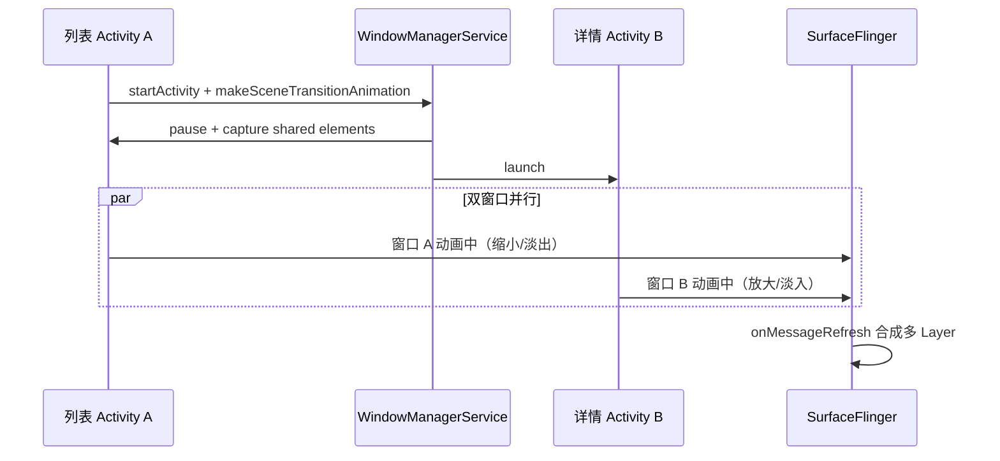

# 转场动画卡顿

## 目录

1. [场景描述](#场景描述)
2. [第一步：理解 Activity 转场动画机制](#第一步理解-activity-转场动画机制)
3. [第二步：数据采集](#第二步数据采集)
4. [第三步：Trace 分析要点](#第三步trace-分析要点)
5. [第四步：优化方向](#第四步优化方向)
6. [通知栏下拉卡顿分析（扩展）](#通知栏下拉卡顿分析扩展)
7. [一、ANR 相关](#一anr-相关)
8. [二、内存与 LMK](#二内存与-lmk)
9. [三、SurfaceFlinger 与刷新率](#三surfaceflinger-与刷新率)
10. [四、Perfetto 通用采集](#四perfetto-通用采集)
11. [五、启动与帧率](#五启动与帧率)
12. [六、常用 SQL（Perfetto Query）](#六常用-sqlperfetto-query)

---

## 场景描述

> **线上反馈**：从列表页点击进入详情页时，共享元素（Shared Element）转场动画不流畅，有明显跳帧。通知栏下拉时也偶尔卡顿，用户感知明显。

这是典型的 **Activity Transition Jank（转场动画卡顿）** 问题。与单窗口内的动画不同，Activity 转场涉及**两个窗口同时动画**，链路更长，瓶颈更隐蔽。作为有过 5 年+ 经验的开发者，你需要理解 WMS、SurfaceFlinger 在转场中的角色，才能精确定位问题。

---

## 第一步：理解 Activity 转场动画机制

### 1.1 转场动画完整链路

```
用户点击 (列表 item)
→ startActivity() with ActivityOptions.makeSceneTransitionAnimation()
→ ActivityTransitionState 管理转场状态
  (frameworks/base/core/java/android/app/ActivityTransitionState.java)
→ TransitionManager.captureStartValues() / captureEndValues()
→ 共享元素动画 + Window 动画同时执行
→ WMS 控制两个 Window 的显示/隐藏
→ SurfaceFlinger 合成两个 Activity 的 Layer
→ 像素上屏
```

**关键点**：转场期间存在**两个 Activity 进程**，各自有主线程、RenderThread，且两个窗口的 Layer 同时参与 SurfaceFlinger 合成。

### 1.2 源码路径速查


| 模块            | 路径                                                                   | 职责                      |
| ------------- | -------------------------------------------------------------------- | ----------------------- |
| Activity 转场状态 | `frameworks/base/core/java/android/app/ActivityTransitionState.java` | 管理转场生命周期、共享元素           |
| 共享元素动画        | `ActivityOptions.makeSceneTransitionAnimation()`                     | 定义共享的 View 配对           |
| Transition 框架 | `frameworks/base/core/java/android/transition/`                      | TransitionManager、Scene |
| Window 动画     | WMS 控制                                                               | 进入/退出窗口动画               |
| Layer 合成      | SurfaceFlinger                                                       | 多个 Layer 的合成            |


### 1.3 转场涉及的双窗口




转场期间 SurfaceFlinger 需要同时处理两个（甚至更多）Activity 的 Layer，合成工作量增加。

---

## 第二步：数据采集

### 2.1 推荐 Perfetto 配置

```bash
# 转场动画抓取（覆盖双进程 + SF）
adb shell perfetto -o /data/misc/perfetto-traces/trace_transition.pb -t 10s \
  sched freq idle am wm gfx view binder_driver hal input res
```

**操作流程**：

1. 先执行上述命令启动录制
2. 立即操作：点击列表 item 进入详情页（触发转场）
3. 可选：再下拉通知栏数次（触发通知栏卡顿）
4. 等待录制结束
5. `adb pull /data/misc/perfetto-traces/trace_transition.pb ./`

### 2.2 数据源说明


| 数据源            | 用途                                    |
| -------------- | ------------------------------------- |
| `am` / `wm`    | Activity 启动、Window 切换、转场事件            |
| `gfx` / `view` | 两个 Activity 的 Choreographer、DrawFrame |
| `input`        | 点击/滑动事件时间戳，与转场对齐                      |
| 无 `memory`     | 转场分析可不开启，减少 trace 体积                  |


---

## 第三步：Trace 分析要点

### 3.1 定位转场起止时间


| 阶段     | Trace 中的标识                                                |
| ------ | --------------------------------------------------------- |
| **起点** | `startActivity` 或 Activity A 的 `onPause`                  |
| **过程** | Activity B 的 `handleLaunchActivity` → `performTraversals` |
| **终点** | 两个窗口的首帧 `DrawFrame` 均完成，转场动画结束                            |


### 3.2 关键 Slice 一览


| Slice 名称                     | 所属进程            | 含义                  |
| ---------------------------- | --------------- | ------------------- |
| `Choreographer#doFrame`      | 列表 App / 详情 App | 各自的主线程帧             |
| `DrawFrame`                  | 列表 App / 详情 App | 各自的 RenderThread 渲染 |
| `onMessageRefresh`           | surfaceflinger  | SurfaceFlinger 合成一帧 |
| `TransitionManager.capture`* | 列表 App          | 共享元素起始/结束状态捕获       |


### 3.3 常见瓶颈


| 瓶颈                     | 表现                                            | 可能原因                   |
| ---------------------- | --------------------------------------------- | ---------------------- |
| **新 Activity 启动慢**     | `performTraversals` 或 `onCreate` 耗时过长         | 详情页布局复杂、首帧加载大图         |
| **共享元素捕获慢**            | `captureStartValues` / `captureEndValues` 耗时长 | 共享 View 层级深、measure 重  |
| **SurfaceFlinger 合成慢** | `onMessageRefresh` 单帧 > 8ms                   | 转场期间 Layer 数量暴增        |
| **双窗口动画不同步**           | 两个 `DrawFrame` 时间错开                           | Window 动画与 App 动画帧率不一致 |


### 3.4 SQL 查询示例

```sql
-- 转场期间 SF 合成耗时（> 8ms 视为异常）
SELECT ts, dur/1000000.0 as ms, name FROM slice
WHERE name = 'onMessageRefresh' AND dur > 8000000
ORDER BY dur DESC LIMIT 20;

-- 转场期间 Layer 数量变化
SELECT ts, value FROM counter
WHERE name LIKE '%numLayers%'
ORDER BY ts ASC;

-- 两个 Activity 的 DrawFrame 耗时对比
SELECT ts, dur/1000000.0 as ms, name, thread_name
FROM slice s
JOIN thread_track tt ON s.track_id = tt.id
JOIN thread t ON tt.utid = t.utid
WHERE name = 'DrawFrame'
ORDER BY ts ASC;
```

---

## 第四步：优化方向

### 4.1 控制转场时机

使用 `postponeEnterTransition()` 和 `startPostponedEnterTransition()` 控制共享元素动画的启动时机，避免首帧未准备好时就开始动画：

```java
// 详情页 Activity
@Override
protected void onCreate(Bundle savedInstanceState) {
    super.onCreate(savedInstanceState);
    postponeEnterTransition();
    setContentView(R.layout.activity_detail);
    // 异步加载数据完成后
    loadDataAndInitView(() -> {
        startPostponedEnterTransition();
    });
}
```

### 4.2 减少详情页首帧复杂度

- 使用占位图，避免转场期间加载大图
- ViewStub 延迟展开
- 减少首屏 View 数量

### 4.3 避免转场期间重量级操作

- 不在 `onCreate`/`onResume` 中做同步网络请求
- 不在转场回调中执行耗时 measure/layout

### 4.4 进阶：SurfaceControl 直接操作

高级场景下，可考虑用 `SurfaceControl` 直接参与动画，减少 View 层级，降低合成开销（需深入系统定制）。

---

## 通知栏下拉卡顿分析（扩展）

### 场景差异

通知栏下拉与 Activity 转场不同：

- **进程**：SystemUI（单进程）
- **动画**：NotificationPanelView 的下拉展开
- **瓶颈**：通知条目多时，需在单帧内 measure/layout 大量 Notification 的 View

### 分析方法

1. 在 Perfetto 中定位 **SystemUI** 进程
2. 关注 `Choreographer#doFrame` 和 `DrawFrame` 在「下拉瞬间」的耗时
3. 若单帧 > 16ms，检查 `measure`/`layout` slice 是否过长

### 数据采集

```bash
# 同上 trace 配置，操作改为：快速下拉通知栏数次
adb shell perfetto -o /data/misc/perfetto-traces/trace_notification.pb -t 8s \
  sched am wm gfx view input
```

---

# AI 交互建议（适用于所有场景）

在实践过程中，可向 AI 提出以下问题，辅助深入分析：


| 场景   | 示例问题                                                               |
| ---- | ------------------------------------------------------------------ |
| 转场动画 | 「Perfetto 中 SurfaceFlinger 的 onMessageRefresh 有一帧耗时 25ms，帮我分析可能原因」 |
| 转场动画 | 「转场动画期间 Layer 数量从 10 增加到 25，这正常吗？如何减少？」                            |
| ANR  | 「帮我分析这个 ANR traces.txt，主线程 stack trace 显示阻塞在 Binder.transact」      |
| LMK  | 「低内存设备上如何用 Perfetto 追踪 lmk 杀进程的时机？」                                |
| 刷新率  | 「如何在 Perfetto 中查看刷新率切换事件？」                                         |


---

# 真机实操速查表

## 一、ANR 相关


| 用途           | 命令                                    |
| ------------ | ------------------------------------- |
| 拉取 ANR 堆栈    | `adb pull /data/anr/traces.txt ./`    |
| 完整 bugreport | `adb bugreport`                       |
| 查看 ANR 进程    | `adb shell dumpsys activity processes |
| 查看主线程状态      | `adb shell dumpsys activity top`      |


## 二、内存与 LMK


| 用途          | 命令                                                             |
| ----------- | -------------------------------------------------------------- |
| 进程内存        | `adb shell dumpsys meminfo <package>`                          |
| 系统内存        | `adb shell cat /proc/meminfo`                                  |
| 进程 ADJ      | `adb shell dumpsys activity processes                          |
| LMK minfree | `adb shell cat /sys/module/lowmemorykiller/parameters/minfree` |
| LMK adj     | `adb shell cat /sys/module/lowmemorykiller/parameters/adj`     |
| dump 堆      | `adb shell am dumpheap <pid> /data/local/tmp/heap.hprof`       |


## 三、SurfaceFlinger 与刷新率


| 用途           | 命令                                 |
| ------------ | ---------------------------------- |
| 刷新率          | `adb shell dumpsys SurfaceFlinger  |
| 刷新率策略        | `adb shell dumpsys SurfaceFlinger  |
| Layer 信息     | `adb shell dumpsys SurfaceFlinger` |
| 禁用 HW 合成（调试） | `adb shell setprop debug.sf.hw 0`  |


## 四、Perfetto 通用采集


| 场景       | 命令                                                                                                                                       |
| -------- | ---------------------------------------------------------------------------------------------------------------------------------------- |
| 转场动画     | `adb shell perfetto -o /data/misc/perfetto-traces/trace_transition.pb -t 10s sched freq idle am wm gfx view binder_driver hal input res` |
| ANR / 卡顿 | `adb shell perfetto -o /data/misc/perfetto-traces/trace_anr.pb -t 20s sched am wm gfx view binder_driver memory`                         |
| 内存压力     | `adb shell perfetto -o /data/misc/perfetto-traces/trace_mem.pb -t 30s sched memory am`                                                   |
| 刷新率      | `adb shell perfetto -o /data/misc/perfetto-traces/trace_refresh.pb -t 15s sched gfx hal`                                                 |
| 拉取 trace | `adb pull /data/misc/perfetto-traces/trace_xxx.pb ./`                                                                                    |


## 五、启动与帧率


| 用途      | 命令                                                                   |
| ------- | -------------------------------------------------------------------- |
| 冷启动测量   | `adb shell am force-stop <pkg> && adb shell am start -W <pkg>/<act>` |
| 帧统计     | `adb shell dumpsys gfxinfo <package>`                                |
| 帧统计（详细） | `adb shell dumpsys gfxinfo <package> framestats`                     |


## 六、常用 SQL（Perfetto Query）


| 用途         | SQL 片段                                                                                                                        |
| ---------- | ----------------------------------------------------------------------------------------------------------------------------- |
| SF 合成耗时    | `WHERE name = 'onMessageRefresh' AND dur > 8000000`                                                                           |
| 主线程长耗时     | `WHERE track_id IN (SELECT id FROM thread_track tt JOIN thread t ON tt.utid=t.utid WHERE t.name='main') AND dur > 1000000000` |
| Binder 统计  | `WHERE t.name LIKE 'Binder:%'` 配合 `GROUP BY t.name`                                                                           |
| 转场 Layer 数 | `WHERE name LIKE '%numLayers%'`                                                                                               |


