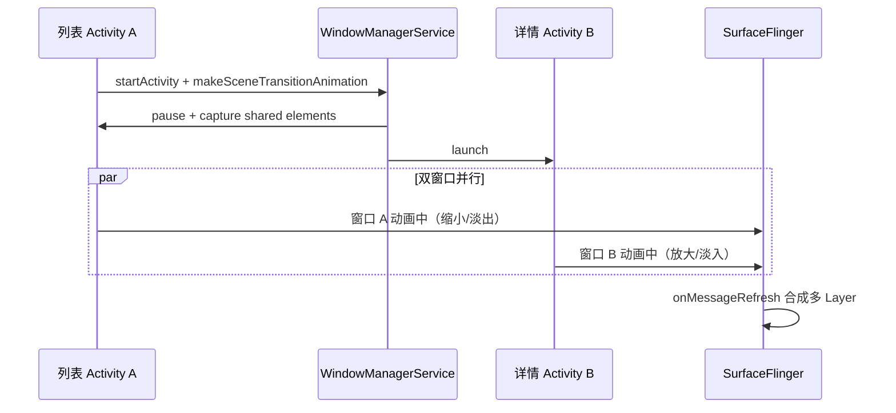

# AI 模拟性能实验室 3 & 4 —— 复杂场景综合实战

> 通过多个真实复杂性能问题案例，掌握从复现、采集、分析到优化的完整排查方法论

---

## 概述

本节是性能分析技能的**综合收官**。涵盖四类典型复杂场景：


| Day        | 场景      | 核心难点                           |
| ---------- | ------- | ------------------------------ |
| **Day 12** | 转场动画卡顿  | 双窗口动画协同、共享元素、SurfaceFlinger 合成 |
| **Day 13** | ANR 分析  | 主线程阻塞、Binder 超时、traces.txt 解读  |
| **Day 13** | 低内存杀后台  | LMK 机制、ADJ 优先级、内存阈值            |
| **Day 13** | 刷新率切换异常 | VRR、120Hz 与 60Hz 切换、帧率适配       |


每个场景均采用「场景描述 → 原理回顾 → 分析方法 → 数据采集 → Perfetto/Trace 分析 → 优化方向」的完整闭环。

---

# 实战场景一：转场动画卡顿（Day 12）

## 场景描述（AI 模拟的问题）

> **线上反馈**：从商品列表页点击进入详情页时，共享元素（Shared Element）转场动画不流畅，有明显跳帧。通知栏下拉时也偶尔卡顿，用户感知明显。

这是典型的 **Activity Transition Jank（转场动画卡顿）** 问题。与单窗口内的动画不同，Activity 转场涉及**两个窗口同时动画**，链路更长，瓶颈更隐蔽。作为有过 5 年+ 经验的开发者，你需要理解 WMS、SurfaceFlinger 在转场中的角色，才能精确定位问题。

---

## 第一步：理解 Activity 转场动画机制

### 1.1 转场动画完整链路

```
用户点击 (列表 item)
→ startActivity() with ActivityOptions.makeSceneTransitionAnimation()
→ ActivityTransitionState 管理转场状态
  (frameworks/base/core/java/android/app/ActivityTransitionState.java)
→ TransitionManager.captureStartValues() / captureEndValues()
→ 共享元素动画 + Window 动画同时执行
→ WMS 控制两个 Window 的显示/隐藏
→ SurfaceFlinger 合成两个 Activity 的 Layer
→ 像素上屏
```

**关键点**：转场期间存在**两个 Activity 进程**，各自有主线程、RenderThread，且两个窗口的 Layer 同时参与 SurfaceFlinger 合成。

### 1.2 源码路径速查


| 模块            | 路径                                                                   | 职责                      |
| ------------- | -------------------------------------------------------------------- | ----------------------- |
| Activity 转场状态 | `frameworks/base/core/java/android/app/ActivityTransitionState.java` | 管理转场生命周期、共享元素           |
| 共享元素动画        | `ActivityOptions.makeSceneTransitionAnimation()`                     | 定义共享的 View 配对           |
| Transition 框架 | `frameworks/base/core/java/android/transition/`                      | TransitionManager、Scene |
| Window 动画     | WMS 控制                                                               | 进入/退出窗口动画               |
| Layer 合成      | SurfaceFlinger                                                       | 多个 Layer 的合成            |


### 1.3 转场涉及的双窗口




转场期间 SurfaceFlinger 需要同时处理两个（甚至更多）Activity 的 Layer，合成工作量增加。

---

## 第二步：数据采集

### 2.1 推荐 Perfetto 配置

```bash
# 转场动画抓取（覆盖双进程 + SF）
adb shell perfetto -o /data/misc/perfetto-traces/trace_transition.pb -t 10s \
  sched freq idle am wm gfx view binder_driver hal input res
```

**操作流程**：

1. 先执行上述命令启动录制
2. 立即操作：点击列表 item 进入详情页（触发转场）
3. 可选：再下拉通知栏数次（触发通知栏卡顿）
4. 等待录制结束
5. `adb pull /data/misc/perfetto-traces/trace_transition.pb ./`

### 2.2 数据源说明


| 数据源            | 用途                                    |
| -------------- | ------------------------------------- |
| `am` / `wm`    | Activity 启动、Window 切换、转场事件            |
| `gfx` / `view` | 两个 Activity 的 Choreographer、DrawFrame |
| `input`        | 点击/滑动事件时间戳，与转场对齐                      |
| 无 `memory`     | 转场分析可不开启，减少 trace 体积                  |


---

## 第三步：Trace 分析要点

### 3.1 定位转场起止时间


| 阶段     | Trace 中的标识                                                |
| ------ | --------------------------------------------------------- |
| **起点** | `startActivity` 或 Activity A 的 `onPause`                  |
| **过程** | Activity B 的 `handleLaunchActivity` → `performTraversals` |
| **终点** | 两个窗口的首帧 `DrawFrame` 均完成，转场动画结束                            |


### 3.2 关键 Slice 一览


| Slice 名称                     | 所属进程            | 含义                  |
| ---------------------------- | --------------- | ------------------- |
| `Choreographer#doFrame`      | 列表 App / 详情 App | 各自的主线程帧             |
| `DrawFrame`                  | 列表 App / 详情 App | 各自的 RenderThread 渲染 |
| `onMessageRefresh`           | surfaceflinger  | SurfaceFlinger 合成一帧 |
| `TransitionManager.capture`* | 列表 App          | 共享元素起始/结束状态捕获       |


### 3.3 常见瓶颈


| 瓶颈                     | 表现                                            | 可能原因                   |
| ---------------------- | --------------------------------------------- | ---------------------- |
| **新 Activity 启动慢**     | `performTraversals` 或 `onCreate` 耗时过长         | 详情页布局复杂、首帧加载大图         |
| **共享元素捕获慢**            | `captureStartValues` / `captureEndValues` 耗时长 | 共享 View 层级深、measure 重  |
| **SurfaceFlinger 合成慢** | `onMessageRefresh` 单帧 > 8ms                   | 转场期间 Layer 数量暴增        |
| **双窗口动画不同步**           | 两个 `DrawFrame` 时间错开                           | Window 动画与 App 动画帧率不一致 |


### 3.4 SQL 查询示例

```sql
-- 转场期间 SF 合成耗时（> 8ms 视为异常）
SELECT ts, dur/1000000.0 as ms, name FROM slice
WHERE name = 'onMessageRefresh' AND dur > 8000000
ORDER BY dur DESC LIMIT 20;

-- 转场期间 Layer 数量变化
SELECT ts, value FROM counter
WHERE name LIKE '%numLayers%'
ORDER BY ts ASC;

-- 两个 Activity 的 DrawFrame 耗时对比
SELECT ts, dur/1000000.0 as ms, name, thread_name
FROM slice s
JOIN thread_track tt ON s.track_id = tt.id
JOIN thread t ON tt.utid = t.utid
WHERE name = 'DrawFrame'
ORDER BY ts ASC;
```

---

## 第四步：优化方向

### 4.1 控制转场时机

使用 `postponeEnterTransition()` 和 `startPostponedEnterTransition()` 控制共享元素动画的启动时机，避免首帧未准备好时就开始动画：

```java
// 详情页 Activity
@Override
protected void onCreate(Bundle savedInstanceState) {
    super.onCreate(savedInstanceState);
    postponeEnterTransition();
    setContentView(R.layout.activity_detail);
    // 异步加载数据完成后
    loadDataAndInitView(() -> {
        startPostponedEnterTransition();
    });
}
```

### 4.2 减少详情页首帧复杂度

- 使用占位图，避免转场期间加载大图
- ViewStub 延迟展开
- 减少首屏 View 数量

### 4.3 避免转场期间重量级操作

- 不在 `onCreate`/`onResume` 中做同步网络请求
- 不在转场回调中执行耗时 measure/layout

### 4.4 进阶：SurfaceControl 直接操作

高级场景下，可考虑用 `SurfaceControl` 直接参与动画，减少 View 层级，降低合成开销（需深入系统定制）。

---

## 通知栏下拉卡顿分析（扩展）

### 场景差异

通知栏下拉与 Activity 转场不同：

- **进程**：SystemUI（单进程）
- **动画**：NotificationPanelView 的下拉展开
- **瓶颈**：通知条目多时，需在单帧内 measure/layout 大量 Notification 的 View

### 分析方法

1. 在 Perfetto 中定位 **SystemUI** 进程
2. 关注 `Choreographer#doFrame` 和 `DrawFrame` 在「下拉瞬间」的耗时
3. 若单帧 > 16ms，检查 `measure`/`layout` slice 是否过长

### 数据采集

```bash
# 同上 trace 配置，操作改为：快速下拉通知栏数次
adb shell perfetto -o /data/misc/perfetto-traces/trace_notification.pb -t 8s \
  sched am wm gfx view input
```

---

# 实战场景二：ANR 分析（Day 13）

## 场景描述（AI 模拟的问题）

> **线上反馈**：后台播放音乐时，前台 App 偶发 ANR。traces.txt 显示主线程阻塞在 `Binder.transact()`，对端为 `system_server` 的 `AudioService`。

这是典型的 **Binder 阻塞导致的 ANR**。主线程在执行跨进程调用时被阻塞，无法响应输入事件，最终触发 Input dispatching timeout。

---

## 第一步：ANR 机制回顾

### 1.1 各类 ANR 超时时间


| 类型                    | 超时时间             | 触发条件                       |
| --------------------- | ---------------- | -------------------------- |
| **Input dispatching** | 5s               | 触摸/按键事件未在 5s 内响应           |
| **BroadcastReceiver** | 前台 10s / 后台 60s  | onReceive 执行超时             |
| **Service**           | 前台 20s / 后台 200s | onCreate/onStartCommand 超时 |
| **ContentProvider**   | publish 超时       | getContentProvider 超时      |


### 1.2 源码路径

- **ANR 调度**：`frameworks/base/services/core/java/com/android/server/am/AnrHelper.java`
- **Input 超时**：AMS 监控 InputDispatcher 的调度状态

### 1.3 ANR 发生时的系统行为

1. 系统检测到超时
2. 收集各进程的 Java/Kernel stack，写入 `/data/anr/traces.txt`
3. 弹出 ANR 弹窗（若为前台 App）
4. 可配合 `bugreport` 获取更完整信息

---

## 第二步：收集 ANR 信息

### 2.1 基础命令

```bash
# 拉取 ANR 时的堆栈
adb pull /data/anr/traces.txt ./

# 完整 bugreport（含 logcat、系统状态）
adb bugreport

# 查看 ANR 相关进程状态
adb shell dumpsys activity processes | grep -A5 "ANR"
```

### 2.2 traces.txt 结构

```
----- pid 12345 at 2025-02-23 10:00:00 -----
Cmd line: com.example.app
...
"main" prio=5 tid=1 Blocked
  | group="main" sCount=1 dsCount=0 flags=1 obj=0x12c4a0 self=0x7a12345600
  | held mutexes=
  at com.example.SomeClass.someMethod(SomeClass.java:42)
  at android.os.Binder.transact(Native method)
  ...
```

重点找到 **main** 线程的 `Blocked` 或 `Waiting` 状态及其 stack trace。

---

## 第三步：traces.txt 解读

### 3.1 常见主线程阻塞原因


| Stack 特征                                | 含义                                 | 优化方向             |
| --------------------------------------- | ---------------------------------- | ---------------- |
| `Binder.transact()`                     | 主线程发起 Binder 调用，对端处理慢或 Binder 线程池满 | 异步化、避免主线程 Binder |
| `Object.wait()`                         | 等待锁，可能死锁                           | 检查锁顺序、减少锁粒度      |
| `Thread.sleep()`                        | 主线程不应 sleep                        | 移除或移至子线程         |
| `SQLiteDatabase.rawQuery()`             | 主线程数据库查询                           | 移至子线程或使用 Room 异步 |
| `SharedPreferences$EditorImpl.commit()` | 同步写 SP                             | 改用 `apply()`     |
| `FileInputStream.read()`                | 主线程 IO                             | 移至子线程            |


### 3.2 Binder 阻塞的典型栈

```
"main" Blocked
  at android.os.BinderProxy.transactNative(Native method)
  at android.os.BinderProxy.transact(BinderProxy.java:xxx)
  at com.android.internal.app.IAppOpsService.checkOperation(...)
  ...
```

说明：主线程调用 `checkOperation`（或其他 Binder 接口），对端 `system_server` 的 Binder 线程繁忙或处理慢，导致主线程阻塞。

---

## 第四步：Perfetto 中定位 ANR

若在 ANR 发生前后有 Perfetto trace，可精确定位阻塞时段。

### 4.1 主线程长时间阻塞 Slice

```sql
-- 查找主线程 > 1 秒的 slice
SELECT ts, dur/1000000.0 as ms, name FROM slice
WHERE track_id IN (
  SELECT id FROM thread_track tt
  JOIN thread t ON tt.utid = t.utid
  WHERE t.name = 'main'
)
AND dur > 1000000000
ORDER BY dur DESC;
```

### 4.2 Binder 线程池使用情况

```sql
-- Binder 线程调用统计（按总耗时排序）
SELECT t.name, count(*) as binder_calls, sum(s.dur)/1000000.0 as total_ms
FROM slice s
JOIN thread_track tt ON s.track_id = tt.id
JOIN thread t ON tt.utid = t.utid
WHERE t.name LIKE 'Binder:%'
GROUP BY t.name
ORDER BY total_ms DESC;
```

### 4.3 与 ANR 时间对齐

在 Perfetto 时间轴上找到 ANR 弹窗出现的时刻，回溯主线程在当时的 slice，即可定位阻塞点。

---

## 第五步：优化方向


| 方向                 | 具体措施                                              |
| ------------------ | ------------------------------------------------- |
| **主线程 Binder 异步化** | 将检查类 Binder 调用移至子线程，结果回调主线程                       |
| **Binder 线程池**     | 系统默认 15 个 Binder 线程，App 无法直接修改；减少主线程 Binder 调用可缓解 |
| **StrictMode**     | 开启检测主线程 IO/网络，提前暴露问题                              |
| **WorkManager**    | 耗时操作使用 WorkManager 替代前台直接执行                       |
| **避免死锁**           | 统一锁顺序，避免多锁交叉等待                                    |


---

# 实战场景三：低内存频繁杀后台（Day 13）

## 场景描述（AI 模拟的问题）

> **线上反馈**：低内存设备上（4GB RAM），用户反馈切换 App 时经常重新加载，后台 App 存活时间极短，体验很差。

这是典型的 **LMK（Low Memory Killer）** 导致的进程被杀问题。系统在内存紧张时按优先级回收进程，低优先级后台 App 首当其冲。

---

## 第一步：LMK 机制分析

### 1.1 核心组件

- **lmkd**（Low Memory Killer Daemon）：监听内存压力，按配置杀进程
- **ADJ（Adjustment）**：进程优先级，数值越低优先级越高，越不容易被杀
- 源码：`frameworks/base/services/core/java/com/android/server/am/ProcessList.java`

### 1.2 ADJ 优先级层级


| ADJ 名称         | 典型值  | 含义                     |
| -------------- | ---- | ---------------------- |
| FOREGROUND_APP | 0    | 前台正在交互的 App            |
| VISIBLE        | 100  | 可见但无焦点（如弹窗后的 Activity） |
| PERCEPTIBLE    | 200  | 用户可感知（如后台音乐）           |
| BACKUP         | 300  | 正在备份                   |
| SERVICE        | 400  | 运行 Service             |
| CACHED         | 900+ | 缓存进程（空进程最高 906）        |
| EMPTY          | 910+ | 空进程                    |


当可用内存低于某阈值时，lmkd 从高 ADJ 向低 ADJ 杀进程，直到内存恢复。

### 1.3 内存阈值

- `minfree`：各档位对应的可用内存阈值（如 18432, 23040, 27648... 单位通常为 page）
- `adj`：各档位对应的 ADJ 值
- 当 `MemFree` 低于某档 `minfree` 时，杀该档及以上的进程

---

## 第二步：数据采集

### 2.1 查看进程 ADJ

```bash
# 查看当前进程 ADJ 与 OOM score
adb shell dumpsys activity processes | grep -E "oom:|adj="

# 查看指定 App 的 ADJ
adb shell dumpsys activity processes | grep -A10 "<package>"
```

### 2.2 内存状态

```bash
# 系统内存概览
adb shell cat /proc/meminfo

# 各进程内存占用
adb shell dumpsys meminfo

# 指定 App 内存
adb shell dumpsys meminfo <package>
```

### 2.3 LMK 配置

```bash
# 查看 minfree 和 adj 配置（部分设备可能路径不同）
adb shell cat /sys/module/lowmemorykiller/parameters/minfree
adb shell cat /sys/module/lowmemorykiller/parameters/adj
```

---

## 第三步：Perfetto 分析

### 3.1 关注事件

- **memory** counter tracks：观察内存变化曲线
- `lmk_kill` 或 `oom_kill` 类 event（若 trace 包含）
- 进程生命周期：进程创建/销毁的时序

### 3.2 分析思路

1. 找到内存骤降的时间点
2. 检查该时刻是否有进程被杀
3. 分析被杀进程的 ADJ 和内存占用
4. 对比 `minfree` 阈值，理解为何被杀

---

## 第四步：优化方向


| 层级        | 优化措施                                            |
| --------- | ----------------------------------------------- |
| **App 侧** | 减少后台内存占用：释放图片缓存、销毁 WebView、缩小 Bitmap 缓存         |
| **App 侧** | 实现 `onTrimMemory()`：根据 `TRIM_MEMORY_`* 等级主动释放资源 |
| **App 侧** | 避免后台持有大对象、静态引用                                  |
| **系统侧**   | 调整 `minfree`/`adj`（需 root 或厂商定制）                |


---

# 实战场景四：刷新率切换导致动画异常（Day 13）

## 场景描述（AI 模拟的问题）

> **线上反馈**：支持 120Hz 的设备上，某些操作后动画突然变慢，感觉像是从 120Hz 降到了 60Hz，但动画没有适配，导致卡顿感明显。

这是 **VRR（Variable Refresh Rate）** 下的动画适配问题。系统根据场景动态切换刷新率，若 App 动画未随之适配，会出现「动画时长不变但帧数减少」的观感。

---

## 第一步：可变刷新率机制

### 1.1 机制简述

- Android 11+ 支持可变刷新率
- **SurfaceFlinger Scheduler** 根据内容帧率、触摸状态、热状态等动态切换
- 源码：`frameworks/native/services/surfaceflinger/Scheduler/RefreshRateConfigs.cpp`
- **Surface.setFrameRate()**：App 可声明期望帧率，辅助系统决策

### 1.2 刷新率切换场景


| 场景    | 典型切换               |
| ----- | ------------------ |
| 用户触摸  | 60Hz → 120Hz       |
| 静止无触摸 | 120Hz → 60Hz（省电）   |
| 视频播放  | 匹配视频帧率（如 24/30/60） |
| 过热    | 降频、降刷新率            |


---

## 第二步：数据采集与分析

### 2.1 查看当前刷新率

```bash
# 当前刷新率
adb shell dumpsys SurfaceFlinger | grep -i "refresh rate"

# 刷新率策略与期望配置
adb shell dumpsys SurfaceFlinger | grep -i "DesiredDisplayModeSpecs"
```

### 2.2 Perfetto 分析

- 查看 **VSync period** 的 counter 变化
- 找到刷新率切换的时间点（period 从 8.33ms 变为 16.67ms 等）
- 检查动画在切换瞬间是否出现异常帧（如突然掉帧）

```sql
-- 查看 VSync 周期变化（具体 counter 名以实际 trace 为准）
SELECT ts, value FROM counter
WHERE name LIKE '%vsync%period%' OR name LIKE '%refresh%'
ORDER BY ts ASC;
```

---

## 第三步：优化方向


| 方向                   | 措施                                       |
| -------------------- | ---------------------------------------- |
| **声明帧率需求**           | 动画期间调用 `Surface.setFrameRate()` 声明 120Hz |
| **使用 Choreographer** | 动画基于 Choreographer 而非固定 timer，自动适应刷新率    |
| **处理切换回调**           | 监听刷新率切换，调整动画时长或插值                        |
| **固定帧率场景**           | 视频播放等可主动 setFrameRate 匹配内容               |


---

# AI 交互建议（适用于所有场景）

在实践过程中，可向 AI 提出以下问题，辅助深入分析：


| 场景   | 示例问题                                                               |
| ---- | ------------------------------------------------------------------ |
| 转场动画 | 「Perfetto 中 SurfaceFlinger 的 onMessageRefresh 有一帧耗时 25ms，帮我分析可能原因」 |
| 转场动画 | 「转场动画期间 Layer 数量从 10 增加到 25，这正常吗？如何减少？」                            |
| ANR  | 「帮我分析这个 ANR traces.txt，主线程 stack trace 显示阻塞在 Binder.transact」      |
| LMK  | 「低内存设备上如何用 Perfetto 追踪 lmk 杀进程的时机？」                                |
| 刷新率  | 「如何在 Perfetto 中查看刷新率切换事件？」                                         |


---

# 真机实操速查表

## 一、ANR 相关


| 用途           | 命令                                                      |
| ------------ | ------------------------------------------------------- |
| 拉取 ANR 堆栈    | `adb pull /data/anr/traces.txt ./`                      |
| 完整 bugreport | `adb bugreport`                                         |
| 查看 ANR 进程    | `adb shell dumpsys activity processes | grep -A5 "ANR"` |
| 查看主线程状态      | `adb shell dumpsys activity top`                        |


## 二、内存与 LMK


| 用途          | 命令                                                             |
| ----------- | -------------------------------------------------------------- |
| 进程内存        | `adb shell dumpsys meminfo <package>`                          |
| 系统内存        | `adb shell cat /proc/meminfo`                                  |
| 进程 ADJ      | `adb shell dumpsys activity processes | grep -E "oom:|adj="`   |
| LMK minfree | `adb shell cat /sys/module/lowmemorykiller/parameters/minfree` |
| LMK adj     | `adb shell cat /sys/module/lowmemorykiller/parameters/adj`     |
| dump 堆      | `adb shell am dumpheap <pid> /data/local/tmp/heap.hprof`       |


## 三、SurfaceFlinger 与刷新率


| 用途           | 命令                                                                     |
| ------------ | ---------------------------------------------------------------------- |
| 刷新率          | `adb shell dumpsys SurfaceFlinger | grep -i "refresh rate"`            |
| 刷新率策略        | `adb shell dumpsys SurfaceFlinger | grep -i "DesiredDisplayModeSpecs"` |
| Layer 信息     | `adb shell dumpsys SurfaceFlinger`                                     |
| 禁用 HW 合成（调试） | `adb shell setprop debug.sf.hw 0`                                      |


## 四、Perfetto 通用采集


| 场景       | 命令                                                                                                                                       |
| -------- | ---------------------------------------------------------------------------------------------------------------------------------------- |
| 转场动画     | `adb shell perfetto -o /data/misc/perfetto-traces/trace_transition.pb -t 10s sched freq idle am wm gfx view binder_driver hal input res` |
| ANR / 卡顿 | `adb shell perfetto -o /data/misc/perfetto-traces/trace_anr.pb -t 20s sched am wm gfx view binder_driver memory`                         |
| 内存压力     | `adb shell perfetto -o /data/misc/perfetto-traces/trace_mem.pb -t 30s sched memory am`                                                   |
| 刷新率      | `adb shell perfetto -o /data/misc/perfetto-traces/trace_refresh.pb -t 15s sched gfx hal`                                                 |
| 拉取 trace | `adb pull /data/misc/perfetto-traces/trace_xxx.pb ./`                                                                                    |


## 五、启动与帧率


| 用途      | 命令                                                                   |
| ------- | -------------------------------------------------------------------- |
| 冷启动测量   | `adb shell am force-stop <pkg> && adb shell am start -W <pkg>/<act>` |
| 帧统计     | `adb shell dumpsys gfxinfo <package>`                                |
| 帧统计（详细） | `adb shell dumpsys gfxinfo <package> framestats`                     |


## 六、常用 SQL（Perfetto Query）


| 用途         | SQL 片段                                                                                                                        |
| ---------- | ----------------------------------------------------------------------------------------------------------------------------- |
| SF 合成耗时    | `WHERE name = 'onMessageRefresh' AND dur > 8000000`                                                                           |
| 主线程长耗时     | `WHERE track_id IN (SELECT id FROM thread_track tt JOIN thread t ON tt.utid=t.utid WHERE t.name='main') AND dur > 1000000000` |
| Binder 统计  | `WHERE t.name LIKE 'Binder:%'` 配合 `GROUP BY t.name`                                                                           |
| 转场 Layer 数 | `WHERE name LIKE '%numLayers%'`                                                                                               |


---

## 小结


| Day        | 场景      | 核心技能                                  |
| ---------- | ------- | ------------------------------------- |
| **Day 12** | 转场动画卡顿  | 双窗口 trace 分析、SF 合成、共享元素时机控制           |
| **Day 13** | ANR     | traces.txt 解读、Binder 阻塞、Perfetto 时间对齐 |
| **Day 13** | LMK 杀后台 | ADJ 层级、minfree、onTrimMemory           |
| **Day 13** | 刷新率切换   | VRR、setFrameRate、Choreographer 适配     |


通过本实战，你将掌握从「线上反馈」到「数据驱动优化」的完整复杂场景性能排查流程，形成系统化的性能分析能力闭环。