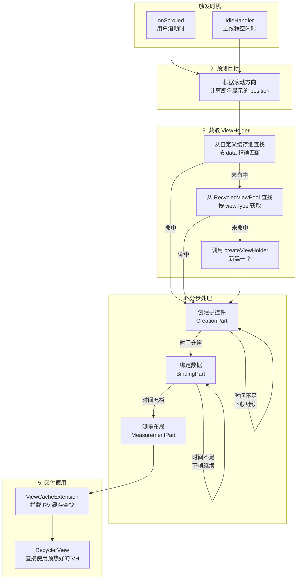

# 牛牛圈 Feed 列表性能优化（分步预加载）

## 一、项目背景介绍 (Background)

- **业务场景**：富途 Android 客户端（FAST）的牛牛圈社区 Feed 列表。
- **复杂结构与股票图表**：每条 Feed 结构极度复杂，单 Item 包含了用户信息区、正文（富文本）、媒体区（九宫格/视频/链接）、引用区、互动按钮、热门评论等数十个可选子区域。更为关键的是，**许多Feed需要展示股票走势图表**。这类金融图表绘制极其复杂，且因数据差异大、状态复杂导致**无法池化复用**，每次展示几乎只能重新创建，极大拉高了单次创建和渲染的时间成本。

## 二、为什么要做？（痛点分析 / Motivation）

- **核心瓶颈——图表渲染无法复用且开销大**：由于股票走势图表等复杂控件每次都需要重新创建，无法通过常规的 ViewHolder 缓存池复用，导致单次初始化开销极高。
- **原生机制的同步限制**：RecyclerView 滑动时，每一个新出现的 Item 必须在**同一帧内**同步经历 `创建控件 -> 绑定数据 -> 测量布局`。
- **严重掉帧卡顿**：上述三步对这种超重载（带有复杂图表）的 Feed Item 总耗时往往达到 20~30ms，远超 60fps(16.6ms) 或 120fps(8.3ms) 的单帧预算，导致严重的滚动掉帧。
- **系统预取的局限**：原生的 `GapWorker` 预取粒度过粗（最小单位是整个 ViewHolder），且通常深度较浅，无法在快速滑动时缓解这种重型控件造成的耗时毛刺。

## 三、项目收益 (Results)

- **流畅度极致提升**：采用自定义的“分步预加载”机制，在 Item 真正上屏前，所有的准备工作（创建、绑定、测量）均已在空闲时间就绪。使得实际上屏时的耗时骤降至 **<1ms**，实现了几乎零耗时的丝滑滚动。
- **业务落地**：抽象出 `RecyclerViewPerformanceHelper` 核心调度器，并在牛牛圈 9 个核心页面全面上线，彻底解决了长期的列表卡顿问题。

## 四、整体架构与核心角色 (Architecture & Core Roles)

### 4.1 全局数据流

整个流程可以概括为：**预测 -> 获取 -> 分步处理 -> 交付**。框架在用户滚动或主线程空闲时自动触发，业务方无需手动调用。

### 4.2 核心角色

| 角色 | 一句话职责 | 所在文件 |
| --- | --- | --- |
| `RecyclerViewPerformanceHelper` | 总调度器，串联所有流程 | `RecyclerViewPerformanceHelper.kt` |
| `ICreationPart` / `IBindingPart` / `IMeasurementPart` | 定义"如何拆分"创建/绑定/测量的工作 | `IProcessPart.kt` |
| `CommonProcessPartProcessor` | 分步执行引擎，递归处理 Part 树 | `RecyclerViewPerformanceHelper.kt` |
| `CacheManager` / `CachePool` | 维护 data -> ViewHolder 的精确缓存映射 | `RecyclerViewPerformanceHelper.kt` |
| `PerformanceViewCacheExtensionV3` | 接入 RV 缓存体系，让 RV 能取到预热好的 VH | `RecyclerViewPerformanceHelper.kt` |
| `IdleHandlerPerformanceOptimizer` | 利用主线程空闲时间补充预处理 | `RecyclerViewPerformanceHelper.kt` |
| `MigrateViewHolderAdapterObserver` | 监听数据变化，同步缓存池 | `RecyclerViewPerformanceHelper.kt` |
| `ProcessPartHelper` | 自动检测数据变化，避免重复处理 | `IProcessPart.kt` |

## 五、核心实现原理 (Implementation Principles)

核心思想是**分步预加载（协作式调度）**：将原本集中在显示前一帧的繁重工作，提前拆散到前面多帧的“空闲时间”中完成（类似于火锅店在客人入座前提前把配菜准备好）。

- **1. 工作任务树形拆分**
将 ViewHolder 的预加载严格按照 `创建 (Creation) -> 绑定 (Binding) -> 测量 (Measurement)` 顺序进行。每个阶段进一步拆分为多层级的树形子任务（如将创建拆为：HeaderCreation、ContentCreation 等）。
- **2. 帧时间预算与动态预估控制**
  - **预算控制**：在 `onScrolled` 时结合系统屏幕刷新率计算当前帧的截止时间，并扣除系统保留时间作为预加载的时间预算。
  - **动态预估**：利用 **指数加权滑动平均 (EWMA)** （75%历史 + 25%最新权重）为每类子任务记录动态耗时预估。
  - **协作式调度**：执行下个子任务前进行决策——若 `当前时间 + 预估耗时 < 截止时间预算` 则继续执行，不满足则主动让出 CPU 暂停执行，等待下一帧。
- **3. 跨帧状态恢复（平行状态树）**
引入 `ProcessPartHolder`，并通过 LRU 缓存为每个 Item 维护一棵平行的“运行时状态树”，用来持久化记录每个子任务的执行进度（完成/未完成）。下一帧进入时自然从状态树的断点处继续，无需任何显式的恢复和寻址逻辑，天然支持跨帧续传。
- **4. 多维度的闲时智能预取**
  - **滚动预取**：滑动时利用 `onScrolled`，根据滑动方向在帧的中间挤占空闲时间预取即将到来的 3 个 Item。
  - **空闲补齐**：静止时利用 `IdleHandler`（主线程无消息时）进一步补齐未预热完整的 Item。这与系统原生 GapWorker（利用 RenderThread 渲染并行间隙在帧尾预热）形成双重预取保障。
- **5. 多级缓存体系与原生机制的桥接**
  - 建立精确数据匹配缓存池 `poolForOnceBound`，存储已完成或部分完成预加载的 ViewHolder。
  - 通过实现 RecyclerView 第 3 级自定义缓存 `ViewCacheExtension` 接入系统查找链。Layout 阶段需上屏时，直接拦截并交付已提前完成预热的 ViewHolder。
  - **细粒度池化补充**：结合业务定制的 `ViewPool`，对不同 ViewHolder 间相同的复杂内部面板（如评论面板）进行独立缓存池对象复用，避免频繁的 Inflate 带来额外开销，形成完整的优化闭环。

