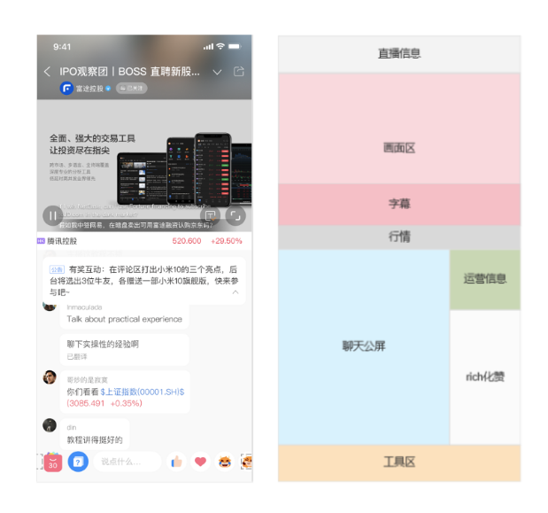
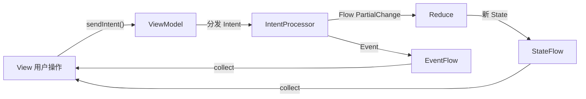
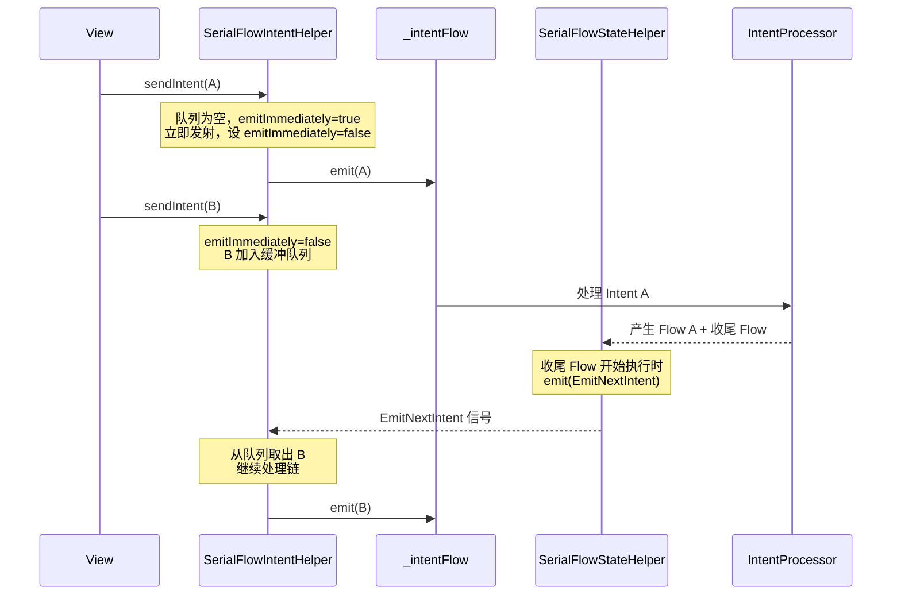

# 直播间 MVI 框架拦截器设计与 Flow 同步框架

## 一、直播间业务介绍

### 1.1 产品背景

富途牛牛 / Moomoo App 内的财经直播功能，主播端开播后，观众可进入直播间观看、互动。直播间承载了丰富的业务场景：实时视频播放、聊天室消息、连麦互动、实时字幕、带货、关联行情推送、打招呼、密码验证、悬浮窗等。




### 1.2 技术挑战

直播间是一个**高复杂度的实时交互页面**，以观众端为例：

- **模块数量庞大**：30+ 个功能模块共享同一个页面，包含播放器、聊天室、连麦、字幕、带货、关联行情、操作区（点赞/评论/菜单）、头部信息、悬浮窗、密码验证等
- **实时性要求高**：服务端 Push 驱动的实时状态更新（房间状态变化、字幕流、聊天消息、连麦信号等）
- **状态交叉依赖**：例如进入密码直播间需要先验证密码再加载房间信息，字幕订阅/取消订阅必须严格顺序执行
- **并发冲突**：多个 Intent 并发触发会导致 Flow 交叉执行、State 竞态更新

### 1.3 重构前的痛点

在 MVP/MVVM 架构下：

- **状态分散**：各模块独立维护状态，难以追踪全局状态变化
- **数据流不可控**：回调嵌套，事件总线满天飞，数据流向难以预测
- **模块耦合**：业务逻辑散落在 View / Presenter / ViewModel 各层，修改一处牵动全身
- **调试困难**：状态变更没有统一入口，线上问题难以复现和排查

---

## 二、MVI 原理与重构收益

### 2.1 重构收益

| 维度 | 收益 |
|------|------|
| 状态可预测 | 所有状态变更通过 `Reducer.reduce()` 产生，State 变化有迹可循 |
| 模块解耦 | 33 个 IntentProcessor 互相独立，新增/修改模块不影响其他业务 |
| 数据流可追踪 | 单向数据流 + 日志拦截器，线上问题可通过日志回溯完整链路 |
| 职责清晰 | Intent 描述意图、Processor 处理逻辑、Reducer 更新状态、View 渲染 |
| 并发安全 | 通过框架层面的拦截器统一管控并发，业务层无需关心 |

### 2.2 MVI 单向数据流原理

MVI（Model-View-Intent）的核心思想是**单向数据流**：所有状态变更都遵循一条确定性的路径。



数据流路径：`View -> Intent -> IntentProcessor -> Flow<PartialChange> -> Reducer/Event -> State/EventFlow -> View`

### 2.2 核心类型

```
┌─────────────────────────────────────────────────────────┐
│                    PartialChange<TState>                 │
│  (Intent 到 State 转换过程中的中间产物)                    │
│                                                         │
│  ┌───────────────────┐    ┌───────────────────┐         │
│  │  Reducer<TState>  │    │  Event<TState>    │         │
│  │                   │    │                   │         │
│  │  reduce(oldState) │    │  一次性事件        │         │
│  │  -> newState      │    │  不改变 State      │         │
│  └───────────────────┘    └───────────────────┘         │
└─────────────────────────────────────────────────────────┘
```

| 类型 | 职责 | 说明 |
|------|------|------|
| `Intent` | 用户意图 | MVI 流程的起点，描述"用户想做什么" |
| `AbsIntentProcessor` | 意图处理器 | 将 Intent 转换为 `Flow<PartialChange>`，每个模块一个 |
| `Reducer` | 状态变化 | 通过 `reduce(oldState): TState` 产生新状态 |
| `Event` | 一次性事件 | Toast、导航等不影响持久化 State 的事件 |
| `State` | UI 状态 | 聚合所有子模块状态，View 直接渲染 |

### 2.4 模块化设计

以观众端为例，`AudienceRoomViewModel` 聚合了 **33 个独立的 IntentProcessor**，每个 Processor 只负责一个业务模块：

```
AudienceRoomViewModel
├── AudienceRoomIntentProcessor          // 页面核心（房间信息、屏幕模式）
├── AudiencePasswordIntentProcessor      // 密码验证
├── AudiencePlayerIntentProcessor        // 播放器
├── AudienceChatRoomIntentProcessor      // 聊天室
├── AudienceSubtitleIntentProcessor      // 字幕
├── AudienceLinkMicIntentProcessor       // 连麦
├── AudienceDeliveryIntentProcessor      // 带货
├── AudienceOperationAreaIntentProcessor // 操作区
├── ...                                  // 共 33 个
```

`AudienceState` 聚合所有子模块的状态：

```kotlin
data class AudienceState(
    val roomState: AudienceRoomState,
    val passwordState: AudiencePasswordState,
    val playerState: AudiencePlayerState,
    val chatRoomState: AudienceChatRoomState,
    val subtitleState: AudienceSubtitleState,
    val linkMicState: AudienceLinkMicState,
    // ... 共 30+ 个子模块 State
) : State
```

---

## 三、MVI 框架拦截器设计

### 3.1 拦截器架构收益

| 收益 | 说明 |
|------|------|
| **开放-封闭原则** | 新增横切逻辑只需添加拦截器，不修改 `AbsMVIViewModel` 核心代码 |
| **关注点分离** | 每个拦截器只负责一件事：串行控制、日志追踪、同步任务... |
| **可插拔组合** | 子类 ViewModel 可通过 `intentInterceptorList` / `stateInterceptorList` 自由组合拦截器 |
| **可观测性** | TraceFlow 拦截器自动追踪 Flow 执行状态，超过警戒值（10 个并发 Flow）自动上报 |
| **类比 OkHttp** | 团队成员对 OkHttp 拦截器模式熟悉，学习成本低 |

### 3.2 设计动机

MVI 基础流程 `Intent -> Processor -> PartialChange -> State` 只解决了数据流方向的问题。在实际业务中，还需要解决一系列**横切关注点**：

- **串行控制**：上一个 Intent 的 Flow 尚未开始处理时，新 Intent 不能发射，否则会覆盖 ProcessedFlowData
- **同步任务**：某些操作（如字幕订阅/取消订阅）必须严格顺序执行
- **日志追踪**：需要追踪每个 Flow 的执行状态，监控是否有 Flow 长时间未完成
- **可扩展性**：未来可能还有新的横切逻辑（限流、权限校验等）

如果把这些逻辑硬编码到核心流程中，会导致 `AbsMVIViewModel` 变得臃肿且难以维护。

### 3.3 架构设计：双拦截器链

借鉴 OkHttp 的责任链模式，设计了**双拦截器链**——Intent 拦截器链和 State 拦截器链，分别控制 Intent 的发射时机和 Flow 的处理流程。

```
                          sendIntent()
                              │
              ┌───────────────▼───────────────┐
              │      Intent 拦截器链            │
              │                               │
              │  ① 子类自定义拦截器              │
              │    (如 SyncTaskIntent)         │
              │           │                   │
              │  ② SerialFlowIntent           │
              │    控制 Intent 串行发射          │
              │           │                   │
              │  ③ EmitIntent                 │
              │    发射到 _intentFlow           │
              └───────────┬───────────────────┘
                          │ _intentFlow
              ┌───────────▼───────────────────┐
              │      State 拦截器链             │
              │                               │
              │  ① ProcessIntent              │
              │    分发 Intent 到各 Processor    │
              │           │                   │
              │  ② SerialFlowState            │
              │    添加收尾流，触发下一个 Intent   │
              │           │                   │
              │  ③ TraceProcessedFlowState     │
              │    追踪 Flow 执行状态            │
              │           │                   │
              │  ④ 子类自定义拦截器              │
              │    (如 SyncTaskState)          │
              │           │                   │
              │  ⑤ MergeProcessedFlow         │
              │    合并所有 ProcessedFlow        │
              │           │                   │
              │  ⑥ FilterEvent                │
              │    过滤 Event 到 EventFlow      │
              │           │                   │
              │  ⑦ ReduceState                │
              │    scan 累积 State              │
              │           │                   │
              │  ⑧ StateFlow                  │
              │    转换为 StateFlow             │
              └───────────┬───────────────────┘
                          │
                    View collect
```

### 3.4 责任链实现

#### Intent 拦截器链

每个拦截器接收一个 `chain`，可以选择拦截（不调用 `chain.proceed`）或放行（调用 `chain.proceed` 将 Intent 传给下一个拦截器）：

```kotlin
// 拦截器接口
abstract class IntentInterceptor<TIntent : Intent> {
    abstract fun intercept(chain: IntentInterceptorChain<TIntent>)
}

// 拦截器链实现（责任链模式）
class IntentInterceptorRealChain<TIntent : Intent>(
    private val interceptors: List<IntentInterceptor<TIntent>>,
    private val index: Int,
    private val intent: TIntent
) : IntentInterceptorChain<TIntent> {

    override fun proceed(intent: TIntent) {
        check(index < interceptors.size)
        val next = copy(index = index + 1, intent = intent)
        val interceptor = interceptors[index]
        interceptor.intercept(next)
    }
}
```

#### State 拦截器链

每个拦截器接收一个 `chain`，可以对 `inputFlow` 进行变换后传递给下一个拦截器，最终返回 `StateFlow`：

```kotlin
// 拦截器接口
abstract class StateInterceptor<TIntent : Intent, TState : State> {
    abstract fun intercept(chain: StateInterceptorChain<TIntent, TState>): StateFlow<TState>
}

// 拦截器链实现
class StateInterceptorRealChain<TIntent : Intent, TState : State>(
    private val interceptors: List<StateInterceptor<TIntent, TState>>,
    private val processedFlowDataList: MutableList<ProcessedFlowData<TIntent, TState>>,
    private val index: Int,
    private val inputFlow: Flow<*>,
) : StateInterceptorChain<TIntent, TState> {

    override fun proceed(inputFlow: Flow<*>): StateFlow<TState> {
        check(index < interceptors.size)
        val next = copy(index = index + 1, inputFlow = inputFlow)
        val interceptor = interceptors[index]
        return interceptor.intercept(next)
    }
}
```

### 3.5 拦截器间通信机制

不同拦截器之间通过 `InterceptorMessage` + `MutableSharedFlow` 进行**解耦通信**：

```kotlin
sealed class InterceptorMessage {
    // 通知 SerialFlowIntentHelper 可以发射下一个 Intent
    object EmitNextIntent : InterceptorMessage()

    // 通知 SyncTaskIntentHelper 可以发射下一个同步任务 Intent
    class SendNextSyncIntent(val syncTaskID: SyncTaskID) : InterceptorMessage()
}
```

```
  State 拦截器端（发送信号）          消息通道              Intent 拦截器端（接收信号）
 ┌─────────────────────┐      ┌───────────────┐      ┌─────────────────────┐
 │ SerialFlowState     │─────>│               │─────>│ SerialFlowIntent    │
 │   emit(EmitNext)    │      │ MutableShared  │      │   sendNextIntent()  │
 │                     │      │ Flow<Message>  │      │                     │
 │ SyncTaskState       │─────>│               │─────>│ SyncTaskIntent      │
 │   emit(SendNext)    │      │               │      │   sendNextSync()    │
 └─────────────────────┘      └───────────────┘      └─────────────────────┘
```

### 3.6 各拦截器职责总览

| 拦截器 | 位置 | 职责 |
|--------|------|------|
| **子类 Intent 拦截器** | Intent 链首 | 业务自定义拦截（如 SyncTask） |
| **SerialFlowIntentInterceptor** | Intent 链 | 缓冲 Intent，确保串行发射 |
| **EmitIntentInterceptor** | Intent 链尾 | 将 Intent 发射到 `_intentFlow` |
| **ProcessIntentInterceptor** | State 链首 | 分发 Intent 到各 IntentProcessor，收集 ProcessedFlowData |
| **SerialFlowStateInterceptor** | State 链 | 添加收尾 Flow，通知发射下一个 Intent |
| **TraceProcessedFlowStateInterceptor** | State 链 | 追踪活跃 Flow，监控未完成的 Flow |
| **子类 State 拦截器** | State 链中 | 业务自定义拦截（如 SyncTask） |
| **MergeProcessedFlowInterceptor** | State 链 | 合并所有 ProcessedFlow 为单一流 |
| **FilterEventInterceptor** | State 链 | 过滤 Event 到 EventFlow，只保留 Reducer |
| **ReduceStateInterceptor** | State 链 | `scan` 累积：`Reducer.reduce(oldState) -> newState` |
| **StateFlowInterceptor** | State 链尾 | 将 `Flow<State>` 转换为 `StateFlow<State>` |

---

## 四、多级同步的拦截器设计

### 4.1 同步框架收益

| 收益 | 说明 |
|------|------|
| **消除竞态** | SerialFlow 保证 `ProcessedFlowData` 不被并发覆盖，SyncTask 保证关键操作严格顺序 |
| **灵活粒度** | 两级控制：全局串行保证框架安全，任务级串行满足业务需求 |
| **最大化吞吐** | SerialFlow 在 Flow "开始处理"时就放行下一个 Intent，多个 Intent 的 Flow 可并发执行 |
| **可扩展** | 新增同步策略只需实现一对 Intent/State 拦截器，注册到子类即可 |
| **任务合并** | `mergeSimilarTasks` 避免队列中积压大量相同任务，减少冗余执行 |
| **自动清理** | `ViewModel.onCleared` 时清理非必须任务，`isNecessary` 标记确保关键任务不被跳过 |
| **业务无感** | 业务 Intent 只需实现 `SyncTaskIntent` 接口，无需关心同步细节 |

### 4.2 问题背景

直播间的 Intent 来源多样（用户操作、Push 推送、定时任务），会出现并发场景：

```
时间线 ──────────────────────────────────────>

Intent A ──> Processor ──> Flow A (异步网络请求)
                                 ↓
Intent B ──> Processor ──> Flow B (异步网络请求)
                                 ↓
                          Flow A 和 Flow B 交叉执行
                          State 更新顺序不可预测！
```

如果不加控制，Flow A 和 Flow B 会被 `flattenMerge` 并发执行，导致 `ProcessedFlowData` 被覆盖、State 更新顺序不可预测。

为此设计了**两级同步机制**，分别解决不同粒度的并发问题。

### 4.3 第一级同步：SerialFlow（全局串行）

**目标**：确保上一个 Intent 产生的 Flow **开始处理**后，再发射下一个 Intent。



#### Intent 端：SerialFlowIntentHelper

使用 `ReentrantLock` + `LinkedList` 实现线程安全的 Intent 缓冲队列：

```kotlin
class SerialFlowIntentHelper<TIntent : Intent>(...) {
    private val lock = ReentrantLock()
    private val intentBufferList = LinkedList<TIntent>()
    @Volatile
    private var emitIntentImmediately = false

    fun intercept(chain: IntentInterceptorChain<TIntent>) {
        lock.withLock {
            intentBufferList.offer(chain.intent())
            if (emitIntentImmediately) {
                emitIntentImmediately = false
                intentBufferList.poll()?.let { chain.proceed(it) }
            }
        }
    }

    // 收到 EmitNextIntent 信号后调用
    private fun sendNextIntent() {
        lock.withLock {
            if (intentBufferList.isEmpty()) {
                emitIntentImmediately = true
                return
            }
            intentBufferList.poll()?.let { chain.proceed(it) }
        }
    }
}
```

#### State 端：SerialFlowStateHelper

检测当前 Intent 是否产生了业务 Flow，如果有则添加**收尾 Flow**，收尾流开始执行时发送信号：

```kotlin
class SerialFlowStateHelper<TIntent : Intent, TState : State>(...) {

    suspend fun intercept(processedFlowDataList: MutableList<ProcessedFlowData<TIntent, TState>>) {
        val hasProcessedFlow = processedFlowDataList.any { !it.isWindUpFlow && it.flow != null }
        if (!hasProcessedFlow) {
            // 没有业务 Flow，直接通知发射下一个 Intent
            interceptorMessageChannel.emit(InterceptorMessage.EmitNextIntent)
            return
        }
        // 有业务 Flow，添加收尾流
        processedFlowDataList.add(
            ProcessedFlowData(intent = ..., processor = ..., flow = windupFlow(), isWindUpFlow = true)
        )
    }

    private fun windupFlow(): Flow<PartialChange<TState>> = flow {
        // 收尾流开始执行时 = 上一个 Intent 的所有业务 Flow 已开始处理
        interceptorMessageChannel.emit(InterceptorMessage.EmitNextIntent)
    }
}
```

**关键设计决策**：信号触发时机是 Flow **"开始处理"**而非**"处理完成"**。因为 `flattenMerge` 会并发执行所有 Flow，收尾流开始执行意味着所有业务 Flow 已经启动。这样在保证 `ProcessedFlowData` 不被覆盖的前提下，最大化了吞吐量——多个 Intent 的 Flow 可以并发执行。

### 4.4 第二级同步：SyncTask（任务级串行）

**目标**：对于需要严格顺序执行的操作（如字幕订阅/取消），确保上一个任务的 Flow **处理完成**后，再发射下一个同类型任务。

SerialFlow 只保证 Flow "开始处理"后发射下一个，但某些场景需要等 Flow "完全结束"。例如字幕的订阅和取消订阅如果交叉执行，会导致状态不一致。

#### 设计要点

```
                    ┌─────────────── SyncTask 架构 ───────────────┐
                    │                                             │
                    │  SyncTaskIntent ──> SyncTaskID              │
                    │    (标记接口)         (任务类型枚举)           │
                    │                                             │
                    │  SyncTaskIntentHelper ──> SyncTaskModel     │
                    │    (分发到对应 Model)     (单类型任务队列管理)  │
                    │                                             │
                    │  SyncTaskStateHelper ─── onCompletion ──>   │
                    │    (检测完成)      SendNextSyncIntent        │
                    │                     ──> SyncTaskIntentHelper │
                    └─────────────────────────────────────────────┘
```

**与 SerialFlow 的区别**：

| 维度 | SerialFlow | SyncTask |
|------|-----------|----------|
| 作用范围 | 全局所有 Intent | 按 SyncTaskID 分组 |
| 触发时机 | Flow **开始处理** | Flow **处理完成** |
| 不同类型任务 | 全局串行 | 不同类型可并行 |
| 任务合并 | 不支持 | 支持合并相似任务 |

#### SyncTaskIntent 接口

业务 Intent 实现此接口即可纳入同步控制：

```kotlin
interface SyncTaskIntent {
    val syncTaskID: SyncTaskID        // 任务类型
    val isNecessary: Boolean           // 是否必须执行（onCleared 时不清理必须任务）
        get() = false
}

enum class SyncTaskID(val mergeSimilarTasks: Boolean) {
    SUBTITLE_SUBSCRIBE_SYNC_TASK(true)  // 字幕订阅，支持合并
}
```

#### SyncTaskModel：单类型任务队列

每个 `SyncTaskID` 对应一个 `SyncTaskModel`，独立管理任务队列：

```kotlin
class SyncTaskModel<TIntent : Intent>(
    private val traceLog: ...,
    private val send: (intent: TIntent) -> Unit
) {
    private val syncTaskQueue = LinkedList<TIntent>()
    private val syncTaskLock = ReentrantLock()
    @Volatile
    private var emitIntentImmediately = true

    fun trySendSyncTaskImmediately(intent: TIntent) {
        syncTaskLock.withLock {
            // 支持合并相似任务：移除队列中同类型的旧任务
            if (intent.syncTaskID.mergeSimilarTasks) {
                syncTaskQueue.removeAll(syncTaskQueue.filter { it::class == intent::class }.toSet())
            }
            syncTaskQueue.offer(intent)

            if (emitIntentImmediately) {
                emitIntentImmediately = false
                syncTaskQueue.poll()?.let { send(it) }
            }
        }
    }

    fun sendNextSyncIntent() {
        syncTaskLock.withLock {
            val next = syncTaskQueue.poll()
            if (next == null) { emitIntentImmediately = true; return }
            send(next)
        }
    }
}
```

#### State 端：SyncTaskStateHelper

在同步任务 Flow 的 `onCompletion` 中发送信号：

```kotlin
class SyncTaskStateHelper<TIntent : Intent, TState : State>(...) {

    suspend fun intercept(processedFlowDataList: ..., intent: TIntent) {
        if (intent !is SyncTaskIntent) return

        val syncFlowCount = processedFlowDataList.count { !it.isWindUpFlow && it.flow != null }

        if (syncFlowCount == 1) {
            // 有业务 Flow，在 onCompletion 时通知发射下一个
            val syncedFlowData = processedFlowDataList.first { !it.isWindUpFlow && it.flow != null }
            syncedFlowData.flow = syncedFlowData.flow?.onCompletion {
                interceptorMessageChannel.emit(
                    InterceptorMessage.SendNextSyncIntent(intent.syncTaskID)
                )
            }
        } else {
            // 没有业务 Flow，直接通知
            interceptorMessageChannel.emit(
                InterceptorMessage.SendNextSyncIntent(intent.syncTaskID)
            )
        }
    }
}
```

#### 实际使用：字幕订阅场景

```kotlin
// 1. 字幕相关 Intent 实现 SyncTaskIntent 接口
interface SubtitleSyncTaskIntent : SyncTaskIntent {
    override val syncTaskID get() = SyncTaskID.SUBTITLE_SUBSCRIBE_SYNC_TASK
}

data class TrySubscribe(...) : AudienceSubtitleIntent(), SubtitleSyncTaskIntent
data class UnSubscribe(...)  : AudienceSubtitleIntent(), SubtitleSyncTaskIntent
object HandleExitRoom : AudienceSubtitleIntent(), SubtitleSyncTaskIntent {
    override val isNecessary = true  // 退出时清理任务必须执行
}

// 2. ViewModel 中注册拦截器
override val intentInterceptorList = listOf(
    SyncTaskIntentInterceptor(::traceLog, delayViewModelScope, interceptorMessageChannel)
)
override val stateInterceptorList = listOf(
    SyncTaskStateInterceptor(::traceLog, interceptorMessageChannel)
)
```

### 4.5 两级同步协作的完整时序

```
用户操作                     Intent 拦截器链                          State 拦截器链
   │
   │  sendIntent(A)
   ├──────────────────> SerialFlowIntentInterceptor
   │                      │ 队列空，立即放行
   │                      ├───> SyncTaskIntentInterceptor
   │                      │       │ A 不是 SyncTask，直接放行
   │                      │       ├───> EmitIntentInterceptor
   │                      │       │       │ emit(A) 到 _intentFlow
   │                      │       │       │
   │  sendIntent(B)       │       │       ├──────────> ProcessIntentInterceptor
   ├──────────────────> SerialFlow │       │              │ 分发 A 到各 Processor
   │                      │ B 入队 │       │              │ 收集 ProcessedFlowData
   │                      │ 等待.. │       │              │
   │  sendIntent(C)       │       │       │              ├──> SerialFlowStateInterceptor
   ├──────────────────> SerialFlow │       │              │      │ 添加收尾 Flow
   │                      │ C 入队 │       │              │      │
   │                      │ 等待.. │       │              │      ├──> MergeProcessedFlow
   │                      │       │       │              │      │      │ flattenMerge
   │                      │       │       │              │      │      │
   │                      │       │       │              │      │      │ Flow A 执行...
   │                      │       │       │              │      │      │ 收尾 Flow 执行
   │                      │       │       │              │      │      │
   │                      │<──────│───────│──────────────│──────│──────┤ EmitNextIntent
   │                      │ 取出 B │       │              │      │      │
   │                      │ 放行 B │       │              │      │      │
   │                      ├───────>       │              │      │      │
   ...
```
