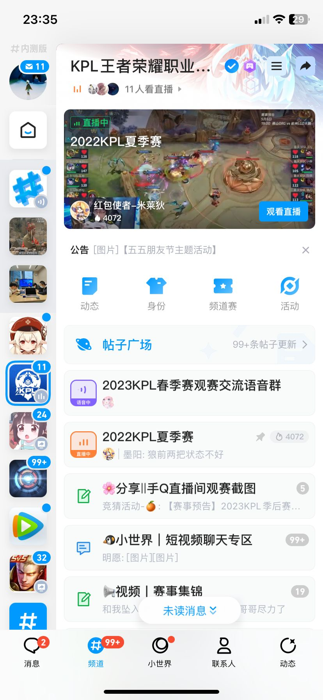
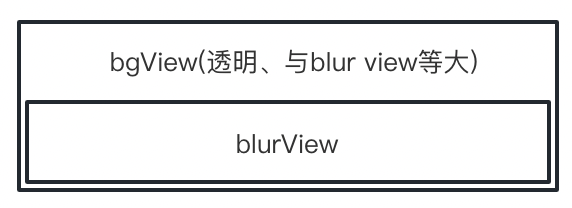
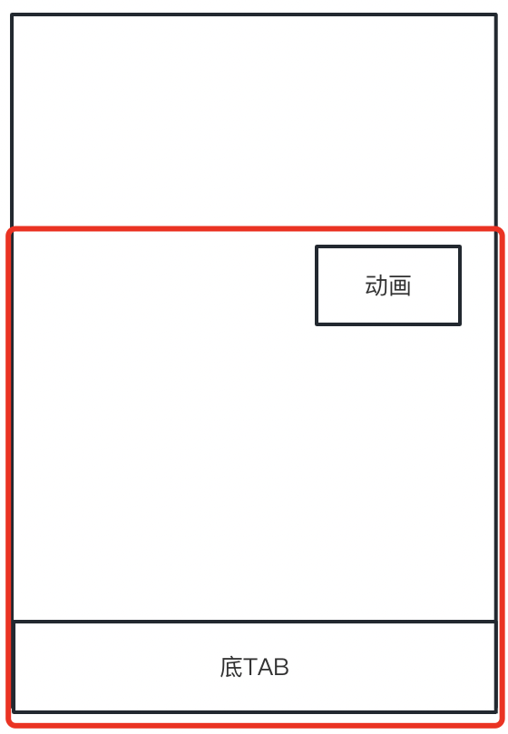
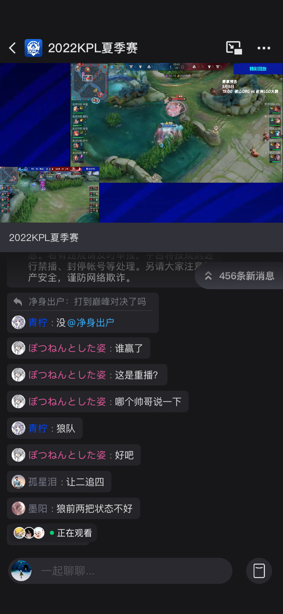
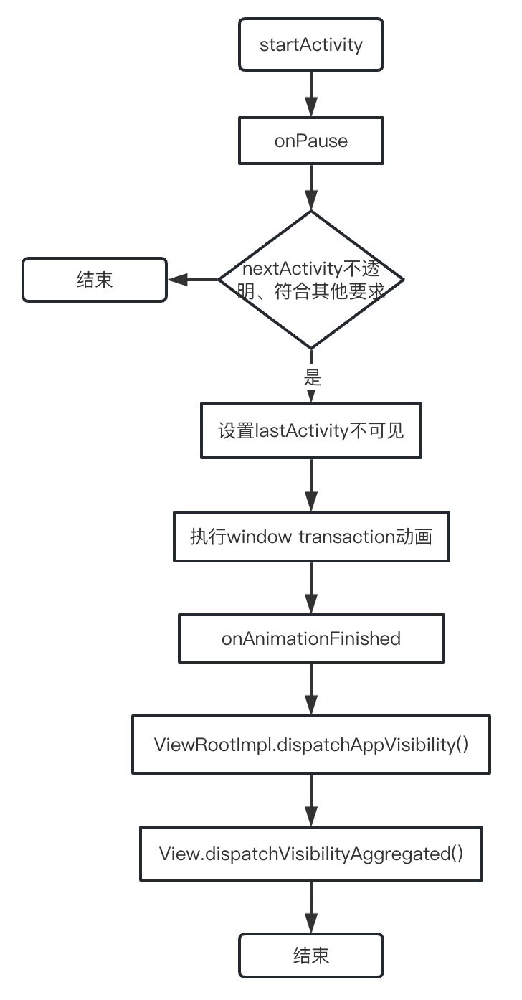

# QQ频道首页GPU优化总结

## 背景
QQ频道是QQ生态内的一款集社交、群聊、小程序应用于一体的娱乐协作平台。

频道主可以创建一个频道，邀请成员加入。除了语音、直播、闲聊、发帖等基础玩法，还通过小程序，上线了世界子频道等游戏性社交玩法。

为了让这些玩法更高效的触达用户，同时提高首页的吸引力，频道首页上线了精选子频道、频道/子频道氛围动画等动态效果。

为了让用户使用起来更聚焦，子频道支持用户通过手势划出，生命周期与常规的activity启动有所不同。

QQ 底 tab 有高斯模糊效果。

上面三个因素叠加，GPU问题比较严重。

## 1 高斯模糊效果与首页动画联动

### 1.1 问题现象
频道首页静置播放动画，GPU持续高占用（三星折叠屏手机，40%）



### 1.2 问题分析
通过影响因素拆解和排除，确认是高斯模糊与动画联动导致
#### 1.2.1 高斯模糊实现原理
1. 在目标位置放置一个等大的bgView(透明)，抓取背景的原始bitmap，使用StackBlur算法得到模糊后的bitmap；

2. 在bgView上覆盖一个blurView，重写onDraw，将模糊后的bitmap绘制上去；



3. 监听ViewTree的onPreDraw方法，onDraw之前先生成模糊bitmap
```java
private ViewTreeObserver.OnPreDrawListener mOnPreDrawListener = new ViewTreeObserver.OnPreDrawListener() {
 	@Override
	public boolean onPreDraw() {
		return handleBlurBitmap();
	}
};
```
#### 1.2.2 问题原因
高斯模糊组件监听了viewTree，当首页有动画播放时，底tab会持续的生成高斯模糊bitmap并刷新;

GPU刷新规则：如果屏幕上有两个view刷新，那么这两个View之间的区域也会刷新，如下图



### 1.3 优化方案

高斯模糊组件是QQ的一个基础组件，影响面比较大，请教基础的同学后，做了下面的尝试，用特性开关兜底

1. 现有方案每次onPreDraw中会有两次invalidate，有点冗余，删去一次
2. 生成模糊bitmap后，与当前显示的bitmap对比，如果相等，则不刷新
3. 生成的bitmap持续相等，说明当前列表没滑动，降低高斯模糊的检测频率（100ms，每6帧检测一次）
4. 有一次生成的bitmap不相等，则取消检测频率限制，防止列表滑动时，体验卡顿


### 1.4 优化效果

频道首页静置播放动画时，GPU占用0-5%（取决于动画本身的消耗），降低35%以上

## 2 手势滑动效果与动画联动

### 2.1 问题现象
频道首页打开直播间、音视频子频道，GPU持续高占用（三星折叠屏手机，40%以上）



### 2.2 问题分析
通过影响因素拆解和排除，当前页面有动画时，打开直播间或者语音房必现
#### 2.2.1 activity onPause原理
启动nextActivity前，先处理lastActivity的onPause生命周期，关键流程如下：
1. 设置lastActivity可见性：
    如果将nextActivity不透明、处于活跃状态，打开方式和用户权限符合要求，会判定lastActivity被完全覆盖，设置lastActivity不可见；
2. 当lastActivity不可见时，执行window transaction 动画，并且在动画结束的回调中，将lastActivity的可见性分发到ViewRootImpl和View



简化版调用链：
```java
// app进程
Activity.startActivity()  
ActivityThread.scheduleTransaction()  
TransactionExecutor.executeLifecycleState()   // 处理生命周期
ActivityTaskManager.getService().activityPaused(token); // 与systemServer进程通信，处理上一个 activity pause

// systemServer进程
ActivityTaskManageService.activityPause()
ActivityRecord.activityPaused()

// 操作 mBehindFullscreenActivity，影响因素如下
// activity 是否透明 是否finish
// mLaunchTaskBehind 是否是后台启动
// activity 权限验证
EnsureActivitiesVisibleHelper.setActivityVisibilityState()

// 透明相关判定 直接读取activity的主题配置
ActivityRecord.occludesParent()
ActivityInfo.isTranslucentOrFloating();
attributes.getBoolean(com.android.internal.R.styleable.Window_windowIsTranslucent, false);

// 根据 mBehindFullscreenActivity 等属性，设置 activity 可见性
// 根据 activity 可见性，将activity加入 closeApps 或者 openingApps
ActivityRecord.setVisibility()

// 设置好状态后，执行 window requestTraversal
WindowSurfacePlacer.requestTraversal()

// 读取前面存的 closeApps 和 openingApps 执行window transaction动画
// 透明 activity 没有存入 closeApps，不执行动画
AppTransitionController.applyAnimations() 
SurfaceAnimator.startAnimation()

// 动画处理完毕 处理View可见性
ActivityRecord.onAnimationFinished()
IWindow.dispatchAppVisibility() // 与app进程通信，处理view状态

// app进程 处理 view 可见性
ViewRootImpl.dispatchAppVisibility()
ViewRootImpl.scheduleTraversals()
View.dispatchVisibilityAggregated()
View.onVisibilityAggregated() // 处理 view 可见性
```

#### 2.2.2 问题原因
为了支持子频道手势滑动，直播间和音视频子频道使用透明activity启动；

频道首页activity在onPause时，仍然可见，当前的动画仍在运行；

在后台收到更新通知后，动画也可正常启动；

### 2.3 优化方案
1. 首页所有动画监听activity的onPause和onResume
2. onPasue时关闭动画，并且记住onPause状态
3. 处于onPause状态下，忽略启动动画的通知
4. onResume中补充刷新状态

### 2.4 优化效果

从频道首页进入子频道时，GPU占用取决于子频道本身的消耗（0-3%），降低40%以上

### 2.5 方案存在的问题
频道首页已有不少动画，而且在持续增加动画，让所有动画都做生命周期处理，开发和维护成本较高
## 3 经验总结
1. 遇到比较复杂的问题时，可以先拆解变量，使用排除法找到关键影响因子；确认因子后，阅读源码，搞清原理，输出最优的解决方案
2. 编译、调试android系统源码对解决此类问题有较大帮助，因为系统源码调用链太长了，只看源码或者网上的博客，无法做到100%心里有底
3. 修改代码前，充分向相关同学请教，控制风险，也可能会得到更优的解决方案