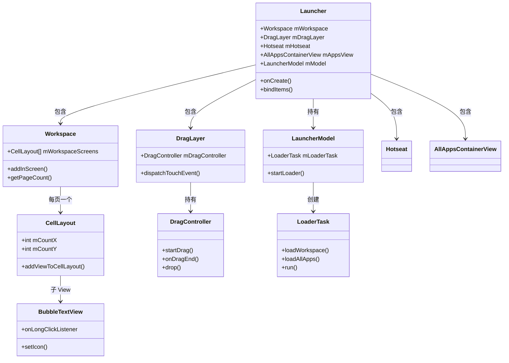
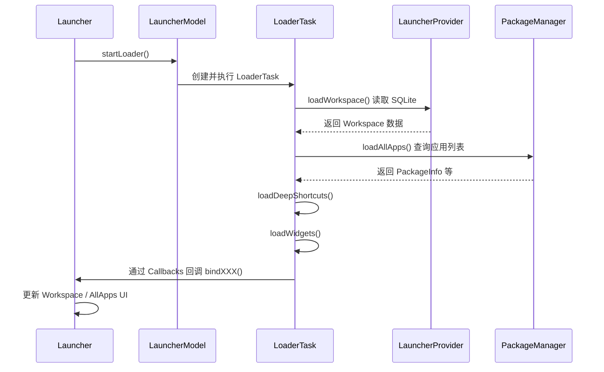
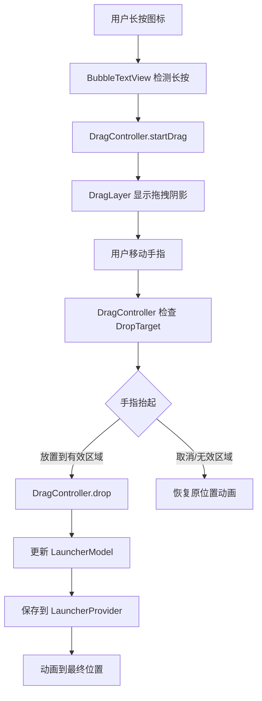

# Launcher3 架构

> 深入学习 Launcher3（Android 桌面）的架构与实现原理

---

## 目录

1. [Launcher3 概述](#1-launcher3-概述)
2. [核心类详解](#2-核心类详解)
3. [数据加载流程](#3-数据加载流程)
4. [拖拽系统](#4-拖拽系统)
5. [Launcher 与系统的交互](#5-launcher-与系统的交互)
6. [Quickstep 模块](#6-quickstep-模块)
7. [AI 交互建议](#7-ai-交互建议)
8. [真机实操](#8-真机实操)
9. [小结](#9-小结)

---

## 1. Launcher3 概述

### 1.1 什么是 Launcher3

**Launcher3** 是 Android 系统的**主屏幕（Home Screen）**应用，也就是用户所说的「桌面」。它提供：

- 主屏页面（Workspace）
- 应用抽屉（All Apps）
- 底部 Dock 栏（Hotseat）
- 小部件（Widget）支持
- 应用图标拖拽、文件夹等


| 项目              | 说明                                      |
| --------------- | --------------------------------------- |
| **源码路径**        | `packages/apps/Launcher3/`              |
| **核心 Activity** | `Launcher.java`（继承自 `StatefulActivity`） |
| **开放程度**        | AOSP 开源，各 OEM 通常深度定制                    |
| **默认主页**        | 可通过 `HOME` intent 设置为默认主屏应用             |


### 1.2 与其他组件的关系

```
Launcher3 ←→ SystemUI（Recents、手势）
Launcher3 ←→ WMS（窗口、启动动画）
Launcher3 ←→ PackageManager（应用列表）
Launcher3 ←→ AppWidgetManager（小部件）
```

---

## 2. 核心类详解

### 2.1 类关系图




### 2.2 Launcher.java


| 职责             | 说明                                                   |
| -------------- | ---------------------------------------------------- |
| **主 Activity** | 应用入口，管理整体 UI 状态                                      |
| **状态管理**       | 通过 `StatefulActivity` 管理 Workspace / AllApps 等不同状态   |
| **数据绑定**       | 实现 `LauncherModel.Callbacks`，接收 LoaderTask 的数据并更新 UI |
| **窗口配置**       | 配置全屏、沉浸式等                                            |


关键方法：

- `onCreate()`：初始化 Model、Workspace、DragLayer 等
- `bindItems()`：由 Model 回调，绑定加载完成的数据到 View
- `startActivitySafely()`：启动应用时的封装逻辑

### 2.3 Workspace.java


| 职责           | 说明                                    |
| ------------ | ------------------------------------- |
| **主屏页面容器**   | 管理多页主屏，每页是一个 `CellLayout`             |
| **横向滑动**     | 支持左右滑动切换页面                            |
| **图标/小部件放置** | 通过 `addInScreen()` 将 Item 添加到指定页的指定格子 |


`Workspace` 本质上是 `PagedView` 的子类，每页对应一个 `CellLayout`，形成网格布局。

### 2.4 CellLayout.java


| 职责       | 说明                                                 |
| -------- | -------------------------------------------------- |
| **网格布局** | 定义每页的网格行列数（如 4×5）                                  |
| **格子计算** | 根据 `mCountX`、`mCountY` 计算每个格子的位置和大小                |
| **放置逻辑** | `addViewToCellLayout()` 将 View 放入指定 (cellX, cellY) |


格子大小和间距通过 `cellWidth`、`cellHeight`、`widthGap`、`heightGap` 等计算，支持跨行跨列（如 2×2 小部件）。

### 2.5 AllAppsContainerView.java


| 职责       | 说明                                     |
| -------- | -------------------------------------- |
| **应用抽屉** | 显示所有已安装应用的列表                           |
| **搜索**   | 支持应用搜索                                 |
| **布局**   | 通常为垂直列表或网格，可配合 `AllAppsRecyclerView` 等 |


### 2.6 DragLayer.java


| 职责       | 说明                                        |
| -------- | ----------------------------------------- |
| **顶层容器** | 最顶层的 `FrameLayout`，覆盖 Workspace、Hotseat 等 |
| **拖拽承载** | 拖拽时在该层上绘制拖拽阴影（drag shadow）                |
| **触摸分发** | 将触摸事件交给 `DragController` 处理拖拽逻辑           |


`DragLayer` 是 `InsettableFrameLayout` 的子类，可处理 WindowInsets。

### 2.7 DragController.java


| 职责              | 说明                               |
| --------------- | -------------------------------- |
| **拖拽状态**        | 管理拖拽开始、进行中、结束                    |
| **Drop Target** | 维护可放置目标列表（Workspace 格子、文件夹、删除区等） |
| **事件处理**        | `startDrag()` 开始拖拽，`drop()` 处理放置 |


### 2.8 LauncherModel.java


| 职责       | 说明                                                |
| -------- | ------------------------------------------------- |
| **数据层**  | 负责加载桌面数据、应用列表、小部件等                                |
| **异步加载** | 通过 `LoaderTask` 在后台线程加载                           |
| **数据存储** | 与 `LauncherProvider`（ContentProvider）交互，读写 SQLite |


### 2.9 LoaderTask.java


| 职责        | 说明                                                           |
| --------- | ------------------------------------------------------------ |
| **后台任务**  | 在 `ModelExecutor` 中执行                                        |
| **分阶段加载** | 依次执行 loadWorkspace、loadAllApps、loadDeepShortcuts、loadWidgets |
| **回调**    | 通过 `Callbacks` 接口回调到 Launcher 更新 UI                          |


### 2.10 BubbleTextView.java


| 职责            | 说明                                 |
| ------------- | ---------------------------------- |
| **应用图标 View** | 显示应用图标和名称                          |
| **长按触发拖拽**    | 长按后调用 `DragController.startDrag()` |
| **点击启动**      | 单击调用 `startActivity()` 启动应用        |


### 2.11 Hotseat.java


| 职责          | 说明                           |
| ----------- | ---------------------------- |
| **底部 Dock** | 主屏底部的固定图标栏（一般为 5 个快捷方式）      |
| **布局**      | 类似单行的 `CellLayout`，可放置图标或文件夹 |


---

## 3. 数据加载流程

### 3.1 加载入口




### 3.2 LoaderTask 阶段详解


| 阶段    | 方法                    | 说明                                                     |
| ----- | --------------------- | ------------------------------------------------------ |
| **1** | `loadWorkspace()`     | 从 `LauncherProvider`（SQLite）读取桌面布局：图标位置、小部件、文件夹等       |
| **2** | `loadAllApps()`       | 通过 `PackageManager.getInstalledApplications()` 等获取所有应用 |
| **3** | `loadDeepShortcuts()` | 加载 Deep Shortcut（长按图标显示的快捷操作）                          |
| **4** | `loadWidgets()`       | 加载 `AppWidgetManager` 提供的可用小部件信息                       |


### 3.3 Binding 机制

`LoaderTask` 通过 `LauncherModel.Callbacks` 接口回调 Launcher：

- `bindWorkspaceItems()`：绑定桌面图标
- `bindAllApps()`：绑定应用抽屉数据
- `bindWidgets()`：绑定小部件等

Launcher 实现这些方法，将数据应用到 `Workspace`、`AllAppsContainerView` 等 View。

---

## 4. 拖拽系统

### 4.1 拖拽完整流程




### 4.2 关键步骤说明


| 步骤                   | 说明                                                                                                       |
| -------------------- | -------------------------------------------------------------------------------------------------------- |
| **1. 长按检测**          | `BubbleTextView` 或 `Workspace` 通过 `OnLongClickListener` 或 `ViewConfiguration.getLongPressTimeout()` 检测长按 |
| **2. startDrag()**   | `DragController.startDrag()` 传入被拖拽的 View、DragSource、DragOptions 等                                        |
| **3. 拖拽阴影**          | `DragLayer` 上绘制一个跟随手指的复制 View 或 Bitmap                                                                   |
| **4. DropTarget 检测** | 根据手指位置，`DragController` 遍历 DropTarget 列表，找到当前有效的目标（Workspace 格子、文件夹、删除区等）                                |
| **5. drop()**        | 在有效目标上调用 `drop()`，目标处理放置逻辑（如 `Workspace.onDrop()`）                                                       |
| **6. 数据更新**          | 更新 `LauncherModel`，调用 `LauncherProvider` 持久化                                                             |
| **7. 动画**            | 播放图标移动到最终位置的动画                                                                                           |


### 4.3 跨页拖拽

拖拽时如果手指移动到屏幕边缘，`Workspace` 会触发**自动翻页**（类似 ViewPager），实现跨页拖放。逻辑在 `Workspace` 的 `onDragOver()` 或相关触摸处理中。

---

## 5. Launcher 与系统的交互

### 5.1 应用安装/卸载广播


| 广播                  | 处理                          |
| ------------------- | --------------------------- |
| **PACKAGE_ADDED**   | 新应用安装，更新 AllApps 列表，可选添加到桌面 |
| **PACKAGE_REMOVED** | 应用卸载，从列表和桌面移除               |
| **PACKAGE_CHANGED** | 应用更新，刷新图标等信息                |


Launcher 在 `LauncherModel` 或 `AllAppsStore` 中注册 `BroadcastReceiver`，收到后触发 `startLoader()` 重新加载。

### 5.2 与 WMS 的交互


| 场景       | 说明                                                                          |
| -------- | --------------------------------------------------------------------------- |
| **启动动画** | 使用 `ActivityOptions.makeSceneTransitionAnimation()` 实现从图标到目标 Activity 的过渡动画 |
| **窗口类型** | Launcher 为主屏，通常为全屏 Activity，可配置 `FLAG_LAYOUT_NO_LIMITS` 等                   |


### 5.3 与 AppWidgetManager


| 场景        | 说明                                                    |
| --------- | ----------------------------------------------------- |
| **小部件列表** | 通过 `AppWidgetManager.getInstalledProviders()` 获取可用小部件 |
| **绑定小部件** | 用户拖拽小部件到桌面时，调用 `AppWidgetHost.bindAppWidgetId()` 等    |
| **更新**    | 通过 `AppWidgetHostView` 接收小部件的更新                       |


### 5.4 默认主屏（HOME）

Launcher 在 Manifest 中声明：

```xml
<intent-filter>
    <action android:name="android.intent.action.MAIN" />
    <category android:name="android.intent.category.HOME" />
    <category android:name="android.intent.category.DEFAULT" />
</intent-filter>
```

用户按 Home 键时，系统会解析 `Intent.ACTION_MAIN` + `Intent.CATEGORY_HOME`，启动配置为默认的 Launcher。

---

## 6. Quickstep 模块

### 6.1 概述

**Quickstep** 是 Launcher3 的一个模块，主要提供：

- **手势导航**：上滑返回桌面、上滑悬停进入最近任务
- **最近任务 (Recents)**：与 SystemUI 协作显示 Overview


| 项目              | 说明                                            |
| --------------- | --------------------------------------------- |
| **源码路径**        | `packages/apps/Launcher3/quickstep/`          |
| **RecentsView** | 最近任务列表的 View 容器                               |
| **TaskView**    | 单个任务卡片的 View                                  |
| **集成**          | 与 SystemUI 的 Recents 逻辑协作，部分实现可能由 SystemUI 托管 |


### 6.2 与 SystemUI 的协作

- 手势导航的**上滑**事件由 Input 层识别，可交给 Launcher 或 SystemUI 处理
- **Overview** 的 UI 可能由 Launcher 的 Quickstep 绘制，也可能由 SystemUI 绘制，取决于设备配置
- 通过 `RecentsActivity`、`RecentsView` 等与 `ActivityTaskManagerService` 获取最近任务列表

---

## 7. AI 交互建议

阅读源码或调试时，可向 AI 提问：

1. **「帮我追踪从点击 App 图标到 Activity 启动的完整流程」**
2. **「Workspace 的网格布局是如何计算的？CellLayout 如何决定图标位置？」**
3. **「Launcher 的拖拽系统是如何实现跨页拖动的？」**
4. **「Quickstep 手势导航如何与 SystemUI 协作？」**

---

## 8. 真机实操

在设备或模拟器上执行以下命令：

```bash
# 查看 Activity 栈（包含 Launcher）
adb shell dumpsys activity activities | grep -i launcher

# 显式启动 Launcher
adb shell am start -n com.android.launcher3/.Launcher

# 查看窗口信息（包含 Launcher 窗口）
adb shell dumpsys window | grep -i launcher

# 查看当前焦点窗口
adb shell dumpsys window | grep -i "mCurrentFocus"
```

---

## 9. 小结


| 知识点              | 要点                                                                              |
| ---------------- | ------------------------------------------------------------------------------- |
| **Launcher3 定位** | 系统主屏应用，HOME 入口                                                                  |
| **核心类**          | Launcher、Workspace、CellLayout、DragLayer、DragController、LauncherModel、LoaderTask |
| **数据加载**         | LoaderTask 分阶段加载 workspace、allApps、shortcuts、widgets                            |
| **拖拽**           | 长按 → startDrag → DropTarget → drop → 更新 Model                                   |
| **系统交互**         | PackageManager、AppWidgetManager、WMS、Quickstep 与 SystemUI                        |


