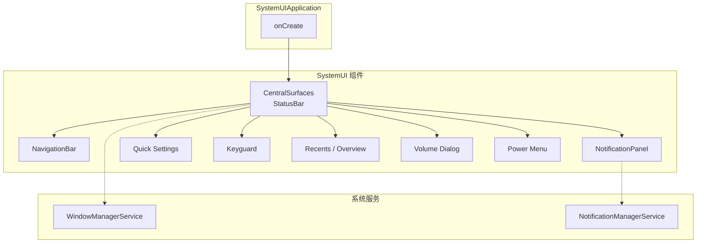
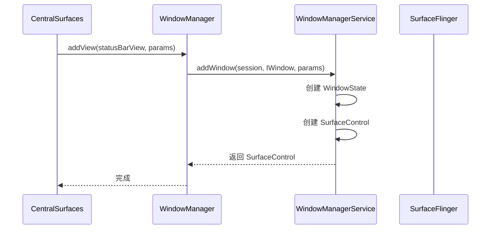
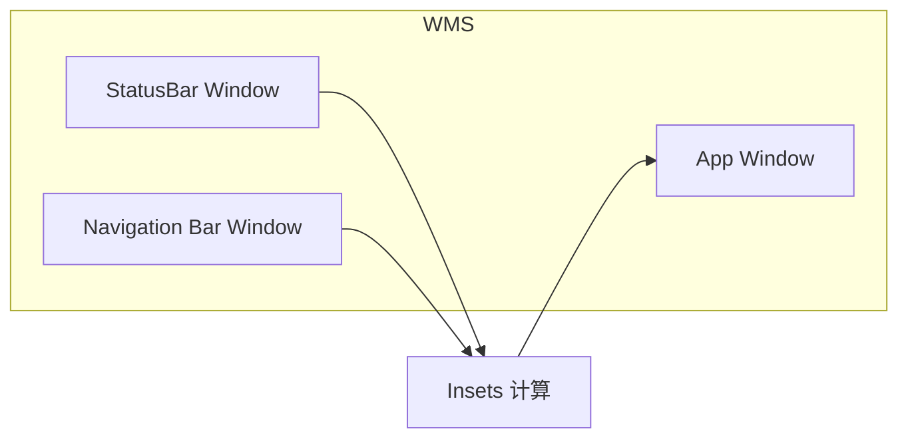
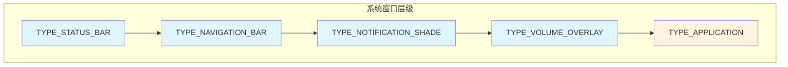
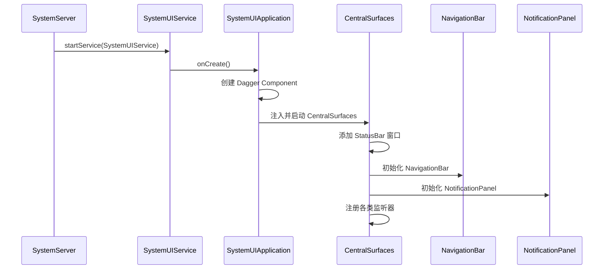

# SystemUI 架构

> 深入学习 SystemUI 的架构与实现原理

---

## 目录

1. [SystemUI 概述](#1-systemui-概述)
2. [模块架构](#2-模块架构)
3. [Dagger 依赖注入](#3-dagger-依赖注入)
4. [SystemUI 与 WMS 的交互](#4-systemui-与-wms-的交互)
5. [SystemUI 定制常见场景](#5-systemui-定制常见场景)
6. [SystemUI 启动与初始化顺序](#6-systemui-启动与初始化顺序)
7. [AI 交互建议](#7-ai-交互建议)
8. [真机实操](#8-真机实操)
9. [小结](#9-小结)

---

## 1. SystemUI 概述

### 1.1 什么是 SystemUI

**SystemUI** 是 Android 系统中的一个**特殊系统应用**，与普通应用不同，它运行在 **system_server 进程上下文**中，具有系统级权限，是用户与系统交互的核心入口之一。


| 特性       | 说明                                 |
| -------- | ---------------------------------- |
| **运行环境** | 在 system_server 进程内运行（部分机型可能为独立进程） |
| **权限**   | 系统签名，可访问系统级 API                    |
| **生命周期** | 系统启动后由 SystemServer 拉起，常驻运行        |
| **职责**   | 提供状态栏、导航栏、通知面板、快捷设置等系统级 UI         |


### 1.2 SystemUI 提供的功能

SystemUI 负责几乎所有的**系统级 UI 组件**：


| 组件                           | 说明                           |
| ---------------------------- | ---------------------------- |
| **Status Bar（状态栏）**          | 顶部显示时间、电量、信号、通知图标等           |
| **Navigation Bar（导航栏）**      | 底部返回 / Home / Recents 三键或手势条 |
| **Notification Shade（通知面板）** | 下拉展开的通知列表                    |
| **Quick Settings（快捷设置）**     | 通知面板中的 WiFi、蓝牙等开关面板          |
| **Lock Screen（锁屏）**          | Keyguard，锁屏界面及解锁流程           |
| **Recent Apps（最近任务）**        | Overview 界面，展示最近使用的应用卡片      |
| **Volume Dialog（音量对话框）**     | 按下音量键时弹出的音量调节 UI             |
| **Screenshot（截图）**           | 截图动画与预览                      |
| **Power Menu（电源菜单）**         | 长按电源键弹出的关机/重启等选项             |


### 1.3 源码位置与入口


| 项目        | 路径                                                  |
| --------- | --------------------------------------------------- |
| **源码根目录** | `frameworks/base/packages/SystemUI/`                |
| **启动方式**  | SystemServer 通过 `SystemUIService` 启动                |
| **入口类**   | `SystemUIApplication.java`                          |
| **入口流程**  | `SystemUIApplication.onCreate()` → 启动多个 SystemUI 组件 |


SystemUI 采用**组件化设计**：`SystemUIApplication` 作为主入口，会依次创建并初始化各个 SystemUI 子组件（如 StatusBar、NavigationBar、NotificationPanel 等），每个组件以 `@SysUISingleton` 作用域由 Dagger 注入。

---

## 2. 模块架构

### 2.1 架构总览




### 2.2 StatusBar / CentralSurfaces（主控制器）

从 **Android 13 (T)** 起，原先的 `StatusBar.java` 被重构为 **CentralSurfaces**，作为 SystemUI 的**主控制器**，协调各子模块。


| 项目       | 说明                                                            |
| -------- | ------------------------------------------------------------- |
| **源码路径** | `packages/SystemUI/src/com/android/systemui/statusbar/phone/` |
| **核心类**  | `CentralSurfacesImpl.java`（原 `StatusBar.java`）                |
| **职责**   | 管理状态栏布局、通知图标、与 Keyguard/QS 等模块的协调                             |
| **接口**   | 实现 `CentralSurfaces` 接口，由 Dagger 注入                           |


CentralSurfaces 负责：

- 添加/移除状态栏窗口（通过 WMS）
- 监听系统状态（电量、信号、通知等）
- 协调 NotificationPanel、Keyguard、QS 的展开/收起

### 2.3 NavigationBar（导航栏）


| 项目       | 说明                                                             |
| -------- | -------------------------------------------------------------- |
| **源码路径** | `packages/SystemUI/.../statusbar/phone/NavigationBarView.java` |
| **职责**   | 显示返回、Home、Recents 按钮（三键模式）或手势条                                 |
| **模式**   | 三键导航 / 手势导航（2-button / 3-button）                               |


手势导航下，底部只有一条细线；三键模式下显示三个按钮。NavigationBar 的布局和样式由 SystemUI 主题和 `config_navBar` 等配置决定。

### 2.4 NotificationPanel（通知面板）

用户下拉状态栏时展开的**通知 shade**，包含通知列表和 Quick Settings。


| 子组件      | 类名                                   | 说明         |
| -------- | ------------------------------------ | ---------- |
| **滚动列表** | `NotificationStackScrollLayout.java` | 负责通知项的滚动布局 |
| **通知底座** | `NotificationShelf.java`             | 分隔/固定通知的区域 |
| **面板容器** | `NotificationPanelViewController`    | 控制展开、收起、手势 |


`NotificationStackScrollLayout` 是 `RecyclerView` 风格的滚动列表，负责：

- 通知项的 measure/layout
- 折叠/展开动画
- 与 `NotificationShelf` 协作实现「固定」效果

### 2.5 Quick Settings (QS)（快捷设置）


| 类名                  | 说明                          |
| ------------------- | --------------------------- |
| **QSTileHost.java** | 管理所有 QS Tile，提供 Tile 列表给 UI |
| **QSTileImpl.java** | 单个 Tile 的基类实现（开关、状态、点击逻辑）   |
| **QSPanel**         | QS 面板的 View 容器              |


**自定义 Tile 示例**：要添加自定义 QSTile，通常需要：

1. 继承 `QSTileImpl`，实现 `handleClick()`、`handleRefreshState()` 等
2. 在 `QSTileHost` 中注册该 Tile
3. 通过 `TileService`（应用侧）或 SystemUI 内 Tile 与系统服务交互

### 2.6 Keyguard（锁屏）


| 类名                              | 说明                           |
| ------------------------------- | ---------------------------- |
| **KeyguardBouncer.java**        | 锁屏「弹跳」容器，管理锁屏视图的显示/隐藏        |
| **KeyguardViewController.java** | 锁屏视图控制器，与 CentralSurfaces 协调 |
| **KeyguardUpdateMonitor.java**  | 监听锁屏相关状态：sim 状态、电量、生物识别等     |


Keyguard 负责：

- 锁屏界面的显示（时间、快捷入口、相机等）
- 解锁流程（PIN、密码、指纹、人脸）
- 与 `KeyguardService` 的交互

### 2.7 Recents / Overview（最近任务）


| 说明                                                            |
| ------------------------------------------------------------- |
| 负责显示最近使用的应用卡片，与 **Launcher3 的 quickstep 模块** 紧密集成             |
| 手势导航下，上滑可进入 Overview                                          |
| 源码涉及 `RecentsView`、`TaskView` 等，部分逻辑在 Launcher3 的 quickstep 中 |


### 2.8 Volume Dialog


| 类名                                  | 说明                   |
| ----------------------------------- | -------------------- |
| **VolumeDialogControllerImpl.java** | 音量对话框控制器，响应音量键并显示 UI |


按下音量键时，`VolumeDialogControllerImpl` 会弹出音量滑块 UI，并可扩展为媒体、通话、闹钟等不同流控。

### 2.9 Power Menu


| 类名                           | 说明                        |
| ---------------------------- | ------------------------- |
| **GlobalActionsDialog.java** | 长按电源键弹出的电源菜单（关机、重启、紧急呼叫等） |


---

## 3. Dagger 依赖注入

### 3.1 为什么使用 Dagger

SystemUI 大量使用 **Dagger** 做依赖注入，原因包括：

- 组件众多，依赖关系复杂
- 便于单元测试（可替换实现）
- 单例与作用域管理清晰

### 3.2 核心概念


| 概念                  | 说明                                |
| ------------------- | --------------------------------- |
| **@SysUISingleton** | SystemUI 级别的单例作用域                 |
| **@Inject 构造函数**    | 通过 `@Inject` 标记构造函数，Dagger 自动构造实例 |
| **Component**       | 依赖注入的入口，如 `SysUIComponent`        |
| **Module**          | 提供无法自动构造的依赖（如需要 Context 的类）       |


### 3.3 典型用法

```java
// 注入到构造函数
@SysUISingleton
public class CentralSurfacesImpl implements CentralSurfaces {
    @Inject
    public CentralSurfacesImpl(
            @Named(STATUS_BAR_CONTEXT) Context context,
            NotificationShadeWindowController notificationShadeWindowController,
            ...) {
        // ...
    }
}
```

### 3.4 阅读代码时如何追踪依赖

1. **从入口开始**：找 `@Inject` 或 `@Provides` 的类
2. **查看 Component**：`SysUIComponent` 或 `ReferenceSystemUI` 等，了解模块的组装方式
3. **搜索接口实现**：如 `CentralSurfaces`，看谁 `implements` 并注入
4. **使用 IDE**：利用 "Find Usages" 和 "Go to Declaration" 追踪依赖链

---

## 4. SystemUI 与 WMS 的交互

### 4.1 窗口类型

SystemUI 通过 **WindowManager** 添加多种系统窗口：


| 窗口类型                        | 说明              |
| --------------------------- | --------------- |
| **TYPE_STATUS_BAR**         | 状态栏窗口           |
| **TYPE_NAVIGATION_BAR**     | 导航栏窗口           |
| **TYPE_NOTIFICATION_SHADE** | 通知面板            |
| **TYPE_VOLUME_OVERLAY**     | 音量对话框           |
| 等                           | 其他系统 overlay 类型 |


这些窗口类型在 `WindowManager.LayoutParams` 中定义，具有较高的 `type` 和 `flags`，确保显示在普通应用之上。

### 4.2 添加窗口流程




SystemUI 通过 `WindowManager.addView()` 添加 View，底层会走到 `WMS.addWindow()`，WMS 为每个窗口创建 `WindowState` 和对应的 `SurfaceControl`。

### 4.3 SurfaceControl 与动画

SystemUI 的不少动画（如状态栏图标、通知展开）会使用 **SurfaceControl** 做同步/异步动画：

- **SyncRtSurfaceTransactionApplier**：在渲染线程同步应用 `SurfaceControl.Transaction`
- 可实现与 Choreographer/VSync 对齐的流畅动画

### 4.4 System Bar Insets

状态栏和导航栏会占据屏幕边缘区域，应用通过 **WindowInsets**（如 `systemBars()`）获取这些 insets，调整自己的布局，避免内容被遮挡。




WMS 会根据可见的系统窗口计算 insets，并通过 `ViewRootImpl` 传递给应用。

### 4.5 窗口层级结构




---

## 5. SystemUI 定制常见场景

### 5.1 添加自定义 Quick Settings Tile

1. 在 SystemUI 中创建 `XxxTile.java` 继承 `QSTileImpl`
2. 实现 `handleClick()`、`handleRefreshState()`
3. 在 `QSTileHost` 或相应 Module 中注册
4. 若需与应用交互，可配合 `TileService`（应用侧）

### 5.2 修改状态栏时钟/图标

- 时钟：查找 `Clock` 相关 View 和 `ClockController`
- 图标：`StatusBarIconController`、`StatusBarIconView` 等
- 可修改布局 XML、颜色、字体大小等

### 5.3 定制通知面板外观

- 修改 `NotificationPanelView` 的布局和主题
- 调整 `NotificationStackScrollLayout` 的间距、背景
- 修改 `NotificationShelf` 的样式

### 5.4 修改锁屏布局

- `KeyguardStatusView`、`KeyguardClockSwitch` 等
- 可调整时间样式、快捷入口、锁屏壁纸等

---

## 6. SystemUI 启动与初始化顺序




---

## 7. AI 交互建议

阅读源码或调试时，可向 AI 提问：

1. **「帮我梳理 SystemUI 启动后各模块的初始化顺序」**
2. **「状态栏是如何通过 WMS 添加到屏幕上的？追踪 addWindow 调用链」**
3. **「QSTile 的点击事件是如何处理的？从触摸到状态切换的完整流程」**
4. **「SystemUI 如何监听通知变化并更新通知栏？」**

---

## 8. 真机实操

在设备或模拟器上执行以下命令，加深理解：

```bash
# 查看状态栏相关信息
adb shell dumpsys statusbar

# 查看通知服务状态
adb shell dumpsys notification

# 展开通知面板
adb shell cmd statusbar expand-notifications

# 收起通知面板
adb shell cmd statusbar collapse

# 查看窗口列表（过滤 SystemUI 相关）
adb shell dumpsys window windows | grep -E "StatusBar|NavigationBar"

# 查看 SurfaceFlinger 中的 Layer（过滤 status/nav）
adb shell dumpsys SurfaceFlinger --list | grep -iE "status|nav"
```

---

## 9. 小结


| 知识点             | 要点                                                                                   |
| --------------- | ------------------------------------------------------------------------------------ |
| **SystemUI 定位** | 运行在 system_server 上下文的系统 UI 应用                                                       |
| **核心模块**        | CentralSurfaces、NavigationBar、NotificationPanel、QS、Keyguard、Recents、Volume、PowerMenu |
| **依赖注入**        | Dagger，@SysUISingleton，@Inject 构造函数                                                  |
| **与 WMS**       | TYPE_STATUS_BAR、TYPE_NAVIGATION_BAR 等窗口，SurfaceControl 动画                            |
| **定制**          | 修改 QS Tile、状态栏、通知面板、锁屏等布局与逻辑                                                         |


